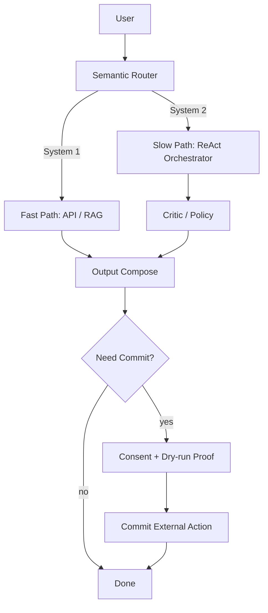

# Tech Spec — Omni-Travel Agent v1.0
**研发版：Router/API/状态机/Action Registry/埋点**  
**Audience:** Backend/Platform Engineers, Agent/Infra Engineers  
**Scope:** Module 14 Router + Orchestrator, Action Registry, APIs, UI state protocol, safety/consent gates, observability, QA acceptance.

---

## 0. 一句话定义

我们要做的不是"问一句答一句"的旅行 App，而是一个 **COALA 骨架 + ReAct 思维流** 的智能体系统：

- **System 1（快）**：能像搜索/工具一样快地完成 80–90% 高频任务
- **System 2（慢）**：在规划/冲突/无 API/网页操作等高价值场景进入受控 ReAct 循环，生成可执行方案并可解释

---

## 1. 总体架构

### 1.1 双系统分流（System 1 / System 2）

入口统一在 **Module 14：Semantic Router + Orchestrator**

- Router 输出结构化 route（不是自由文本），决定走快车道还是慢车道
- System 2 必须受预算、步数、时间、权限闸门控制

### 1.2 核心组件（COALA 映射）

**Memory Service（记忆）**
- **Working Memory**：当前 Trip Draft / 本次请求状态（仅短期）
- **Episodic Memory**：历史行程偏好、复盘摘要（向量检索）
- **Semantic Memory**：POI/营业时间/规则/国家档案（事实）
- **Procedural Memory**：工具与算法能力（VRPTW、聚类、鲁棒时间等）

**Action Registry（行动空间）**：所有模块能力注册成 Action（带 preconditions/cost/side_effect）

**Decision Loop（决策机制）**
- System 1：直达 ToolBench/RAG
- System 2：ReAct（Plan→Act→Observe→Critic→Repair）循环

**Critic & Policy（评价/审查）**
- 可行性检查（时间窗、日界、午餐、鲁棒交通）
- 高风险动作策略（支付/退款/浏览器）

**Explainability（解释）**
- 不存"模型内心独白"，只存结构化 decision_log + facts-based 人话解释

### 1.3 High-level flow


### 1.4 Non-negotiables (Commercial-grade)
1. **No uncontrolled loops**: System 2 has max_steps/max_seconds/max_browser_steps
2. **No silent risky actions**: web browsing / booking / refund require consent & commit gate
3. **No "hidden thinking logs"**: store only structured decision logs (facts/reason codes), not chain-of-thought

---

## 2. Router 规范（研发必须实现）

### 2.1 Route 枚举

- `SYSTEM1_API`：标准 API / CRUD / 简单查
- `SYSTEM1_RAG`：知识库/向量检索
- `SYSTEM2_REASONING`：ReAct + 工具 + TravelPlanner/Critic
- `SYSTEM2_WEBBROWSE`：无头浏览器兜底（仅授权后）

### 2.2 Router 输出契约（必须按此 JSON）

```json
{
  "route": "SYSTEM1_API|SYSTEM1_RAG|SYSTEM2_REASONING|SYSTEM2_WEBBROWSE",
  "confidence": 0.0,
  "reasons": ["MULTI_CONSTRAINT","MISSING_INFO","NO_API","REALTIME_WEB","HIGH_RISK_ACTION"],
  "required_capabilities": ["places","transport","planner","browser"],
  "consent_required": true,
  "budget": { "max_seconds": 60, "max_steps": 8, "max_browser_steps": 12 },
  "ui_hint": {
    "mode": "fast|slow",
    "status": "thinking|browsing|verifying|repairing|awaiting_consent|awaiting_confirmation",
    "message": "..."
  }
}
```

### 2.3 决策策略（强烈建议：规则优先 + 小模型灰区裁决）

#### A) 硬规则短路

- 涉及支付/退款/浏览器/批量写库：强制 System2 + `consent_required=true`
- 明确 CRUD（删/加/移动/改优先级）：`SYSTEM1_API`
- 单纯事实查询且知识库覆盖：`SYSTEM1_RAG`

#### B) 灰区：用轻量模型或特征打分裁决

提取特征：
- constraint count（如"既要…又要…但不要…"）
- ambiguity（未解析实体数、代词）
- realtime/web signals（"官网/下周六有房/今天/现在/限量"）
- planning signals（"规划/几天/赶得上吗/如果…就…"）

#### C) 小模型仲裁（仅用于灰区）

- 如果打分不确定，用便宜模型选择 route，输出 JSON

### 2.4 置信度阈值

- `≥0.75`：直接执行
- `0.45–0.75`：先给 System1 近似结果或追问 1 个关键缺参
- `<0.45`：必须追问关键字段（日期/人数/城市/预算）

### 2.5 性能指标（SLA）

- Router P95 < **500ms**
- System1 端到端 P95 < **3s**
- System2 默认预算：`max_seconds=60, max_steps=8, max_browser_steps=12`

---

## 3. AgentState（Working Memory）统一结构（研发/算法共享）

所有模块只读写这个 state，**禁止散落临时状态**。

```json
{
  "request_id": "uuid",
  "user_input": "string",
  "trip": {
    "trip_id": "string|null",
    "days": 3,
    "day_boundaries": [{"start":"10:00","end":"22:00"}],
    "lunch_break": {"enabled": true, "duration_min": 60, "window": ["11:30","13:30"]},
    "pacing": "relaxed|normal|tight"
  },
  "draft": {
    "nodes": [],
    "hard_nodes": [],
    "soft_nodes": [],
    "edits": []
  },
  "memory": {
    "semantic_facts": {"pois": [], "rules": {}},
    "episodic_snippets": [],
    "user_profile": {}
  },
  "compute": {
    "clusters": null,
    "time_matrix_api": null,
    "time_matrix_robust": null,
    "optimization_results": [],
    "robustness": null
  },
  "react": {
    "step": 0,
    "max_steps": 8,
    "observations": [],
    "decision_log": [
      {"step":1,"chosen_action":"places.get_poi_facts","reason_code":"MISSING_POI_FACTS","facts":{},"policy_id":"FACTS_FIRST"}
    ]
  },
  "result": {
    "status": "DRAFT|READY|NEED_MORE_INFO|NEED_CONSENT|FAILED|TIMEOUT",
    "timeline": [],
    "dropped_items": [],
    "explanations": []
  },
  "observability": {
    "router_ms": 0,
    "latency_ms": 0,
    "tool_calls": 0,
    "browser_steps": 0,
    "cost_est_usd": 0.0,
    "fallback_used": false
  }
}
```

---

## 4. Action Registry（研发接口化清单）

### 4.1 规则

每个 Action 必须标注：

- `kind`（internal/external）
- `cost`（low/med/high）
- `side_effect`（none/writes_db/calls_api）
- `preconditions`
- `idempotent`
- `cacheable`
- 输入/输出 schema

### 4.2 最小必备 Actions（开工用）

- **Trip**：`trip.load_draft`, `trip.apply_user_edit`, `trip.persist_plan`
- **Places**：`places.resolve_entities`, `places.get_poi_facts`
- **Transport**：`transport.build_time_matrix`, `transport.apply_robustness_policy`
- **Optimization**：`itinerary.cluster_days_balanced`, `itinerary.optimize_day_vrptw`, `itinerary.repair_cross_day`
- **Policy/Critic**：`policy.validate_feasibility`, `policy.score_robustness`
- **Explain**：`llm.generate_explanation`

其它模块（语音、视觉、退款政策、浏览器）按同模式挂载。

---

## 5. System 2（ReAct）执行流程（研发实现 Orchestrator）

### 5.1 ReAct Loop（受控）

循环：**Plan → Act → Observe → Critic → Repair**

终止条件：
- Critic pass → `READY`
- 必去点不可行（Hard infeasible）→ `FAILED`（给操作建议）
- 达到 max_steps/max_seconds → `TIMEOUT`（fallback）

### 5.2 Critic 必须覆盖的硬检查

- **时间窗**（到达与服务时段不能碰闭馆/午休）
- **日界**（最晚结束时间）
- **午餐锚点**（每天且仅一个，11:30–13:30，60min）
- **鲁棒交通时间**（不能用 API 原始时间）
- **等待显性化**（>15min 必须出现在时间轴）

### 5.3 Commit Gate（高风险动作闸门）

任何 external commit（写库/下单/退款）：
- 必须先 dry-run（拿到结构化证据：价格、取消政策、可用性）
- WebBrowse 必须 user consent（未授权不能启动浏览器）
- 最终提交前需要 `awaiting_confirmation`（若产品要求二次确认）

---

## 6. 对外 API（研发对齐前端）

### 6.1 统一入口

`POST /agent/route_and_run`

**Request**
```json
{
  "request_id": "uuid",
  "user_id": "string",
  "trip_id": "string|null",
  "message": "string",
  "conversation_context": {
    "recent_messages": ["string"],
    "locale": "zh-CN",
    "timezone": "Asia/Shanghai"
  },
  "options": {
    "dry_run": false,
    "allow_webbrowse": false,
    "max_seconds": 60,
    "max_steps": 8,
    "max_browser_steps": 12,
    "cost_budget_usd": 0.20
  }
}
```

**Response**
```json
{
  "request_id": "uuid",
  "route": { /* RouterOutputContract */ },
  "result": {
    "status": "OK|NEED_MORE_INFO|NEED_CONSENT|NEED_CONFIRMATION|FAILED|TIMEOUT",
    "answer_text": "string",
    "payload": {
      "timeline": [],
      "dropped_items": [],
      "candidates": [],
      "evidence": [],
      "robustness": {}
    }
  },
  "explain": { "decision_log": [] },
  "observability": {
    "latency_ms": 0,
    "router_ms": 0,
    "system_mode": "SYSTEM1|SYSTEM2",
    "tool_calls": 0,
    "browser_steps": 0,
    "tokens_est": 0,
    "cost_est_usd": 0.0,
    "fallback_used": false
  }
}
```

### 6.2 状态流（前端显示）

`thinking` / `browsing` / `verifying` / `repairing` / `awaiting_consent` / `awaiting_confirmation` / `done` / `failed`

---

## 7. 埋点与监控（必须做，否则无法控成本与稳定性）

### 7.1 关键事件

- `router_decision(route, confidence, reasons, router_ms)`
- `system2_step(step, action, ms, status, error_code)`
- `critic_result(pass, violations, min_slack, total_wait)`
- `webbrowse_blocked(domain, blocked_type)`
- `fallback_triggered(from_route, to_route, reason)`
- `agent_complete(status, latency_ms, cost_est_usd, tool_calls, browser_steps)`

### 7.2 核心指标

- Router P95、System1 P95、System2 success rate（按场景分桶）
- WebBrowse block rate（验证码/反爬）
- fallback rate（有但不高）
- infeasible hard nodes rate（用来反推产品输入/默认规则）

---

## 8. Error Codes

### Router
- `ROUTER_LOW_CONFIDENCE`
- `ROUTER_PARSE_FAILED`

### System 2
- `TIMEOUT_SYSTEM2`
- `BUDGET_EXCEEDED`
- `BROWSER_CONSENT_REQUIRED`
- `BROWSER_BLOCKED_CAPTCHA`
- `PLANNER_INFEASIBLE_HARD_NODES`
- `TOOL_CALL_FAILED`

---

## 9. QA 最小验收集（必须全通过）

### Router
- 明天天气 → `SYSTEM1_API`
- 推荐新宿拉面 → `SYSTEM1_RAG`
- 删除清水寺 → `SYSTEM1_API`
- 规划 5 天游+冷门+还能订到 → `SYSTEM2_REASONING`（有 verifying）
- 官网查房 → `SYSTEM2_WEBBROWSE`（先 `NEED_CONSENT`）
- 赶不上日落就改横滨 → `SYSTEM2_REASONING`（分支）
- System2 超时 → `TIMEOUT` + fallback + 下一步建议
- 浏览器遇验证码 → `BROWSER_BLOCKED_CAPTCHA` + 用户接管/降级

---

## 10. 分工建议（避免互相等）

### 研发（Platform/Backend）
- Router + Orchestrator（状态机、预算闸门、权限闸门）
- Action Registry 封装（各模块 tool 化）
- API + 状态流 + 埋点监控
- WebBrowse 执行器（若做）与授权/证据抽取协议

### 算法（Algo）
- 多日拆分（balanced clustering）+ 指标输出
- 日内优化（VRPTW/PC-TSPTW）+ dropped/wait/slack 输出
- 鲁棒时间策略 + 稳健度评分
- reason_code 字典（与前端/解释模块对齐）

### 产品/前端（配合点）
- 慢车道 UI 状态展示 + 授权弹窗 + 提交确认
- dropped_items/why 按 reason_code 展示
- pacing slider、作息偏好（映射到 policy 参数）

---

## 11. Definition of Done（最终完成标准）

- ✅ Router 达到性能与正确性 AC（不乱走 System1 造成幻觉）
- ✅ System2 受控循环可稳定收敛（不死循环、不无故超时）
- ✅ 优化输出可执行（午餐/时间窗/日界/鲁棒时间全部满足）
- ✅ dropped/wait/slack 可解释且 UI 可展示
- ✅ 可观测：成本、延迟、失败原因可追踪，可迭代调参

---

*Document end.*
