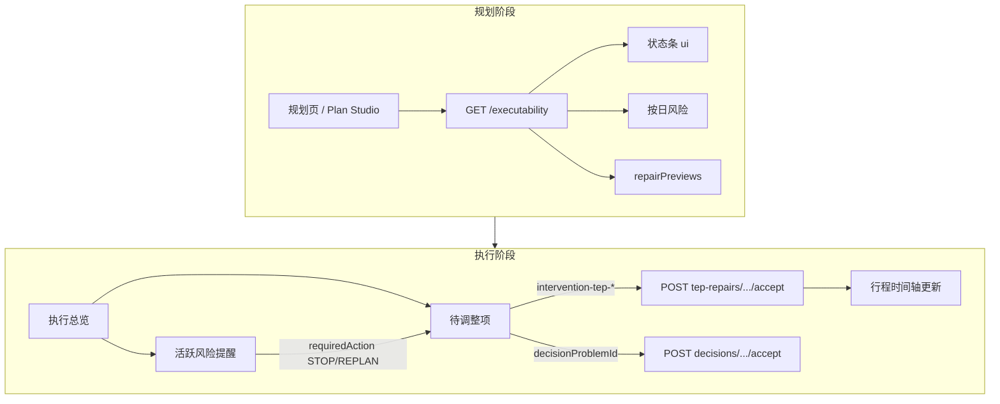

# 冰岛自驾 TEP — 前端页面调整说明（规划 & 执行）

**受众：** Mobile / Web 规划工作台 / 执行页  
**状态：** Limited Pilot 前必对齐 · **2026-07-12**  
**关联：** [TEP-SELF-DRIVE-WEB-P0-INTEGRATION.md](./TEP-SELF-DRIVE-WEB-P0-INTEGRATION.md)（Web P0） · [TEP-SELF-DRIVE-WEB-P1-INTEGRATION.md](./TEP-SELF-DRIVE-WEB-P1-INTEGRATION.md)（Web P1） · [TEP-CONSTRAINT-CONSOLE-ASSESSMENT-INTEGRATION.md](./TEP-CONSTRAINT-CONSOLE-ASSESSMENT-INTEGRATION.md)（Console Assessment 化 P1-A） · [TEP-SELF-DRIVE-WEB-P2-INTEGRATION.md](./TEP-SELF-DRIVE-WEB-P2-INTEGRATION.md)（Web P2） · [TEP-SELF-DRIVE-WEB-P3-INTEGRATION.md](./TEP-SELF-DRIVE-WEB-P3-INTEGRATION.md)（Web P3） · [TEP-PHASE0-LIMITED-PILOT-PLAYBOOK.md](../product/TEP-PHASE0-LIMITED-PILOT-PLAYBOOK.md) · [CONSTRAINT-CAPABILITY-REGISTRY-PHASE0.md](../product/CONSTRAINT-CAPABILITY-REGISTRY-PHASE0.md)

---

## 0. 给前端的一句话

TEP 自驾规则**不再是后台能力**，应成为：

| 阶段 | 页面只回答一个问题 |
|------|-------------------|
| **规划** | 这趟自驾**能不能执行**？哪一天最脆弱？怎么调可以恢复？ |
| **执行** | **现在**还能不能按计划走？**今天**需要我决定什么？ |

**禁止**再建一套与 TEP 平行的状态、卡片或写回逻辑。

---

## 1. 冻结的状态语言（必须用后端枚举）

前端 **不得** 自建 `OK` / `WARNING` / `BLOCKED` 等平行状态。

### 1.1 规划 & 执行共用 — `ExecutabilityStatus`

| 值 | 用户文案（用 `ui.statusLabel`） | Strip | 能否确认行程 `ui.canCommit` |
|----|--------------------------------|-------|----------------------------|
| `EXECUTABLE` | 可以出发 | 绿 success | ✅ |
| `EXECUTABLE_WITH_CAUTION` | 可以出发，但有注意事项 | 黄 warning | ✅ |
| `REQUIRES_CONFIRMATION` | 需要你确认几项再出发 | 黄 warning | ❌（确认后） |
| `REQUIRES_REPAIR` | 需要调整后才能出发 | 红 danger | ❌ |
| `NOT_EXECUTABLE` | 当前计划无法执行 | 红 danger | ❌ |
| `UNKNOWN` | 部分信息待更新，暂无法确认 | 灰 neutral | ❌ |

主 CTA 用 `ui.primaryCta.label` + `deepLink`，不要硬编码「重新规划」。

### 1.2 执行页风险门控 — `requiredAction`（仅 execution-alerts）

| 值 | 底部 CTA 语义 |
|----|--------------|
| `STOP` | 停止按原计划执行 → 导航待调整项 |
| `REPLAN` | 需要重规划/调整 → 导航待调整项 |
| `ACKNOWLEDGE` | 确认已阅读 |
| `NONE` | 无强制动作 |

`requiredAction` 与卡片 `recommendedAction` 冲突时，**以 `requiredAction` 为准**（后端已抑制矛盾文案）。

---

## 2. 自驾场景约束体系（前端须知）

TEP 检查的不是「信息完不完整」，而是**这份自驾计划在当前车辆、道路、天气、时间窗下能不能执行**。约束分四层；前端职责是**采集输入、展示结论、引导确认/修复**，不在客户端重算规则。

### 2.1 四层约束模型

```
① 用户输入约束（SelfDriveProfile）  ← 规划前/中采集
        ↓
② 行程结构约束（DailyDrivePlan）   ← 规划器产出，前端可编辑 importance/flexibility
        ↓
③ 冰岛 SDR 规则（12 条）           ← 后端 TEP Validator / 行中 Runtime
        ↓
④ 修复边界（RecoveryOption）        ← 仅 REMOVE / 预计算 REPLACE
```

与旧版「规划约束摘要」`GET /constraints-summary`（预算、成员、日期等）**并存**：那是 **PlanningReadiness**；自驾可执行性以 **`GET /executability`** 为准。

### 2.2 ① 用户输入约束 — `SelfDriveProfile`

规划工作台 / 建行程向导应采集或确认（来自 `GET /executability` → `profile`）：

| 字段 | 选项 / 含义 | 影响规则 |
|------|-------------|----------|
| `vehicle.vehicleType` | `2WD` `4WD` `AWD` `CAMPERVAN` `OTHER` | SDR-001 道路准入 |
| `vehicle.vehicleSource` | 用户声明 / 租车合同 / Pack 默认 | SDR-001/003；`PACK_DEFAULT` 不得单独得出 F-road 确定性结论 |
| `drivers[].experienceLevel` | 海外新手 / 中级 / 老手 | 驾驶负荷等效分钟 +30min（新手） |
| `drivingPolicy.nightDrivingAllowed` | 是否允许夜间驾驶 | SDR-202 |
| `drivingPolicy.nightDrivingPreference` | `AVOID` / `ALLOW_WITH_CAUTION` / `ALLOW` | SDR-202 日照/夜驾 |
| `drivingPolicy.maxDailyDriveMinutes` | 可选上限 | SDR-101 |
| `rentalRestrictions[]` | 租车合同禁止项 | SDR-003 |

**前端：** 缺车型/夜驾偏好时引导补全；**不要**用本地规则替代后端 `assessment`。

### 2.3 ② 行程结构约束 — 节点属性

每个活动/路段在 `dailyDrivePlans[]` 带结构属性，决定**能否被自动修复**：

| 属性 | 值 | 前端含义 |
|------|-----|----------|
| `importance` | `MANDATORY` / `RECOMMENDED` / `OPTIONAL` | 必选节点更难 REMOVE |
| `flexibility` | `FIXED` / `MOVABLE` / `REPLACEABLE` / `REMOVABLE` | 仅 `REMOVABLE`/`REPLACEABLE` 等可进 RecoveryGraph |
| `weatherSensitive` | boolean | 触发 SDR-302 + 行中天气 Hook |
| `reservationRequired` + `fixedStartAt` | 预约活动 | SDR-203 固定可达性 |
| `accommodation.latestArrival` | 当地时刻 | SDR-201 晚到风险 |
| `weatherFallbackPoiId` | 预计算 POI | SDR-302 REPLACE 唯一合法来源 |

**前端：** 编辑行程时暴露「可选/可删/可替换/固定预约」等**用户友好标签**，映射到 `importance` + `flexibility`；高负荷日（SDR-301）应提示保留至少 1 个弹性节点。

### 2.4 ③ SDR 规则 — Phase 0 范围

共 12 条；**前端不展示规则编号**，用 `findings[].message` / `ruleResults[].explanation` 展示人话。

#### 硬阻断（`REJECT` → 通常 `NOT_EXECUTABLE`）

| 规则 | 检查什么 | 用户面说法示例 |
|------|----------|----------------|
| **SDR-001** | 车型 × 路段准入（如 2WD × F-road） | 「这辆车不能走这段路」 |
| **SDR-002** | 计划日道路 **CLOSED** | 「这段路当天封闭」 |
| **SDR-003** | 租车合同禁止（碎石比例等） | 「超出租车合同允许范围」 |
| **SDR-203** | 有预约时间但路上来不及 | 「按现在路线赶不上预约」 |

#### 需调整（`SUGGEST_REPAIR` → `REQUIRES_REPAIR`）

| 规则 | 检查什么 | 典型修复 |
|------|----------|----------|
| **SDR-101** | 单日驾驶负荷 HIGH/EXTREME | REMOVE 可选停靠 |
| **SDR-202** | 末段驾驶越过民用暮光 / 夜驾政策 | REMOVE 停靠或改活动时段 |
| **SDR-102** | 连续驾驶超时 ⏳ **Phase 0 未上线** | — |
| **SDR-103** | 连续多日高负荷 ⏳ **未上线** | — |

#### 需确认（`NEED_CONFIRM` → `REQUIRES_CONFIRMATION`）

| 规则 | 检查什么 |
|------|----------|
| **SDR-201** | 预计晚于酒店 `latestArrival`（小缓冲内） |
| **SDR-202** | 夜驾在政策 `AVOID` 边界 |

#### 注意事项（`CAUTION` → `EXECUTABLE_WITH_CAUTION`）

| 规则 | 检查什么 |
|------|----------|
| **SDR-101** | 负荷 MEDIUM |
| **SDR-301** | 高负荷日但没有可删/可移节点 |
| **SDR-302** | 天气敏感活动无预计算 fallback |

#### 非阻断

| 规则 | 作用 |
|------|------|
| **SDR-303** | 编辑某节点时展示下游依赖影响（RecoveryGraph） |

### 2.5 驾驶负荷分级（SDR-101 用户可见）

后端用**等效驾驶分钟**（含路况、天气、车型、新手加成等因子），前端只展示 **tier**：

| Tier | 等效分钟（冰岛默认） | 规则 outcome | 聚合 status 影响 |
|------|---------------------|--------------|------------------|
| LOW | 0–180 | PASS | 趋向 EXECUTABLE |
| MEDIUM | 181–300 | CAUTION | EXECUTABLE_WITH_CAUTION |
| HIGH | 301–420 | SUGGEST_REPAIR | REQUIRES_REPAIR |
| EXTREME | >420 | NEED_CONFIRM | REQUIRES_CONFIRMATION |

按日卡片展示 `HIGH` / `EXTREME` 即可；细节在 `repairPreviews.loadTierBefore/After`。

### 2.6 规则裁决 → 页面行为

**单条规则**用 `RuleOutcome`；**整单**用 `ExecutabilityStatus`（取最严）：

| RuleOutcome | 用户理解 | 规划页 | 执行页 |
|-------------|----------|--------|--------|
| `PASS` | 通过 | 绿/无提示 | 通常无卡 |
| `CAUTION` | 注意 | 黄条/按日提示 | 可进 alerts 次要信息 |
| `NEED_CONFIRM` | 需确认 | 禁用 commit →「去确认」 | adjustment-queue 确认项 |
| `SUGGEST_REPAIR` | 建议调整 | 展示 repairPreviews | `intervention-tep-*` 或决策项 |
| `REJECT` | 不可执行 | 红条 + 原因 | STOP + 待调整项 |
| `UNKNOWN` | 证据不足 | 灰条 +「刷新信息」 | 勿显示为「没问题」 |

**聚合优先级（后端已算，前端只读 `assessment.status`）：**  
`REJECT` > `UNKNOWN(高)` > `SUGGEST_REPAIR` > `NEED_CONFIRM` > `CAUTION` > `PASS`

**可覆盖：** 仅 Pack 标记 `overridable: true` 的项，且用户走**显式确认**（`constraints/confirm` 或决策 accept）；前端不得静默忽略 `REJECT`。

### 2.7 ④ 修复与写回约束

| 约束 | 说明 |
|------|------|
| 支持动作 | `REMOVE`；`REPLACE`（仅 `replacementPoiId` / `weatherFallbackPoiId` 预计算） |
| 目标 | `activity_*` 引用；`REMOVABLE` / `REPLACEABLE` 节点 |
| 不支持 | 运行时搜 POI；整段路自动改线；无用户确认的 bulk replan |
| 规划预览 | `repairPreviews` 仅模拟，不写库 |
| 行中写回 | `intervention-tep-*` → accept；须带 `recommendation.basePlanVersionId` |
| 保护节点 | `MANDATORY` + `FIXED` + 预约活动默认不进 REMOVE 图 |

### 2.8 行中监测约束（执行阶段额外触发）

规划期预埋 `decisionHooks[]`；行中当 WorldState 变化时升级 status（前端只消费投影结果）：

| 变化类型 | 关联 SDR | 用户面 |
|----------|----------|--------|
| 道路 OPEN→CLOSED | SDR-002 | 风险提醒 + 待调整项 |
| 天气超阈值 | SDR-302 | 同上 |
| 晚出发 / 执行 slip | SDR-202 / SDR-101 | 日照/负荷类卡片 |
| 负荷日超标（运行时） | SDR-101 | `intervention-tep-*` 修复卡 |

**TEP 优先于 Canonical 重复卡**（IS-CERT-404）：同一道路事件只展示一张主卡，前端勿 dedupe。

### 2.9 数据不足时的前端表现

`ruleResults[].degraded === true` 或 `status === UNKNOWN` 时：

- 展示 `degradationReason` 或「部分路况信息待更新」
- 提供「刷新」→ `GET /executability?refresh=true`
- **禁止**把 UNKNOWN 渲染成绿色「可出发」

### 2.10 与 `constraints-summary` 的分工

| API | 回答 | 自驾 TEP 关系 |
|-----|------|---------------|
| `GET /trips/:id/constraints-summary` | 预算/成员/日期等**规划输入**是否齐备 | 互补，不替代 executability |
| `GET /trips/:id/executability` | 自驾计划**能不能执行** | **自驾主接口** |

确认行程前建议：**constraints 已确认** + **`ui.canCommit === true`** 同时满足。

### 2.11 约束引擎 vs TEP — SSOT 与 Phase 0 不开放项

**完整矩阵：** [CONSTRAINT-CAPABILITY-REGISTRY-PHASE0.md](../product/CONSTRAINT-CAPABILITY-REGISTRY-PHASE0.md)

#### 两套系统，不要混成一个「约束保证」

| 系统 | 管什么 | Phase 0 主接口 |
|------|--------|----------------|
| **约束引擎** | 旅行决策合同、HARD/SOFT 卡片、feasibility、planning-conflicts | `GET /constraints` · `constraints-summary` |
| **TEP** | 冰岛自驾 SDR、可执行性、行中 Hook、Local Repair | `GET /executability` · P2/P3 行中 |

**出发门控以 TEP 为准：** `ui.canCommit` + `executability` 优先于 constraint check 单独 PASS。

#### 前端禁止推断 enforce

BFF 对 `type: HARD` 会投影 `violationResult: BLOCK`，**不代表底层真有 enforce**（如老人步行上限）。  
**禁止**用 `item.type === 'HARD'` 显示「系统保证 / 不可突破」。  
Phase 0 应读 Capability Registry 的 `enforcementLevel` / `phase0UiPolicy`（静态表见 Registry §4–5；未来 BFF `capability` 字段）。

#### Phase 0 OPEN（可编辑 + 可宣传）

| 能力 | 约束侧 | TEP |
|------|--------|-----|
| 日期 / 预算 / 固定自驾 | ✅ constraints-summary + HARD 卡片 | — |
| 单日驾驶上限 | `c_max_daily_drive` | SDR-101 |
| 不夜驾 | `c_no_night_drive` + P1 metadata | SDR-202 |
| 车型 / 弹性 / 诊断 | P1 metadata / `_tep` | Profile + SDR |
| 官方冰岛规则 | `readonly_official` 只读展示 | SDR-001 等 |
| 行中修复 | — | P2 `tep-repairs` · P3 Slip |

#### Phase 0 不开放（HIDDEN 或 DISPLAY_ONLY）

- Catalog HARD：`elderly_walk_limit` · `child_nap_time` · `accessibility` · `motion_sickness` · 大部分时间类 HARD 模板
- 全部 SOFT 模板（16 个）— 勿宣传「系统会优化」；旅行目标排序仅表示**冲突权重**，非自动改行程
- `teamGovernance` 三选一决策方式 — 未接入 TEP/行中 accept

#### P0 双源债（写入时必须对齐）

| 字段 | 约束引擎 | TEP P1 |
|------|----------|--------|
| 单日驾驶上限 | `metadata.constraints.maxDailyDrivingHours`（小时） | `metadata.constraints.maxDailyDriveMinutes`（分钟） |

Compiler 落地前：**同一表单保存应双写**（minutes + hours=minutes/60），或只经后端统一编译。  
仅写一侧可能导致 **Constraint PASS / TEP FAIL**。

#### 目标链（产品方向，Phase 0 未全通）

```
Constraint (canonical key)
  → Capability Registry
  → Assessment
  → DecisionProblem (reason + impact + options)
  → Repair
  → Effective Plan
```

规划期 constraint repair **尚未**达到行中 adjustment-queue 的 DecisionProblem 完整度；勿在 UI 过度承诺「AI 决策闭环」。

---

## 3. 规划阶段 — 页面调整

### 3.1 核心问题与信息架构

```
行程规划页（自驾）
├── 顶部：总体可执行状态条（ExecutabilityAssessmentUi）
├── 摘要：主要阻断 / 需确认事项（findings 聚合，非规则 ID 列表）
├── 按日：DailyDrivePlan 风险摘要（见 §2.3）
├── 修复：repairPreviews（仅 REQUIRES_REPAIR 时有）
└── 主操作：ui.primaryCta（确认行程 / 去确认 / 查看调整建议）
```

**不要**在用户面展示 `SDR-101`、`RFC-001`、`semanticKey` 等内部标识；用 `ruleResults[].explanation` 或 finding `message` 的自然语言。

### 3.2 接口

```
GET /api/trips/{tripId}/executability
GET /api/trips/{tripId}/executability?refresh=true   # 强制重算
POST /api/trips/{tripId}/executability/refresh       # 等同 refresh=true
```

> 当前 **无** `/api/mobile/.../executability` 别名；规划工作台 / Web 走 Canonical 路径。Mobile 若要在规划页展示，需 BFF 代理或共用同一接口。

**响应关键字段（`TripExecutabilityView`）：**

| 字段 | 前端用途 |
|------|----------|
| `ui` | 状态条 + 主 CTA（**优先渲染**） |
| `assessment.status` | 与 `ui.status` 一致 |
| `assessment.findings` / `ruleResults` | 阻断/确认列表；按 `severity` 排序 |
| `dailyDrivePlans[]` | 按日驾驶视图（§2.3） |
| `repairPreviews[]` | 「调整什么可以恢复」预览卡片 |
| `recoveryGraph` | 规划期预览依赖；**行中修复卡来自 adjustment-queue** |
| `decisionHooks` | 仅调试/折叠「监测项」；默认不展示 hookId |
| `profile` | 车辆/驾驶政策展示（2WD/4WD、夜间驾驶等） |
| `isStale` | 为 true 时提示刷新证据 |
| `planVersionId` | 与行中 `basePlanVersionId` 对齐用 |

### 3.3 按日卡片（`dailyDrivePlans[]`）— 建议展示

每日回答：**这一天自驾风险在哪？**

| 展示项 | 数据来源 | 说明 |
|--------|----------|------|
| 日期 / Day N | `date`, `dayIndex` | |
| 驾驶负荷 | 由 `legs` 聚合 + `ruleResults` 中 SDR-101 | 展示 LOW/MEDIUM/HIGH/EXTREME  tier |
| 日照风险 | `ruleResults` SDR-202 / findings | 如「末段可能越过暮光」 |
| 住宿可达 | `accommodation.latestArrival` | 晚到风险 |
| 天气敏感活动 | `activities[].weatherSensitive` 计数 | |
| 弹性节点 | `activities` 中 `flexibility !== FIXED` 计数 | 0 = 难调整 |
| 最晚建议出发 | 从 findings / suggestedActions 派生 | 有则展示 |

**「最脆弱一天」：** 取当日关联 findings 中最高 `severity` 或 `REQUIRES_REPAIR` / `NOT_EXECUTABLE` 涉及的 `dayIndex`，在总览高亮，例如：

> Day 4 · 高风险 · 驾驶负荷高 · 弹性节点 0 · 天气敏感活动 1 · 最晚出发 09:20

### 3.4 修复预览（`repairPreviews[]`）

仅当 `assessment.status === REQUIRES_REPAIR'` 时非空。

| 字段 | UI |
|------|-----|
| `description` | 卡片标题 |
| `action` | `REMOVE` / `REPLACE` 角标 |
| `loadTierBefore` → `loadTierAfter` | 「高 → 中」负荷变化 |
| `statusBefore` → `statusAfter` | 「需调整 → 可出发」预期 |
| `minutesReleased` | 释放驾驶时间（可选） |
| `optionId` | 行中 accept 时对应 `REPAIR-*` |

规划期 **只预览**，不写回。用户点「采用」应引导至确认流程或行中 adjustment-queue（产品定）。

### 3.5 规划页禁止

| 禁止 | 原因 |
|------|------|
| 展示全部 `ruleResults` 原始表格 | 用户只需阻断/确认/脆弱日 |
| 用 Feasibility 分数替代 TEP 状态 | `PlanningReadiness` ≠ `Executability` |
| 前端模拟 repair 效果 | 用 `repairPreviews` |
| 承诺 SDR-102/103 UI | Phase 0 未上线 |

---

## 4. 执行阶段 — 页面调整

### 4.1 只保留两个用户入口 + 一个折叠层

```
执行总览
├── 活跃风险提醒     GET .../execution/execution-alerts
│     问：现在有多危险？还能不能按计划走？
│     只读；不承载写回
│
└── 待调整项         GET .../execution/adjustment-queue
      问：今天需要我决定什么？
      承载 accept / defer / TEP 写回
          
折叠「为什么」      causalChain / causal-trace（默认关闭）
```

**删除或降级：**

- 用 `GET /execution-risks` 扁平列表当主列表
- 本地按 `clusterId` / `linkedRiskIds` 合并卡片
- 独立的「决策队列」全页（缺 Intervention 文案与 actions 时不要用）
- `GET /internal/attention-dual-read` 上用户面

### 4.2 活跃风险提醒 — 渲染契约

接口：`GET /api/mobile/trips/{tripId}/execution/execution-alerts`

```
1 × primaryRisk 主卡
  └─ impacts[] 必须在主卡内展示（不是独立卡）
+ N × independentRisks 独立卡
```

| 规则 | 行为 |
|------|------|
| 有 `independentRisks` | **不要**再渲染 `alerts[]`（v1 兼容重复） |
| 叙事优先 | 有 `userNarrative` 时：**勿用** `title`/`reason` 作主文案 |
| 主按钮 | `userActions[role=primary]` 或 gate 推导；勿硬编码「重新规划」 |
| `requiredAction=STOP` | 底部 CTA → 导航 **待调整项** |

字段映射见 [EXECUTION-USER-NARRATIVE-CONTRACT.md](./EXECUTION-USER-NARRATIVE-CONTRACT.md) §4。

### 4.3 待调整项 — 渲染契约

接口：`GET /api/mobile/trips/{tripId}/execution/adjustment-queue`

| 区域 | 数据源 |
|------|--------|
| 页头 `headline` / `pendingCount` | **必须**与 `items.length` 一致，勿混用 decision-queue `openCount` |
| 列表 | `items[]` 一项一卡 |
| 类型角标 | `countsByType` |
| 叙事 | 优先 `userNarrative` + `userActions` |

**服务端已完成 TEP/Canonical 去重（IS-CERT-404）** — 前端 **不要**再 dedupe。

### 4.4 待调整项 — 写操作分支（必实现）

按 `items[]` 单条判断：

```
items[i]
│
├─ id 以 intervention-tep- 开头（且无 decisionProblemId）
│     → POST .../execution/tep-repairs/{id}/accept
│     Body: { optionId?, basePlanVersionId?, comment? }
│     basePlanVersionId ← items[i].recommendation.basePlanVersionId
│
├─ 有 decisionProblemId
│     → POST .../decisions/{decisionProblemId}/accept
│     或 defer / snooze
│
└─ 无 decisionProblemId，id 为 intervention-risk-* / intervention-cluster-*
      → GET .../execution-risks/{riskId}/recommendations
      → apply / confirm 闭环
```

#### TEP 修复卡（`intervention-tep-*`）UI 要点

| 项 | 说明 |
|----|------|
| 类型 | 通常 `DYNAMIC_REPLAN` |
| 主按钮 | `actions.primary.action === 'accept'` → 「应用修复」/「采用方案」 |
| REMOVE | `modifiesEffectivePlan: true`；成功后时间轴删节点 |
| REPLACE | 预计算备选；成功后时间轴替换节点 |
| 成功 | 刷新 adjustment-queue + 行程时间轴 + executability（若规划页可见） |
| `STALE_REPAIR_OPTION` | Toast「方案已过期」→ 拉新 queue 重试 |
| `idempotentReplay` | 仍展示成功，勿重复动画副作用 |

样例：[IOS-USER-NARRATIVE-CANARY-SAMPLE.md](./IOS-USER-NARRATIVE-CANARY-SAMPLE.md) §2 TEP 卡

### 4.5 写回后刷新（TEP accept 成功）

Mobile 响应含 `contextVersion`；同时应：

1. 失效本地 execution / decisions 缓存（比对 `contextVersion`）
2. 重新拉 `adjustment-queue`
3. 重新拉 `execution-alerts`
4. 刷新行程时间轴（itinerary）
5. （可选）拉 `GET .../executability?refresh=true` 更新规划态条

---

## 5. 用户叙事 — 统一展示规范（规划 + 执行）

### 5.1 三段式（执行页必遵）

| UI 区块 | 字段 |
|---------|------|
| 发生了什么 | `userNarrative.whatHappened` |
| 影响 | `userNarrative.impactOnTrip` + `affected` |
| 建议 | `userNarrative.recommendation` |
| 主/次按钮 | `userActions[role=primary/secondary]` |

无 `userNarrative` 时（过渡期）fallback `title` / `reason` / `recommendedAction`。

### 5.2 禁止直出用户面的词

道路/可行性、决策冲突、RFC-001、ERC Alert、派生影响、semanticKey — 见 [EXECUTION-USER-NARRATIVE-CONTRACT.md](./EXECUTION-USER-NARRATIVE-CONTRACT.md) §2.3。

### 5.3 `causalChain`

放入折叠「为什么」，**不要**与主卡并列占屏。

---

## 6. 导航与页面关系



---

## 7. 前端验收清单（自驾 TEP Phase 0）

### 规划

- [ ] 采集/展示 SelfDriveProfile（车型、夜驾政策等）
- [ ] 活动编辑暴露 importance / flexibility（可选、可删、固定预约）
- [ ] 使用 `ExecutabilityStatus` + `ui`，无自建状态枚举
- [ ] 顶部状态条 + `canCommit` 控制「确认行程」按钮
- [ ] 按日展示负荷 / 日照 / 住宿 / 天气敏感（至少摘要）
- [ ] 标出「最脆弱一天」
- [ ] `REQUIRES_REPAIR` 时展示 `repairPreviews`
- [ ] 不展示 SDR 编号 / hookId 给用户

### 执行

- [ ] 风险提醒：1 primary + impacts 内嵌 + independentRisks
- [ ] 待调整项：列表仅来自 `items[]`，count 与 headline 一致
- [ ] 优先 `userNarrative`，因果链折叠
- [ ] **不**本地 dedupe adjustment items
- [ ] 三分支写操作：TEP / decision / risk-recommendation
- [ ] TEP accept 传 `basePlanVersionId`
- [ ] 处理 `STALE_REPAIR_OPTION`、`idempotentReplay`
- [ ] 写回后刷新 queue + alerts + 时间轴

### 不做（本阶段）

- [ ] SDR-102 连续驾驶 / SDR-103 多日疲劳 UI
- [ ] 运行时 LLM 搜 POI 的 REPLACE 交互
- [ ] 全自动重规划按钮（无用户确认的 bulk replan）
- [ ] `execution-risks` 扁平列表作为主 UI

---

## 8. 参考文档与样例

| 文档 | 用途 |
|------|------|
| [EXECUTION-ALERTS-AND-ADJUSTMENT-QUEUE-BFF.md](./EXECUTION-ALERTS-AND-ADJUSTMENT-QUEUE-BFF.md) | 执行两页 API + TEP 写回 |
| [EXECUTION-USER-NARRATIVE-CONTRACT.md](./EXECUTION-USER-NARRATIVE-CONTRACT.md) | 叙事字段与禁止词 |
| [IOS-USER-NARRATIVE-CANARY-SAMPLE.md](./IOS-USER-NARRATIVE-CANARY-SAMPLE.md) | Swift 映射 + curl 样例 |
| [TEP-PHASE0-CONTRACT-FREEZE.md](../product/TEP-PHASE0-CONTRACT-FREEZE.md) | 状态与写回边界冻结 |
| [TEP-SELF-DRIVE-PHASE0-ENGINEERING-CONTRACT.md](../product/TEP-SELF-DRIVE-PHASE0-ENGINEERING-CONTRACT.md) | **SDR 规则全文** + 附录 E 状态文案 |
| [CONSTRAINT-CAPABILITY-REGISTRY-PHASE0.md](../product/CONSTRAINT-CAPABILITY-REGISTRY-PHASE0.md) | 约束 enforce 白名单 + UI 不开放项 |

**Swagger：** `/api-docs` · tags `mobile-execution` · `tep-self-drive`

---

## 9. 变更记录

| 日期 | 说明 |
|------|------|
| 2026-07-13 | §2.11 约束 vs TEP SSOT + Phase0 不开放项；链 Capability Registry |
| 2026-07-12 | §2 自驾约束体系（Profile / 结构 / SDR / 修复边界） |
| 2026-07-12 | 初版：规划/执行页面收敛 + TEP 写回分支 + 叙事规范 |
