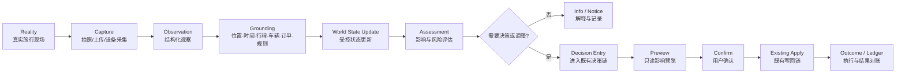
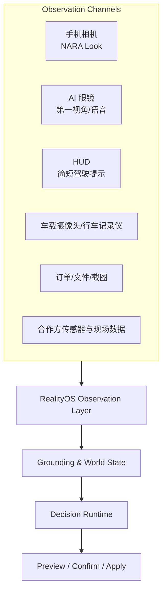
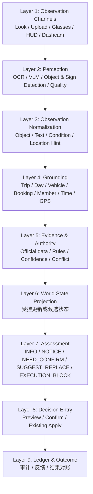
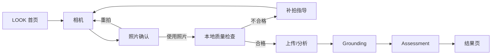
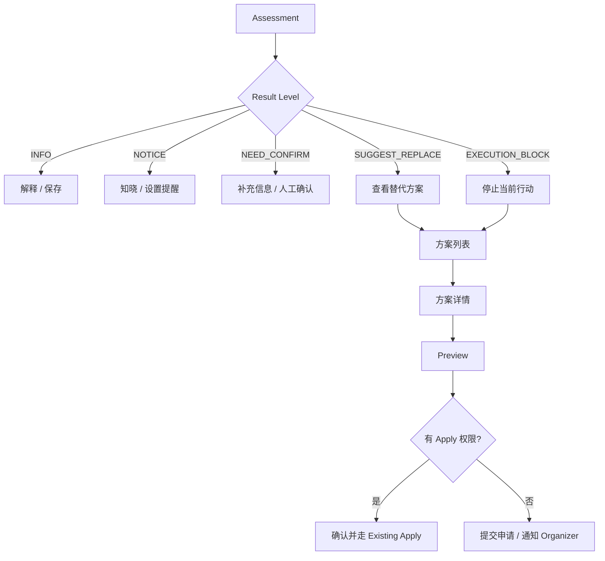
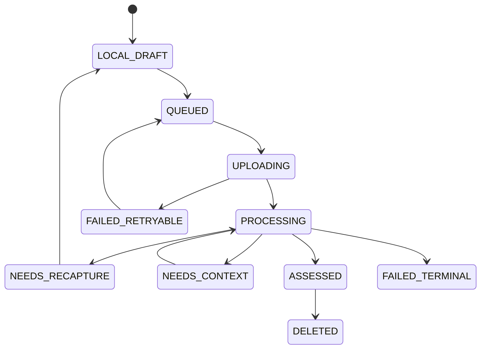

# TripNARA Reality Intelligence（RealityOS）产品需求文档

> **文件名：** `TripNARA-Reality-Intelligence-RealityOS-PRD-v1.0.md`  
> **产品代号：** RealityOS  
> **首个产品切片：** NARA Look  
> **版本：** V1.0  
> **日期：** 2026-07-26  
> **状态：** PROPOSED SSOT / 待产品、架构与安全会签  
> **适用端：** TripNARA iOS / 后续 Android、AI 眼镜、HUD、车载设备  
> **文档类型：** 产品定义级 PRD  
> **维护者：** TripNARA 产品团队

---

## 0. 文档控制

### 0.1 文档目的

本文定义 TripNARA 面向真实旅行世界的感知与决策能力——**Reality Intelligence（RealityOS）**，并冻结首个可交付产品切片 **NARA Look** 的：

- 产品定位；
- 用户价值；
- 能力边界；
- 交互主链；
- 场景优先级；
- Assessment 状态；
- 安全与责任边界；
- 数据模型；
- 接口草案；
- 验收标准；
- 路线图。

本文不是通用视觉识别产品说明，也不是 AI 眼镜硬件方案。  
它是 TripNARA 将手机相机、未来眼镜、HUD、车载摄像头等真实世界输入接入现有旅行决策系统的上位产品定义。

### 0.2 研究输入

本 PRD 基于以下已有材料重构：

1. 《TripNARA NARA Look 视觉交互能力研究报告》V1.0；
2. 《TripNARA NARA Look 竞品详细分析》V1.0；
3. 《TripNARA NARA Look 研究报告—引用注册表》V1.0；
4. TripNARA 已冻结的 Travel Ontology、World State、Decision Runtime、Preview / Confirm / Apply 主链；
5. TripNARA iOS Native Mobile Product Design 原则。

### 0.3 证据标记

本文使用三类标记：

- **[RESEARCH]**：来自附件研究报告或竞品材料；
- **[PRODUCT DECISION]**：本 PRD 做出的产品范围或交互决策；
- **[TO VERIFY]**：仍需通过工程实验、数据核验、法务或上线观察验证。

> 注意：附件引用注册表提供了来源名称和证据等级，但未包含全部原始链接、采样方法和逐条核验记录。本文保留其结论作为产品输入，不将其中所有比例、金额或趋势判断视为已经完成独立事实核查。

### 0.4 术语

| 术语 | 定义 |
|---|---|
| **Reality Intelligence** | TripNARA 理解现实旅行现场并形成可验证行动建议的总体能力 |
| **RealityOS** | Reality Intelligence 的产品与系统总称，不代表独立操作系统 |
| **NARA Look** | 手机相机驱动的第一个 RealityOS Observation Channel |
| **Observation** | 从照片、视频、文本、位置和设备传感器中提取的结构化现场观察 |
| **Grounding** | 将 Observation 与位置、时间、行程、车辆、订单、规则和官方数据关联 |
| **Assessment** | 系统对现场情况及其旅行影响的结构化评估 |
| **Evidence** | 支撑识别与评估的照片、OCR、位置、时间、外部数据、规则和用户确认 |
| **Decision Entry** | 从 Assessment 进入既有 Decision Runtime 或替代方案预览的入口 |
| **Preview** | 对可能调整的只读影响预览，不写入行程 |
| **Confirm** | 用户明确确认建议或方案 |
| **Apply** | 通过 TripNARA 既有授权写链执行变更 |
| **Observation Channel** | 真实世界输入通道，如 LOOK_FIELD、GLASSES、HUD、DASHCAM |
| **World State** | TripNARA 对当前旅行状态的结构化表示 |
| **Authority** | 某项结论可被产品用于什么级别的提示或行动 |

---

## 1. 执行摘要

### 1.1 一句话定位

> **RealityOS 让 NARA 不只知道用户计划去哪里，还能理解用户眼前正在发生什么，并将现场证据转化为安全、可解释、可确认的旅行行动。**

### 1.2 核心问题

通用视觉 AI 通常回答：

> “这是什么？”

TripNARA 需要回答：

> “这对我的行程意味着什么，我现在应该怎么做？”

单纯识别出一个 F-road 标志、停车牌或活动入口，不足以形成旅行价值。  
用户真正需要的是系统进一步判断：

- 当前车辆是否允许进入；
- 当前租车合同和保险是否覆盖；
- 官方道路状态是否开放；
- 当前时间是否还能完成后续活动；
- 是否需要改道、延后、取消或补充确认；
- 哪个行动对当前行程最合适。

### 1.3 核心机会

**[RESEARCH]** 研究材料将旅行视觉需求区分为：

1. **决策场景：** 涉及金钱损失、人身风险、时间窗口或行程中断；
2. **好奇场景：** 地标、植物、建筑和百科知识识别。

**[PRODUCT DECISION]** RealityOS 只将第一类作为核心产品范围。  
普通百科识图可以由通用模型辅助回答，但不作为独立产品壁垒和 P0 投入重点。

### 1.4 产品主链



### 1.5 首个产品切片

**NARA Look** 是手机端相机入口，首版聚焦用户主动发起的现场观察：

```text
打开 NARA Look
→ 拍照或选择照片
→ 确认图片和场景
→ 上传与解析
→ 补齐行程上下文
→ 形成 Assessment
→ 查看证据和影响
→ 必要时进入 Preview / Confirm / Existing Apply
```

---

## 2. 产品愿景与战略定位

### 2.1 愿景

TripNARA 的长期目标不是成为一个“会识图的旅行聊天机器人”，而是成为连接旅行计划与现实世界的持续决策系统。

传统旅行产品主要掌握：

- 用户计划；
- 预订信息；
- 地图路径；
- 天气和道路接口。

但真实旅行中，大量关键变化首先出现在用户眼前：

- 现场标志与官方数据不一致；
- 实际车辆与订单不一致；
- 活动入口改变；
- 酒店自助入住说明更新；
- 路面和环境出现异常；
- 设备、票据或合同包含关键限制；
- 用户已到达错误位置；
- 现场排队导致后续计划不可执行。

RealityOS 的作用是将这些现场变化变成结构化、可追溯、可用于决策的输入。

### 2.2 战略定位

| 维度 | 通用视觉产品 | RealityOS |
|---|---|---|
| 核心问题 | 这是什么 | 这对当前旅行意味着什么 |
| 输入 | 图片或视频 | 图片/视频 + Trip Context + 官方数据 |
| 输出 | 名称、翻译、搜索结果 | 影响、风险、证据、建议、行动入口 |
| 上下文 | 弱或由用户手动描述 | 行程、车辆、成员、订单、位置、时间 |
| 行动能力 | 链接或通用操作 | Preview → Confirm → Existing Apply |
| 风险控制 | 通用免责声明 | Authority、证据门槛、阻断与升级 |
| 长期资产 | 视觉模型能力 | 旅行判例、规则、上下文和结果对账 |

### 2.3 产品不是

RealityOS 不是：

- 通用物体识别产品；
- Google Lens 替代品；
- 通用地图导航产品；
- 驾驶辅助系统或自动驾驶系统；
- 仅凭照片判断道路绝对安全的工具；
- 医疗诊断、车辆维修诊断或法律意见服务；
- 绕过用户确认直接修改行程的自动代理；
- 持续、隐蔽地采集同行者或路人的监控系统。

### 2.4 长期设备形态



**[PRODUCT DECISION]** 手机是 P0 唯一正式产品端。  
眼镜、HUD 和车载能力仅作为兼容方向，不作为 NARA Look 成立的前提。

---

## 3. 用户问题与价值定义

### 3.1 用户真正要完成的任务

用户不是为了“使用相机”而使用 NARA Look。  
用户是在旅行现场遇到不确定性，希望快速完成以下任务：

1. **看懂：** 眼前是什么；
2. **判断：** 是否与我有关；
3. **评估：** 对安全、费用、时间或行程有什么影响；
4. **选择：** 下一步应该继续、停止、确认还是替换；
5. **执行：** 导航、联系、补充证据或进入行程调整；
6. **留证：** 在纠纷、车辆交付或住宿问题中保存可信证据。

### 3.2 核心 Job Stories

#### JS-01 道路入口判断

> 当我在陌生地区看到一个不确定的道路标志时，我希望 NARA 结合我的车辆、合同和官方道路状态进行判断，这样我能避免进入不允许或高风险的道路。

#### JS-02 停车规则判断

> 当我看不懂停车牌时，我希望 NARA 告诉我在当前地点和时间能否停车、需要做什么以及何时必须离开。

#### JS-03 租车交付留证

> 当我取车或还车时，我希望 NARA 引导我完整记录车身、里程和油量，并生成带时间与位置的证据包，减少后续责任争议。

#### JS-04 现场入口确认

> 当我找不到活动、酒店或渡轮的正确入口时，我希望 NARA 结合订单、位置和时间确认我是否在正确地点，并给出下一步行动。

#### JS-05 文本限制理解

> 当合同、门票或现场说明包含我看不懂的文字时，我希望 NARA 不只翻译，还能指出对当前旅行真正有影响的限制。

#### JS-06 行程影响判断

> 当现场情况发生变化时，我希望 NARA 告诉我它是否会导致迟到、错过活动、无法入住或需要调整路线。

### 3.3 用户角色

| 角色 | 主要需求 | 权限 |
|---|---|---|
| **Organizer / 行程组织者** | 评估影响、选择方案、确认写回 | 可 Preview、Confirm，按行程角色 Apply |
| **Driver / 驾驶员** | 道路、车辆、停车与安全提示 | 可提交 Observation；驾驶中受交互限制 |
| **Member / 普通成员** | 上传现场、确认入口、查看解释 | 可提交 Observation；默认不可 Apply 高影响变更 |
| **Professional Leader / 顾问或领队** | 审核现场证据、给出专业建议 | 按授权参与 Confirm 或协同处理 |
| **Support / 运营支持** | 处理数据冲突、申诉和高风险升级 | 不可替代用户做现实安全决定 |

### 3.4 生命周期

RealityOS 可服务整个旅行生命周期，但 P0 重点是 **TRAVELING**。

| 生命周期 | 典型视觉需求 | P0 |
|---|---|---|
| PLANNING | 合同、订单、装备、攻略截图 | 部分支持，非主入口 |
| TRAVELING | 道路、停车、车辆、入口、现场异常 | 核心 |
| COMPLETED | 证据导出、纠纷处理、旅行记录 | 支持结果查看与导出 |

---

## 4. 研究结论转化

### 4.1 旅行视觉需求分类

**[RESEARCH]** 附件报告将需求归纳为六类：

| 类别 | 典型对象 | 用户问题 | 产品处理方式 |
|---|---|---|---|
| 道路/交通 | 停车牌、限速牌、F-road、渡口 | 能不能走、能不能停 | 核心 Assessment |
| 车辆/租车 | 划痕、里程、油量、合同 | 是否匹配、是否留证 | 证据 + 规则核验 |
| 活动/景区 | 集合点、门票、安全提示 | 是否走对、是否赶得上 | 订单 + 时间窗 |
| 住宿 | 入口、自助入住、停车规则 | 能否入住、是否违规 | 订单 + 位置 |
| 环境 | 风雪、能见度、河流、冰面 | 是否危险 | 视觉仅作证据，不单独授权 |
| 文字内容 | 菜单、合同、说明、票据 | 什么意思、有什么影响 | OCR + 上下文解释 |

### 4.2 研究候选 Top 5

附件研究建议优先考虑：

1. 停车标志智能识别；
2. 租车取车证据存档；
3. F-road / 碎石路判断；
4. 菜单翻译与过敏原提示；
5. 限速牌单位识别。

### 4.3 产品范围收敛

**[PRODUCT DECISION]** RealityOS P0 不将五个场景全部作为同等深度的正式能力。

原因：

- TripNARA 当前冷启动是复杂自驾与可执行决策；
- 通用菜单翻译竞争充分，难以体现核心决策链；
- 驾驶中限速牌识别涉及驾驶安全和实时设备能力，不适合以手持手机作为主交互；
- P0 应优先验证“现场 Observation 是否能进入 TripNARA Decision Runtime”。

因此，P0 分为：

#### P0-A：正式决策闭环场景

1. **道路与车辆适配确认**
   - F-road / 道路限制标志；
   - 车辆类型与合同限制；
   - 官方道路状态核验；
   - 安全替代路线入口。

2. **停车规则与时间判断**
   - 停车标志 OCR；
   - 当前地点和时间；
   - 是否允许停车；
   - 付费、时限和离开提醒。

3. **活动 / 住宿 / 渡轮入口确认**
   - 是否为正确入口；
   - 是否与订单匹配；
   - 是否可能迟到；
   - 导航、联系或调整入口。

#### P0-B：证据型场景

4. **租车取还车证据采集**
   - 引导式多角度拍摄；
   - 划痕、里程、油量；
   - 时间、GPS 和原图摘要；
   - 证据包查看与导出。

#### P0-C：轻能力，不进入核心决策链

5. **文本解释**
   - 合同、门票、停车说明、活动通知；
   - 提取关键限制；
   - 高风险内容标记“需人工或官方确认”。

#### P1 候选

- 菜单翻译与过敏原辅助；
- 景点开放时间；
- 门票有效期；
- 加油站读数核对；
- 露营火禁令；
- 登山步道难度；
- 房间与预订信息对比；
- AI 眼镜第一视角采集。

---

## 5. 产品目标与非目标

### 5.1 P0 产品目标

| ID | 目标 |
|---|---|
| G-01 | 用户可在 3 个核心现场场景中快速发起观察 |
| G-02 | 系统能将图片结果与当前 Trip Context 自动关联 |
| G-03 | 系统明确区分识别事实、外部事实、推断和建议 |
| G-04 | 系统能输出结构化 Assessment，而非仅返回聊天文本 |
| G-05 | 高影响场景可进入既有 Preview / Confirm / Apply 链 |
| G-06 | UNKNOWN、数据冲突和证据不足时禁止强结论 |
| G-07 | 完整记录 Observation、Evidence、Assessment 与用户行动 |
| G-08 | 弱网和上传失败时，不丢失用户已拍摄的证据 |

### 5.2 非目标

| ID | 非目标 |
|---|---|
| NG-01 | 不做通用百科识图的全面覆盖 |
| NG-02 | 不提供仅凭现场图片得出的“道路绝对安全”结论 |
| NG-03 | 不在驾驶员驾驶过程中鼓励手持拍摄或阅读复杂结果 |
| NG-04 | 不替代官方道路、天气、活动运营商和紧急服务 |
| NG-05 | 不新增独立行程 Apply 链路 |
| NG-06 | 不允许 AI 直接写入行程 |
| NG-07 | 不做隐蔽持续录像、自动人脸或情绪分析 |
| NG-08 | 不在 P0 建设硬件或生产 AI 眼镜 |

### 5.3 成功定义

P0 成功不等于识别准确率高，而是：

> 在真实旅行关键时刻，用户可以通过一次现场观察，获得比通用识图更相关、更安全、更能执行的结果。

---

## 6. 产品原则

### P1 — Observation Before Judgment

系统先记录“看到了什么”，再判断“意味着什么”。  
Observation 与 Assessment 必须分层，不允许把模型推断伪装成现场事实。

### P2 — Context Is Required for Decision

无位置、时间、车辆、订单或行程上下文时，系统最多提供识别与解释。  
不能形成需要这些上下文才能成立的强行动建议。

### P3 — Authority Follows Evidence

Assessment 的权威级别由证据决定，而不是由模型语气决定。

```text
单张图片
≠ 官方道路开放
≠ 当前车辆合法进入
≠ 现场绝对安全
```

### P4 — No Silent Write

AI 只能生成建议或草案。  
任何行程变更必须经过：

```text
Assessment
→ Preview
→ Confirm
→ Existing Apply / Authorize / Execute
```

### P5 — Unknown Is a Valid Result

当图片模糊、缺少位置、规则冲突或官方数据不可用时，应明确返回 UNKNOWN、NEED_CONFIRM 或 CONFLICTING，而不是补全一个看似合理的答案。

### P6 — Mobile = Immediate Decision

移动端应优先展示：

- 发生了什么；
- 对当前行程有什么影响；
- 推荐做什么；
- 用户现在可以执行什么。

不在移动端展示复杂因果图、完整约束控制台或宽表决策矩阵。

### P7 — Safety Over Convenience

涉及驾驶、涉水、暴风雪、道路封闭、车辆故障和人身安全时：

- 优先阻断危险交互；
- 优先引用官方数据；
- 优先建议停车、撤离或联系专业机构；
- 不使用“看起来安全”“应该可以”等模糊鼓励性文案。

### P8 — Privacy by Default

图片是为当前任务采集，而不是默认进入训练数据。  
默认最小化保存、最小化共享，并对人脸、车牌、合同和订单信息提供遮挡与删除能力。

---

## 7. RealityOS 能力架构

### 7.1 分层模型



### 7.2 Observation Channel

P0 统一命名：

```ts
type ObservationChannel = 'LOOK_FIELD';
```

未来扩展：

```ts
type ObservationChannel =
  | 'LOOK_FIELD'
  | 'PHOTO_LIBRARY'
  | 'DOCUMENT_UPLOAD'
  | 'GLASSES_FIRST_PERSON'
  | 'HUD_SENSOR'
  | 'DASHCAM'
  | 'PARTNER_FEED';
```

**[PRODUCT DECISION]** 不复用或重载现有 `UnifiedAssessmentLaneKind`。  
Observation Channel 描述输入来源；Assessment Lane 描述评估维度，两者语义不同。

### 7.3 Observation 类型

```ts
type ObservationKind =
  | 'ROAD_SIGN'
  | 'PARKING_SIGN'
  | 'ROAD_SURFACE'
  | 'VEHICLE'
  | 'VEHICLE_DAMAGE'
  | 'DASHBOARD'
  | 'BOOKING_DOCUMENT'
  | 'CONTRACT_DOCUMENT'
  | 'ACTIVITY_ENTRANCE'
  | 'ACCOMMODATION_ENTRANCE'
  | 'FERRY_TERMINAL'
  | 'ENVIRONMENT'
  | 'EQUIPMENT'
  | 'TEXT_NOTICE'
  | 'UNKNOWN';
```

### 7.4 Observation 不等于 World State

默认流程：

```text
Raw Media
→ Observation Candidate
→ Grounding
→ Evidence Check
→ Assessment
```

只有满足明确规则时，Observation 才能更新 World State：

| 情况 | World State 处理 |
|---|---|
| OCR 识别到停车时间 | 作为候选事实，不直接覆盖官方规则 |
| 用户拍到车辆车牌和车型 | 用户确认后更新 Trip Vehicle Snapshot |
| 用户拍到活动入口 | 可更新 arrival evidence，不更改订单 |
| 拍到封路牌 | 触发官方数据核验和风险 Assessment |
| 拍到道路积雪 | 记录现场证据，不自动判定道路关闭 |
| 租车划痕 | 写入 Evidence Package，不修改车辆责任结论 |

---

## 8. NARA Look 信息架构

### 8.1 入口

NARA Look 在 P0 提供四个入口：

1. **执行总览快捷入口：** “让 NARA 看一下”；
2. **问 NARA：** 相机按钮；
3. **风险 / 待调整项详情：** “拍摄现场确认”；
4. **车辆、活动、住宿详情页：** 场景化“拍照核对”。

### 8.2 Look 首页

#### 页面目标

让用户在不理解技术分类的情况下，快速开始拍摄。

#### 页面结构

```text
导航栏
NARA Look
说明：拍下现场，NARA 会结合你的行程判断影响

当前上下文卡
- 冰岛自驾 · Day 4
- 当前车辆：2WD SUV
- 下一项：14:30 冰川徒步
- 位置：可用 / 不可用

主按钮
[打开相机]

快捷场景
- 看道路或停车标志
- 核对车辆与合同
- 找活动或住宿入口
- 看通知、门票或说明

最近观察
- 时间、缩略图、Assessment 状态
```

#### 交互原则

- 主入口只有一个强 CTA；
- 快捷场景用于提高解析精度，不要求用户必须选择；
- 无 Trip Context 时允许拍摄，但提前说明结果可能仅为“识别与解释”。

### 8.3 页面清单

| 页面 ID | 页面 |
|---|---|
| LOOK-01 | NARA Look 首页 |
| LOOK-02 | 相机拍摄 |
| LOOK-03 | 照片确认 |
| LOOK-04 | 上传与分析 |
| LOOK-05 | 补拍指导 |
| LOOK-06 | Assessment 结果 |
| LOOK-07 | Evidence 详情 |
| LOOK-08 | 替代方案列表 |
| LOOK-09 | 方案详情 |
| LOOK-10 | Preview 确认 |
| LOOK-11 | 提交 / 申请完成 |
| LOOK-12 | Observation 历史 |
| LOOK-13 | 证据包详情与导出 |
| LOOK-14 | 离线待处理 |
| LOOK-15 | 隐私与数据设置 |

---

## 9. 核心交互流程

### 9.1 标准拍摄流程



### 9.2 照片确认页

必须显示：

- 照片预览；
- 当前时间；
- 当前定位状态；
- 自动识别的场景类型；
- “这张照片主要想确认什么？”可选输入；
- 重拍；
- 使用照片。

若检测到：

- 驾驶中移动；
- 明显人脸；
- 车牌或合同；
- 图片可能包含敏感信息；

应显示相应提示，但不阻断合理任务。

### 9.3 补拍流程

触发条件：

- 图片模糊；
- 目标过小；
- 标志被遮挡；
- 缺少关键角度；
- OCR 不完整；
- 车辆证据采集未完成规定视角。

补拍指引必须具体：

```text
没有拍清停车牌下方的时间限制。
请靠近并保持手机稳定，完整拍下：
1. 顶部停车符号
2. 中间日期/时间
3. 底部付费或例外说明
```

禁止只显示“识别失败，请重试”。

### 9.4 Assessment 到决策流程



### 9.5 权限不足

普通成员发现问题时：

1. 可以上传 Observation；
2. 可以查看 Assessment；
3. 可以查看只读替代方案；
4. 不可直接执行高影响调整；
5. 可“提交给组织者”；
6. 组织者收到包含 Evidence、Assessment 和 Preview 的待确认项。

---

## 10. Assessment 模型

### 10.1 状态枚举

```ts
type LookAssessmentLevel =
  | 'INFO'
  | 'NOTICE'
  | 'NEED_CONFIRM'
  | 'SUGGEST_REPLACE'
  | 'EXECUTION_BLOCK'
  | 'UNKNOWN'
  | 'CONFLICTING';
```

### 10.2 状态定义

| 状态 | 含义 | 用户 CTA | 可否进入 Apply |
|---|---|---|---|
| INFO | 识别完成，无明显行程影响 | 完成、查看详情 | 否 |
| NOTICE | 有影响但当前无需更改计划 | 知道了、设置提醒 | 否 |
| NEED_CONFIRM | 证据或关键上下文不足 | 补拍、补信息、联系确认 | 否 |
| SUGGEST_REPLACE | 当前方案不优或存在高影响风险 | 查看替代方案 | 仅经 Preview |
| EXECUTION_BLOCK | 当前行动被规则或权威证据阻断 | 停止、查看安全方案 | 禁止原方案 Apply |
| UNKNOWN | 无法形成可靠判断 | 重拍、稍后处理 | 否 |
| CONFLICTING | 图片、官方数据或用户信息冲突 | 查看冲突、人工确认 | 否 |

### 10.3 Result Card 标准结构

所有结果卡按顺序表达：

1. **发生了什么**
2. **影响什么**
3. **系统依据**
4. **推荐做什么**
5. **用户可执行操作**

示例：

```text
道路可能不适合当前车辆

你拍到的标志与 F-road 入口特征一致。
当前行程车辆为 2WD SUV，租车合同记录为“禁止进入 F-road”。

影响：
继续前进可能违反租车限制，并影响保险覆盖。

依据：
- 现场照片：高置信识别
- 当前车辆：2WD SUV
- 租车限制：已确认
- 官方道路状态：正在核验

推荐：
先不要进入，查看低地替代路线。

[查看安全方案] [补拍标志] [查看依据]
```

### 10.4 Authority 等级

```ts
type AssessmentAuthority =
  | 'VISUAL_ONLY'
  | 'CONTEXT_GROUNDED'
  | 'OFFICIAL_CORROBORATED'
  | 'USER_CONFIRMED'
  | 'PROFESSIONAL_CONFIRMED';
```

| Authority | 可输出 |
|---|---|
| VISUAL_ONLY | 识别、翻译、保守解释 |
| CONTEXT_GROUNDED | 个性化影响提示、NEED_CONFIRM |
| OFFICIAL_CORROBORATED | SUGGEST_REPLACE、部分 EXECUTION_BLOCK |
| USER_CONFIRMED | 更新用户声明型状态 |
| PROFESSIONAL_CONFIRMED | 特定运营商、领队或客服确认结果 |

**[PRODUCT DECISION]** 单一视觉模型不得单独形成高风险“允许继续”的结论。

---
## 11. P0 场景详细需求

### 11.1 场景 A：道路与车辆适配

#### 用户问题

- 这是什么路？
- 当前车辆能不能走？
- 租车公司是否允许？
- 保险是否可能失效？
- 官方道路是否开放？
- 不走这里还有什么方案？

#### 输入

- 道路标志照片；
- 当前 GPS；
- 拍摄时间；
- Trip Vehicle Snapshot；
- 租车合同或用户已确认限制；
- 当前路线和下一目的地；
- 官方道路状态；
- 天气与风况。

#### 系统输出

- 标志和道路类型识别；
- 车辆适配判断；
- 合同限制；
- 官方道路状态；
- 当前建议；
- Evidence；
- 替代路线入口。

#### 关键规则

1. 图片识别为 F-road，但无车辆信息：
   - 返回 NEED_CONFIRM；
   - 引导确认车辆；
   - 不输出“可以进入”。

2. 车辆或合同明确不允许：
   - 至少 SUGGEST_REPLACE；
   - 若用户正准备进入且规则明确，返回 EXECUTION_BLOCK。

3. 官方道路关闭：
   - EXECUTION_BLOCK；
   - 不允许用户绕过并将原路线写回为可执行。

4. 图片显示恶劣路面但官方数据未知：
   - NOTICE 或 NEED_CONFIRM；
   - 建议停车后核验；
   - 不根据视觉判断可安全通过。

#### 验收案例

| Case | 输入 | 预期 |
|---|---|---|
| ROAD-01 | F-road 标志 + 2WD + 合同禁止 | EXECUTION_BLOCK 或 SUGGEST_REPLACE |
| ROAD-02 | 标志模糊 + 无 GPS | UNKNOWN + 补拍 |
| ROAD-03 | 图片疑似封路 + 官方显示开放 | CONFLICTING |
| ROAD-04 | 官方关闭 + 图片无明显封路 | EXECUTION_BLOCK，以官方数据为准 |
| ROAD-05 | 4WD + 合同允许 + 官方开放 | 不直接宣称安全；输出条件性说明 |

### 11.2 场景 B：停车规则判断

#### 用户问题

- 现在能不能停？
- 是否需要付费？
- 可以停到几点？
- 周末和节假日是否例外？
- 是否只允许居民或特定车辆？
- 如何避免错过离开时间？

#### 输入

- 停车牌完整照片；
- OCR 文本；
- 当前位置；
- 当前日期与当地时间；
- 车辆类型；
- 当地停车规则数据；
- 可能的支付平台或区域编号。

#### 输出

```text
现在可以停车
有效至 18:00
17:00 前需要付费
此车位不适用于房车过夜

[设置离开提醒] [打开缴费方式] [查看原文]
```

#### 风险控制

- 无法识别完整附加牌时返回 NEED_CONFIRM；
- 不根据通用国家规则覆盖现场具体标志；
- 罚款金额只有存在可靠来源时显示；
- 不承诺“绝对不会被罚款”；
- 当地法规数据不可用时，明确标记结果依据仅为视觉解释。

### 11.3 场景 C：活动、住宿与渡轮入口

#### 用户问题

- 我到的是正确入口吗？
- 这是我的运营商吗？
- 应该在哪个停车区集合？
- 还有多久停止签到？
- 走错地方会不会迟到？
- 需要联系谁？

#### 输入

- 入口或招牌照片；
- 当前 GPS；
- Booking Snapshot；
- 订单运营商、集合点、时间；
- 当前 Day Timeline；
- 步行或驾驶距离；
- 运营商联系方式。

#### 输出

- 匹配程度；
- 当前是否在正确地点；
- 距离正确入口的时间；
- 是否存在迟到风险；
- 导航；
- 联系运营商；
- 必要时进入“调整今天”。

#### 关键规则

- 视觉相似但定位相差过大：CONFLICTING；
- 距签到截止不足缓冲：NOTICE 或 SUGGEST_REPLACE；
- 活动已错过且订单不可变更：进入 Decision Problem，不自动取消；
- 只允许显示已验证的联系方式。

### 11.4 场景 D：租车取还车证据包

#### 用户问题

- 车身现有损伤是否记录完整？
- 里程和油量是多少？
- 这些证据是否足以应对纠纷？
- 还车时是否与取车记录一致？

#### 采集流程

```text
开始检查
→ 车辆四角
→ 左侧
→ 右侧
→ 前部
→ 后部
→ 车顶/挡风玻璃（可选）
→ 轮胎（可选）
→ 仪表盘
→ 油量/电量
→ 用户确认
→ 生成证据包
```

#### 证据包字段

- 原始照片；
- 拍摄时间；
- GPS；
- 上传时间；
- 文件哈希；
- 车辆订单 ID；
- 车牌（可遮挡展示）；
- 车型；
- 自动识别的疑似损伤区域；
- 用户确认的损伤；
- 里程；
- 油量或电量；
- 取车 / 还车类型；
- 导出记录。

#### 产品边界

- AI 识别“疑似划痕”，不直接认定责任；
- 不自动向租车公司发送；
- 用户可删除或导出；
- PDF 导出为 P0.5，数据完整保存为 P0。

### 11.5 场景 E：文本与文件解释

#### 支持对象

- 停车说明；
- 活动通知；
- 门票；
- 租车合同；
- 保险说明；
- 自助入住说明；
- 渡轮和景点告示。

#### 输出层次

1. 原文 OCR；
2. 用户语言翻译；
3. 关键字段提取；
4. 与当前 Trip Context 有关的限制；
5. 需人工确认的条款。

#### 示例

```text
这份租车说明包含一项与当前路线有关的限制：

“车辆不得进入标记为 F 的道路。”

你的 Day 4 路线包含 F208 候选路段。
该条款可能使原路线不可执行。

[查看相关路段] [提交给组织者] [查看原文]
```

---

## 12. 边缘状态与异常处理

### 12.1 UNKNOWN

触发：

- 图片无有效目标；
- 模糊或过暗；
- 模型无法分类；
- 上下文不足；
- 外部数据不可用且结论依赖它。

页面：

```text
暂时无法判断

照片中没有足够信息确认这是什么，或它是否影响当前行程。

建议：
- 完整拍下标志和附加说明
- 打开定位
- 选择与这张照片相关的行程项目

[重新拍摄] [补充信息] [保存稍后处理]
```

### 12.2 CONFLICTING

触发：

- 图片疑似封路，但官方道路状态为开放；
- 入口招牌匹配，但 GPS 与订单集合点不匹配；
- 车辆照片车型与订单车型不同；
- OCR 条款与结构化合同数据不同。

要求：

- 并列显示冲突来源；
- 不自动选择“看起来更可信”的一方；
- 给出安全默认动作；
- 允许用户确认现场事实；
- 高风险冲突可提交运营支持或专业人员。

### 12.3 NO_GPS

允许继续拍摄，但：

- 明确降低 Assessment Authority；
- 与位置强相关的场景返回 NEED_CONFIRM；
- 提供“打开定位”“手动选择地点”；
- 不因定位不可用阻止证据拍摄。

### 12.4 UPLOAD_FAIL

要求：

- 图片先安全保存本地；
- 显示“已保存，网络恢复后重试”；
- 用户可删除；
- 自动重试遵循网络与电量条件；
- 不重复创建 Observation。

### 12.5 OFFLINE

P0 离线能力：

- 本地拍摄与队列；
- 时间戳与本地位置；
- 场景选择；
- 基础图片质量检查；
- 本地展示“尚未完成分析”。

不承诺：

- 离线视觉决策；
- 离线官方道路判断；
- 离线行程写回。

---

## 13. 功能需求

### 13.1 Capture

| ID | 需求 | 优先级 |
|---|---|---|
| LOOK-FR-001 | 支持相机拍照 | P0 |
| LOOK-FR-002 | 支持从照片库选择 | P0 |
| LOOK-FR-003 | 支持一次任务上传多张图片 | P0 |
| LOOK-FR-004 | 拍摄时记录本地时间和定位状态 | P0 |
| LOOK-FR-005 | 支持场景快捷选择 | P0 |
| LOOK-FR-006 | 支持用户补充一句问题 | P0 |
| LOOK-FR-007 | 检测图片模糊、过暗、遮挡和目标过小 | P0 |
| LOOK-FR-008 | 驾驶移动状态下限制手持拍照入口 | P0 |
| LOOK-FR-009 | 支持短视频 | P1 |

### 13.2 Observation

| ID | 需求 | 优先级 |
|---|---|---|
| OBS-FR-001 | 创建唯一 Observation ID | P0 |
| OBS-FR-002 | 保留原始媒体与派生结果关系 | P0 |
| OBS-FR-003 | 输出结构化 Observation Candidate | P0 |
| OBS-FR-004 | 标记识别置信与不确定项 | P0 |
| OBS-FR-005 | 区分 OCR 原文、翻译和模型推断 | P0 |
| OBS-FR-006 | 支持用户纠正场景和识别结果 | P0 |
| OBS-FR-007 | 记录 Observation Channel | P0 |

### 13.3 Grounding

| ID | 需求 | 优先级 |
|---|---|---|
| GRD-FR-001 | 自动关联当前 Trip | P0 |
| GRD-FR-002 | 自动关联当前 Day / 时间轴附近项目 | P0 |
| GRD-FR-003 | 关联当前车辆 | P0 |
| GRD-FR-004 | 关联订单、活动或住宿 | P0 |
| GRD-FR-005 | 关联位置、当地时间与时区 | P0 |
| GRD-FR-006 | 获取必要的官方道路或规则数据 | P0 |
| GRD-FR-007 | 允许用户切换错误关联对象 | P0 |
| GRD-FR-008 | 生成 contextHash 以支持可追溯评估 | P0 |

### 13.4 Assessment

| ID | 需求 | 优先级 |
|---|---|---|
| ASM-FR-001 | 输出标准 Assessment Level | P0 |
| ASM-FR-002 | 输出“发生、影响、依据、建议、行动” | P0 |
| ASM-FR-003 | 输出 Authority | P0 |
| ASM-FR-004 | 输出 Evidence 引用 | P0 |
| ASM-FR-005 | 检测视觉与外部数据冲突 | P0 |
| ASM-FR-006 | 高风险且证据不足时降级为 NEED_CONFIRM | P0 |
| ASM-FR-007 | 可生成 Decision Entry | P0 |
| ASM-FR-008 | 不直接写 Plan Version | P0 |

### 13.5 Evidence

| ID | 需求 | 优先级 |
|---|---|---|
| EVD-FR-001 | 查看原图和裁剪区域 | P0 |
| EVD-FR-002 | 查看 OCR 原文和翻译 | P0 |
| EVD-FR-003 | 查看位置、时间与数据更新时间 | P0 |
| EVD-FR-004 | 查看关联行程、车辆和订单 | P0 |
| EVD-FR-005 | 查看官方数据来源类型 | P0 |
| EVD-FR-006 | 用户可删除自己上传的媒体 | P0 |
| EVD-FR-007 | 导出租车证据包 | P0.5 |
| EVD-FR-008 | 敏感信息遮挡 | P1 |

### 13.6 Decision Integration

| ID | 需求 | 优先级 |
|---|---|---|
| DEC-FR-001 | SUGGEST_REPLACE 可进入替代方案列表 | P0 |
| DEC-FR-002 | EXECUTION_BLOCK 可进入安全方案 | P0 |
| DEC-FR-003 | 方案详情显示影响和 Evidence | P0 |
| DEC-FR-004 | Preview 只读且 writesPlanVersion=false | P0 |
| DEC-FR-005 | Confirm 后走 Existing Apply | P0 |
| DEC-FR-006 | 无权限用户可提交给 Organizer | P0 |
| DEC-FR-007 | Gate BLOCK 不得硬写 | P0 |
| DEC-FR-008 | 写回后返回相关 Day Timeline | P0 |

---

## 14. 状态机

### 14.1 Observation 状态

```ts
type ObservationStatus =
  | 'LOCAL_DRAFT'
  | 'QUEUED'
  | 'UPLOADING'
  | 'PROCESSING'
  | 'NEEDS_RECAPTURE'
  | 'NEEDS_CONTEXT'
  | 'ASSESSED'
  | 'FAILED_RETRYABLE'
  | 'FAILED_TERMINAL'
  | 'DELETED';
```



### 14.2 Assessment 生命周期

```ts
type AssessmentStatus =
  | 'DRAFT'
  | 'EVIDENCE_PENDING'
  | 'READY'
  | 'ACKNOWLEDGED'
  | 'DECISION_OPENED'
  | 'SUPERSEDED'
  | 'RESOLVED';
```

同一 Observation 允许产生多个 Assessment 版本。  
新官方数据、用户补拍或 Trip Context 变化后，旧 Assessment 标记为 `SUPERSEDED`，不得静默覆盖。

---

## 15. 数据模型

### 15.1 RealityObservation

```ts
interface RealityObservation {
  observationId: string;
  tripId?: string;
  dayIndex?: number;
  channel: ObservationChannel;
  kind: ObservationKind;
  status: ObservationStatus;

  capturedAt: string;
  uploadedAt?: string;
  timezone?: string;

  geo?: {
    latitude: number;
    longitude: number;
    accuracyMeters?: number;
    source: 'DEVICE' | 'MANUAL' | 'MEDIA_METADATA';
  };

  userPrompt?: string;
  mediaRefs: ObservationMediaRef[];
  clientContextRef?: string;
  authoritativeContextHash?: string;

  createdBy: string;
  createdAt: string;
  deletedAt?: string;
}
```

### 15.2 ObservationMediaRef

```ts
interface ObservationMediaRef {
  mediaId: string;
  mediaType: 'IMAGE' | 'VIDEO' | 'DOCUMENT';
  originalRef: string;
  thumbnailRef?: string;
  sha256?: string;
  width?: number;
  height?: number;
  durationMs?: number;
  quality?: {
    blurScore?: number;
    brightnessScore?: number;
    occlusionScore?: number;
    targetCoverage?: number;
  };
  privacyFlags?: Array<
    'FACE' | 'LICENSE_PLATE' | 'DOCUMENT_ID' | 'PAYMENT_INFO'
  >;
}
```

### 15.3 ObservationCandidate

```ts
interface ObservationCandidate {
  candidateId: string;
  observationId: string;
  kind: ObservationKind;
  detectedObjects: DetectedObject[];
  extractedTexts: ExtractedText[];
  inferredConditions: InferredCondition[];
  confidence: number;
  limitations: string[];
  modelTraceRef?: string;
}
```

### 15.4 LookAssessment

```ts
interface LookAssessment {
  assessmentId: string;
  observationId: string;
  version: number;

  level: LookAssessmentLevel;
  authority: AssessmentAuthority;
  title: string;
  whatHappened: string;
  tripImpact?: string;
  recommendation?: string;

  evidenceRefs: string[];
  conflictingEvidenceRefs?: string[];
  missingContext?: string[];

  decisionEntry?: {
    decisionProblemId?: string;
    previewRef?: string;
    allowedActions: Array<
      'ACKNOWLEDGE'
      | 'RECAPTURE'
      | 'ADD_CONTEXT'
      | 'VIEW_EVIDENCE'
      | 'VIEW_ALTERNATIVES'
      | 'SUBMIT_TO_ORGANIZER'
      | 'CONTACT_PROVIDER'
      | 'NAVIGATE'
    >;
  };

  contextHash: string;
  createdAt: string;
  supersededBy?: string;
}
```

### 15.5 EvidenceRecord

```ts
interface EvidenceRecord {
  evidenceId: string;
  type:
    | 'MEDIA'
    | 'OCR'
    | 'USER_INPUT'
    | 'TRIP_CONTEXT'
    | 'VEHICLE'
    | 'BOOKING'
    | 'OFFICIAL_ROAD'
    | 'WEATHER'
    | 'RULE'
    | 'PROVIDER_CONFIRMATION';

  sourceRef: string;
  observedAt?: string;
  fetchedAt?: string;
  validUntil?: string;
  confidence?: number;
  authorityRank: number;
  summary: string;
}
```

### 15.6 EvidencePackage

```ts
interface EvidencePackage {
  packageId: string;
  tripId: string;
  type: 'RENTAL_PICKUP' | 'RENTAL_RETURN' | 'INCIDENT' | 'ACCOMMODATION';
  observationIds: string[];
  mediaHashes: string[];
  generatedAt: string;
  exportStatus?: 'NOT_REQUESTED' | 'GENERATING' | 'READY' | 'FAILED';
}
```

---

## 16. API 草案

> 以下为产品契约草案，具体 REST、GraphQL 或 BFF 路径由架构评审决定。

### 16.1 创建 Observation

```http
POST /v1/trips/{tripId}/reality-observations
```

```json
{
  "channel": "LOOK_FIELD",
  "kindHint": "ROAD_SIGN",
  "capturedAt": "2026-07-26T14:30:00+00:00",
  "geo": {
    "latitude": 63.983,
    "longitude": -19.068,
    "accuracyMeters": 12
  },
  "userPrompt": "我的车能走这里吗？"
}
```

### 16.2 上传媒体

```http
POST /v1/reality-observations/{observationId}/media
```

返回：

```json
{
  "mediaId": "media_xxx",
  "uploadStatus": "READY",
  "quality": {
    "isAcceptable": true
  }
}
```

### 16.3 提交分析

```http
POST /v1/reality-observations/{observationId}/assess
```

要求：

- 幂等；
- 不写 Plan Version；
- 可返回异步任务；
- 保存 contextHash。

### 16.4 获取结果

```http
GET /v1/reality-observations/{observationId}
GET /v1/reality-observations/{observationId}/assessments/latest
GET /v1/reality-assessments/{assessmentId}/evidence
```

### 16.5 补充上下文

```http
PATCH /v1/reality-observations/{observationId}/context
```

支持：

- Trip；
- Day；
- Vehicle；
- Booking；
- 手动地点；
- 用户确认的场景类型。

### 16.6 创建 Decision Entry

```http
POST /v1/reality-assessments/{assessmentId}/decision-entry
```

约束：

- 只创建或关联 Decision Problem；
- 不执行变更；
- 返回可用 Preview 入口。

### 16.7 Feedback

```http
POST /v1/reality-assessments/{assessmentId}/feedback
```

```json
{
  "result": "HELPFUL",
  "userCorrection": {
    "actualKind": "PARKING_SIGN",
    "actualOutcome": "PROVIDER_CONFIRMED"
  }
}
```

### 16.8 删除

```http
DELETE /v1/reality-observations/{observationId}
```

需处理：

- 用户媒体删除；
- 审计记录最小保留；
- 已生成证据包时提示影响；
- 训练用途必须独立同意。

---

## 17. AI 与决策系统要求

### 17.1 推理职责分离

| 组件 | 职责 |
|---|---|
| OCR | 提取文字，不解释旅行影响 |
| 视觉模型 | 识别对象、标志和现场条件 |
| Translation | 翻译原文 |
| Grounding Service | 关联 Trip Context |
| Rule / Constraint Gateway | 评估规则、车辆和道路约束 |
| Official Data Adapter | 获取道路、天气、运营商等外部事实 |
| Decision Runtime | 形成问题、方案和影响 |
| LLM Narrator | 将结构化结果表达给用户 |
| Existing Apply Chain | 用户确认后的正式写入 |

### 17.2 禁止模型越权

LLM Narrator 不得：

- 将低置信视觉推断表达为事实；
- 自称官方已确认，除非 Evidence 中存在官方来源；
- 直接修改计划；
- 生成不存在的替代方案并声称已验证；
- 在高风险场景使用鼓励继续的模糊措辞；
- 隐藏数据冲突；
- 把 Preflight 结果表述为 Verified。

### 17.3 建议生成模板

```text
OBSERVE
现场照片显示什么。

GROUND
与哪个行程、车辆、订单和位置有关。

ASSESS
对当前计划的影响是什么。

EVIDENCE
哪些证据支持，哪些仍不确定。

SUGGEST
推荐用户采取什么动作。

EXECUTE
仅提供合法的 Preview / Contact / Navigate / Confirm 入口。
```

### 17.4 高风险场景策略

| 场景 | 策略 |
|---|---|
| 涉水 | 不给出“可以通过”；建议不要进入并核验官方/专业信息 |
| 暴风雪 | 结合官方预警；优先停车、避险或改变行程 |
| 道路关闭 | 官方关闭直接 EXECUTION_BLOCK |
| 仪表盘故障灯 | 解释可能含义，建议安全停车和联系租车公司；不做维修诊断 |
| 药品 | 仅翻译与信息提取；不提供用药诊断 |
| 合同法律条款 | 摘要与旅行影响提示；不替代法律意见 |
| 人员健康 | 不从外观诊断疲劳、疾病或情绪 |

---

## 18. 隐私、安全与合规

### 18.1 数据分类

| 数据 | 敏感级别 |
|---|---|
| 普通道路或标志照片 | 一般 |
| 精确位置与时间 | 敏感 |
| 车牌、车辆订单 | 敏感 |
| 合同、身份证件、付款信息 | 高敏感 |
| 人脸与儿童图像 | 高敏感 |
| 健康、药品和成员状态 | 高敏感 |

### 18.2 默认策略

- 默认不用于模型训练；
- 原始媒体与分析结果分开存储；
- 显示保存期限；
- 用户可主动删除；
- 导出不会自动公开；
- 分享前提示可能包含位置、车牌和个人信息；
- 对非任务相关人脸提供自动模糊选项；
- 未成年人图像不用于视觉画像或状态推断。

### 18.3 驾驶安全

当系统判断设备处于移动驾驶状态时：

- 驾驶员端不展示相机主 CTA；
- 显示“请在安全停车后使用”；
- 可允许副驾驶模式，但需明确由非驾驶员操作；
- 不显示长文本；
- 未来眼镜 / HUD 只能输出极简语音或视觉警告；
- 不将 RealityOS 宣称为驾驶辅助系统。

### 18.4 免责声明原则

免责声明不能替代产品安全设计。  
文案应贴近具体结论，例如：

> “此结果基于现场照片和当前可用数据，不代表道路持续安全。请以现场官方指示和最新道路状态为准。”

禁止使用一个笼统免责声明来支持高风险强结论。

---
## 19. iOS 交互规范

### 19.1 设计原则

遵循 TripNARA iOS Native Mobile Design：

- Mobile = Action + Context + Immediate Decision；
- 状态驱动 UI；
- 使用 Sheet 处理补充信息和确认；
- 高影响操作使用 Bottom CTA；
- 不在移动端展示完整约束控制台；
- AI 采用 Observe → Explain → Suggest → Execute；
- 重要建议采用“发生了什么 → 影响什么 → 方案 → 推荐 → 确认”。

### 19.2 视觉层级

#### 一级：结论

- 可以继续；
- 需要确认；
- 建议替换；
- 不要继续；
- 暂时无法判断。

#### 二级：影响

- 对今天的活动；
- 对当前路线；
- 对车辆与保险；
- 对费用；
- 对成员。

#### 三级：证据

默认折叠，通过“查看依据”打开。

### 19.3 品牌组件

- Context Card；
- Assessment Card；
- Evidence Row；
- Conflict Banner；
- Recapture Guide；
- Alternative Card；
- Preview Sheet；
- Bottom CTA；
- Offline Queue Item。

品牌色沿用：

- 主品牌色：`#2A4B3C`
- 交互色：`#5E7D5B`

状态色应遵循系统可访问性规范，不只依赖颜色表达。

---

## 20. 通知与主动触发

### 20.1 P0

P0 以用户主动发起为主。  
系统可在已有风险卡或待调整项中提供“拍摄现场确认”，但不主动频繁要求拍照。

### 20.2 P1

允许基于明确上下文触发低打扰建议：

```text
前方路线可能进入 F-road。
如现场看到道路限制标志，请安全停车后让 NARA 看一下。
```

触发必须满足：

- 与当前路线直接相关；
- 用户可理解触发原因；
- 不要求驾驶员立即操作；
- 可关闭；
- 不形成持续监控。

---

## 21. 指标体系

### 21.1 北极星指标

> **Resolved Critical Observations：完成有效 Assessment，并帮助用户采取正确下一步行动的关键现场观察数。**

不能只用拍照次数或识别次数作为北极星指标。

### 21.2 漏斗指标

```text
Look Entry
→ Capture Started
→ Media Accepted
→ Observation Processed
→ Assessment Ready
→ Result Viewed
→ Recommended Action Opened
→ Preview Viewed
→ Confirmed / Acknowledged
→ Outcome Reported
```

### 21.3 核心指标

| 指标 | 定义 |
|---|---|
| Capture Completion Rate | 打开相机后完成有效提交比例 |
| First-pass Media Acceptance | 首张照片无需补拍的比例 |
| Assessment Completion Rate | 有效 Observation 形成结果的比例 |
| Time to Useful Result | 从提交到用户可理解结果的时间 |
| Context Auto-link Accuracy | 自动关联 Trip/Vehicle/Booking 的正确率 |
| Unknown Rate | 返回 UNKNOWN 的比例 |
| Conflict Detection Rate | 成功识别多源冲突的比例 |
| Decision Entry Rate | 进入方案或处理流程的比例 |
| Preview-to-Confirm Rate | 查看 Preview 后确认的比例 |
| Unsafe Overclaim Rate | 高风险结果中错误强结论比例 |
| User Correction Rate | 用户纠正识别或上下文的比例 |
| Evidence Export Rate | 证据包导出比例 |
| Repeat Use | 同一行程多次使用比例 |

### 21.4 守护指标

- 驾驶中手持拍摄尝试；
- 高风险结果被用户报告为误导；
- 已删除媒体仍可访问；
- 官方数据过期却未提示；
- Assessment 与 Evidence 不一致；
- Apply 绕过 Preview / Confirm；
- 同一 Observation 重复写入；
- 上传失败导致原始证据丢失。

### 21.5 P0 建议目标

以下为产品建议目标，不是研究事实，需在 Pilot 后校准：

| 指标 | Pilot 目标 |
|---|---|
| Assessment 成功完成 | ≥ 85% |
| 中位 Time to Useful Result | ≤ 8 秒 |
| 高风险强结论证据覆盖 | 100% |
| writesPlanVersion during assess | 0 |
| Apply 绕过 Confirm | 0 |
| 上传失败证据丢失 | 0 |
| 用户可查看 Evidence | 100% |
| UNKNOWN 提供下一步操作 | 100% |

不以一个统一“视觉准确率 95%”作为全部场景上线门槛。  
各场景应分别定义对象识别、OCR、Grounding、Assessment 和安全误判指标。

---

## 22. 埋点事件

```text
look_home_viewed
look_capture_started
look_capture_blocked_driving
look_media_captured
look_media_rejected_quality
look_recapture_requested
look_observation_created
look_upload_failed
look_analysis_started
look_analysis_completed
look_assessment_viewed
look_evidence_opened
look_context_corrected
look_result_acknowledged
look_alternatives_opened
look_preview_opened
look_confirmed
look_submitted_to_organizer
look_feedback_submitted
look_observation_deleted
look_evidence_exported
```

埋点不得包含原始图片内容和完整 OCR 敏感文本。

---

## 23. 性能与可靠性

### 23.1 SLO

| 项目 | P0 要求 |
|---|---|
| 创建 Observation API | P95 ≤ 800ms |
| 图片质量本地检测 | P95 ≤ 500ms |
| 常规 Assessment | P95 ≤ 10s |
| 状态查询可用性 | ≥ 99.5% |
| 上传断点与重试 | 支持 |
| Idempotency | 必须 |
| 审计链 | Observation → Assessment → Decision Entry 可追溯 |

### 23.2 数据新鲜度

外部数据必须显示：

- 数据来源类型；
- 最后更新时间；
- 是否已过期；
- 是否成功匹配当前位置。

道路、天气和运营商状态的有效期由数据适配器与规则定义，不能由 LLM 自行决定。

---

## 24. 发布计划

### Phase 0 — Internal Prototype

范围：

- 相机；
- ROAD_SIGN / PARKING_SIGN / ENTRANCE 三类；
- Mock Trip Context；
- 结构化 Assessment；
- 不接 Apply。

验收：

- 端到端演示；
- UNKNOWN / CONFLICTING；
- Evidence 展示；
- 无静默强结论。

### Phase 1 — Iceland Closed Pilot

范围：

- 冰岛自驾；
- 道路车辆适配；
- 停车规则；
- 活动 / 住宿入口；
- 租车证据包；
- 接既有 Preview / Confirm。

要求：

- 官方道路数据可用；
- 车辆与合同上下文可用；
- Safety Review；
- Pilot 用户主动反馈；
- 全链路审计。

### Phase 2 — Product Beta

范围：

- 更多文本和订单场景；
- Observation 历史；
- 离线队列；
- Organizer 权限流；
- 证据导出；
- 新西兰南岛国家包适配。

### Phase 3 — Multi-device Research

范围：

- AI 眼镜第一视角采集；
- 手机显示完整 Assessment；
- 眼镜只播报简短结论；
- 不在此阶段建设自动驾驶或持续环境判断。

---

## 25. Roadmap

| 阶段 | 产品定位 | 核心能力 |
|---|---|---|
| P0 / 0–6个月 | 手机现场决策入口 | 拍照、Grounding、Assessment、Decision Entry |
| P1 / 6–12个月 | 旅行现场助手 | 更多订单与文本场景、证据包、主动触发 |
| P2 / 12–24个月 | 多设备 Observation | AI 眼镜采集、语音、手机协同 |
| P3 / 24个月后 | Continuous Reality Intelligence | 多源观察、持续 World State、Outcome Reconciliation |

路线图不代表固定承诺，应以 P0 的使用数据、安全表现和 TripNARA 主链成熟度为继续投资门槛。

---

## 26. 依赖项

### 26.1 产品依赖

- Trip Context Protocol；
- 当前 Trip / Day / Vehicle / Booking Snapshot；
- iOS 权限与角色模型；
- 调整今天 / Decision Space；
- Preview / Confirm / Apply 主链；
- Evidence 与 Activity Ledger。

### 26.2 数据依赖

- 冰岛道路状态与道路规则；
- 车辆道路适配矩阵；
- 租车合同和车型信息；
- 停车规则数据；
- 活动和住宿订单；
- 当地时区与时间；
- 天气和安全预警。

### 26.3 工程依赖

- 媒体上传与安全存储；
- 多模态模型服务；
- OCR 与翻译；
- BFF Grounding；
- Assessment Builder；
- Decision Runtime Adapter；
- 审计、反馈与删除机制。

---

## 27. 风险与缓解

| 风险 | 表现 | 缓解 |
|---|---|---|
| 视觉误判 | 错认标志或车型 | 补拍、低置信降级、多证据 |
| 上下文错配 | 关联错误车辆或订单 | 显示关联对象，允许一键纠正 |
| 官方数据延迟 | 现场与接口不一致 | CONFLICTING、显示更新时间 |
| 过度信任 | 用户将建议视为绝对安全 | Authority、条件式文案、阻断 |
| 驾驶分心 | 手持手机拍摄 | 移动检测、停车提示、副驾驶模式 |
| 隐私泄露 | 人脸、车牌、合同 | 最小保存、遮挡、删除、权限 |
| 法律责任 | 合同、停车或安全结论错误 | 明确依据、保守结论、专业升级 |
| 成本过高 | 每张图片调用多个模型 | 场景路由、轻模型预检、缓存 |
| 通用竞品跟进 | 通用视觉增加旅行回答 | 深化 Trip Context、规则和闭环 |
| 无真实使用 | 用户觉得拍照麻烦 | 场景入口、主动但克制的触发、快速结果 |

---

## 28. P0 验收标准

### 28.1 主链

- [ ] 用户可从执行总览进入 NARA Look；
- [ ] 可拍照、确认、上传；
- [ ] 图片不合格时提供具体补拍指引；
- [ ] Observation 使用 `LOOK_FIELD`；
- [ ] Assessment 不写 Plan Version；
- [ ] 结果展示“发生、影响、依据、建议、行动”；
- [ ] SUGGEST_REPLACE 可进入替代方案；
- [ ] EXECUTION_BLOCK 禁止继续原方案写回；
- [ ] Confirm 后只走 Existing Apply；
- [ ] 无权限成员可提交给 Organizer。

### 28.2 状态

- [ ] INFO；
- [ ] NOTICE；
- [ ] NEED_CONFIRM；
- [ ] SUGGEST_REPLACE；
- [ ] EXECUTION_BLOCK；
- [ ] UNKNOWN；
- [ ] CONFLICTING；
- [ ] NO_GPS；
- [ ] UPLOAD_FAIL；
- [ ] OFFLINE QUEUE。

### 28.3 Safety

- [ ] 单张图片不能形成高风险“允许继续”；
- [ ] 官方道路关闭优先于视觉结果；
- [ ] 涉水场景不提供通过建议；
- [ ] 驾驶移动状态限制手持交互；
- [ ] 所有高风险结果可查看 Evidence；
- [ ] 所有外部数据展示更新时间；
- [ ] 不将 Assessment 描述为已执行；
- [ ] 不将 Preflight 描述为 Verified。

### 28.4 数据与审计

- [ ] Observation、Media、Assessment 独立 ID；
- [ ] contextHash 可追溯；
- [ ] Assessment 支持版本与 superseded；
- [ ] 上传失败不丢原始证据；
- [ ] 用户可删除；
- [ ] Decision Entry 与原 Observation 可追溯；
- [ ] writesPlanVersion = false during capture / assess / preview。

---

## 29. 决策记录

### D-01 产品命名

**决定：** 上位能力命名为 `TripNARA Reality Intelligence（RealityOS）`；手机首个入口命名为 `NARA Look`。

### D-02 Observation Channel

**决定：** P0 使用：

```ts
ObservationChannel = 'LOOK_FIELD'
```

不复用 Assessment Lane 枚举。

### D-03 Apply 路径

**决定：** 不建立 NARA Look 专属 Apply。

```text
Look
→ Assessment
→ Decision Entry
→ Preview
→ Confirm
→ Existing Apply
```

### D-04 手机与眼镜

**决定：** 手机优先；眼镜是后续 Channel，不是 P0 依赖。

### D-05 P0 场景

**决定：**

- 道路与车辆适配；
- 停车规则；
- 活动 / 住宿 / 渡轮入口；
- 租车证据包；
- 关键文本解释。

菜单翻译和驾驶中实时限速识别暂不作为 P0 核心闭环。

### D-06 高风险许可结论

**决定：** 视觉证据只能证明“看到了什么”，不能单独证明“可以安全继续”。

### D-07 World State 写入

**决定：** Observation 默认进入候选状态；只有明确字段和用户/权威确认后，才能更新 World State。

---

## 30. 待决问题

| ID | 问题 | 默认建议 | Owner |
|---|---|---|---|
| OQ-01 | 原始图片默认保存多久 | 行程结束后 30 天，可提前删除 | Privacy |
| OQ-02 | 证据包是否提供 PDF | P0.5 提供 | Product |
| OQ-03 | 是否允许用户匿名提交现场案例改进规则 | 默认关闭，独立 opt-in | Privacy |
| OQ-04 | 停车规则数据源覆盖哪些国家 | 冰岛 Pilot 先做有限覆盖 | Data |
| OQ-05 | 驾驶状态如何检测 | 速度 + CarPlay/运动状态，多信号 | iOS |
| OQ-06 | 专业人工升级由谁提供 | Pilot 期内部支持，不对外承诺 24/7 | Ops |
| OQ-07 | AI 眼镜合作优先级 | P0 数据证明需求后再选型 | Strategy |
| OQ-08 | 合同解释的法务边界 | 摘要与风险提示，不给法律结论 | Legal |
| OQ-09 | 车辆损伤识别模型是否自研 | 先使用通用能力 + 用户确认 | AI |
| OQ-10 | Assessment 是否进入统一 Unified Assessment Bundle | 建议进入独立 observation lane，再聚合 | Arch |

---

## 31. 研究材料与产品决策的差异说明

### 31.1 研究报告支持的结论

附件研究材料支持以下方向性判断：

- 决策场景比好奇识图更适合 TripNARA；
- 停车、租车、道路和合同是高价值候选；
- 通用竞品缺少完整旅行上下文和行动闭环；
- 手机是短期更现实的入口；
- AI 眼镜在解放双手和第一视角采集方面有潜在价值；
- 视觉结论需要与位置、时间、道路、天气和订单等数据融合。

### 31.2 研究材料没有直接证明的事项

以下事项是产品设计或架构决策，不应被表述为研究已验证：

- 用户一定愿意为 NARA Look 付费；
- “手机覆盖 80%、眼镜覆盖 20%”是精确市场比例；
- 所有竞品都不会进入旅行决策领域；
- 任一统一视觉准确率阈值足以保证安全；
- AI 眼镜将在固定时间成为主要交互设备；
- 停车、租车、菜单、限速和 F-road 的排名适用于所有国家和用户；
- 证据导出一定构成独特商业壁垒。

这些判断需要 Pilot 数据、原始来源核验和后续市场验证。

---

## 32. 附录 A：Research Top 30 场景映射

| Research 场景 | RealityOS 处理 |
|---|---|
| 外国停车标志 | P0 核心 |
| 租车取车划痕 | P0 证据 |
| 菜单翻译+过敏原 | P1 |
| 限速牌单位 | P1，眼镜/HUD 更适合实时 |
| F-road/碎石路 | P0 核心 |
| 景点开放时间 | P1 |
| 门票类型/有效期 | P1 |
| 租车协议条款 | P0 轻能力 |
| 加油站读数 | P1 |
| 渡轮登船口 | P0 入口类 |
| 登山步道难度 | P1，高风险保守 |
| 露营火禁令 | P1 |
| 酒店自助入住 | P0 入口类 / P1 完整 |
| 货币换算 | 通用能力，不是 RealityOS 核心 |
| 天气预警信号 | P1，必须官方核验 |
| 药品说明 | 非核心，高风险边界 |
| 房间与照片对比 | P1 证据 |
| 博物馆文物说明 | P2 / 通用 |
| 购物比价 | 不做核心 |
| 路边摊食物识别 | P2 |
| 纪念品条形码 | 不做核心 |
| 植物识别 | 不做核心 |
| 建筑风格 | 不做核心 |
| 艺术品背景 | 不做核心 |
| 动物识别 | 不做核心 |
| 星空识别 | 不做核心 |
| 历史建筑年代 | 不做核心 |
| 当地文字书法 | 通用翻译 |
| 构图建议 | 不做 |
| 滤镜推荐 | 不做 |

---

## 33. 附录 B：竞品启示

| 竞品 | 借鉴 | 不跟随 |
|---|---|---|
| Google Lens | 快速拍摄、区域选择、OCR | 不做通用视觉搜索 |
| Apple Visual Intelligence | 系统级入口、轻卡片、直接操作 | 不依赖特定高端设备 |
| ChatGPT Vision | 多轮理解、文档分析 | 不只输出长文本，不依赖用户手动输入全部上下文 |
| Google Maps Live View | 位置与视觉结合、直接导航 | 不与地图做通用导航竞争 |
| Ray-Ban Meta | 第一视角、语音、解放双手 | 不以拍照分享为核心，不在无显示条件下强行做复杂决策 |

---

## 34. 附录 C：引用索引

以下编号沿用《TripNARA NARA Look 研究报告—引用注册表》：

1. Reddit r/VisitingIceland：F-road discussions（2024–2025）
2. TripAdvisor Forum：Parking and rental car disputes（2024）
3. ParkMobile Survey：Driver stress and parking pain points（2024）
4. Airbnb Global Quality Report：Common guest complaints（2024）
5. 小红书 / 知乎：冰岛自驾、停车标志相关问题（2024–2025）
6. Spiers & Maguire（2008）：Cognition during wayfinding
7. Chang（2023）：Wayfinding strategies and tourist anxiety
8. Petit et al.（2023）：Sunk cost effects for time versus money
9. Orlu Özen（2025）：Visual attention allocation during wayfinding
10. Google（2024）：Google Lens 官方资料
11. Apple（2024）：Visual Intelligence 官方资料
12. Meta（2024）：Ray-Ban Meta 官方资料
13. OpenAI（2024）：GPT-4V System Card
14. Google（2024）：Google Maps Live View 官方资料
15–18. Reddit r/VisitingIceland 具体 F-road / 保险帖子
19. 知乎停车标志相关内容
20. 小红书冰岛 F-road 攻略内容
21. Gartner（2024）相关调查
22. TripAdvisor Trust & Safety Annual Report（2024）
23. Booking.com User Satisfaction Survey（2024）
24. Forbes（2025）：Physical AI / Spatial Computing 趋势
25. PCMag（2026）：Smart Glasses 测评
26. The Verge（2025）：CES Smart Glasses
27. Android Central（2025）：Best Smart Glasses
28. Phocuswright（2025）：Travel Innovation and Technology Trends
29. European Travel Commission（2025）：AI in Tourism Report
30. Spherical Insights（2026）：AR in Travel and Tourism Market

> 正式对外使用研究数字前，应补充原始 URL、访问日期、样本方法和逐条核验结果。

---

## 35. 最终产品定义

> **RealityOS 是 TripNARA 将现实旅行现场转化为结构化 Observation、可信 Assessment 和用户可确认行动的能力层。**

它的首个产品入口 NARA Look 不追求“什么都能看”，而优先处理：

- 用户正在做决定；
- 决定与当前行程直接相关；
- 错误可能造成损失、风险或行程中断；
- 图片比纯文字更能提供关键证据；
- TripNARA 的行程、车辆、订单、规则和官方数据能提供额外价值；
- 系统能够以保守、可解释、可追溯的方式形成下一步行动。

最终主链冻结为：

```text
Reality
→ Observation
→ Grounding
→ Travel World State
→ Assessment
→ Decision Entry
→ Preview
→ Confirm
→ Existing Apply
→ Ledger / Outcome Reconciliation
```

**NARA 看见现实，但不越过证据；理解影响，但不替用户决定；生成方案，但不绕过确认。**
