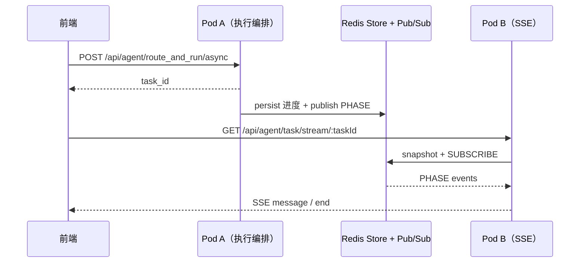

# Agent `route_and_run` 编排 SSE 与分布式事件总线

团队 canonical 文档：旁路流式化改造、多 Pod 部署、Staging 验收与排障。

**相关代码**：`src/agent/`（`RouteAndRunTaskProgressReporter`、`RouteAndRunAsyncTaskStore`、`RouteAndRunTaskStreamService`、Event Bus Port）

---

## 1. 背景与目标

| 改造前 | 改造后 |
|--------|--------|
| `POST /api/agent/route_and_run` 阻塞至编排结束 | 异步 `POST .../async` + **SSE** 阶段进度 |
| 前端 1.5–2s 轮询 `GET .../task/status/:taskId` | 轮询 **保留**；SSE **增量**体验 |
| 单进程内无跨 Pod 事件 | 可选 **Redis Pub/Sub** 跨实例 PHASE 送达 |

**原则**：不动编排内核业务逻辑；Store 仍写任务物理状态；PHASE 经 Event Bus 旁路广播。

---

## 2. 架构（单栈 Nest）



### 2.1 数据流 vs 事件流

| 层 | 职责 | 存储 / 通道 |
|----|------|-------------|
| **物理状态** | `status`、`data`、phase 字段 | `RouteAndRunAsyncTaskStore` → Redis/内存 `task_progress:*` |
| **阶段事件** | 低频率 `PHASE` / 终态 `RESULT` / `ERROR` | `RouteAndRunTaskEventBusPort` → Local 或 Redis `route_and_run:task:{taskId}` |

### 2.2 跨 Pod 行为

- **POST 在 A、SSE 在 B**：生产需 `ROUTE_AND_RUN_TASK_EVENT_BUS_DRIVER=redis`。
- **兜底**：SSE 连接时读 Store 快照；30s 心跳再读 Store（防 Pub/Sub 丢消息或晚连）。

### 2.3 与「管道 B」正交

| | 编排 SSE | 规划助手 Token 流（未做） |
|--|----------|---------------------------|
| 载荷 | `type: PHASE \| RESULT \| ERROR` | `type: TOKEN`（规划） |
| 频率 | 秒级 | 极高 |
| 跨 Pod | 需要 Redis Pub/Sub | 通常单 Pod 长连接透传，**不占** `route_and_run:task:*` |

---

## 3. 环境变量

| 变量 | 默认 | 说明 |
|------|------|------|
| `ROUTE_AND_RUN_TASK_EVENT_BUS_DRIVER` | `local` | 设为 `redis` 启用跨 Pod Pub/Sub |
| `DISABLE_REDIS` | — | `true` 时强制 Local Bus；且不创建 ioredis 客户端 |
| `REDIS_HOST` / `REDIS_PORT` / `REDIS_PASSWORD` / `REDIS_DB` | 见 Config | Pub/Sub **独立** ioredis 双连接（与 cache-manager **物理隔离**） |

**多副本 Staging / 生产**：

```bash
export ROUTE_AND_RUN_TASK_EVENT_BUS_DRIVER=redis
# DISABLE_REDIS 不得为 true
```

**本地 / CI**（无需 Redis 容器）：

```bash
# 不设置 DRIVER 或 DRIVER=local，或 DISABLE_REDIS=true
```

---

## 4. 前端改造

详见 **[route-and-run-sse-frontend-guide.md](./route-and-run-sse-frontend-guide.md)**（调用流程、TypeScript 类型、React Hook、鉴权、轮询兜底、UI 映射）。

---

## 5. HTTP API

| 方法 | 路径 | 说明 |
|------|------|------|
| POST | `/api/agent/route_and_run/async` | 返回 `task_id`（与同步编排同请求体） |
| GET | `/api/agent/task/status/:taskId` | 轮询（存量，兼容） |
| GET | `/api/agent/task/stream/:taskId` | `text/event-stream` |

### SSE 事件格式

- `event: message` — `data` 为 JSON，含 `type`、`current_phase`、`progress_percentage`、`message`、`status`、`ts` 等。
- `type: RESULT` — 含完整 `data`（与 status 接口 SUCCESS 一致）。
- `type: ERROR` — 含 `error`。
- `event: end` — 流结束。
- 注释行 `: ping` — 约 30s 心跳。

---

## 6. 实现落点对照表（ARB / Code Review）

| 验收项 | 代码落点 |
|--------|----------|
| Bus 选型 Local / Redis | `providers/route-and-run-task-event-bus.provider.ts` |
| Redis 双连接 MAIN/SUB | `redis/route-and-run-redis-pubsub.providers.ts` |
| Local EventEmitter2 | `services/local-route-and-run-task-event.bus.ts` |
| Redis Pub/Sub | `services/redis-pub-sub-route-and-run-task-event.bus.ts` |
| Port 接口 | `ports/route-and-run-task-event-bus.port.ts` |
| 编排步骤埋点 | `runtime/route-and-run-task-progress.reporter.ts` |
| Store 写状态 + 终态 emit | `services/route-and-run-async-task.store.ts` |
| SSE 连接 / 背压 / 快照 | `services/route-and-run-task-stream.service.ts` |
| 活跃连接 / 停机推送 | `services/route-and-run-task-stream.registry.ts` |
| 进程退出清理 | `services/route-and-run-task-lifecycle.service.ts` |
| TTFA / 连接时长 | `services/route-and-run-task-stream-metrics.service.ts` → `EventTelemetryService` |
| SSE 路由 | `agent.controller.ts` → `getRouteAndRunTaskStream` |

---

## 7. Staging 双副本验收标准（Acceptance Criteria）

### AC-1 启动日志与双实例对齐

**动作**：查看 Pod A、Pod B 日志。

**期望**（多副本 + `DRIVER=redis`）：

```text
[RouteAndRunTaskEventBus] Using RedisPubSubRouteAndRunTaskEventBus (multi-Pod PHASE delivery)
```

**防呆**（本地 / CI / `DISABLE_REDIS=true`）：

```text
[RouteAndRunTaskEventBus] Using LocalRouteAndRunTaskEventBus (in-process EventEmitter2)
```

```bash
kubectl logs -l app=tripnara --tail=200 | grep RouteAndRunTaskEventBus
```

### AC-2 跨 Pod 分布式事件秒级送达

**动作**：POST `/api/agent/route_and_run/async` → Pod A；`EventSource` `/api/agent/task/stream/:taskId` → Pod B（Ingress 分流或 Header 绑定）。

**期望**：首条 `PHASE` **秒级**出现（**非**仅依赖 30s 心跳）。

### AC-3 可观测性指标

**动作**：检索 `EventTelemetryService` 事件类型：

- `route_and_run_sse_connect`
- `route_and_run_sse_first_action`
- `route_and_run_sse_close`

**期望**：

- `ttfa_from_task_ms`：跨 Pod 与单 Pod **同数量级**（P50 / P99）。
- `ttfa_from_connect_ms`：跨实例可略高（几十 ms），**不得**秒级。

日志示例：

```text
[SSE] first_action task=... ttfa_task_ms=... ttfa_connect_ms=...
```

### AC-4 终态闭环与资源回落

**期望**：

- 前端收到 `type: RESULT` 或 `ERROR`，随后 `event: end`。
- `active_connections` 回落；客户端断开时 `offProgress` 解绑（无僵尸监听）。

**异常停机**：本进程 `PROCESSING` 任务标 `SERVER_SHUTDOWN`；仍挂着的 SSE 收到 `ERROR` 并关闭。

---

## 8. 排障速查

| 现象 | 可能原因 | 检查 |
|------|----------|------|
| SSE 无 PHASE，30s 后才有终态 | SSE 与执行不在同 Pod 且未开 Redis Bus | `DRIVER=redis`、两 Pod 均有 Redis 日志 |
| 连接后一直空白 | task_id 错误或已过期 | `GET task/status`、Store key |
| 重复 PHASE | 正常（步骤上报 + 可选重复步骤名） | 前端按 `current_phase` 去重 |
| 内存涨 | SSE 未解绑 | `active_connections`、连接 `close` 日志 |

---

## 9. PR 描述模板（合 Master）

```markdown
## Feature: Agent Orchestration Streaming (SSE) & Distributed Event Bus

### Summary

对 `route_and_run` 旁路流式化：Event Bus + SSE 推送编排阶段（PHASE）。
存量轮询 `GET /agent/task/status/:taskId` 完全兼容。

### Architecture

- **状态**：`RouteAndRunAsyncTaskStore` → Redis `task_progress:*`
- **事件**：`RouteAndRunTaskEventBusPort` → Local（默认）或 Redis Pub/Sub（多 Pod）
- **SSE**：`GET /api/agent/task/stream/:taskId`

### Deployment

| 环境 | 配置 |
|------|------|
| 本地 / CI | 默认 `local` 或 `DISABLE_REDIS=true`，无需 Redis 容器 |
| Staging / 生产（≥2 副本） | `ROUTE_AND_RUN_TASK_EVENT_BUS_DRIVER=redis` |

### Docs

- [internal-docs/agent/route-and-run-sse-rollout.md](../internal-docs/agent/route-and-run-sse-rollout.md)

### Staging AC

见文档 §7（启动日志、跨 Pod PHASE、TTFA、终态与连接回落）。

### Frontend

见 [route-and-run-sse-frontend-guide.md](./route-and-run-sse-frontend-guide.md)。
```

---

## 10. 演进备忘

- **Redis Pub/Sub 多区域**：当前单频道 per task；若需联邦，替换 `RouteAndRunTaskEventBusPort` 实现即可。
- **管道 B**：`LlmService.callLlmStream` + `planning-assistant` `@Sse()`，不走 `route_and_run:task:*`。
- **勿用 cache-manager 连接做 SUBSCRIBE**：已用独立 ioredis，避免连接池与阻塞订阅死锁。

---

*Last updated: 2026-05 — 与 `src/agent` 实现同步维护。*
