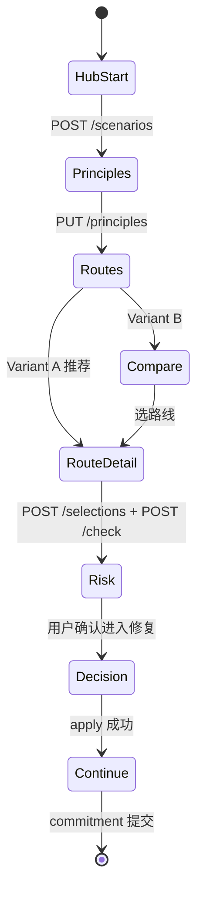

gao# Exploration 前端路由与页面骨架

**Audience:** C 端前端（React / Vue）  
**API Client:** [frontend-exploration-api-client.ts](../../src/trips/exploration/dto/frontend-exploration-api-client.ts)  
**类型:** [frontend-exploration-api.types.ts](../../src/trips/exploration/dto/frontend-exploration-api.types.ts)

本仓库为后端 monorepo，不含 UI 工程。本文提供 **Hub ① 完整页面树 + 组件清单 + 状态机**，可直接在独立前端仓库落地。

---

## 1. 路由表

| 路径 | 页面组件 | 职责 |
|------|----------|------|
| `/explore` | `ExploreHubRedirectPage` | Hub ① 入口：调 `startExplorationFromHub` → redirect |
| `/explore/:scenarioId/principles` | `ExplorePrinciplesPage` | 六原则卡片 + 排序 |
| `/explore/:scenarioId/routes` | `ExploreRoutesEntryPage` | Variant A/B 分流 |
| `/explore/:scenarioId/compare` | `ExploreComparePage` | 三路线六维比较 |
| `/explore/:scenarioId/routes/:routeId` | `ExploreRouteDetailPage` | 时间轴 + 地图摘要 |
| `/explore/:scenarioId/routes/:routeId/check` | `ExploreRiskPage` | 风险发现（loading → issue） |
| `/explore/:scenarioId/decisions/:problemId` | `ExploreDecisionPage` | 修复方案比较 + apply |
| `/explore/:scenarioId/continue` | `ExploreContinuePage` | 商品包装 + 承诺（Sprint 4A） |

**Hub 总入口（四选一）** 仍在 `/plan/start`；仅卡片 ① 导航到 `/explore`。

---

## 2. 页面状态机



**sessionStorage 键：** `tripnara.exploration.flow`（client 已提供 `persistFlowState` / `readFlowState`）

---

## 3. 组件清单（按页）

### 3.1 `ExploreHubRedirectPage` (`/explore`)

```tsx
// 伪代码 — 进入即创建 Scenario
useEffect(() => {
  startExplorationFromHub(token, { researchProtocolId: 'iceland-discovery-v1' })
    .then((data) => {
      persistFlowState({
        scenarioId: data.scenarioId,
        sessionId: data.sessionId,
        assignedVariant: data.assignedVariant ?? undefined,
      });
      navigate(`/explore/${data.scenarioId}/principles`);
    });
}, []);
```

### 3.2 `ExplorePrinciplesPage`

| 组件 | 说明 |
|------|------|
| `ScenarioSummaryBar` | 目的地 / 9天 / 人数 / 预算（只读，来自 protocol） |
| `PrincipleCardGrid` | 6 张卡片，最多选 3 + 拖拽排序 |
| `PrincipleHelpDrawer` | 单条原则说明 |
| `ContinueButton` | `savePrinciples` → `/routes` |

### 3.3 `ExploreRoutesEntryPage`

读 `assignedVariant`：

- **A `SINGLE_RECOMMENDATION`：** `RecommendedRouteHero` + 链接「查看其他可能」→ `/compare`
- **B `THREE_ROUTE_COMPARISON`：** 直接 `navigate('/compare')`

### 3.4 `ExploreComparePage`

| 组件 | 说明 |
|------|------|
| `RouteStrategyCard` ×3 | gains / sacrifices / 六维摘要 |
| `DimensionExpandRow` | 点开看一句解释 |
| `SelectRouteDialog` | 收集 selectionReason + gain/sacrifice |

### 3.5 `ExploreRiskPage`

| 组件 | 说明 |
|------|------|
| `CheckProgressSteps` | 分阶段 loading（禁止假百分比） |
| `ConsumerRiskCard` | headline / 为什么 / 影响 / 证据 / 后果 |
| `IssueCountBadge` | `totalIssueCount` 若 >1 显示「还有 N-1 个问题未展示」 |
| `CTARepair` | → `/decisions/:problemId` |

### 3.6 `ExploreDecisionPage`

| 组件 | 说明 |
|------|------|
| `RepairOptionCard` ×n | preserves / sacrifices / impact |
| `ApplyConfirmSheet` | submit → apply |
| `RevalidationBanner` | `originalProblem.resolved` + 新 issues 列表 |

### 3.7 `ExploreContinuePage`（Sprint 4A）

| 组件 | 说明 |
|------|------|
| `PackageCardStack` | 按 `presentationOrder` 展示 4 张商品卡 |
| `ValueTrustScoreRow` | 每卡 1–5 价值 + 信任 |
| `PackageRankDragList` | 拖拽排序 |
| `PriceRangeInput` | 开放价格 USD |
| `CommitmentChoice` | NOTIFY_ME（email）/ SELF_CHECK |
| `ResearchDisclaimer` | 产品尚在开发、可退订金说明（4B：`fetchPaymentCatalog`） |
| `DepositCheckout` | Stripe Payment Element + `startResearchDeposit` / `confirmResearchDeposit` |
| `RefundButton` | `refundResearchDeposit` 一键退款 |
| `PriceLockForm` | `submitPriceLock` |

---

## 4. Hub ① 与 Hub 总页对接

```tsx
// /plan/start — 四选一 Hub
function onSelectTellAiWhere() {
  navigate('/explore'); // → ExploreHubRedirectPage
}

function onSelectGuideToPlan() {
  navigate('/guide-to-plan');
}
```

卡片 ① 去掉「即将上线」，改为 **推荐研究流程**（或与 ② 并列，由 feature flag 控制）。

---

## 5. 埋点（4A 最小集）

在以下节点调用 `batchResearchEvents`：

| 事件 | 时机 |
|------|------|
| `exploration_session_started` | POST /scenarios 成功 |
| `principles_submitted` | PUT /principles 成功 |
| `route_selected` | POST /selections |
| `feasibility_check_completed` | POST /check 完成 |
| `consumer_issue_viewed` | Risk 页 mount |
| `repair_option_selected` | submit 前 |
| `decision_applied` | apply 成功 |
| `package_card_viewed` | Continue 页每卡 impression |
| `package_rank_submitted` | POST /continue/feedback |
| `commitment_option_selected` | 用户点 NOTIFY_ME / SELF_CHECK |
| `notify_me_submitted` / `self_check_selected` | POST /commitments 成功 |

---

## 6. Feature Flags（前端）

```typescript
const flags = {
  explorationEnabled: import.meta.env.VITE_EXPLORATION_CONSUMER_MVP_ENABLED === '1',
  hubCardTellAi: import.meta.env.VITE_HUB_EXPLORE_CARD_ENABLED === '1',
};
```

后端：`EXPLORATION_CONSUMER_MVP_ENABLED` · `RESEARCH_PROTOCOL_ENABLED`

---

## 7. 目录结构建议（独立前端仓库）

```text
src/features/exploration/
  api/                    # 复制或 symlink backend client 类型
  pages/
    ExploreHubRedirectPage.tsx
    ExplorePrinciplesPage.tsx
    ExploreRoutesEntryPage.tsx
    ExploreComparePage.tsx
    ExploreRouteDetailPage.tsx
    ExploreRiskPage.tsx
    ExploreDecisionPage.tsx
    ExploreContinuePage.tsx
  components/
    ScenarioSummaryBar.tsx
    PrincipleCardGrid.tsx
    RouteStrategyCard.tsx
    ConsumerRiskCard.tsx
    RepairOptionCard.tsx
    PackageCardStack.tsx
  hooks/
    useExplorationFlow.ts   # readFlowState + persist
  routes.tsx                  # 上表路由注册
```

---

## 8. `useExplorationFlow` 钩子 sketch

```typescript
export function useExplorationFlow() {
  const [flow, setFlow] = useState(readFlowState);

  const update = (patch: Partial<ExplorationFlowState>) => {
    const next = { ...flow!, ...patch };
    persistFlowState(next);
    setFlow(next);
  };

  return { flow, update, scenarioId: flow?.scenarioId, sessionId: flow?.sessionId };
}
```

---

## 9. 冰岛研究快捷路径（QA）

1. `/explore` → principles（任选 3）→ compare → 选 **`route_remote-highlands-south`**
2. check → issues → options → apply → continue
3. 提交 package feedback + NOTIFY_ME

预期：F208 相关 BLOCK（需 `DECISION_GATEWAY_UNIFIED=1` + 后端已 seed F208 段）。
