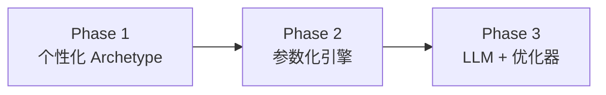

# Exploration AI 路线生成 — 6 个月路线图

> 目标：6 个月内对外以「AI 规划产品」售卖，Hub ①「告诉 AI 我想去哪」从研究 MVP 演进为可个性化、可验证、可扩展的路线生成管线。

## 现状（Sprint 5 完成）

| 能力 | 状态 |
|------|------|
| 消费者探索管线（Scenario → Trip → 原则 → 候选 → 可靠性） | ✅ |
| 3 条冰岛 archetype 路线（catalog SSOT） | ✅ |
| 用户可配置旅行条件 | ✅ |
| 决策网关可靠性闭环 | ✅（需 `DECISION_GATEWAY_UNIFIED=1`） |
| **可插拔路线生成** | ✅ 本迭代 |

## 三阶段演进



### Phase 1 — 个性化 Archetype（M1–M2）✅ 已开始

**对外话术**：「基于你的天数、车辆与旅行原则，从三种典型走法中为你定制对比方案」

**实现**：
- `ExplorationRouteGenerationService` + Provider 模式
- `PERSONALIZED` 模式：按 input / rankedPrinciples 调整 narrative、metrics、sacrifices、routeDetail
- DB 持久化 `generationSource` + `routeDetail` JSON
- Feature flag：`EXPLORATION_AI_ROUTE_GENERATION=1`

**验收**：
- [x] 原则变更后 invalidate 候选（`candidatesStatus: STALE`）
- [x] `POST .../candidates/regenerate` 重新生成（generationVersion +1）
- [ ] 前端展示 `generationSource` badge（个性化 vs 静态）— helpers 已就绪，待 UI 工程接入
- [x] E2E 脚本含 PERSONALIZED 断言（`EXPLORATION_AI_ROUTE_GENERATION=1` 时）

### Phase 2 — 引擎几何 + 参数化（M3–M4）

**对外话术**：「AI 规划引擎根据你的条件计算真实驾驶路线」

**实现**：
- `ENGINE` 模式：`MapboxDirectionsService` 拼接 mainLine polyline
- 复用 `MultiStrategyRouteGeneratorService` / `RouteGeometryService`
- 按 days / vehicle / season 调整 anchor 顺序与停留权重
- `MAPBOX_ACCESS_TOKEN` 必填

**Env**：
```bash
EXPLORATION_AI_ROUTE_GENERATION=1
EXPLORATION_ROUTE_GENERATION_MODE=ENGINE
MAPBOX_ACCESS_TOKEN=...
```

**验收**：
- [x] 地图折线与 Mapbox 导航一致（Reykjavik→Vík 186.8km / 2485 pts）
- [x] ENGINE 三路线贴路几何（12778–20183 pts vs 8–9 anchors）
- [x] 无 Mapbox 时 graceful fallback → PERSONALIZED
- [x] LLM live（DeepSeek 3 narratives ~5.7s）

### Phase 3 — LLM 叙事 + 优化器生成（M5–M6）

**对外话术**：「AI 为你生成专属路线方案并解释取舍」

**实现**：
- `LLM` generationSource：`EXPLORATION_LLM_ROUTE_NARRATIVE=1` ✅ stub 已接入
- `LlmRouteNarrativeProvider` — 模板叙事 overlay；`EXPLORATION_LLM_ROUTE_NARRATIVE_LIVE=1` 时接 `LlmService`（失败降级模板）
- 接入 `itinerary.generate` skill + `trip-draft-generation.service`（待做）
- 新 POI 锚点来自目的地 pack，**禁止**业务逻辑硬编码冰岛
- A/B：archetype vs engine-generated vs LLM-assisted

**验收**：
- [ ] 非冰岛 destination 可生成 ≥2 候选
- [ ] LLM 输出经 Decision Gateway 可靠性校验
- [ ] 付费转化漏斗：候选 → 选路 → 可靠性通过 → 定金

## 架构

```
ExplorationOrchestratorService.generateCandidates
  └── ExplorationRouteGenerationService
        ├── StaticArchetypeRouteProvider   (STATIC)
        ├── PersonalizedRouteProvider      (PERSONALIZED)
        └── EngineGeometryRouteProvider    (ENGINE, Mapbox)
```

## API 变更

`POST /api/exploration/scenarios/:id/candidates` 响应新增：

```json
{
  "generationVersion": 1,
  "generationMode": "PERSONALIZED",
  "candidates": [
    {
      "routeId": "route_depth-south-coast",
      "generationSource": "PERSONALIZED",
      "narrative": "...",
      "preview": { "map": { "mainLine": [[lng, lat], ...] } }
    }
  ]
}
```

`GET .../routes/:routeId` 优先返回 DB 中 `routeDetail`（个性化后），catalog 为 fallback。

## 实网验证

```bash
# 从 .env 加载 VITE_MAPBOX_ACCESS_TOKEN + DEEPSEEK_API_KEY
npx tsx scripts/exploration-ai-live-verify.ts
```

生产 env 建议：

```bash
EXPLORATION_AI_ROUTE_GENERATION=1
EXPLORATION_ROUTE_GENERATION_MODE=ENGINE   # 或 PERSONALIZED
EXPLORATION_LLM_ROUTE_NARRATIVE=1          # 可选
EXPLORATION_LLM_ROUTE_NARRATIVE_LIVE=1     # 可选，需 DEEPSEEK_API_KEY
MAPBOX_ACCESS_TOKEN=...                      # 或 VITE_MAPBOX_ACCESS_TOKEN
LLM_USE_MOCK=false
```

| 变量 | 默认 | 说明 |
|------|------|------|
| `EXPLORATION_AI_ROUTE_GENERATION` | off | `1` 启用 AI 生成（默认 PERSONALIZED） |
| `EXPLORATION_ROUTE_GENERATION_MODE` | — | `STATIC` \| `PERSONALIZED` \| `ENGINE` |
| `EXPLORATION_LLM_ROUTE_NARRATIVE` | off | Phase 3 LLM 叙事（模板 stub） |
| `EXPLORATION_LLM_ROUTE_NARRATIVE_LIVE` | off | 真实 LLM 调用（需 DeepSeek 等 API key） |
| `EXPLORATION_ROUTE_GEOMETRY_CACHE_TTL_SEC` | 86400 | ENGINE 模式 Mapbox segment 内存缓存 TTL |
| `MAPBOX_ACCESS_TOKEN` | — | ENGINE 模式贴路几何 |

## 前端集成要点

1. **文案**：Phase 1 用「三种典型走法对比 · 已按你的条件个性化」，勿写「AI 定制唯一路线」
2. **Badge**：`generationSource === 'PERSONALIZED'` → 「已个性化」
3. **Regenerate**：`candidatesStatus.status === 'STALE'` 时调 `regenerateCandidates()`；原则 PUT 后自动 invalidate
4. Client：`frontend-exploration-api-client.ts` → `generateCandidates` / `regenerateCandidates` / `candidatesStatus`

## 风险与缓解

| 风险 | 缓解 |
|------|------|
| 对外过度承诺「AI 定制」 | 分 phase 话术 + generationSource 透明展示 |
| 冰岛 hardcode 扩散 | catalog 仅 IS MVP；Phase 3 走 destination pack |
| Mapbox 成本 | 候选生成时缓存 segment geometry |
| F208 可靠性 E2E | `DECISION_GATEWAY_UNIFIED=1` + env checklist |

## 下一步（本周）

1. 部署 migration `20260705120000_exploration_route_generation`
2. 开 `EXPLORATION_AI_ROUTE_GENERATION=1` 跑 E2E
3. 前端复制 `frontend-exploration-api-client.ts` + `frontend-exploration-api.helpers.ts`，接 badge / STALE 提示条
4. ~~M2：条件变更 invalidate 候选 + regenerate endpoint~~ ✅
5. ~~物化后（未选路）PATCH conditions + Trip 同步~~ ✅

### M2 API（已实现）

| 方法 | 路径 | 说明 |
|------|------|------|
| GET | `/scenarios/:id` | 响应含 `candidatesStatus` |
| PUT | `/scenarios/:id/principles` | 保存后 invalidate DRAFT 候选，返回 `candidatesInvalidated` |
| POST | `/scenarios/:id/candidates/regenerate` | 归档旧候选并 bump `generationVersion` |
| POST | `/scenarios/:id/candidates` | body `{ force: true }` 等同 regenerate（无 SELECTED 时） |

`candidatesStatus.status`：`EMPTY` | `READY` | `STALE` | `SELECTED`
