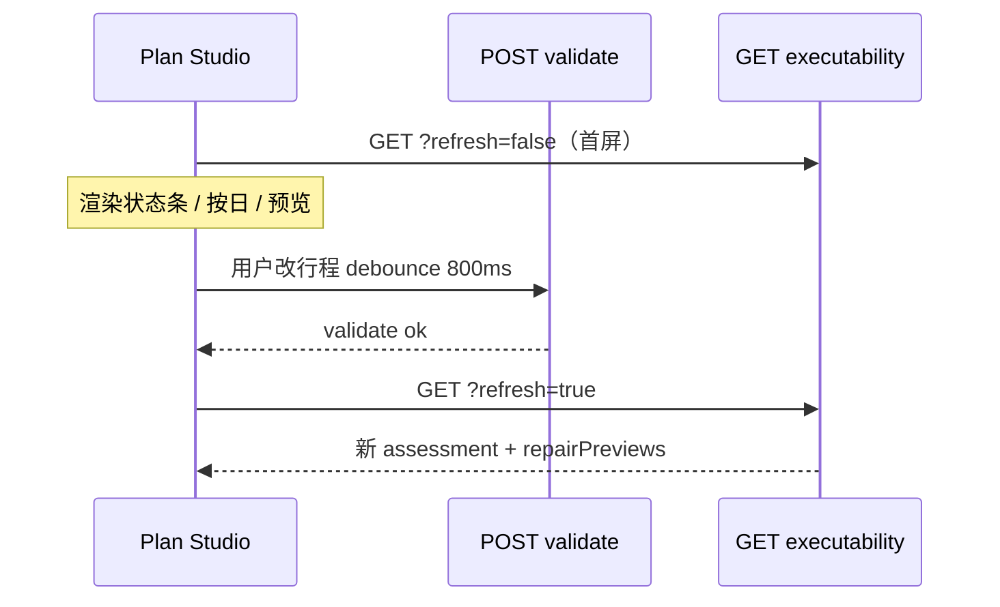

# 冰岛自驾 TEP — Web P0 对接说明

**受众：** Plan Studio / Web 前端  
**范围：** 规划阶段 · 仅 P0（可执行性诊断条 + 按日摘要 + 修复预览）  
**Base URL：** `{host}/api`（本地 Canary 常用 `http://127.0.0.1:3002/api`）  
**详细契约：** [TEP-SELF-DRIVE-FRONTEND-HANDOFF.md](./TEP-SELF-DRIVE-FRONTEND-HANDOFF.md) · **下一步：** [TEP-SELF-DRIVE-WEB-P1-INTEGRATION.md](./TEP-SELF-DRIVE-WEB-P1-INTEGRATION.md) · **行中：** [TEP-SELF-DRIVE-WEB-P2-INTEGRATION.md](./TEP-SELF-DRIVE-WEB-P2-INTEGRATION.md) · [TEP-SELF-DRIVE-WEB-P3-INTEGRATION.md](./TEP-SELF-DRIVE-WEB-P3-INTEGRATION.md) · [CONSTRAINT-CAPABILITY-REGISTRY-PHASE0.md](../product/CONSTRAINT-CAPABILITY-REGISTRY-PHASE0.md)

---

## 1. P0 交付定义

| 做 | 不做 |
|----|------|
| Plan Studio 顶部 **可执行性状态条** | 重写创建行程 / 编排器 |
| **阻断 & 待确认** 列表 | 本地计算 SDR |
| **按日风险** 摘要 + 标出最脆弱一天 | SDR-102/103 UI |
| **`repairPreviews`** 只读卡片 | 规划期调写回 API |
| 改行程后 **自动刷新** executability | 与 conflicts 混成一个分数 |

**展示门槛：** 冰岛目的地 + 自驾行程（`constraints-summary.transport.scope === 'self_drive_only'`）时展示本模块；否则隐藏。

---

## 2. P0 接口清单

| # | 方法 | 路径 | 用途 | P0 必接 |
|---|------|------|------|---------|
| 1 | GET | `/trips/{tripId}/executability` | **主读模型** | ✅ |
| 2 | GET | `/trips/{tripId}/executability?refresh=true` | 强制重算（改行程后） | ✅ |
| 3 | POST | `/trips/{tripId}/feasibility-report/validate` | 触发校验后再拉 (2) | ✅ |
| 4 | GET | `/trips/{tripId}/constraints-summary` | 输入约束是否齐备（并排展示） | 推荐 |
| 5 | GET | `/trips/{tripId}/planning-conflicts?includeConstraintsSummary=1` | 原有冲突列表（保留，不替代 TEP） | 已有则保留 |

**认证：** `Authorization: Bearer <accessToken>`（与现有 Plan Studio 一致）

**响应信封：**

```typescript
interface StandardResponse<T> {
  success: boolean;
  data?: T;
  error?: { code: string; message: string; details?: Record<string, unknown> };
}
```

失败时通常仍 HTTP 200 + `success: false`；401/403/404 少数直接 HTTP 错误。

---

## 3. 主接口 — `GET /executability`

### 3.1 请求

```http
GET /api/trips/{tripId}/executability
GET /api/trips/{tripId}/executability?refresh=true
```

| Query | 说明 |
|-------|------|
| `refresh=true` | 先跑 `feasibility validate`，再投影 TEP（**用户改行程后用这个**） |

等价写操作（可选）：

```http
POST /api/trips/{tripId}/executability/refresh
```

### 3.2 响应 `data` 类型（前端建议复制）

```typescript
/** === P0 必用字段 === */

type ExecutabilityStatus =
  | 'EXECUTABLE'
  | 'EXECUTABLE_WITH_CAUTION'
  | 'REQUIRES_CONFIRMATION'
  | 'REQUIRES_REPAIR'
  | 'NOT_EXECUTABLE'
  | 'UNKNOWN';

type RuleOutcome =
  | 'PASS' | 'CAUTION' | 'NEED_CONFIRM' | 'SUGGEST_REPAIR' | 'REJECT' | 'UNKNOWN';

type RuleSeverity = 'INFO' | 'LOW' | 'MEDIUM' | 'HIGH' | 'CRITICAL';
type DriveLoadTier = 'LOW' | 'MEDIUM' | 'HIGH' | 'EXTREME';
type ExecutabilityStripLevel = 'success' | 'warning' | 'danger' | 'neutral';

interface ExecutabilityAssessmentUi {
  status: ExecutabilityStatus;
  statusLabel: string;           // 直接展示，如「可以出发」
  stripLevel: ExecutabilityStripLevel;
  canCommit: boolean;            // 控制「确认行程」按钮
  primaryCta: {
    label: string;               // 如「查看调整建议」
    deepLink: string;            // 如 tab=decisions&filter=repair（路由自行解析）
  };
}

interface ValidationFinding {
  findingId: string;
  ruleId: string;                // P0 勿展示给用户
  outcome: RuleOutcome;
  severity: RuleSeverity;
  message: string;               // P0 列表主文案
  affectedRefs: string[];
}

interface PlanningRuleResult {
  ruleId: string;
  outcome: RuleOutcome;
  severity: RuleSeverity;
  affectedRefs: string[];
  explanation: string;           // 比 message 更完整，可用于详情
  degraded?: boolean;
  degradationReason?: string;
}

interface ExecutabilityAssessment {
  schemaId: string;
  status: ExecutabilityStatus;
  findings: ValidationFinding[];
  ruleResults: PlanningRuleResult[];
  evaluatedAt: string;
  planVersionRef?: string;
}

interface DailyDrivePlan {
  date: string;                  // YYYY-MM-DD
  dayIndex: number;              // 1-based
  origin: { ref: string; label: string };
  destination: { ref: string; label: string };
  legs: Array<{
    legId: string;
    baseNavigationMinutes: number;
    adjustedMinutes?: number;
    roadRefs: string[];
  }>;
  accommodation?: {
    ref: string;
    latestArrival?: string;
    checkInFrom?: string;
  };
  activities: Array<{
    ref: string;
    importance: 'MANDATORY' | 'RECOMMENDED' | 'OPTIONAL';
    flexibility: 'FIXED' | 'MOVABLE' | 'REPLACEABLE' | 'REMOVABLE';
    weatherSensitive: boolean;
    reservationRequired: boolean;
    fixedStartAt?: string;
  }>;
}

interface LocalRepairPreview {
  optionId: string;
  action: 'REMOVE' | 'REPLACE' | 'SHIFT' | 'REROUTE';
  targetRefs: string[];
  minutesReleased: number;
  loadTierBefore: DriveLoadTier;
  loadTierAfter: DriveLoadTier;
  statusBefore: ExecutabilityStatus;
  statusAfter: ExecutabilityStatus;
  description: string;
}

interface SelfDriveProfile {
  vehicle: {
    vehicleType: '2WD' | '4WD' | 'AWD' | 'CAMPERVAN' | 'OTHER';
    vehicleSource: string;
  };
  drivingPolicy: {
    nightDrivingAllowed: boolean;
    nightDrivingPreference: 'AVOID' | 'ALLOW_WITH_CAUTION' | 'ALLOW';
    maxDailyDriveMinutes?: number;
  };
}

/** GET /executability 完整 data */
interface TripExecutabilityView {
  tripId: string;
  assessment: ExecutabilityAssessment;
  ui: ExecutabilityAssessmentUi;          // ⭐ P0 状态条
  profile: SelfDriveProfile;
  dailyDrivePlans: DailyDrivePlan[];      // ⭐ P0 按日卡
  repairPreviews: LocalRepairPreview[];   // ⭐ P0 修复预览（可能 []）
  /** P1 — 规划期 DecisionProblem（reason + impact + options）；`repairPreviews.length > 0` 时有值 */
  planningDecisionProblems: PlanningTepDecisionProblem[];
  isStale: boolean;                       // true → 提示刷新
  planVersionId?: string;                 // 行中写回对齐用，P0 只读
  hooksPersisted: boolean;
  // 以下 P0 可不渲染
  decisionHooks?: unknown[];
  recoveryGraph?: unknown;
  tepRuleResults?: PlanningRuleResult[];
  worldStateEvidence?: unknown;
  evidenceBinding?: string;
}
```

### 3.3 响应示例（裁剪）

```json
{
  "success": true,
  "data": {
    "tripId": "uuid",
    "ui": {
      "status": "REQUIRES_REPAIR",
      "statusLabel": "需要调整后才能出发",
      "stripLevel": "danger",
      "canCommit": false,
      "primaryCta": {
        "label": "查看调整建议",
        "deepLink": "tab=decisions&filter=repair"
      }
    },
    "assessment": {
      "status": "REQUIRES_REPAIR",
      "findings": [
        {
          "findingId": "finding_sdr101_d3",
          "ruleId": "SDR-101",
          "outcome": "SUGGEST_REPAIR",
          "severity": "HIGH",
          "message": "Day 3 单日驾驶负荷偏高，建议删除可选停靠",
          "affectedRefs": ["day_3", "activity_item_stop_1"]
        }
      ],
      "ruleResults": [],
      "evaluatedAt": "2026-07-12T10:00:00.000Z"
    },
    "dailyDrivePlans": [
      {
        "date": "2026-07-15",
        "dayIndex": 3,
        "origin": { "ref": "anchor_d3_o", "label": "维克" },
        "destination": { "ref": "anchor_d3_d", "label": "赫本" },
        "legs": [{ "legId": "drive_leg_d3_01", "baseNavigationMinutes": 320, "roadRefs": ["F208"] }],
        "activities": [
          {
            "ref": "activity_item_stop_1",
            "importance": "OPTIONAL",
            "flexibility": "REMOVABLE",
            "weatherSensitive": false,
            "reservationRequired": false
          }
        ]
      }
    ],
    "repairPreviews": [
      {
        "optionId": "REPAIR-SDR101-D3-activity_item_stop_1",
        "action": "REMOVE",
        "targetRefs": ["activity_item_stop_1"],
        "minutesReleased": 45,
        "loadTierBefore": "HIGH",
        "loadTierAfter": "MEDIUM",
        "statusBefore": "REQUIRES_REPAIR",
        "statusAfter": "EXECUTABLE_WITH_CAUTION",
        "description": "删除可选停靠以降低 Day 3 驾驶负荷"
      }
    ],
    "planningDecisionProblems": [
      {
        "problemId": "tep_planning:uuid:SDR-101:day_3",
        "phase": "PLANNING",
        "triggerRuleIds": ["SDR-101"],
        "reason": "第 3 日等效驾驶负荷偏高（HIGH），政策上限 360min",
        "impact": {
          "summary": "删除可选停靠，释放约 45 分钟，负荷 HIGH→MEDIUM",
          "loadTierBefore": "HIGH",
          "loadTierAfter": "MEDIUM",
          "statusBefore": "REQUIRES_REPAIR",
          "statusAfter": "EXECUTABLE_WITH_CAUTION",
          "affectedRefs": ["day_3", "drive_leg_d3_01"],
          "minutesReleased": 45
        },
        "options": [
          {
            "optionId": "REPAIR-SDR101-D3-activity_item_stop_1",
            "action": "REMOVE",
            "label": "删除节点",
            "description": "删除可选停靠以降低 Day 3 驾驶负荷",
            "targetRefs": ["activity_item_stop_1", "day_3"],
            "recommended": true
          }
        ],
        "recommendedOptionId": "REPAIR-SDR101-D3-activity_item_stop_1"
      }
    ],
    "profile": {
      "vehicle": { "vehicleType": "4WD", "vehicleSource": "EXPLORATION" },
      "drivingPolicy": { "nightDrivingAllowed": false, "nightDrivingPreference": "AVOID" }
    },
    "isStale": false,
    "planVersionId": "plan_xxx_v1",
    "hooksPersisted": true
  }
}
```

---

## 4. 字段 → 组件映射（照着做）

### 4.1 顶部状态条 `ExecutabilityStrip`

| UI | 数据源 | 规则 |
|----|--------|------|
| 背景色 | `ui.stripLevel` | success→绿 warning→黄 danger→红 neutral→灰 |
| 主文案 | `ui.statusLabel` | **禁止**前端自翻 status |
| 主按钮 | `ui.primaryCta.label` | 点击解析 `deepLink` 或滚到修复区 |
| 确认行程 | `ui.canCommit` | `false` 时 disabled + tooltip |

```typescript
const stripColor: Record<ExecutabilityStripLevel, string> = {
  success: 'var(--color-success)',
  warning: 'var(--color-warning)',
  danger: 'var(--color-danger)',
  neutral: 'var(--color-neutral)',
};
```

### 4.2 问题列表 `ExecutabilityFindingsList`

数据源：`assessment.findings`，按 `severity` 排序（CRITICAL → HIGH → …）。

| 展示 | 字段 |
|------|------|
| 标题 | `finding.message` |
| 角标 | `outcome` 映射（见下表，**不展示 ruleId**） |
| 跳转 | `affectedRefs` 含 `day_N` → 滚到对应日卡 |

| `outcome` | 用户角标文案 |
|-----------|-------------|
| `REJECT` | 无法执行 |
| `SUGGEST_REPAIR` | 建议调整 |
| `NEED_CONFIRM` | 需确认 |
| `CAUTION` | 注意 |
| `UNKNOWN` | 待更新 |

`ruleResults[].degraded === true` 时列表顶部加提示条：`degradationReason` 或「部分路况信息待更新」。

### 4.3 按日卡 `DayRiskCard`

遍历 `dailyDrivePlans[]`；风险文案从 `findings` / `ruleResults` 里筛 `affectedRefs` 含 `day_{dayIndex}` 或当日 `activity.ref` / `legId` 的项。

| 展示项 | 计算方式 |
|--------|----------|
| 标题 | `Day {dayIndex} · {date}` |
| 驾驶负荷 | 从当日相关 finding 或 `tepRuleResults` SDR-101 的 explanation 提取；无则根据 legs 分钟数粗显 |
| 天气敏感 | `activities.filter(a => a.weatherSensitive).length` |
| 弹性节点 | `activities.filter(a => a.flexibility === 'REMOVABLE' \|\| a.flexibility === 'REPLACEABLE').length` |
| 住宿晚到 | `accommodation.latestArrival` 有相关 finding 时展示 |

**最脆弱一天：** 取关联 findings 中 `severity` 权重最高的一天，`isVulnerable: true` 高亮。

```typescript
const SEVERITY_WEIGHT: Record<RuleSeverity, number> = {
  CRITICAL: 5, HIGH: 4, MEDIUM: 3, LOW: 2, INFO: 1,
};
```

### 4.4 修复预览 `RepairPreviewCard`（只读）

仅当 `repairPreviews.length > 0` 渲染（通常 `assessment.status === 'REQUIRES_REPAIR'`）。

**P1 升级：** 优先用 `planningDecisionProblems[]` 渲染完整决策卡（含 `reason` / `impact` / 多 `options`）；`repairPreviews` 仍可用于轻量预览或向后兼容。

| UI | 字段 |
|----|------|
| 标题 | `description` |
| 动作标签 | `action === 'REMOVE'` →「删除停靠」；`REPLACE` →「替换活动」 |
| 负荷变化 | `{loadTierBefore} → {loadTierAfter}` |
| 预期状态 | `{statusBefore} → {statusAfter}`（用 `ui.statusLabel` 那套文案表） |
| 释放时间 | `minutesReleased` 分钟（可选） |

**P0 按钮：** 「了解详情」展开即可；**不要**接 `POST .../executability/repairs/.../apply`（那是行中）。

---

## 5. 刷新与时序（必实现）



### 5.1 推荐封装

```typescript
const API = import.meta.env.VITE_API_BASE ?? 'http://127.0.0.1:3002/api';

async function fetchExecutability(
  tripId: string,
  opts?: { refresh?: boolean; token: string },
): Promise<TripExecutabilityView> {
  const q = opts?.refresh ? '?refresh=true' : '';
  const res = await fetch(`${API}/trips/${tripId}/executability${q}`, {
    headers: { Authorization: `Bearer ${opts?.token}` },
  });
  const body: StandardResponse<TripExecutabilityView> = await res.json();
  if (!body.success || !body.data) {
    throw new Error(body.error?.message ?? 'executability failed');
  }
  return body.data;
}

/** 改行程后调用 */
async function refreshAfterPlanEdit(tripId: string, token: string) {
  await fetch(`${API}/trips/${tripId}/feasibility-report/validate`, {
    method: 'POST',
    headers: { Authorization: `Bearer ${token}`, 'Content-Type': 'application/json' },
    body: '{}',
  });
  return fetchExecutability(tripId, { refresh: true, token });
}
```

### 5.2 与「确认行程」门控

```typescript
function canConfirmTrip(
  executability: TripExecutabilityView,
  constraintsSummary: { allReady: boolean; isVersionConfirmed: boolean },
): boolean {
  return (
    executability.ui.canCommit &&
    constraintsSummary.allReady &&
    constraintsSummary.isVersionConfirmed
  );
}
```

---

## 6. 页面布局（P0 wireframe）

```
┌──────────────────────────────────────────────────────────┐
│ Plan Studio · {tripName}                                  │
├──────────────────────────────────────────────────────────┤
│ [ExecutabilityStrip]  ui.statusLabel    [primaryCta]      │  ← P0-1
│ isStale → 「信息可能过期」[刷新]                           │
├──────────────────────────────────────────────────────────┤
│ 待处理 (findings.length)                                  │  ← P0-2
│  · finding.message                                        │
│  · finding.message                                        │
├──────────────────────────────────────────────────────────┤
│ 按日风险                                                  │  ← P0-3
│  ┌ Day 3 · 7/15 · ⚠ 最脆弱 ─────────────────────────┐   │
│  │ 负荷 HIGH · 弹性 1 · 天气敏感 1                    │   │
│  └──────────────────────────────────────────────────┘   │
│  ┌ Day 4 · 7/16 ─────────────────────────────────────┐   │
│  └──────────────────────────────────────────────────┘   │
├──────────────────────────────────────────────────────────┤
│ 调整建议（repairPreviews）                                │  ← P0-4
│  ┌ 删除可选停靠…  HIGH→MEDIUM  需调整→可出发(留意) ┐   │
│  └──────────────────────────────────────────────────┘   │
├──────────────────────────────────────────────────────────┤
│ （原有）planning-conflicts / ScheduleTab — 不改逻辑        │
└──────────────────────────────────────────────────────────┘
```

---

## 7. curl 自测（本地 3002）

```bash
TOKEN="<your-jwt>"
TRIP="<trip-uuid>"
BASE="http://127.0.0.1:3002/api"

# 首屏
curl -s "$BASE/trips/$TRIP/executability" \
  -H "Authorization: Bearer $TOKEN" \
  | jq '.data | {status: .ui, findings: .assessment.findings, previews: .repairPreviews}'

# 强制刷新
curl -s "$BASE/trips/$TRIP/executability?refresh=true" \
  -H "Authorization: Bearer $TOKEN" | jq '.data.ui'

# 门槛：是否自驾 scope
curl -s "$BASE/trips/$TRIP/constraints-summary" \
  -H "Authorization: Bearer $TOKEN" \
  | jq '.data.transport.scope'
```

---

## 8. P0 验收清单

- [ ] 冰岛自驾 trip 展示 `ExecutabilityStrip`，非自驾隐藏
- [ ] 文案来自 `ui.statusLabel`，无自建 BLOCKED/WARNING
- [ ] `canCommit` 控制确认按钮
- [ ] `findings` 列表不展示 `ruleId` / `SDR-*`
- [ ] `dailyDrivePlans` 按日卡 + 最脆弱一天高亮
- [ ] `repairPreviews` 有则展示，无则不占位
- [ ] `isStale` 时显示刷新入口
- [ ] 改行程 → validate → `executability?refresh=true`
- [ ] 未调用写回 API；未本地 dedupe / 重算规则

---

## 9. 常见错误

| 现象 | 原因 | 处理 |
|------|------|------|
| `repairPreviews` 恒为 `[]` | status 不是 `REQUIRES_REPAIR` | 正常；不硬造卡片 |
| `profile.vehicleSource: PACK_DEFAULT` | 未采车型 | P1 补约束表单；P0 可展示「默认按 2WD 评估」 |
| `UNKNOWN` + degraded | 道路/日照证据过期 | 展示灰条 + 刷新，勿显示绿色可出发 |
| 与 conflicts 数字不一致 | 两套系统 | **允许**；TEP 管可执行性，conflicts 管日程冲突 |

---

## 10. 变更记录

| 日期 | 说明 |
|------|------|
| 2026-07-12 | Web P0 对接初版 |
