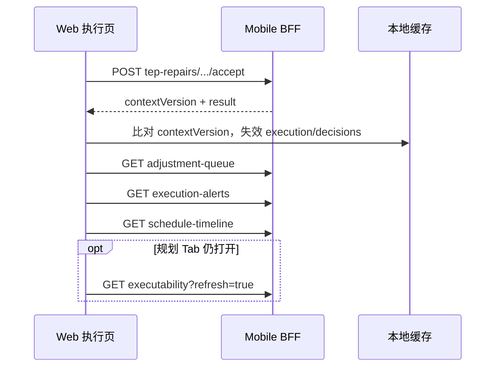

# 冰岛自驾 TEP — Web P2 对接说明

**受众：** Plan Studio / Web 前端（行中执行页）  
**范围：** P2 — 活跃风险提醒 + 待调整项 + TEP Local Repair 写回  
**前置：** [TEP-SELF-DRIVE-WEB-P0-INTEGRATION.md](./TEP-SELF-DRIVE-WEB-P0-INTEGRATION.md)（规划诊断）· [TEP-SELF-DRIVE-WEB-P1-INTEGRATION.md](./TEP-SELF-DRIVE-WEB-P1-INTEGRATION.md)（约束与弹性写入）  
**详细契约：** [EXECUTION-ALERTS-AND-ADJUSTMENT-QUEUE-BFF.md](./EXECUTION-ALERTS-AND-ADJUSTMENT-QUEUE-BFF.md) · [TEP-SELF-DRIVE-FRONTEND-HANDOFF.md](./TEP-SELF-DRIVE-FRONTEND-HANDOFF.md) §4  
**下一步：** [TEP-SELF-DRIVE-WEB-P3-INTEGRATION.md](./TEP-SELF-DRIVE-WEB-P3-INTEGRATION.md)（执行总览 + 我晚了 + 决策卡）  
**Base URL：** `{host}/api`（本地 Canary 常用 `http://127.0.0.1:3002/api`）

---

## 1. P2 交付定义

| 做 | 不做 |
|----|------|
| 执行总览下 **两个用户页**：活跃风险提醒、待调整项 | 用 `GET /execution-risks` 扁平列表当主 UI |
| **`userNarrative` + `userActions`** 三段式叙事 | 本地按 `clusterId` / `linkedRiskIds` dedupe |
| 待调整项 **写回三分支**（TEP / 决策 / 纯风险） | 规划期 `executability/repairs/apply` 入口（P0 只读预览） |
| TEP 卡 `intervention-tep-*` → **`tep-repairs/accept`** | SDR-102/103 行中 UI |
| 写回后 **`contextVersion` 失效 + 双页刷新 + 时间轴** | `GET /internal/attention-dual-read` 上用户面 |
| 折叠层「为什么」：`causalChain` / `causal-trace` | 独立全页 `decision-queue`（缺 Intervention 文案时） |

**与 P0/P1 关系：**

- P0/P1 管 **规划态**（`GET /executability`、约束与弹性写入）。
- P2 管 **行中态**（Mobile BFF 投影路径，Web 与 iOS **共用同一套接口**）。
- TEP accept 写回后，若用户仍打开规划页，应顺带刷新 `GET /executability?refresh=true`（P0 条同步）。

**展示门槛：** 行程已进入执行阶段（`travelStatus` 为在途 / 今日执行等，与现有 Web 执行 Tab 门控一致）；冰岛自驾时优先展示 TEP 修复卡。

---

## 2. P2 接口清单

| # | 方法 | 路径 | 用途 | P2 必接 |
|---|------|------|------|---------|
| E1 | GET | `/mobile/trips/{tripId}/execution/execution-alerts` | 活跃风险提醒（第一层，只读） | ✅ |
| E2 | GET | `/mobile/trips/{tripId}/execution/adjustment-queue` | 待调整项（第二层，含 actions） | ✅ |
| W1 | POST | `/mobile/trips/{tripId}/execution/tep-repairs/{interventionId}/accept` | TEP Local Repair 写回 | ✅ |
| W2 | POST | `/mobile/trips/{tripId}/decisions/{decisionProblemId}/accept` | 有决策闭环的调整项 | ✅ |
| W3 | POST | `/mobile/trips/{tripId}/decisions/{decisionProblemId}/defer` | 延后 / 稍后再说 | 推荐 |
| R1 | GET | `/trips/{tripId}/execution-risks/{riskId}/recommendations` | 纯环境风险方案 | 条件 |
| R2 | POST | `/trips/{tripId}/execution-risks/{riskId}/recommendations/{recId}/apply` | 风险方案预览 | 条件 |
| R3 | POST | `/trips/{tripId}/execution-risks/{riskId}/recommendations/{recId}/confirm` | 风险方案确认 | 条件 |
| H1 | GET | `/mobile/trips/{tripId}/execution/interventions/{id}/causal-trace` | 折叠「为什么」完整回放 | 推荐 |
| H2 | GET | `/trips/{tripId}/decision-queue/{problemId}` | 有 `decisionProblemId` 时 hydrate `repairOptions` | 条件 |
| P0 | GET | `/trips/{tripId}/executability?refresh=true` | 写回后刷新规划条（可选） | 推荐 |
| T1 | GET | `/trips/{tripId}/schedule-timeline` | 写回后刷新行程时间轴 | ✅ |

**认证：** `Authorization: Bearer <accessToken>`（与 Plan Studio 一致）

**响应信封：**

```typescript
interface StandardResponse<T> {
  success: boolean;
  data?: T;
  error?: { code: string; message: string; details?: Record<string, unknown> };
}
```

读接口通常 HTTP 200 + `success: true`；`STALE_REPAIR_OPTION` 可能 HTTP 409 或 200 + `success: false`（以实际 BFF 为准，前端统一按 `error.code` 分支）。

**废弃别名（勿在新代码使用）：**

| 废弃 | 改用 |
|------|------|
| `GET .../execution/risk-alerts` | `execution-alerts` |
| `GET .../execution/pending-adjustments` | `adjustment-queue` |

---

## 3. 页面结构 & 导航

```
执行总览（Web Tab）
├── 活跃风险提醒          E1 execution-alerts
│     问：现在有多危险？还能不能按计划走？
│     只读；主 CTA 导航到待调整项
│
└── 待调整项              E2 adjustment-queue
      问：今天需要我决定什么？
      承载 accept / defer / TEP 写回
      
折叠「为什么」            causalChain（卡片内默认关）
  展开 → H1 causal-trace（按需拉取）
```

| 从 Alert 页 | 行为 |
|-------------|------|
| `requiredAction` = `STOP` / `REPLAN` | 底部 CTA → 导航 **待调整项** |
| `primaryRisk.decisionProblemIds[0]` | 深链到 queue 中对应 `items[].id` |
| `userActions[role=primary]` | 按 `action` 路由（见 §6 写分支） |

---

## 4. 模块 A — 活跃风险提醒（execution-alerts）

### 4.1 请求

```http
GET /api/mobile/trips/{tripId}/execution/execution-alerts
Authorization: Bearer <token>
```

### 4.2 响应类型（建议复制）

```typescript
type ExecutionAlertLevel = 'STOP' | 'REPLAN_REQUIRED' | 'AT_RISK';
type ExecutionAlertRequiredAction = 'STOP' | 'REPLAN' | 'NONE' | 'ACKNOWLEDGE';

interface ExecutionUserNarrativeDto {
  whatHappened: string;
  impactOnTrip: string;
  recommendation: string;
  affected?: {
    activities?: Array<{ label: string; time?: string }>;
    route?: string;
    reservation?: { label: string; time: string };
  };
}

interface ExecutionUserActionDto {
  label: string;
  action: string; // accept | defer | view_impact | confirm | ...
  actionId?: string;
  enabled: boolean;
  role: 'primary' | 'secondary' | 'defer';
}

interface ExecutionAlertDto {
  id: string;
  riskId?: string;
  level: ExecutionAlertLevel;
  title: string;
  reason: string;
  impact: string;
  recommendedAction?: string;
  affectedActivities: string[];
  requiresImmediateAttention: boolean;
  decisionProblemIds?: string[];
  recommendationIds?: string[];
  causalChain?: ExecutionInterventionCausalChainDto; // 折叠层
  userNarrative?: ExecutionUserNarrativeDto;
  userActions?: ExecutionUserActionDto[];
  observedAt: string;
}

interface ExecutionAlertsDto {
  schemaId: 'tripnara.execution_alerts@v2' | 'tripnara.execution_alerts@v1';
  tripId: string;
  contextVersion: number;
  requiredAction?: ExecutionAlertRequiredAction;
  banner?: { level: ExecutionAlertLevel; title: string; detail: string };
  primaryRisk?: ExecutionAlertDto;
  impacts?: Array<{ id: string; type: string; label: string; sourceRiskId?: string }>;
  independentRisks?: ExecutionAlertDto[];
  alerts: ExecutionAlertDto[]; // v1 兼容；有 independentRisks 时勿重复渲染
  aiRecommendation: {
    title: string;
    detail: string;
    evidenceIds: string[];
    headline?: string;
  };
}
```

### 4.3 渲染契约（v2）

```
1 × primaryRisk 主卡
  └─ impacts[] 子区块（派生影响，非独立卡）
+ N × independentRisks 独立卡
```

| 规则 | 行为 |
|------|------|
| 有 `independentRisks` | **不要**再渲染 `alerts[]` |
| `impacts[]` | 必须在主卡内展示 |
| 叙事优先 | 有 `userNarrative` 时：**勿用** `title`/`reason` 作主文案 |
| 主按钮 | `userActions[role=primary]`；勿硬编码「重新规划」 |
| 过滤「仅看紧急」 | `requiresImmediateAttention === true` |

字段映射详见 [EXECUTION-USER-NARRATIVE-CONTRACT.md](./EXECUTION-USER-NARRATIVE-CONTRACT.md) §4。

### 4.4 本页不写回

活跃风险页 **只读**。用户点主按钮应：

1. 导航到 **待调整项** 对应卡；或
2. 打开风险详情 / 方案 Sheet（纯 `env-rec-*` 且无 `decisionProblemId` 时）。

---

## 5. 模块 B — 待调整项（adjustment-queue）

### 5.1 请求

```http
GET /api/mobile/trips/{tripId}/execution/adjustment-queue
Authorization: Bearer <token>
```

### 5.2 响应类型（建议复制）

```typescript
type ExecutionInterventionType =
  | 'SAFETY_INTERVENTION'
  | 'DYNAMIC_REPLAN'
  | 'TEAM_COORDINATION'
  | 'EXECUTION_PREPARATION';

type ExecutionInterventionStatus =
  | 'OPEN' | 'SNOOZED' | 'ACCEPTED' | 'DISMISSED' | 'APPLYING'
  | 'RESOLVED' | 'FAILED' | 'EXPIRED';

interface ExecutionInterventionDto {
  schemaId: 'tripnara.execution_intervention@v1';
  id: string;
  type: ExecutionInterventionType;
  priority: 'CRITICAL' | 'HIGH' | 'MEDIUM' | 'LOW';
  title: string;
  reason: string;
  recommendedAction: string;
  status: ExecutionInterventionStatus;
  decisionProblemId?: string;
  linkedRiskIds?: string[];
  primaryRiskId?: string;
  recommendationId?: string;
  modifiesEffectivePlan: boolean;
  requiresRevalidation: boolean;
  actions: {
    primary: { label: string; action: string; actionId?: string; enabled: boolean };
    secondary: { label: string; action: string; actionId?: string; enabled: boolean };
    defer?: { label: string; action: string; actionId?: string; enabled: boolean };
  };
  causalChain: ExecutionInterventionCausalChainDto;
  recommendation?: {
    title: string;
    summary?: string;
    keeps: string[];
    costs: string[];
    recommendedActionId?: string;
    /** TEP 写回必带 — 与当前 effective PlanVersion 对齐 */
    basePlanVersionId?: string;
  };
  userNarrative?: ExecutionUserNarrativeDto;
  userActions?: ExecutionUserActionDto[];
}

interface ExecutionAdjustmentQueueDto {
  schemaId: 'tripnara.execution_adjustment_queue@v1';
  tripId: string;
  contextVersion: number;
  pendingCount: number;
  criticalCount: number;
  highPriorityCount: number;
  headline: string;
  items: ExecutionInterventionDto[];
  countsByType: Record<ExecutionInterventionType, number>;
  linkedActiveRiskCount?: number;
}
```

### 5.3 渲染契约

| 区域 | 数据源 |
|------|--------|
| 页头角标 | `pendingCount` / `criticalCount` / `highPriorityCount` |
| 列表 | **`items[]` 一项一卡** |
| 类型分组 | `countsByType` |
| 叙事 | 优先 `userNarrative` + `userActions` |

**禁止：**

- 用 `riskClusters` 替代 `items[]` 渲染列表
- 前端本地 dedupe（服务端 IS-CERT-404 已处理 TEP/Canonical 重复）
- 直接渲染裸 `decision-queue` 列表（缺 Intervention 文案与 `actions`）

### 5.4 TEP 修复卡识别（冰岛自驾 P2 重点）

| 特征 | 值 |
|------|-----|
| `id` 前缀 | `intervention-tep-` |
| `decisionProblemId` | **无** |
| `type` | 通常 `DYNAMIC_REPLAN` |
| 主按钮 | `actions.primary.action === 'accept'` |
| 方案 SSOT | `PlanVersion.metadata.tep.recoveryGraph`（非 recommendations） |

样例数据：[IOS-USER-NARRATIVE-CANARY-SAMPLE.md](./IOS-USER-NARRATIVE-CANARY-SAMPLE.md) §2。

---

## 6. 模块 C — 写操作三分支

对 `adjustment-queue.items[i]` **逐条**判断，勿混用路径。

```
items[i]
│
├─ A. id 以 intervention-tep- 开头（且无 decisionProblemId）
│     → POST .../execution/tep-repairs/{id}/accept
│
├─ B. 有 decisionProblemId
│     → POST .../decisions/{decisionProblemId}/accept | defer
│     → 点击主按钮前可 GET .../decision-queue/{id} 取 repairOptions
│
└─ C. 无 decisionProblemId，id 为 intervention-risk-* / intervention-cluster-*
      → GET .../execution-risks/{primaryRiskId}/recommendations
      → apply / confirm
```

### 6.1 分支 A — TEP Local Repair（P2 核心）

```http
POST /api/mobile/trips/{tripId}/execution/tep-repairs/{interventionId}/accept
Authorization: Bearer <token>
Content-Type: application/json
```

```json
{
  "optionId": "REPAIR-SDR101-D1-activity_item_stop_1",
  "basePlanVersionId": "plan_cert_302_v1",
  "comment": "应用驾驶负荷修复"
}
```

| 字段 | 来源 | 说明 |
|------|------|------|
| `interventionId` | path | `items[i].id`，形如 `intervention-tep-REPAIR-...` |
| `optionId` | body 可选 | 可省略；默认从 `interventionId` 解析 |
| `basePlanVersionId` | body **推荐必传** | `items[i].recommendation.basePlanVersionId` |
| `comment` | body 可选 | 展示在 `previewSummary` |

**成功响应：**

```typescript
interface TepRepairAcceptResponse {
  contextVersion: number;
  decisionStatus: 'accepted';
  previewSummary: string;
  result: {
    planVersionId: string;
    parentPlanVersionId: string;
    appliedOptionId: string;
    appliedAction: 'REMOVE' | 'REPLACE';
    removedRefs: string[];
    removedItemIds: string[];
    createdItemIds?: string[];
    replacementPoiId?: string;
    idempotentReplay: boolean;
    itineraryMaterialized: boolean;
    executabilityRefreshed: boolean;
  };
}
```

**UI 副作用：**

| `appliedAction` | 时间轴 |
|-----------------|--------|
| `REMOVE` | 删除 `removedItemIds` 对应节点 |
| `REPLACE` | 替换节点；新建 `createdItemIds` |

**错误处理：**

| `error.code` | UI |
|--------------|-----|
| `STALE_REPAIR_OPTION` | Toast「方案已过期」→ 重拉 E2 → 用户重试 |
| `REPAIR_IN_PROGRESS` | 静默退避 1.5s → 最多 3 次重试同一 accept；仍失败则 Toast「正在处理，请稍候」+ 重拉 E2 |
| `NOT_FOUND` | Toast + 刷新 queue |
| `BAD_REQUEST` | 展示 `message`，勿重试同一 body |

**幂等：** `result.idempotentReplay === true` 时仍展示成功，**勿**重复播放庆祝动画或二次 toast。

**`REPAIR_IN_PROGRESS` 退避重试（推荐实现）：**

```typescript
const REPAIR_IN_PROGRESS_BACKOFF_MS = [1500, 2500, 4000];

async function acceptTepRepairWithRetry(
  acceptFn: () => Promise<{ success: boolean; error?: { code?: string } }>,
): Promise<{ success: boolean; error?: { code?: string } }> {
  for (let attempt = 0; attempt <= REPAIR_IN_PROGRESS_BACKOFF_MS.length; attempt += 1) {
    const res = await acceptFn();
    if (res.success || res.error?.code !== 'REPAIR_IN_PROGRESS') {
      return res;
    }
    const delay = REPAIR_IN_PROGRESS_BACKOFF_MS[attempt];
    if (delay == null) break;
    await new Promise((r) => setTimeout(r, delay));
  }
  return { success: false, error: { code: 'REPAIR_IN_PROGRESS' } };
}
```

并发双 tab 时第二次请求应最终 `idempotentReplay: true` 或相同 `planVersionId`。

**Canonical 等价（调试 / 非 Mobile 客户端可用）：**

```http
POST /api/trips/{tripId}/executability/repairs/{optionId}/apply
```

产品路径以 Mobile BFF 为准（含 `contextVersion` 推送语义）。

### 6.2 分支 B — 决策项（有 decisionProblemId）

```http
POST /api/mobile/trips/{tripId}/decisions/{decisionProblemId}/accept
Content-Type: application/json

{ "actionId": "act-1", "optionId": "act-1", "comment": "…" }
```

```http
POST /api/mobile/trips/{tripId}/decisions/{decisionProblemId}/defer
```

**hydrate 方案（点击主按钮时）：**

```http
GET /api/trips/{tripId}/decision-queue/{problemId}
```

→ 使用 `repairOptions[]` 作为方案 SSOT，**不要**从 `execution-risks/.../recommendations` 取同名方案。

当 `decisionProblemIds` 非空时，`recommendations` 返回空 `items[]` 是 **正常行为**，不得 fallback 到风险建议 Sheet。

### 6.3 分支 C — 纯环境风险（无 decisionProblemId）

仅 `intervention-risk-*` / `intervention-cluster-*` 且无 TEP 前缀时：

```http
GET  /api/trips/{tripId}/execution-risks/{riskId}/recommendations
POST /api/trips/{tripId}/execution-risks/{riskId}/recommendations/{recId}/apply
POST /api/trips/{tripId}/execution-risks/{riskId}/recommendations/{recId}/confirm
```

---

## 7. 模块 D — 写回后刷新

任意写操作成功后（尤其 TEP accept）：



| 步骤 | 动作 |
|------|------|
| 1 | 用响应 `contextVersion` 失效本地 execution / decisions 缓存 |
| 2 | 重拉 `adjustment-queue`（卡片应变 `RESOLVED` 或消失） |
| 3 | 重拉 `execution-alerts`（`requiredAction` / `primaryRisk` 可能降级） |
| 4 | 重拉 `schedule-timeline`（REMOVE/REPLACE 物化反映到时间轴） |
| 5 | （可选）`GET /executability?refresh=true` 同步规划条 |

**轮询 vs 推送：** Web Phase 0 以 **写后主动刷新** 为主；若后续接入 SSE/WebSocket，仍以 `contextVersion` 单调递增为准。

---

## 8. 折叠层 — 因果链

卡片内默认展示 `userNarrative` 三段式；技术细节折叠。

| 层级 | 数据源 |
|------|--------|
| 卡片摘要 | `items[i].causalChain.headline` + `assessment` |
| 展开节点 | `causalChain.nodes[]` |
| 完整回放 | `GET .../interventions/{interventionId}/causal-trace` |

勿把 `impacts[]` / `consequenceImpacts` 提成与主叙事并列的第二套「风险列表」。

---

## 9. 与 P0 规划条的联动

TEP accept 会：

- 提升 effective `PlanVersion`
- 触发 `executabilityRefreshed`（`result.executabilityRefreshed`）
- 可能改变 `repairPreviews` / `dailyDrivePlans`

若 Web 在同一 SPA 内保留规划侧栏或 Plan Studio 条：

```http
GET /api/trips/{tripId}/executability?refresh=true
```

用户从「待调整项」返回规划页时，应看到更新后的 `ui.statusLabel` 与按日风险。

---

## 10. curl 自测

```bash
TOKEN="<jwt>"
TRIP="<uuid>"
BASE="http://127.0.0.1:3002/api"

# 活跃风险
curl -s "$BASE/mobile/trips/$TRIP/execution/execution-alerts" \
  -H "Authorization: Bearer $TOKEN" \
  | jq '.data | {requiredAction, pending: .primaryRisk.title, ctx: .contextVersion}'

# 待调整项（找 intervention-tep-*）
curl -s "$BASE/mobile/trips/$TRIP/execution/adjustment-queue" \
  -H "Authorization: Bearer $TOKEN" \
  | jq '.data | {ctx: .contextVersion, items: [.items[] | {id, type, decisionProblemId, base: .recommendation.basePlanVersionId}]}'

# TEP 写回（替换 INTERVENTION_ID 与 basePlanVersionId）
curl -s -X POST "$BASE/mobile/trips/$TRIP/execution/tep-repairs/INTERVENTION_ID/accept" \
  -H "Authorization: Bearer $TOKEN" \
  -H "Content-Type: application/json" \
  -d '{"basePlanVersionId":"plan_cert_302_v1","comment":"Web P2 自测"}' \
  | jq '.data | {ctx: .contextVersion, replay: .result.idempotentReplay, removed: .result.removedItemIds}'

# 写回后刷新
curl -s "$BASE/mobile/trips/$TRIP/execution/adjustment-queue" \
  -H "Authorization: Bearer $TOKEN" | jq '.data.pendingCount'
curl -s "$BASE/trips/$TRIP/executability?refresh=true" \
  -H "Authorization: Bearer $TOKEN" | jq '.data.ui.statusLabel'
```

**Canary 数据：** 使用 IS-CERT 种子行程或 staging 已有在途 trip；`intervention-tep-*` 需行程已触发 SDR-101 等 Hook 且 `recoveryGraph` 已投影。

---

## 11. P2 验收清单

### 活跃风险提醒

- [ ] 使用 `execution-alerts`，非 `execution-risks` 扁平列表
- [ ] `1 + independentRisks.length` 卡布局；`impacts` 在主卡内
- [ ] `userNarrative` 优先于 `title`/`reason`
- [ ] `requiredAction=STOP` 时 CTA 导航待调整项
- [ ] 本页无写回 API 调用

### 待调整项

- [ ] 列表来自 `items[]`；角标用 `pendingCount`
- [ ] 识别 `intervention-tep-*` 并展示「应用修复」类主按钮
- [ ] 三分支路由正确（TEP / decision / recommendations）
- [ ] 有 `decisionProblemId` 时不打开风险 recommendations Sheet
- [ ] 无前端 dedupe

### TEP 写回

- [ ] accept 请求带 `recommendation.basePlanVersionId`
- [ ] 处理 `STALE_REPAIR_OPTION`（刷新 queue 后重试）
- [ ] 处理 `REPAIR_IN_PROGRESS`（退避重试 ≤3 次，见 §6.1）
- [ ] 处理 `idempotentReplay`（静默成功）
- [ ] REMOVE 后时间轴节点消失；REPLACE 后节点替换
- [ ] 写回后刷新 alerts + queue + schedule-timeline

### 与 P0/P1

- [ ] 写回后（可选）刷新 executability 规划条
- [ ] 规划期仍不调 `tep-repairs/accept`（仅行中）

### 不做

- [ ] `GET /internal/attention-dual-read` 上用户面
- [ ] 本地聚类 / 合并 intervention 卡
- [ ] SDR-102/103 行中专属 UI

---

## 12. 常见错误

| 现象 | 原因 | 处理 |
|------|------|------|
| queue 空但 alerts 有 STOP | 干预已处理或投影延迟 | 比对 `contextVersion`；手动刷新 |
| 两张相同 TEP 卡 | 旧客户端本地 dedupe 逻辑 | 删除前端 dedupe；升级后端 |
| accept 409 `STALE_REPAIR_OPTION` | 用户停留过久，PlanVersion 已变 | 重拉 queue，取新 `basePlanVersionId` |
| recommendations 为空 | 项走 decision-queue | 改拉 `decision-queue/{id}` |
| 时间轴未变 | 未刷新 schedule-timeline | 写回成功后必拉 T1 |
| 规划条仍显示旧 repair | 未刷新 executability | 拉 `?refresh=true` |

---

## 13. 相关文档

| 文档 | 用途 |
|------|------|
| [EXECUTION-ALERTS-AND-ADJUSTMENT-QUEUE-BFF.md](./EXECUTION-ALERTS-AND-ADJUSTMENT-QUEUE-BFF.md) | BFF 字段全集 & curl |
| [EXECUTION-USER-NARRATIVE-CONTRACT.md](./EXECUTION-USER-NARRATIVE-CONTRACT.md) | 叙事四段式 |
| [TEP-SELF-DRIVE-FRONTEND-HANDOFF.md](./TEP-SELF-DRIVE-FRONTEND-HANDOFF.md) | 全阶段约束与架构 |
| [TEP-SELF-DRIVE-WEB-P0-INTEGRATION.md](./TEP-SELF-DRIVE-WEB-P0-INTEGRATION.md) | 规划诊断 |
| [TEP-SELF-DRIVE-WEB-P1-INTEGRATION.md](./TEP-SELF-DRIVE-WEB-P1-INTEGRATION.md) | 约束写入 |
| [TEP-SELF-DRIVE-WEB-P3-INTEGRATION.md](./TEP-SELF-DRIVE-WEB-P3-INTEGRATION.md) | P3 总览 + Slip + 决策卡 |
| [IOS-USER-NARRATIVE-CANARY-SAMPLE.md](./IOS-USER-NARRATIVE-CANARY-SAMPLE.md) | TEP 卡样例 JSON |
| [src/mobile/dto/mobile-execution.types.ts](../../src/mobile/dto/mobile-execution.types.ts) | DTO SSOT |
| [src/trips/tep/services/tep-local-repair-apply.service.ts](../../src/trips/tep/services/tep-local-repair-apply.service.ts) | 写回实现 |

---

## 14. 变更记录

| 日期 | 说明 |
|------|------|
| 2026-07-13 | Web P2 对接初版 — 行中双页 + TEP accept + 刷新链路 |
