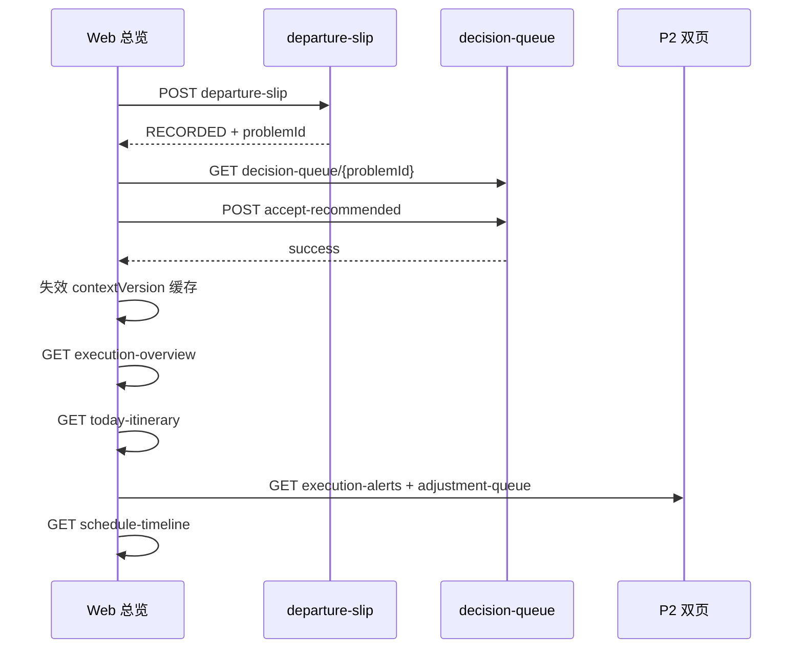

# 冰岛自驾 TEP — Web P3 对接说明

**受众：** Plan Studio / Web 前端（行中执行总览 + 延误上报 + 决策卡）  
**范围：** P3 — 执行总览首屏 +「我晚了」+ 行程调整建议（Decision Card）完整确认流  
**前置：** [TEP-SELF-DRIVE-WEB-P2-INTEGRATION.md](./TEP-SELF-DRIVE-WEB-P2-INTEGRATION.md)（风险双页 + TEP 写回）  
**详细契约：** [EXECUTION_SLIP_FRONTEND_HANDOFF.md](../../src/trips/guardian-decision-core/EXECUTION_SLIP_FRONTEND_HANDOFF.md) · [TEP-SELF-DRIVE-FRONTEND-HANDOFF.md](./TEP-SELF-DRIVE-FRONTEND-HANDOFF.md) §4  
**Base URL：** `{host}/api`（本地 Canary 常用 `http://127.0.0.1:3002/api`）

---

## 1. P3 交付定义

| 做 | 不做 |
|----|------|
| **执行总览首屏**（`execution-overview`，支持 `lite=1`） | 重写地图导航引擎 |
| **`context-snapshot` + `today-itinerary`** 驱动当前活动 | 用 `new Date()` 充当 departure-slip 的 `observedAt` |
| **「我晚了」弹窗** → `POST .../execution/departure-slip` | 走 `POST /mobile/.../decisions/.../accept` 确认 BLOCK 决策 |
| **`RECORDED` 后决策卡**：`decision-queue/{problemId}` + `accept-recommended` | 用 `execution-risks/recommendations` 替代 Slip 方案 |
| 总览 **statusRows** 深链到 P2 双页 | 独立第三套风险列表 UI |
| 写回后 **contextVersion 失效 + 总览 / 今日行程 / P2 双页刷新** | `live-route` 全量地图（可选 P4） |

**与 P2 分工：**

| 层 | 文档 | 回答的问题 |
|----|------|-----------|
| 总览 + 主动上报 | **P3** | 我现在在哪？晚了怎么办？选哪个修复方案？ |
| 风险投影 + TEP 写回 | **P2** | 系统发现了什么？待调整项怎么 accept？ |

**环境开关：** Execution Slip 需 `CANONICAL_EXECUTION_SCHEDULE_INFEASIBLE=1`（Slice 3 已 PASS）；未开启时 `departure-slip` 可能降级或无 `problemId`。

---

## 2. P3 接口清单

### 2.1 Mobile BFF（读聚合）

| # | 方法 | 路径 | 用途 | P3 必接 |
|---|------|------|------|---------|
| O1 | GET | `/mobile/trips/{tripId}/execution-overview` | 执行总览首屏 | ✅ |
| O2 | GET | `/mobile/trips/{tripId}/execution-overview?lite=1` | 首屏快路径（`meta.partial=true`） | 推荐 |
| C1 | GET | `/mobile/trips/{tripId}/context-snapshot` | 当前活动 ID、`contextVersion`、`lifecycle` | ✅ |
| T1 | GET | `/mobile/trips/{tripId}/today-itinerary` | 今日行程列表 + `plannedDepartAt` 解析 | ✅ |
| T2 | GET | `/mobile/trips/{tripId}/today-itinerary?dayIndex={n}` | 指定日行程 | 可选 |

### 2.2 Canonical Trips API（延误 + 决策 — **无 Mobile BFF**）

| # | 方法 | 路径 | 用途 | P3 必接 |
|---|------|------|------|---------|
| S1 | POST | `/trips/{tripId}/execution/departure-slip` | 「我晚了」上报 | ✅ |
| D1 | GET | `/trips/{tripId}/decision-queue/{problemId}` | 决策卡 hydrate（`repairOptions`） | ✅ |
| D2 | GET | `/trips/{tripId}/decision-queue` | 列表 / 404 时 fallback 轮询 | 推荐 |
| D3 | POST | `/trips/{tripId}/decision-queue/{problemId}/accept-recommended` | 确认所选方案（含 `acknowledgement`） | ✅ |

### 2.3 P2 联动（写回后刷新）

| # | 方法 | 路径 | 用途 |
|---|------|------|------|
| E1 | GET | `/mobile/trips/{tripId}/execution/execution-alerts` | P2 |
| E2 | GET | `/mobile/trips/{tripId}/execution/adjustment-queue` | P2 |
| ST | GET | `/trips/{tripId}/schedule-timeline` | 时间轴 |
| EX | GET | `/trips/{tripId}/executability?refresh=true` | 规划条（可选） |

**认证：** `Authorization: Bearer <accessToken>`

**departure-slip 建议头：**

```http
Idempotency-Key: <uuid-per-submit>
```

---

## 3. 页面结构

```
执行 Tab（Web）
├── 执行总览（P3 本页）          O1 execution-overview
│     ├─ 当前活动 + 今日进度
│     ├─ statusRows → 深链 P2
│     └─ 「我晚了」入口
│
├── 活跃风险提醒（P2）            E1
├── 待调整项（P2）                E2
│
└── 行程调整建议（P3 模态/子页）  D1 + D3
      由 departure-slip RECORDED 或 adjustment-queue 决策项打开
```

| `execution-overview.statusRows[].id` | 导航 |
|--------------------------------------|------|
| `risk` | → 活跃风险提醒（P2 E1） |
| `adjust` | → 待调整项（P2 E2） |
| `progress` | → 今日行程展开 / `today-itinerary` |

---

## 4. 模块 A — 执行总览（execution-overview）

### 4.1 请求

```http
GET /api/mobile/trips/{tripId}/execution-overview
GET /api/mobile/trips/{tripId}/execution-overview?lite=1
GET /api/mobile/trips/{tripId}/execution-overview?dayIndex=2
```

| Query | 说明 |
|-------|------|
| `lite=1` / `lite=true` | 跳过 advisory 等重聚合；`data.meta.partial=true` |
| `dayIndex` | 指定日（默认按「今天」相对行程 startDate 推算） |

### 4.2 响应类型（建议复制）

```typescript
interface MobileExecutionOverviewDto {
  tripName: string;
  dayLabel: string;           // 如 "Day 3"
  lifecycleLabel: string;
  isExecuting: boolean;
  contextVersion: number;
  currentActivity: {
    title: string;
    subtitle: string;
    locationName: string;
    meetingPoint: string;
    meetingTime: string;
    estimatedArrival: string;
    remainingTime: string;
    progress: number;         // 0–1
    imageUrl?: string | null;
    currentLocationName?: string | null;
  };
  metrics: Array<{
    id: string;               // time | weather | wind | signal
    icon: string;
    title: string;
    value: string;
    detail: string;
  }>;
  team: {
    activeCount: number;
    totalCount: number;
    summary: string;
    members: Array<{ id: string; name: string; role: string; status: string }>;
  };
  statusRows: Array<{
    id: 'risk' | 'adjust' | 'progress';
    icon: string;
    title: string;
    badgeCount?: number;
    detail: string;
    progress?: number;
    style: 'risk' | 'adjustment' | 'progress';
  }>;
  quickActions: Array<{
    id: string;               // adjust-itinerary | contact-leader | ...
    icon: string;
    title: string;
    isDestructive: boolean;
  }>;
  executionScore: number;
  executionScoreLabel: string;
  scoreBreakdown: Array<{ id: string; label: string; value: string; style: string }>;
  aiInsight: {
    observation: string;
    impact: string;
    recommendation: string;
    executable: string;
  };
  meta?: { partial: boolean; skippedSections?: string[] };
}
```

### 4.3 渲染契约

| 区域 | 规则 |
|------|------|
| 首屏 | 先 `lite=1` 展示骨架 → 再拉完整 overview |
| `isExecuting=false` | 隐藏「我晚了」；展示规划态文案 |
| `statusRows` | `badgeCount` 来自 alerts / adjustment-queue 聚合，**勿**前端重算 |
| `executionScore` | 展示用；**勿**替代 P2 `requiredAction` 门控 |
| `quickActions` | 产品映射见 §4.4 |

### 4.4 quickActions 建议映射（Web）

| `id` | Web 行为 |
|------|----------|
| `adjust-itinerary` | 导航 → 待调整项（P2） |
| `log-event` | 打开 **「我晚了」** 弹窗（§6） |
| `contact-leader` / `send-notification` | 沿用现有 Web 通讯能力（非 TEP 范围） |

---

## 5. 模块 B — 上下文 & 今日行程

### 5.1 context-snapshot

```http
GET /api/mobile/trips/{tripId}/context-snapshot
```

**P3 必用字段：**

```typescript
interface MobileContextSnapshotDto {
  lifecycle: 'planning' | 'traveling' | 'completed' | 'cancelled';
  contextVersion: number;
  planVersion?: number;
  execution: {
    currentActivityID: string | null;
    nextActivityID: string | null;
    progressPercent: number;
  } | null;
}
```

| 断言 | 说明 |
|------|------|
| `lifecycle === 'traveling'` | 才展示「我晚了」 |
| `execution.currentActivityID` | departure-slip 的 `activityId`（§6.1） |

### 5.2 today-itinerary

```http
GET /api/mobile/trips/{tripId}/today-itinerary
```

在 `items[]` 中找 `id === currentActivityID`：

**`plannedDepartAt` 优先级（与后端 Slip 评估一致）：**

1. metadata `rfc001ExecutionActivityContext.byActivityId[activityId].plannedDepartAt`
2. item `endTime`（ISO）
3. item `startTime`

```typescript
interface MobileTodayItineraryItemDto {
  id: string;
  time: string;
  endTime?: string;
  title: string;
  status: 'completed' | 'inProgress' | 'upcoming' | 'delayed' | 'risk' | 'cancelled';
}
```

**禁止：** 用 `nextActivityID` 作为 departure-slip 的 `activityId`（必须是**当前仍所在、即将离开**的活动）。

---

## 6. 模块 C —「我晚了」（departure-slip）

### 6.1 activityId 规则

| 场景 | 正确 | 错误 |
|------|------|------|
| 在 POI A 未离开，评估能否赶上 POI B | Activity A | Activity B |

数据源：`context-snapshot.execution.currentActivityID`。

### 6.2 observedAt 规则（必读）

后端用 `observedAt` 与 **`plannedDepartAt`** 算 slip 分钟数。

```typescript
// ❌ 错误 — 未来行程日会导致 slip=0，永远 NO_ACTION
observedAt: new Date().toISOString()

// ✅ 正确 — 计划离开 + 用户选择延迟
observedAt: addMinutes(plannedDepartAt, delayMinutes).toISOString()
```

| 选项 | `delayMinutes` | `observedAt` |
|------|----------------|--------------|
| 仍在当前地点 | 0 | 仅行程日=今天时用 `new Date().toISOString()` |
| 晚了 15 分钟 | 15 | `addMinutes(plannedDepartAt, 15)` |
| 晚了 30 分钟 | 30 | 同上 |
| 晚了 45 分钟 | 45 | 同上 |

参考实现见 [EXECUTION_SLIP_FRONTEND_HANDOFF.md](../../src/trips/guardian-decision-core/EXECUTION_SLIP_FRONTEND_HANDOFF.md) §3.3。

### 6.3 请求

```http
POST /api/trips/{tripId}/execution/departure-slip
Authorization: Bearer <token>
Content-Type: application/json
Idempotency-Key: <uuid>
```

```json
{
  "activityId": "c0c77777-7777-4777-8777-777777777631",
  "observedAt": "2026-07-12T13:45:00.000Z",
  "stillAtPoi": true,
  "source": "USER_REPORT"
}
```

### 6.4 响应分支

```typescript
type DepartureSlipResponse =
  | { observationId: string; status: 'NO_ACTION' }
  | { observationId: string; status: 'RECORDED'; problemId: string; runId?: string };
```

| `status` | UI | 后续 |
|----------|-----|------|
| `NO_ACTION` | Toast「按当前延误，后续行程仍可执行，无需调整」 | 关弹窗，**不**打开决策卡 |
| `RECORDED` | Toast「后续行程可能赶不上，请查看调整建议」 | 打开 **行程调整建议**（§7），`problemId` 用返回值 |

### 6.5 UI 文案（可直接用）

| 元素 | 文案 |
|------|------|
| 弹窗标题 | 我晚了 |
| 说明 | 请选择实际情况，系统将重新评估后续行程。 |
| 提交中 | 正在评估… |
| 网络错误 | 上报失败，请稍后重试 |

---

## 7. 模块 D — 行程调整建议（决策卡）

### 7.1 何时打开

1. `departure-slip` 返回 `RECORDED` + `problemId`
2. P2 待调整项 `decisionProblemId` 存在且 `semanticCapability = EXECUTION_SCHEDULE_INFEASIBLE`（或用户点「查看调整建议」）

### 7.2 读取决策卡

```http
GET /api/trips/{tripId}/decision-queue/{problemId}
```

`problemId` 优先用 departure-slip 返回值。404 时短轮询（≤3 次，500ms）：

```http
GET /api/trips/{tripId}/decision-queue
```

取最新 open 且 `problemId` 前缀 `problem_exec_slip_` 的项。

### 7.3 响应类型（建议复制）

```typescript
interface ConsumerDecisionItem {
  schemaId: 'tripnara.consumer_decision_item@v1';
  problemId: string;
  headline: string;
  impact: string;
  explanation: string;
  severity: 'BLOCK' | 'CONFLICT' | 'VERIFY' | 'OPTIMIZE';
  affectedActivities?: Array<{ activityId: string; title: string; dayIndex?: number }>;
  recommendation?: {
    title: string;
    summary?: string;
    keeps: string[];
    costs: string[];
    recommendedActionId?: string;
  };
  repairOptions?: Array<{
    optionId: string;
    title: string;
    summary?: string;
    preserves: string[];
    sacrifices: string[];
    canApply: boolean;
    changePreview?: { remove?: unknown[]; add?: unknown[]; shortenMinutes?: number };
    scheduleContext?: {
      projectedEtaLabel?: string;
      nextLastEntryAtLabel?: string;
      slipMinutes?: number;
    };
  }>;
  actions: {
    acceptRecommended: { enabled: boolean; actionId?: string };
    keepOriginal: { enabled: boolean; actionId?: string };
    viewAlternatives: { enabled: boolean; count: number };
    defer: { enabled: boolean; actionId?: string };
  };
  requiredAcknowledgements?: string[];
  scheduleContext?: {
    projectedEtaLabel?: string;
    nextLastEntryAtLabel?: string;
    slipMinutes?: number;
  };
}
```

### 7.4 渲染契约

| 区域 | 数据源 |
|------|--------|
| 页面标题 | 行程调整建议 |
| 发生了什么 | `headline` / `explanation` |
| 影响 | `impact` + `affectedActivities[]` |
| 时间证据 | `scheduleContext` → `预计 {projectedEtaLabel} 抵达 · 最后入场 {nextLastEntryAtLabel} · 延误 {slipMinutes} 分钟` |
| 方案列表 | `repairOptions[]` — 用 `title`/`summary`，**勿**本地映射 `cand_*` |
| 变更预览 | `changePreview`（remove / add / shortenMinutes） |
| 严重度 | `BLOCK` → 标签「紧急」；`CONFLICT` →「需调整」 |
| 确认前勾选 | `requiredAcknowledgements[]`（BLOCK **必填**） |

### 7.5 确认方案 — **必须走 Canonical**

```http
POST /api/trips/{tripId}/decision-queue/{problemId}/accept-recommended
Content-Type: application/json
```

```json
{
  "actionId": "cand_substitute_next",
  "acknowledgement": [
    "我确认在了解阻断原因后仍执行该方案",
    "我已了解该决策对行程的影响与约束说明",
    "我确认已知悉相关风险并自愿承担决策后果"
  ]
}
```

| 字段 | 说明 |
|------|------|
| `actionId` | 用户所选 `repairOptions[].optionId`；可覆盖默认推荐 |
| `acknowledgement` | 与 `requiredAcknowledgements` 全文一致；未勾满则失败 |

**禁止（Slice 3 签收硬性要求）：**

```http
POST /api/mobile/trips/{tripId}/decisions/{decisionId}/accept
```

该 Mobile BFF **不传** `acknowledgement`，BLOCK 类 Execution Slip 确认会失败。P2 的 `decisions/accept` 仅适用于非 BLOCK、无需 acknowledgement 的轻量决策。

**禁止：** legacy `execution-advisory/.../apply`（返回 `WRITE_CHAIN_BLOCKED`）。

### 7.6 与 P2 adjustment-queue 的关系

| 场景 | 入口 | 确认 API |
|------|------|----------|
| Slip（日程不可行） | P3 决策卡 或 queue 项深链 | **D3** `accept-recommended` |
| TEP Local Repair | P2 `intervention-tep-*` | **W1** `tep-repairs/accept` |
| 纯环境风险 | P2 recommendations Sheet | **R2/R3** apply/confirm |

`adjustment-queue.items[].decisionProblemId` 与 `decision-queue/{problemId}` 的 `problemId` **应对齐**。

---

## 8. 模块 E — 写回后刷新



| 步骤 | 动作 |
|------|------|
| 1 | 比对写前后 `contextVersion` / `planVersion`，失效本地缓存 |
| 2 | 重拉 `execution-overview` + `context-snapshot` |
| 3 | 重拉 `today-itinerary`（活动状态可能变 `risk` / `cancelled`） |
| 4 | 重拉 P2 `execution-alerts` + `adjustment-queue` |
| 5 | 重拉 `schedule-timeline` |
| 6 | （可选）`GET /executability?refresh=true` |

关闭决策卡模态；若方案含 REMOVE/REPLACE，时间轴应反映物化结果。

---

## 9. curl 自测

```bash
TOKEN="<jwt>"
TRIP="<uuid>"
BASE="http://127.0.0.1:3002/api"

# 总览（lite 首屏）
curl -s "$BASE/mobile/trips/$TRIP/execution-overview?lite=1" \
  -H "Authorization: Bearer $TOKEN" \
  | jq '.data | {day: .dayLabel, score: .executionScore, partial: .meta.partial}'

# 上下文 + 今日行程
curl -s "$BASE/mobile/trips/$TRIP/context-snapshot" \
  -H "Authorization: Bearer $TOKEN" \
  | jq '.data | {lifecycle, current: .execution.currentActivityID, ctx: .contextVersion}'

curl -s "$BASE/mobile/trips/$TRIP/today-itinerary" \
  -H "Authorization: Bearer $TOKEN" \
  | jq '.data.items[] | {id, title, endTime, status}'

# 我晚了（替换 activityId / observedAt）
curl -s -X POST "$BASE/trips/$TRIP/execution/departure-slip" \
  -H "Authorization: Bearer $TOKEN" \
  -H "Content-Type: application/json" \
  -H "Idempotency-Key: $(uuidgen)" \
  -d '{
    "activityId": "ACTIVITY_A_UUID",
    "observedAt": "2026-07-12T13:45:00.000Z",
    "stillAtPoi": true,
    "source": "USER_REPORT"
  }' | jq '.data'

# 决策卡（用上一步 problemId）
PROBLEM="problem_exec_slip_xxx"
curl -s "$BASE/trips/$TRIP/decision-queue/$PROBLEM" \
  -H "Authorization: Bearer $TOKEN" \
  | jq '.data | {severity, options: [.repairOptions[].optionId], acks: .requiredAcknowledgements}'

# 确认方案
curl -s -X POST "$BASE/trips/$TRIP/decision-queue/$PROBLEM/accept-recommended" \
  -H "Authorization: Bearer $TOKEN" \
  -H "Content-Type: application/json" \
  -d '{
    "actionId": "cand_substitute_next",
    "acknowledgement": [
      "我确认在了解阻断原因后仍执行该方案",
      "我已了解该决策对行程的影响与约束说明",
      "我确认已知悉相关风险并自愿承担决策后果"
    ]
  }' | jq '.success'
```

**Canary drill：**

```bash
EXEC_SLIP_DRILL_ALLOW_PROD=1 npx tsx scripts/execution-slip-accept-recommended-smoke.ts --action=cand_substitute_next
```

---

## 10. P3 验收清单

### 执行总览

- [ ] 首屏 `lite=1` → 完整 overview 二段加载
- [ ] `statusRows` 角标与 P2 列表数量一致
- [ ] `risk` / `adjust` 行点击导航到 P2 对应页
- [ ] 非 `traveling` 时隐藏「我晚了」

### 我晚了

- [ ] `activityId` 来自 `currentActivityID`，非下一站
- [ ] `observedAt` 基于 `plannedDepartAt + delay`，非裸 `new Date()`（除「仍在当前地点」且行程日=今天）
- [ ] `NO_ACTION` 不打开决策卡
- [ ] `RECORDED` 打开决策卡并带入 `problemId`
- [ ] 请求带 `Idempotency-Key`

### 决策卡

- [ ] hydrate `repairOptions` 展示 POI 名（非裸 `cand_*`）
- [ ] 展示 `scheduleContext` 时间证据
- [ ] BLOCK 展示 `requiredAcknowledgements` 勾选框
- [ ] 确认走 **`accept-recommended`**，非 Mobile `decisions/accept`
- [ ] 可选方案 `actionId` 可切换

### 刷新

- [ ] 确认后刷新 overview + today-itinerary + P2 双页 + schedule-timeline
- [ ] `contextVersion` 单调递增

### 不做

- [ ] Mobile `decisions/accept` 确认 BLOCK Slip
- [ ] `execution-advisory/.../apply` legacy 写链
- [ ] 用 recommendations 替代 Slip `repairOptions`

---

## 11. 常见错误

| 现象 | 原因 | 处理 |
|------|------|------|
| 永远 `NO_ACTION` | `observedAt` 用了 `new Date()` 或错 activity | 按 §6.2 重算 |
| 决策卡 404 | queue 投影延迟 | 短轮询 `decision-queue` 列表 |
| accept 失败缺 acknowledgement | 走了 Mobile BFF 或未勾选 | 改 D3 + 勾满 `requiredAcknowledgements` |
| 方案标题是 `cand_*` | 未 hydrate 或未用 `repairOptions[].title` | 拉 `decision-queue/{problemId}` |
| 总览角标与 P2 不一致 | 前端重算 badge | 只用 overview 返回值 |
| 确认后时间轴未变 | 未刷新 schedule-timeline | §8 步骤 5 |

---

## 12. 相关文档

| 文档 | 用途 |
|------|------|
| [TEP-SELF-DRIVE-WEB-P2-INTEGRATION.md](./TEP-SELF-DRIVE-WEB-P2-INTEGRATION.md) | 风险双页 + TEP 写回 |
| [EXECUTION_SLIP_FRONTEND_HANDOFF.md](../../src/trips/guardian-decision-core/EXECUTION_SLIP_FRONTEND_HANDOFF.md) | Slip Native 全契约 |
| [EXECUTION-ALERTS-AND-ADJUSTMENT-QUEUE-BFF.md](./EXECUTION-ALERTS-AND-ADJUSTMENT-QUEUE-BFF.md) | P2 BFF 字段 |
| [TEP-SELF-DRIVE-FRONTEND-HANDOFF.md](./TEP-SELF-DRIVE-FRONTEND-HANDOFF.md) | 全阶段 handoff |
| [src/mobile/dto/mobile-execution.types.ts](../../src/mobile/dto/mobile-execution.types.ts) | Overview / Today DTO |
| [src/trips/travel-status/types/travel-status.types.ts](../../src/trips/travel-status/types/travel-status.types.ts) | Decision queue DTO |

---

## 13. 变更记录

| 日期 | 说明 |
|------|------|
| 2026-07-13 | Web P3 对接初版 — 总览 + departure-slip + 决策卡 canonical 确认流 |
