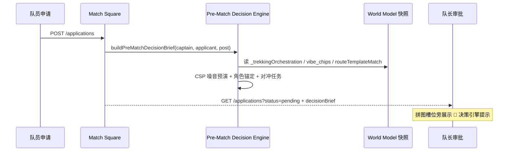

# 3.13 决策引擎拼团决策与任务飞轮接口规范

> Decision Engine & Task Flywheel — Match Square × World Model × Trip Active Hub × Decision DNA

**doc_version**: 1.0  
**last_reviewed**: 2026-06-07  
**产品经理**: Danny（Chief Product Architect）  
**前置规范**: [3.10 徒步×DNA](./trekking-dna-integration-3.10.md) · [3.11 路线模板](./route-template-matching-integration-3.11.md) · [3.12 成团转流](./group-formation-trip-instantiation-3.12.md)

---

## 0. 产品经理审阅结论

**结论：成团不是「状态切换」，而是 Decision OS 数据飞轮的点火器。** 拼团本质是 **CSP（约束满足问题）**：人 × 时空 × 物理约束 × 行为倾向。TripNARA 已有 Match Engine、World Model 编排、Trip 实例化与 `PreferenceEvolutionService` — 3.13 把它们串成 **「拼团意图 → 任务生成 → 决策干预 → 行中确认 → DNA 进化」** 闭环。

**当前仓库真实现状（禁止 PRD 夸大）**：

| 能力 | 现状 | 3.13 缺口 |
|------|------|-----------|
| 拼团匹配叙事 | `application-insights.engine` + `structural-match` 亮点/风险 | **无** World Model 里程碑级噪音预演 |
| 队长审批 UI 数据 | `highlights` / `warnings` / `structuralMatch` | **无** `decisionBrief`（角色锚定 + 对冲任务） |
| 成团实例化 | 3.12 `trip-instantiation` + contextual cards | **无** 协同任务自动派发 |
| 行中行为捕获 | `FlywheelModule` 存在，Rollback API **未接** Match Square | **无** 任务 confirm/rollback 状态机 |
| DNA 进化 | `TREK_VIBE_CONFIRMED` 等 5 种 reason | **无** 任务链黄金特征回流 |

**分 Phase 交付**：

| Phase | 范围 | 目标 |
|-------|------|------|
| **1** | 前置决策 brief + 任务派发计划（metadata） | 队长审批见 AI 幕僚；成团后 Trip 带任务清单 |
| **2** | `POST /trips/:id/collaborative-tasks/:taskId/events` | confirm / rollback / timeout → DNA |
| **3** | 与 Rollback Decision Node、Vault、行后问卷联动 | 完整飞轮 + replay |

---

## 1. 商业闭环：Task Data Flywheel

```
[拼团阶段：引擎前置 CSP 预演]
        ↓ 队长 approve + sealed
[成团瞬间：3.12 Trip 实例化]
        ↓
[自动派发：场景化协同任务] ──→ Trip.metadata.collaborativeTaskFlywheel
        ↓ 行中
[行为捕获：confirm / rollback / timeout]  ← Phase 2 API
        ↓ 行后
[互评 + 任务链协同效率] ──→ UserProfileLearningService
        ▲
        └── PreferenceEvolution（Weekly 自适应）
```

与传统社交 App 差异：**成团后不是退化为微信群**，而是 **结构化任务 + 决策节点** 持续抓取协同行为数据。

---

## 2. 系统流

### 2.1 拼团前置决策（Pre-Match Decision Simulation）



**输入**：

| 字段 | 来源 |
|------|------|
| 队长 / 队员画像 | `CaptainPersonaSnapshot` + Odyssey rawScores |
| 物理约束 | `_trekkingOrchestration.worldModel` / `eventStreamMilestones` |
| Vibe 标签 | `_vibeParse.vibe_chips[]` |
| 组队风格 | `planningStyle` → `cControl` 映射 |

**输出 `decisionBrief`**（队长审批专用，**不**替代 Hard Gate）：

| 字段 | 说明 |
|------|------|
| `hardMetricsPass` | 硬指标是否通过（与 `teamworkMatchBlocked` 对齐） |
| `inTripCollaborationNoisePercent` | 行中协作噪音预测 0–100 |
| `noiseDrivers[]` | 驱动因子（如 `dem_blind_nav` × 高焦虑） |
| `suggestedSceneRoleAnchor` | 建议场景角色，如 `blind_box_follower` |
| `suggestedSceneRoleLabel` | UI 文案，如 `🧩 盲盒跟从者` |
| `mitigatingTaskTemplateIds[]` | 成团后建议前置锁死的任务模板 id |
| `narrativeLine` | 单行决策建议（审批卡片展示） |

**冰岛兰格维格示例**（验收用例）：

> 🤖 TripNARA 决策引擎提示：该申请人综合硬指标通过。但在行中遭遇『内陆断网盲导』里程碑时，与你的指挥官风格可能产生 **18%** 的协作噪音。AI 决策建议：若吸纳该成员，建议将其角色锚定为 **[🧩 盲盒跟从者]**，并在行程模块中前置锁死 **[行前安全蓝图交付任务]** 以对冲行中焦虑。

### 2.2 动态任务实例化（Dynamic Task Instantiation）

成团 `instantiate-trip` 成功后，引擎读取：

- `plan.vibeChipIds` + `plan.toolchainIds`
- `plan.crew[]` + 各成员 `applicantPersonaSnapshot`
- `scene-task-templates.config.ts`

产出写入 `Trip.metadata.collaborativeTaskFlywheel`：

```typescript
{
  version: 'collaborative_task_flywheel_v1',
  recruitmentPostId: string,
  tasks: CollaborativeTaskView[],
  dispatchedAt: ISO8601,
}
```

**任务派发矩阵**（配置驱动 `task-role-dispatch-matrix.config.ts`）：

| 任务模板 | 触发 | 优先派发角色 |
|----------|------|--------------|
| `satellite_dem_offline_verify` | `dem_blind_nav` | 队长 / INTJ·高 control |
| `ford_gear_shared_checklist` | `glacier_river_ford` | ISTP·硬核执行 / slot-2 |
| `pre_trip_safety_blueprint` | 噪音 ≥15% + 角色锚定 | 被锚定成员 |
| `shared_gear_ledger` | `shared_gear_checklist` toolchain | 副手 / co_planning |

### 2.3 任务驱动 DNA 进化（Phase 2+）

**状态机**：

```
pending → confirmed | rolled_back | timed_out
```

**监听**：`POST /trips/:tripId/collaborative-tasks/:taskId/events`

```json
{ "action": "confirm" | "rollback" | "ack_timeout", "evidenceRefs": [] }
```

**下游**：

| 事件 | PreferenceEvolutionReason |
|------|---------------------------|
| 高风险任务 confirm + 队长 lock | `TASK_CHAIN_CONFIRMED` |
| rollback 修订 | `TASK_CHAIN_ROLLED_BACK` |
| 超时未响应 | `TASK_CHAIN_TIMEOUT` |
| 行后五星 + 任务链完成 | `TREK_POST_RATING_FIVE_STAR`（已有，叠加任务特征） |

`UserProfileLearningService.syncPreferenceToProfile` 提取 **响应速度、修改频次、协同效率** — 权重定义 Consult COS，**本 PRD 不虚构数值**。

---

## 3. API 与代码落点

### 3.1 Phase 1 已实现 / 骨架

| 路径 / 模块 | 说明 |
|-------------|------|
| `GET .../applications?status=pending` | 每条申请附加 `decisionBrief` |
| `GET .../instantiation/preview` | 扩展 `collaborativeTaskPreview` |
| `POST .../instantiate-trip` | 写入 `Trip.metadata.collaborativeTaskFlywheel` |
| `engine/pre-match-decision.engine.ts` | 纯函数 CSP 预演 |
| `engine/collaborative-task-dispatch.engine.ts` | 纯函数任务派发 |
| `config/scene-task-templates.config.ts` | 场景任务模板库 |
| `config/task-role-dispatch-matrix.config.ts` | MBTI / control / slot → assignee |

### 3.2 Phase 2 已实现

| 路径 | 说明 |
|------|------|
| `GET /trips/:tripId/collaborative-tasks` | 行中任务列表 + `behaviorLog` |
| `POST /trips/:tripId/collaborative-tasks/:taskId/events` | `{ action: confirm \| rollback \| ack_timeout }` |
| `engine/collaborative-task-behavior.engine.ts` | 状态机 + 权限 + metadata 持久化 |
| `collaborative-task-flywheel.service.ts` | 协作者鉴权 + DNA 调度 |
| `GET/POST /trips/:tripId/decision-events` | 3.12 路线 Rollback 环（`active-trip-decision.service.ts`） |

### 3.3 与现有模块关系

```
Match Square
  ├── pre-match-decision.engine ──→ listPostApplications.decisionBrief
  ├── collaborative-task-dispatch.engine
  └── trip-instantiation.service ──→ Trip.metadata.collaborativeTaskFlywheel

Trips / Decision
  ├── FlywheelModule（Phase 2 行为日志）
  └── PreferenceEvolutionService（扩 reason 枚举）

Odyssey Intake
  └── UserFeatureVector.cControl / stress_anxiety → 噪音模型输入
```

---

## 4. 前端对接

### 4.1 队长审批卡片

在拼图槽位 / 亮点下方渲染：

```typescript
if (application.decisionBrief?.narrativeLine) {
  showDecisionEngineHint(application.decisionBrief);
}
// 可选展开：noiseDrivers, suggestedSceneRoleLabel, mitigatingTaskTemplateIds
```

### 4.2 Active Trip Dashboard（Phase 1 只读）

从 `GET /trips/:id` 的 `metadata.collaborativeTaskFlywheel.tasks[]` 渲染任务卡；Phase 2 接 confirm 按钮。

详见 [frontend-integration-guide.md §7.3](./frontend-integration-guide.md)。

---

## 5. 验收标准

### Phase 1

- [ ] 冰岛兰格维格帖 + 高焦虑队员：`decisionBrief.inTripCollaborationNoisePercent` ≥ 15  
- [ ] 同上：`suggestedSceneRoleAnchor` = `blind_box_follower`  
- [ ] `instantiate-trip` 后 `Trip.metadata.collaborativeTaskFlywheel.tasks.length` ≥ 2  
- [ ] 队长 INTJ 高 control 命中 `satellite_dem_offline_verify` 派发  
- [ ] 单元测试：`pre-match-decision.engine.spec.ts` + `collaborative-task-dispatch.engine.spec.ts`

### Phase 2

- [x] `GET /trips/:tripId/collaborative-tasks` 协作者可读任务 + behaviorLog  
- [x] `POST .../events` confirm / rollback / ack_timeout → metadata 更新  
- [x] confirm → `TASK_CHAIN_CONFIRMED`；rollback → `TASK_CHAIN_ROLLED_BACK`  
- [ ] 与 `POST /trips/:tripId/decision-events` Rollback 环合并（3.12 Phase 2）

---

## 6. 埋点

| 事件 | 属性 |
|------|------|
| `pre_match_decision_brief_shown` | `postId`, `applicationId`, `noisePercent`, `roleAnchor` |
| `collaborative_tasks_dispatched` | `tripId`, `taskCount`, `templateIds[]` |
| `collaborative_task_confirmed` | `tripId`, `taskId`, `latencyMs`（Phase 2） |
| `collaborative_task_rolled_back` | `tripId`, `taskId`, `revisionCount`（Phase 2） |

---

## 7. 风险与待确认

| 风险 | 缓解 |
|------|------|
| 噪音 % 被当作「拒绝理由」 | UI 文案强调「建议」非 Hard Gate；`hardMetricsPass` 独立展示 |
| 任务过多骚扰用户 | Phase 1 每团 ≤6 条；按 vibe 去重 |
| COS 未定义协同效率分 | Phase 2 前仅持久化原始事件 |
| 与 3.12 contextual cards 重复 | 任务 = 可确认行为；卡片 = 只读工具入口 |

---

## 8. 参考实例（Danny 叙事锚点）

**拼团** = CSP；**决策引擎** = 首席数据幕僚；**成团** = 飞轮点火；**任务 confirm/rollback** = 黄金行为特征；**DNA 进化** = 下一次拼团更准。
