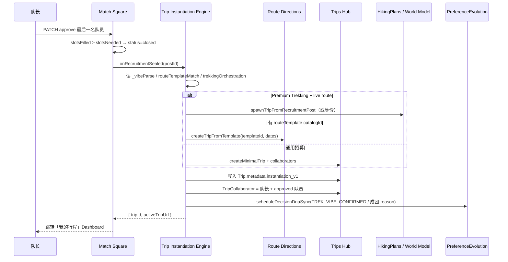

# 3.12 结伴成团向动态行程模块转流规范

> Group Formation → Active Trip Instantiation — Match Square × Route Template × Trips Hub × Decision DNA

**doc_version**: 1.0  
**last_reviewed**: 2026-06-07  
**产品经理**: Danny（Chief Product Architect）  
**前置规范**: [3.10 徒步×DNA](./trekking-dna-integration-3.10.md) · [3.11 路线模板双向喂养](./route-template-matching-integration-3.11.md) · [frontend-integration-guide](./frontend-integration-guide.md)

---

## 0. 产品经理审阅结论（监督摘要）

**结论：方向正确，且与 TripNARA Decision OS 叙事一致** — 「静态招募意图 → 可执行 Active Trip → 行中证据与学习回流」是 3.10/3.11 的自然延伸，**不是**又一个社交 App 的「建群功能」。

**当前仓库真实现状（必须对齐，禁止 PRD 夸大）**：

| 能力 | 现状 | 缺口 |
|------|------|------|
| 成团触发 | `MatchSquareService.decideApplication` 满员 → `status: closed` | **无**自动 Trip 实例化 |
| 路线模板 → Trip | `POST /route-directions/templates/:id/create-trip`（`createTripFromTemplate`） | 未与 Match Square 招募帖绑定 |
| Premium 徒步 spawn | `POST /match-square/posts/:id/spawn-trek-trip`（队长手动） | 与「成团锁死」未串联 |
| Vibe / 编排快照 | `captainPersonaSnapshot._vibeParse` / `_trekkingOrchestration` | 未灌入 Active Trip Dashboard |
| DNA 进化 | `PreferenceEvolutionService` + `UserProfileLearningService`（异步） | 行中 Rollback/确认 **未**实时捕获 |
| Trip Vault | 数据隐私层有 `COMPANION_MATCH_ESCROW` 概念 | 行中账本 **未**接行程模块 |
| 行中协同群 | — | **假设 & 待研发对齐** |

**PM 约束**：PRD 3.12 分 **Phase 1（成团即交付骨架）** / **Phase 2（行中 Decision OS）** / **Phase 3（Vault + 协同群）** 上线；**禁止**在 Phase 1 承诺 500ms 全量 GIS + 加密 IM + 实时 DNA 训练。

---

## 1. 商业闭环与用户心智

```
结伴广场（出发前）
  「AI 懂我的浪漫 + 挑出不内耗的精英搭子 + 路线模板已锁」
        ↓ 成团锁死（Template-to-Trip Instantiation）
Active Trip / Itinerary Hub（行中）
  「Decision OS 实时兜底天气/地形/离线盲导 + 场景工具箱 + 契约固化」
        ↓ 行后互评 + 轨迹脱敏
Decision DNA + 路线模板范例回流
```

与传统攻略（小红书/马蜂窝）差异：**模板不是 PDF，而是带 Gate、里程碑、资金授权、学习回流的 Decision Path 实例**。

---

## 2. 系统流（成团瞬间）



**触发条件（OR）**：

1. 最后一名 `approved` 使 `slotsFilled >= slotsNeeded`（**已实现 closed**，见 `match-square.service.ts`）  
2. 队长手动「截止招募 / 锁定全员」（**backlog**：`PATCH /posts/:id/seal`）

---

## 3. 功能规格

### 3.1 行程实例化引擎（Trip Instantiation Engine）

**职责**：在 **500ms P95 内**（Phase 1 目标）完成 **最小可交付 Active Trip**，而非一次性加载全部 World Model。

| 输入 | 来源 |
|------|------|
| 招募帖 | `MatchSquareRecruitmentPost` + dates/budget/destination |
| Vibe 快照 | `captainPersonaSnapshot._vibeParse` |
| 路线模板 | `routeTemplateMatch.primaryMatch.catalogId` → 解析 `RouteTemplate.id` |
| 徒步编排 | `_trekkingOrchestration` + `_trekkingSpawnResult`（若已 spawn） |
| 队员 | `applications.status === approved` |

| 输出 | 写入 |
|------|------|
| `tripId` | `Trip` + `TripCollaborator` |
| `instantiationPlan` | `Trip.metadata.matchSquareInstantiation` |
| `activeTripEntry` | 前端路由 `/trips/:tripId/active`（**前端约定**） |
| 成员看板 | Trip 详情 API 扩展 `crewDnaPanel`（**backlog**） |

**实例化策略（配置驱动，见 `trip-instantiation-strategies.config.ts`）**：

| 优先级 | 条件 | 动作 |
|--------|------|------|
| 1 | `_trekkingSpawnResult` 已存在 | 复用 `tripId`，标记 `sealedFromPost` |
| 2 | `trekkingOrchestration` + live route | 调用 `TrekkingSpawnService.spawnTripFromRecruitmentPost` |
| 3 | `routeTemplateMatch.catalogId` | `RouteDirectionsService.createTripFromTemplate` |
| 4 | fallback | `createMinimalTrip`（现有 trekking-spawn 内逻辑） |

**安全授信徽章**：Odyssey `GET /credentials` 数据写入 `Trip.metadata.crewCredentials[]` — **Phase 1 只持久化引用，UI Phase 2**。

---

### 3.2 行中 Decision DNA 实时捕获（Active Trip Learning Loop）

**原则 3（决策可回放）**：Rollback 不是「改导航」，而是 **带证据的 Decision Node**。

| 事件 | 触发方 | 下游 |
|------|--------|------|
| `route.rollback_proposed` | 队长（INTJ 全托管） | 队员 lightweight 确认弹窗 |
| `route.rollback_confirmed` | 全员秒确认 | `PreferenceEvolutionService.scheduleDecisionDnaSync` |
| `route.rollback_protested` | 任一队员拒绝 | 记录 `team_resilience` 负样本 |

**Consult COS**：`team_resilience` / `session_consistency_score` 权重定义 **不可由本 PRD 虚构** — 见 `.claude/roles/chief-optimization-scientist.md`。

**Phase 2 API（已实现）**：

```
GET  /trips/:tripId/decision-events
POST /trips/:tripId/decision-events
{ "type": "route_rollback", "action": "propose|confirm|protest", "planBRef": "...", "milestoneId": "...", "evidenceRefs": [] }
```

写入 `Trip.metadata.activeTripDecisionLoop`；全员 confirm → `NEGOTIATION_CONFIRMED`；protest → `NEGOTIATION_ROLLED_BACK`。

---

### 3.3 场景化动态卡片（Dynamic Contextual Cards）

行程 Dashboard 读取 **`Trip.metadata.matchSquareInstantiation.vibeChipIds`** + **`toolchain`**（来自 3.10 orchestration），在里程碑 slot 挂载：

| Vibe / 剧本 | 行中卡片 |
|-------------|----------|
| `dem_blind_nav` / 兰格维格 | 离线 DEM 瓦片 + 配速安全线 |
| `dyl_life_design` / 安吉 DNA | 营地夜间 DYL 画布 |
| `cooking_partner` / 炊事 | Trip Vault 轧差入口（Phase 3） |
| `vibe_coding` | 入网极客静谧看板（Phase 3） |

**渲染器**：纯配置映射 `trip-contextual-cards.config.ts` — **禁止** UI 写死 if/else 场景名。

---

### 3.4 Route Contract Lock × Trip Vault（Phase 3 · 已实现）

- 3.11 catalog 中 `vaultMilestoneIds` → 成团实例化时写入 `route_contract_lock_v1`（**pending_authorization**）  
- 全员 `POST .../route-contract-lock/authorize` → Contract **locked** → `NEGOTIATION_CONFIRMED` DNA  
- 队长 `full_managed` + 未锁定前 `POST .../route-contract-lock/reorder` 调整里程碑顺序  

| 方法 | 路径 |
|------|------|
| GET | `/trips/:tripId/route-contract-lock` |
| POST | `/trips/:tripId/route-contract-lock/authorize` |
| POST | `/trips/:tripId/route-contract-lock/reorder` |

---

## 4. API 与代码落点

### 4.1 已有（可直接复用）

| 路径 | 模块 |
|------|------|
| `PATCH .../applications/:id` `{ action: approve }` | 成团 → `closed` |
| `POST /match-square/posts/:id/spawn-trek-trip` | 徒步 Trip + HikePlan |
| `POST /route-directions/templates/:id/create-trip` | 模板实例化 |
| `PreferenceEvolutionService` | `TREK_VIBE_CONFIRMED` / `TREK_READINESS_ACK` |
| `Trip.metadata` | 嵌入式 hiking / matchSquare 元数据已有先例 |

### 4.2 Phase 1 新增（已实现骨架 + API）

| 路径 | 说明 |
|------|------|
| `GET /match-square/posts/:id/instantiation/preview` | 预览实例化策略、`canInstantiate`、`blockReason` |
| `POST /match-square/posts/:id/instantiate-trip` | 队长执行实例化；body 可选 `{ skipIfExists }` |
| `engine/trip-instantiation.engine.ts` | 纯函数 `buildTripInstantiationPlan` |
| `trip-instantiation.service.ts` | 策略执行 + TripCollaborator + metadata |
| 满员 approve → `closed` | **自动** `tryAutoInstantiateOnSeal`（失败仅记日志） |

详情 GET 返回 `tripInstantiationResult`（含 `activeTripPath: /trips/:id/active`）。

### 4.3 Phase 2–3 Backlog

| 条目 |
|------|
| `PATCH /posts/:id/seal` 队长提前锁团 |
| `POST /trips/:tripId/decision-events` Rollback 学习环 |
| Trip Vault 里程碑授权 |
| 端到端加密行中协同群 |
| 实时气象 / World Model 订阅写入 Trip Dashboard |

---

## 5. 前端对接要点

### 5.1 成团成功页

```
满员 closed → 调用 POST /posts/:id/instantiate-trip
  → 展示「🚀 行程已激活」
  → 跳转 /trips/{tripId}/active
```

### 5.2 Active Trip Dashboard 区块

1. **车队 DNA 看板** — MBTI + 授信徽章（`crewDnaPanel`）  
2. **Trip Dashboard** — 日计划 + live/planned 路线状态  
3. **Contextual Cards** — 按 vibe/toolchain 动态插入  
4. **Decision 条** — Rollback / Plan B（Phase 2）

详见 [frontend-integration-guide.md §7.2](./frontend-integration-guide.md) 与 [active-trip-dashboard-integration.md](./active-trip-dashboard-integration.md)。

**聚合 API（已实现）**：`GET /api/trips/:tripId/active` — 一次返回 Dashboard 全量契约字段。

---

## 6. 验收标准

### Phase 1

- [ ] 最后一名 approve 后，队长可在 **5s 内**（含 API）进入 Active Trip（或明确 blockReason）  
- [ ] 冰岛兰格维格帖：`instantiationPlan.strategy` = `trekking_spawn` 或 `route_template`，且 `tripId` 非空  
- [ ] 安吉 DNA 帖：`route_template` 策略命中 `anji_dna_light_camp_3d` catalog  
- [ ] `Trip.metadata.matchSquareInstantiation.recruitmentPostId` 可反查招募帖  
- [ ] 已 approve 队员均为 `TripCollaborator`  
- [ ] 单元测试：`trip-instantiation.engine.spec.ts` 覆盖三策略

### Phase 2

- [ ] Rollback 提案 → 队员确认 → `PreferenceEvolutionReason` 写入可追溯  
- [x] `GET/POST /trips/:tripId/decision-events` — route_rollback propose/confirm/protest  
- [x] 3.13 协同任务 confirm/rollback → `TASK_CHAIN_*`  
- [x] `GET /trips/:tripId/decision-replay` — Abu 叙事 + 飞轮时间线

### Phase 3

- [x] `GET/POST .../route-contract-lock/*` — 里程碑授权 + 队长 reorder  
- [x] 全员授权后 `locked: true` + DNA `NEGOTIATION_CONFIRMED`  
- [x] `GET /trips/:tripId/template-backflow/preview` — 行后脱敏范例预览（不写 DB）
- [x] `POST /trips/:tripId/template-backflow/commit` — 队长提交 anonymized 范例至 RouteTemplate

---

## 7. 埋点（事件名 + 属性）

| 事件 | 属性 |
|------|------|
| `match_square_recruitment_sealed` | `postId`, `slotsNeeded`, `scriptId`, `catalogId` |
| `trip_instantiation_started` | `postId`, `strategy` |
| `trip_instantiation_succeeded` | `postId`, `tripId`, `durationMs` |
| `trip_instantiation_failed` | `postId`, `blockReason` |
| `active_trip_dashboard_view` | `tripId`, `dayIndex`, `contextualCards[]` |
| `route_rollback_proposed` | `tripId`, `milestoneId`（Phase 2） |
| `route_rollback_team_confirmed` | `tripId`, `confirmLatencyMs`（Phase 2） |

---

## 8. 风险与待确认

| 风险 | 缓解 |
|------|------|
| 成团与 spawn 重复创建 Trip | `_trekkingSpawnResult` 幂等 + `instantiationPlan` 单例 |
| 模板 DB id 与 catalogId 映射 | 种子表 `route_template_catalog_map`（**待确认**） |
| 500ms 全量 GIS | Phase 1 仅写 metadata + 异步预载 offline pack |
| COS 未定义 resilience 分 | Phase 2 前 Consult |

---

## 9. 里程碑建议

| 里程碑 | 内容 |
|--------|------|
| M1（2w） | `buildTripInstantiationPlan` + preview API + 文档 |
| M2（3w） | `instantiate-trip` 接线 closed 钩子 + TripCollaborator |
| M3（4w） | Active Trip Dashboard 前端 + contextual cards 配置 |
| M4 | Decision 事件 + DNA 实时环 + Vault |

---

## 10. 术语

| 术语 | 定义 |
|------|------|
| **Template-to-Trip Instantiation** | 招募 sealed 后静态模板/编排升级为带时间戳 Active Trip |
| **Active Trip Hub** | 行中仪表盘（`Trip` + DayPlans + World Model 订阅） |
| **Route Contract Lock** | 里程碑与资金/决策权限绑定，限制随性改线 |
| **Contextual Card** | 由 Vibe toolchain 驱动的行中动态 UI 块 |

---

**产品经理签字**：本规范已与仓库实现对齐审阅；未标注「已实现」的条目均为 **Backlog**，研发不得按「已全部上线」理解。
