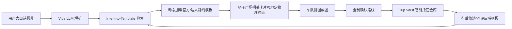

# 3.11 路线模板与结伴广场双向喂养规范

> Route Template & Matching Integration — 场景意图 ➔ 路线模板 ➔ 拼图成团 ➔ 资金托管

## 1. 商业闭环定位

传统攻略（小红书、马蜂窝）与路线模板是**静态且悬浮**的：看完依然不知道怎样组队、怎样落地。

TripNARA 将 **搭子广场** 与 **路线模板** 从两个孤立页面，升级为 AI 调配下的**双向闭轮**：



**与 3.10 的关系**：3.10 负责 Premium Trekking → World Model / DNA / spawn-trip；3.11 在其上增加 **Route Template _catalog 层**，把「情绪意图」落到可执行的 GPS/DEM/里程碑模板。

---

## 2. 双向交互设计

### 链路 A：路线模板 → 发起招募（内容到社交）

1. 用户在 **路线模板** 频道选中《冰岛内陆兰格维格 55km 硬核重装 4日》（内置 12.5m DEM）。
2. 底部 CTA：**「🎯 以此路线模板发起车队招募」**。
3. 系统在 **搭子广场** 挂起卡片，强绑定该模板的：
   - `routeDirectionName` / `durationDays` / 日计划 GPS
   - 物理约束（涉水点、海拔、离线包）
   - 由模板驱动的拼图槽位 augmentation
4. 无需手写复杂日程；`image_fe7c88` 拼图位由模板约束反向生成。

**API backlog**：~~`POST /route-directions/templates/:id/launch-recruitment`~~ **已实现**

| 方法 | 路径 | 说明 |
|------|------|------|
| POST | `/match-square/route-templates/:id/launch-recruitment` | 从模板发起招募（挂载 match-square，避免模块循环依赖） |

Body：`startDate`, `endDate`, `slotsNeeded`, `planningStyle` 必填；可选 `departureLabel`, `budget*`, `captainMessage` 等。

### 链路 B：大白话 → 匹配模板（情绪到物理落地）

1. 用户输入：「安吉 DNA 社区写代码，傍晚山谷露营，Stanford DYL 人生复盘。」
2. `POST /match-square/vibe-llm/parse` 返回：
   - Vibe chips + Hard Gates
   - `routeTemplateMatch.associationHint`：`🗺️ AI 已为你一键关联最佳路线模板：《…》`
   - `routeTemplateMatch.primaryMatch`（`matchPercent ≥ 85` → `confidence: highlight`）
3. 队长点击确认 → 模板 GPS、营地、预算区间自动回填详情页。

**已实现（Phase 1 骨架）**：parse 响应字段 `routeTemplateMatch`（配置驱动检索，无 DB 硬编码）。

---

## 3. Route Contract Lock × Trip Vault

高端组队最大摩擦：**「今天到底去哪？」「为什么临时改线？」**

| 机制 | 说明 |
|------|------|
| **Route Contract Lock** | 全员「确认加入」= 签署 MBTI 契约 + 授权路线模板里程碑 |
| **Trip Vault 联动** | 模板 Day 2 必须入住 Landmannalaugar 火山营地 → 对应里程碑资金锁死 |
| **Rollback 权限** | 仅 `[全托管]` 基因队长可发布 rollback；否则严格按模板节奏 |
| **消灭随性改线** | 产品机制层面消除陌生人因目的地分歧内耗 |

**Phase 3 backlog**：`vaultMilestoneIds` 已在 catalog 配置；待 Trip Vault API 接线。

---

## 4. 规范条目（PRD 原文）

### 4.1 意图到路线的动态检索 (Intent-to-Template Retrieval)

- Vibe LLM 完成解析后，调用 **路线模板 catalog**（配置 + 未来向量检索）做相似度打分。
- 匹配度 **≥ 85%** → `confidence: highlight`，以 Chip 注入招募详情核心区块。
- 匹配度 **60%–84%** → `confidence: suggest`，展示为次要推荐。

### 4.2 模板数据驱动的拼图槽位 (Template-Driven Slots)

- 模板 `physicalConstraints`（涉水区、高海拔里程、攀爬天数）作为 PreferenceEvolution / 拼图引擎入参。
- 例：兰格维格模板 → 强制 augmentation `[涉水/高寒物理救援]`、`[离线气象精算]`。
- 与 3.10 `structuralMatch` + `slot_definitions` 叠加，非替换。

### 4.3 行后满意度数据反哺 (Feedback Route Loop)

- 行后互评高赞 → 强化用户 Decision DNA（3.10）。
- 团队真实轨迹、脱敏记账 → 沉淀为该模板下「高赞真实出游范例」。
- 完成 **内容 → 工具 → 内容** 长效生态。

**已实现 API**

| 方法 | 路径 | 说明 |
|------|------|------|
| GET | `/trips/:tripId/template-backflow/preview` | 只读脱敏预览，不写 DB |
| POST | `/trips/:tripId/template-backflow/commit` | 队长提交；写入 `RouteTemplate.metadata.matchSquareBackflow_v1.examples[]`；Trip 侧幂等键 `matchSquareTemplateBackflowCommit` |

Body（commit）：`{ note?: string, skipIfExists?: boolean }`。响应含 `alreadyCommitted`。

---

## 5. 代码落点（Phase 1）

| 文件 | 职责 |
|------|------|
| `config/route-template-intent-bindings.config.ts` | 模板 catalog：关键词、剧本 id、RouteDirection、Vault 里程碑 |
| `engine/route-template-intent.engine.ts` | 纯函数打分 + `RouteTemplateIntentMatchPlan` |
| `types/route-template-intent.types.ts` | Schema `route_template_intent_v1` |
| `POST /vibe-llm/parse` → `routeTemplateMatch` | 链路 B 实时预览 |
| `trekkingOrchestration` | 3.10 路线候选 boost 模板匹配分 |

### 已配置 catalog 示例

| catalogId | 剧本 | RouteDirection | 场景 |
|-----------|------|----------------|------|
| `is_laugavegur_55km_heavy_4d` | `iceland_laugavegur_heavy_trek` | `IS_LAUGAVEGUR` | 冰岛兰格维格 |
| `anji_dna_light_camp_3d` | `mountain_dyl_retreat` | `ANJI_DNA_RETREAT` | 安吉 DNA + DYL |
| `chuanxi_heavy_loop_planned` | `chuanxi_heavy_trek` | `CHUANXI_HEAVY_LOOP` | 川西重装（planned） |

新增场景：**只改 config**，不改 engine。

---

## 6. Phase 2–4 Backlog

| Phase | 条目 |
|-------|------|
| 2 | ~~`POST /templates/:id/launch-recruitment` 链路 A~~ **已实现** |
| 2 | 发帖 `routeTemplateCatalogId` 持久化 + 详情页展示 → **`post.routeTemplateBinding` + `_routeTemplateLaunch`** |
| 3 | Trip Vault × `vaultMilestoneIds` 资金锁 |
| 3 | Route Contract Lock / rollback 权限 |
| 4 | 向量检索替代纯关键词打分 |
| ~~4~~ | ~~行后轨迹脱敏反哺模板范例~~ → **已实现** `preview` + `commit` |

---

## 7. API 响应示例

`POST /api/match-square/vibe-llm/parse` 片段：

```json
{
  "routeTemplateMatch": {
    "version": "route_template_intent_v1",
    "associationHint": "🗺️ AI 已为你一键关联最佳路线模板：《冰岛内陆兰格维格 55km 硬核重装 4日》",
    "primaryMatch": {
      "catalogId": "is_laugavegur_55km_heavy_4d",
      "routeDirectionName": "IS_LAUGAVEGUR",
      "durationDays": 4,
      "titleZh": "冰岛内陆兰格维格 55km 硬核重装 4日",
      "matchPercent": 92,
      "confidence": "highlight",
      "launchRecruitmentAction": "confirm_template",
      "slotAugmentations": [
        {
          "slotRole": "gear_rescue",
          "expectedTagSuffix": "涉水/高寒物理救援",
          "reason": "兰格维格模板含多处冰川融水强涉水，需硬核物理输出补位"
        }
      ]
    },
    "suggestions": []
  }
}
```

---

参见：[trekking-dna-integration-3.10.md](./trekking-dna-integration-3.10.md) · [3.12 成团→Active Trip](./group-formation-trip-instantiation-3.12.md) · [frontend-integration-guide.md](./frontend-integration-guide.md) §16
