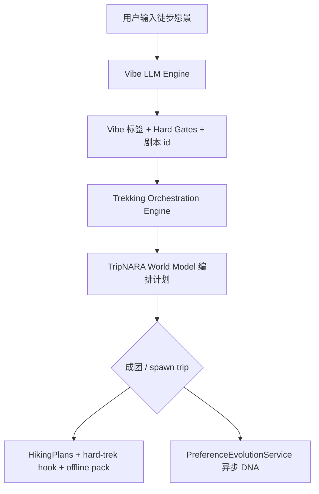

# 3.10 徒步模块与 Decision DNA 深度联动规范

> Trekking & DNA Integration — Match Square Vibe LLM × TripNARA Hiking × UserProfileLearningService

## 1. 核心链路



### 三层引擎职责

| 层 | 模块 | 输出 |
|----|------|------|
| 1 | `VibeLlmService` / `vibe-llm-parse.engine` | `vibe_chips`, `hard_gates`, `recruitment_script_id`, `recruitment_scene_category` |
| 2 | `trekking-vibe-orchestration.engine` | `TrekkingVibeOrchestrationPlan` — 路线候选、离线 DEM、公摊装备、行中 Event、工具链 |
| 3 | TripNARA 决策栈 | `attachHardTrekTrailPlanToState`, `HikingPlansService.createWithSegment`, `HikingOfflinePackService` |
| 4 | `PreferenceEvolutionService` | `UserProfile.preferences.decision_dna` 异步进化（行后确认触发） |

## 2. 代码落点

| 文件 | 职责 |
|------|------|
| `config/premium-trekking.config.ts` | 场景 `premium_trekking` ↔ 菜单 `hiking` |
| `config/trekking-vibe-world-model.config.ts` | 四剧本 → World Model / DNA / 工具链绑定 |
| `engine/trekking-vibe-orchestration.engine.ts` | 纯函数编排计划生成 |
| `types/trekking-vibe-orchestration.types.ts` | 编排计划 Schema `trekking_orchestration_v1` |
| `captainPersonaSnapshot._trekkingOrchestration` | 发帖时持久化 |
| `POST /vibe-llm/parse` → `trekkingOrchestration` | 实时预览 |
| `GET /posts/:id` → `trekkingOrchestration` | 详情页消费 |

## 3. 四大剧本 × TripNARA 响应

### 场景 A — 冰岛兰格维格重装 · `iceland_laugavegur_heavy_trek`

**Vibe 触发 chip**：`laugavegur_55km`, `iceland_volcanic_wilderness`, `dem_blind_nav`, `glacier_river_ford`

**编排计划**：
- `worldModel.offlineDataPreloadRequired: true`
- `demGridMetres: 12.5`（冰岛全岛 DEM）
- `routeDirectionCandidates`: `IS_LAUGAVEGUR` (live) + `IS_TREKKING_WILDERNESS` (live 走廊参考)
- `eventStreamMilestones`: Fjórðungakvísl 涉水刚性检查 + 清晨低流量时间窗
- `sharedGearDeficits`: 涉水鞋/徒步杖、四季帐、失温/LNT 套件
- `dnaEvolution.ambiguityToleranceHint: minimize` → 拼图熔断 flaky / 越界负反馈

**Country Pack IS**：高地开放季门禁 · DEM 缺失 REJECT · 风暴 recovery audit

**TripNARA 落地**：
1. spawn → `HikingOfflinePackService.getOfflinePack` (`is-laugavegur`)
2. `attachHardTrekTrailPlanToState` + 全队 offline pack push（backlog）
3. 行后离线导航确认 → `TREK_READINESS_ACK` DNA 同步

### 场景 B — 川西重装 · `chuanxi_heavy_trek`

**Vibe 触发 chip**：`dem_digital_elevation`, `self_supported_camping`, `risk_self_managed`

**编排计划**：
- `worldModel.offlineDataPreloadRequired: true`
- `demGridMetres: 12.5`
- `routeDirectionCandidates`: `CHUANXI_HEAVY_LOOP` (planned)
- `sharedGearDeficits`: 卫星电话、四季帐、LNT 绳索套件
- `dnaEvolution.ambiguityToleranceHint: minimize` → 拼图熔断 flaky 标签

**TripNARA 落地（工程 backlog）**：
1. 川西 fixture 上线后将 `CHUANXI_HEAVY_LOOP` 切换为 `live`
2. `attachHardTrekTrailPlanToState` + `HardTrekTripMetadataService.persist`
3. 申请侧 `structuralMatch.filterNegativeTags` 对齐声誉 OS

### 场景 C — 雨崩/乌孙轻装 DYL · `light_trek_dyl_retreat`

**Vibe 触发 chip**：`dyl_life_design`, `burnwash_full`, `starry_bonfire`

**编排计划**：
- 剔除重装暴走路线约束 `light_pack_mule`, `slow_pace`
- `eventStreamMilestones`: 晴夜 `starry_dyl_canvas`
- `toolchain`: DYL Canvas 电子版 + MBTI 互补透镜
- `dnaEvolution`: Co-Creation · 过滤爹味/职场撕逼

### 场景 D — 杭州速攀 · `weekend_fast_light_trek`

**Vibe 触发 chip**：`hr_max_out`, `elite_silence`, `basecamp_craft_beer`

**编排计划**：
- `physicalConstraints`: 单日爆发、无酒店账本
- `toolchain`: 小时级气象配速 + 终点精酿 POI
- `dnaEvolution.silent_flow` → 行后五星触发 `TREK_POST_RATING_FIVE_STAR` DNA 同步（待接 PreferenceEvolutionService）

## 4. 研发条目（Phase 2 编排器）

### 4.1 GIS 与 DEM 数据流闭环

- [x] `spawnTripFromRecruitmentPost(postId)` — `POST /match-square/posts/:id/spawn-trek-trip`
- [x] `GET /match-square/posts/:id/spawn-trek-trip/preview` — 预览 live/planned 路线
- [x] 选人 live 路线 → `HikingPlansService.createWithSegment` + `hardTrekTrailPlan` + offline pack 元数据
- [ ] 川西/雨崩/浙西 fixture 上线后，将 `planned` 路由切换为 `live`

### 4.2 UserProfileLearningService 接口扩展

- [x] 扩展 `PreferenceEvolutionReason`: `TREK_VIBE_CONFIRMED` | `TREK_READINESS_ACK` | `TREK_POST_RATING_FIVE_STAR`
- [x] spawn 成功时 `scheduleDecisionDnaSync`（按剧本 `preferenceEvolutionReasonPlanned`）
- [ ] 行后五星回流触发 `TREK_POST_RATING_FIVE_STAR`（待 Trip 反馈 API 接线）
- [ ] 将 `odysseyWeightAdjustments` 写入 intake 特征矩阵

### 4.3 场景化工具链

- [ ] DYL 场景：行程单晚间节点注入 `dyl_canvas_electronic`
- [ ] 重装场景：Trip Vault OS 公摊装备轧差（与 `sharedGearDeficits` 联动）
- [ ] 速攀场景：跳过酒店/大额账本，仅起点补给 + 终点 POI

## 5. 前端集成要点

1. 从 **🏃 徒步** 入口发布 → 监听 `trekkingOrchestration != null`
2. 详情页展示 `worldModel.routeDirectionCandidates`（planned 路由标「即将上线」）
3. 队长视图：离线预载 CTA 当 `offlineDataPreloadRequired`
4. 拼图位 + `structuralMatch` 与社会硬背书 UI 联动

## 6. API 示例

`POST /api/match-square/vibe-llm/parse` 响应片段：

```json
{
  "trekkingOrchestration": {
    "version": "trekking_orchestration_v1",
    "scriptId": "iceland_laugavegur_heavy_trek",
    "sceneCategory": "premium_trekking",
    "worldModel": {
      "profile": "heavy_offline_dem",
      "offlineDataPreloadRequired": true,
      "demGridMetres": 12.5
    },
    "sharedGearDeficits": [{ "item": "卫星电话", "reason": "…" }],
    "dnaEvolution": { "ambiguityToleranceHint": "minimize" }
  }
}
```

---

参见：`internal-docs/match-square/frontend-integration-guide.md` §7 · `vibe-llm-prompt.md` Premium Trekking 表 · [3.11 路线模板双向喂养](./route-template-matching-integration-3.11.md) · [3.12 成团→Active Trip](./group-formation-trip-instantiation-3.12.md)
