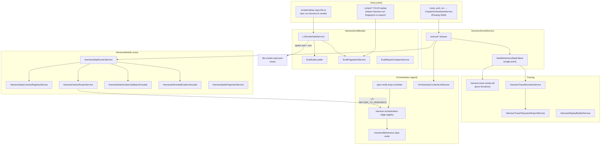
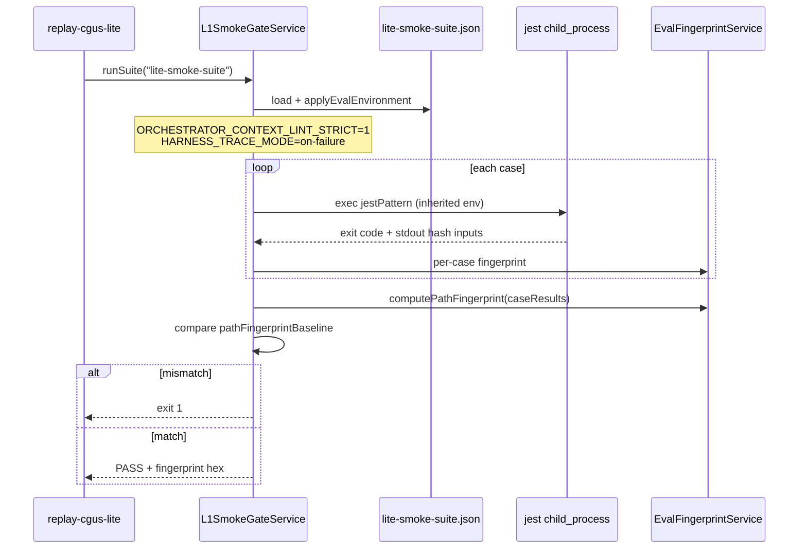
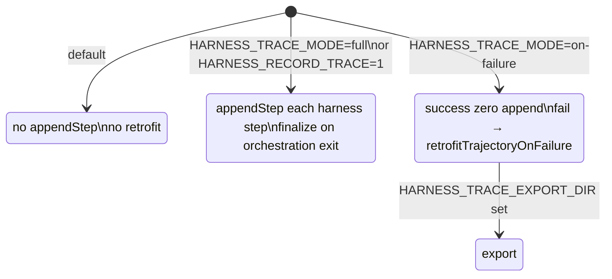
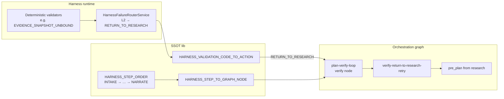

# Harness 模块依赖与环境变量图

> **Companion** to [harness-1x-roadmap.md](./harness-1x-roadmap.md). Describes the **production-ready base** after Phase 4b: trace on-failure, L1 fingerprint gate, and orchestration routing SSOT.

---

## 1. 模块依赖总览



**依赖方向（Nest）：**

| 模块 | imports | exports 给上层 |
|------|---------|----------------|
| `HarnessModule` | validators, tracing, runtime | `HarnessStepRunnerService`, trace recorder, failure router |
| `HarnessEvalModule` | `HarnessModule` | L1 gate, fingerprint, suite loader |
| `HarnessEvalCliModule` | `HarnessEvalModule` | CLI bootstrap only |
| `DecisionKernelModule` | `HarnessModule` + context lint | `execute*` + harness runtime patch |

---

## 2. L1 Smoke 数据流（26s 指纹门禁）



**钉扎基线：** `0537ff978954174142a770d18fbadddaad23743b3850b82c9d224fbaf9b965cf`

---

## 3. Trace 三态与 Kernel 失败单点



| 检查函数 | `off` | `full` | `on-failure` |
|----------|-------|--------|--------------|
| `shouldSkipHarnessTraceAppend()` | ✓ | — | ✓ |
| `shouldRecordOnFailureRetrofit()` | — | — | ✓ |
| `shouldFinalizeHarnessTraceOnOrchestrationExit()` | — | ✓ | — |

**Kernel 收口：** 各 phase Harness 失败 → `handleHarnessStepFailure()` →（可选）`retrofitTrajectoryOnFailure` → `HarnessTraceFilesystemExportService.exportHarnessTraceIfConfigured`

---

## 4. 路由同源化（Harness ↔ 编排图）



**原则：** 编排层不硬编码「VERIFY 失败回 RESEARCH」；读 `last_harness_failure_events` + `resolveGraphNodeForHarnessAction` + `HARNESS_STEP_ORDER`。

---

## 5. 环境变量速查表

### 5.1 L1 Smoke 默认高压（`L1SmokeGateService` / `lite-smoke-suite.json`）

| 变量 | L1 值 | 作用 |
|------|-------|------|
| `ORCHESTRATOR_CONTEXT_LINT_ENABLED` | `1` | Kernel `execute*` 前 Context Lint |
| `ORCHESTRATOR_CONTEXT_LINT_STRICT` | `1` | 违规 **抛错**（非 warn） |
| `HARNESS_TRACE_MODE` | `on-failure` | 成功零 append；失败黑匣子 |

### 5.2 Context Lint（Phase 4a）

| 变量 | 默认 | 作用 |
|------|------|------|
| `ORCHESTRATOR_CONTEXT_LINT_ENABLED` | off | 启用审计 |
| `ORCHESTRATOR_CONTEXT_LINT_STRICT` | off | 严格模式 |
| `ORCHESTRATOR_CONTEXT_LINT_MAX_BYTES` | — | 可见载荷 size guard |

### 5.3 Trace

| 变量 | 默认 | 作用 |
|------|------|------|
| `HARNESS_TRACE_MODE` | `off` | `off` \| `full` \| `on-failure` |
| `HARNESS_RECORD_TRACE` | — | `=1` 等价 `full`（向后兼容） |
| `HARNESS_TRACE_EXPORT_DIR` | — | on-failure / full 落盘目录 |
| `HARNESS_TRACE_EXPORT_FLAT` | — | 扁平导出布局 |
| `HARNESS_TRACE_MAX_ENTRIES` | — | 内存 trace 上限 |
| `HARNESS_TRACE_SAMPLE_RATE` | — | 仅 **full** 成功路径采样 0–1 |

### 5.4 Eval / L1 门禁

| 变量 | 默认 | 作用 |
|------|------|------|
| `HARNESS_EVAL_RECORD_BASELINE` | — | `=1` 写回 suite `pathFingerprintBaseline` |
| `npm run harness:l1-smoke` | — | 跑套件并对齐基线 |
| `npm run harness:l1-smoke:baseline` | 设上一项 | 钉扎指纹 |

### 5.5 Harness 运行时（已有）

| 变量 | 默认 | 作用 |
|------|------|------|
| `HARNESS_SKIP_INFERENTIAL` | — | `=1` 跳过 inferential graders |

### 5.6 待排期（梯队 3+，roadmap 预留）

| 变量 | 状态 | 作用 |
|------|------|------|
| `HARNESS_SHADOW_GRADER` | 未接 | 异步语义分 |
| `HARNESS_KERNEL_HARD` | 未接 | 同步硬门禁（需运维签字） |

---

## 6. 生产 vs 本地门禁推荐配置

```text
┌────────────────────┬──────────────────┬─────────────────────────────┐
│ 场景               │ Trace            │ Context Lint                │
├────────────────────┼──────────────────┼─────────────────────────────┤
│ 生产默认           │ off（零开销）    │ 可选 ENABLED，STRICT 慎用     │
│ 排障 / badcase     │ on-failure       │ ENABLED + EXPORT_DIR        │
│ 深度调试           │ full             │ 按需                        │
│ CI / 合入前 L1     │ on-failure       │ ENABLED + STRICT=1          │
└────────────────────┴──────────────────┴─────────────────────────────┘
```

```bash
# CI / 开发者合入前（与 L1 一致）
ORCHESTRATOR_CONTEXT_LINT_ENABLED=1 \
ORCHESTRATOR_CONTEXT_LINT_STRICT=1 \
HARNESS_TRACE_MODE=on-failure \
npm run harness:l1-smoke

# 排障归档
HARNESS_TRACE_MODE=on-failure \
HARNESS_TRACE_EXPORT_DIR=artifacts/harness-on-failure
```

---

## 7. 源码锚点索引

| concern | 主文件 |
|----------|--------|
| Trace 模式解析 | `src/harness/tracing/harness-trace-mode.util.ts` |
| 失败 retrofit | `src/harness/tracing/harness-trace-recorder.service.ts` |
| Kernel 单点 | `src/decision/kernel/decision-kernel.service.ts` → `handleHarnessStepFailure` |
| L1 门禁 | `src/harness/eval/compare/l1-smoke-gate.service.ts` |
| 套件定义 | `fixtures/harness/eval/suites/lite-smoke-suite.json` |
| 步骤顺序 SSOT | `src/harness/lib/harness-step-order.ts` |
| 图边绑定 | `src/agent/orchestration/graph/edges/harness-orchestration-edge.registry.ts` |
| CGUS 兼容 | `scripts/lib/harness-run-fingerprint.ts` → re-export eval fingerprint |

---

*维护：新增 Harness 环境变量或 Nest 模块依赖时，同步更新本节与 [harness-1x-roadmap.md](./harness-1x-roadmap.md) §3–§4。*
