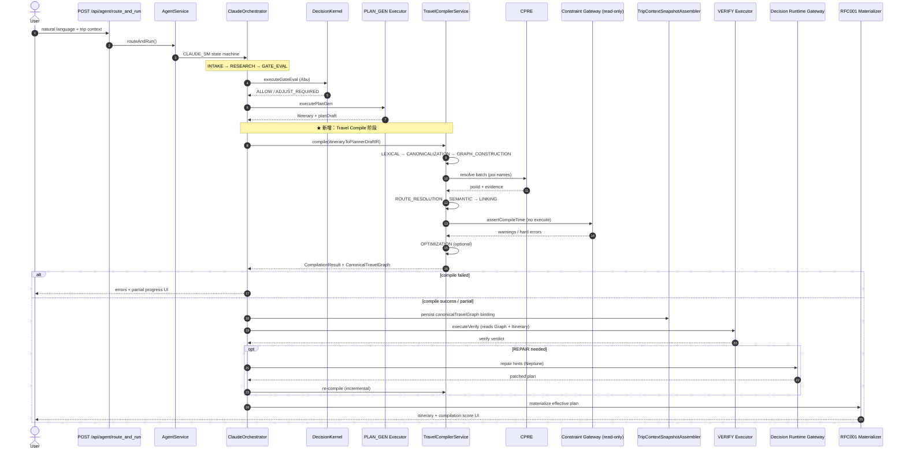

# Travel Compiler — 契约与 `route_and_run` 集成设计 V0

**文档版本：** V0.1  
**状态：** 架构草案（契约已落盘 `src/travel-compiler/contracts/`）  
**优先级：** P0（AI Native Foundation）  
**相关：**

- [TripNARA AI Native 收敛战略](./TRIPNARA_AI_NATIVE_POSITIONING.md)
- [CPRE PRD](./prd-cpre-v1.md)
- 契约：`src/travel-compiler/contracts/`

---

## 1. 定位

Travel Compiler 是 **AI Planner 与 Decision Runtime 之间的唯一结构化入口**：

- **输入：** `PlannerDraftIR`（PLAN_GEN 结构化草案，非原始 NL）
- **输出：** `CompilationResult` + `CanonicalTravelGraph`
- **不做：** 攻略生成、方案推荐、Runtime 授权/执行

---

## 2. 契约文件索引

| 文件 | Schema ID | 用途 |
|------|-----------|------|
| `planner-draft-ir.types.ts` | `tripnara.planner_draft_ir@v0` | Compiler 输入 |
| `canonical-travel-graph.types.ts` | `tripnara.canonical_travel_graph@v0` | Compiler 产物 / Runtime 读模型 |
| `compilation-result.types.ts` | `tripnara.compilation_result@v0` | 统一返回 + UI 进度 |
| `travel-compiler.types.ts` | — | 九阶段枚举 + Service Facade |

---

## 3. 与 Trip Context Snapshot 的关系

`CanonicalTravelGraph` **不单独建第四套 SSOT**，作为 Snapshot 的计划域投影：

```text
TripContextSnapshot v2（规划）
├── goal / members / preferences
├── contract                    ← TravelDecisionContract
├── canonicalTravelGraph        ← Travel Compiler 产物（新增）
├── worldFacts                  ← Runtime 更新
├── effectivePlan               ← materializer 投影 → ItineraryItem
└── openDecisions / monitoring
```

`GET /api/trips/:tripId/travel-graph` 返回 Snapshot 的 `canonicalTravelGraph` slice（只读）。

---

## 4. 编译阶段与现有模块映射

| 阶段 | 职责 | 复用模块 |
|------|------|----------|
| LEXICAL | 识别 POI/Route/Activity/Stay/Time/Booking 槽位 | PlannerDraftIR 已含 slots；GuideParse 可投影 |
| CANONICALIZATION | 别名 → poiId / routeTemplate / activityType | **CPRE**、`EntityResolutionService` |
| GRAPH_CONSTRUCTION | 组装 CanonicalTravelGraph 骨架 | 新：`TravelGraphBuilder` |
| ROUTE_RESOLUTION | Route 模板匹配 → segments + waypoint POI 展开 | `is-route-templates.catalog`、CTRE Module 2 |
| SEMANTIC | Intent、dependency hints | experience-intent compiler、country-pack rules |
| LINKING | 建 typed edges | RouteTemplate、PlaceEdge、SpatialDomain（引用） |
| VALIDATION | 结构 + 目的地规则（compile-time） | Constraint Gateway **只读 assertion** |
| OPTIMIZATION | 去重、route merge、timeline 压缩 | compile-time only；**非 Neptune REPAIR** |

### Compiler Validation vs Decision Runtime

| | Travel Compiler | Decision Runtime |
|--|-----------------|------------------|
| 问题 | Graph 是否自洽？POI 是否存在？ | 当前封路/天气下该不该走？ |
| 时机 | PLAN_GEN 之后、VERIFY 之前 | 读 Graph + WorldStateSnapshot |
| 失败 | `CompilationResult.errors` | `DecisionProblem` + 修复选项 |
| 写回 | 写 Graph 到 Snapshot | authorize → execute → Effective Plan |

---

## 5. `route_and_run` 集成序列图

### 5.1 主链（CLAUDE_SM / Kernel Native）



### 5.2 编排步骤命名（DecisionLog）

在 `OrchestrationStep` 中新增一步（建议插入 PLAN_GEN 与 VERIFY 之间）：

```text
… → PLAN_GEN → TRAVEL_COMPILE → VERIFY → REPAIR → NARRATE → DONE
```

与 PRD §11 UI 进度条对齐：

```text
AI Planning        ██████████
Travel Compile     ██████░░░░   ← phaseReports + counters
Validation         ████░░░░░░
Decision Runtime   ██░░░░░░░░
Done
```

---

## 6. HTTP API（Phase A 目标）

### POST `/api/travel/compiler`

**Request**

```json
{
  "draft": { "schemaId": "tripnara.planner_draft_ir@v0", "…": "…" },
  "options": { "countryCode": "IS", "allowPartialGraph": true }
}
```

**Response：** `CompilationResult`（含 `graph`、`phaseReports`、`score`）

### GET `/api/trips/:tripId/travel-graph`

**Response：** `CanonicalTravelGraph`（来自最新 Snapshot binding）

---

## 7. Phase A 实施清单（4–6 周量级）

1. **`TravelCompilerService` Facade**（`src/travel-compiler/travel-compiler.service.ts`）
   - 编排九阶段（含 ROUTE_RESOLUTION）；MVP 冰岛 POI + Route 模板
2. **`itineraryToPlannerDraftIR` 适配器**
   - `Itinerary` → `PlannerDraftIR`（PLAN_GEN 输出直连）
3. **挂接点：** `claude-orchestrator` PLAN_GEN 完成后、`executeVerify` 之前
4. **Snapshot 扩展：** `TripContextSnapshotView.canonicalTravelGraph?`（v1.1 可选字段，向后兼容）
5. **Progress Hub：** 复用 `GuideParseProgressHub` 模式 → `TravelCompileProgressHub`
6. **禁止：** 新建第四条独立编排主链；Guide-to-Plan / Exploration 仍走旧 API，内部逐步调用同一 Facade

---

## 8. 示例：CompilationResult UI counters

Compiler Validation 阶段产出 `phaseReports.VALIDATION.counters`：

```json
{
  "POI": { "done": 18, "total": 18 },
  "Route": { "done": 14, "total": 14 },
  "Booking": { "done": 6, "total": 8 },
  "Constraint": { "done": 2, "total": 2 },
  "Dependency": { "done": 10, "total": 10 }
}
```

前端编译面板：✓ / ⚠ 与 PRD §11 一致。

---

## 10. Phase D — VERIFY SSOT + Effective Plan Materialize

- `TRAVEL_COMPILER_VERIFY_SSOT=true`（默认）：TRAVEL_COMPILE 后将 Graph 投影 Itinerary 设为 VERIFY 输入
- `GRAPH_COMPILE_INTEGRITY`：VERIFY 阶段读取 `canonicalTravelGraph` 统计
- `RFC001_ITINERARY_MATERIALIZE=true` 或 `TRAVEL_COMPILER_MATERIALIZE=true`：VERIFY 通过后写入 Trip 时间线

## 11. Phase E — REPAIR 增量 re-compile + CTRE 命名

- REPAIR 成功后自动触发 `compileTrigger=repair` 的 CTRE re-compile
- `TRAVEL_COMPILER_INCREMENTAL_REPAIR=true`（默认）：仅合并 `affectedDayIndices` 对应天的 Graph 切片
- 对外 API 别名：
  - `POST /travel/ctre/compile` ↔ `POST /travel/compiler`
  - `GET /trips/:tripId/ctre/graph` ↔ `GET /trips/:tripId/travel-graph`
- `CompilationResult.engine = 'CTRE'`

## 12. Phase F — VERIFY↔REPAIR 闭环 + 前端进度

- **子图边表：** `repair → verify`（修复 + 增量 re-compile 后再次 VERIFY）
- **SSE 增量：** `RouteAndRunTaskProgressPayload.ctre_compilation`（`tripnara.ctre_compile_progress@v0`）
- **Orchestrator metadata：** `state.metadata.ctre_compile_progress`（同步 route_and_run 结果）
- **进度文案：** `TRAVEL_COMPILE` 阶段 46%，message 含 `POI x/y · Route x/y`
- **前端字段说明：** [frontend-ai-route-generation-handoff.md §十一](../exploration/frontend-ai-route-generation-handoff.md)

---

## 14. Planning Workbench 内嵌 CTRE（Phase G）

**入口：** `POST /planning-workbench/execute`（sync/async）  
**实现：** `runPlanningWorkbenchTravelCompile`（`planStateToItinerary` → `TravelCompilerService.compile` → `TravelGraphStoreService.persistCompilation`）

| 能力 | route_and_run | Planning Workbench |
|------|---------------|-------------------|
| CTRE compile | ✅ TRAVEL_COMPILE 阶段 | ✅ execute 末尾 (~92%) |
| SSE `ctre_compilation` | ✅ | ❌（用 task `currentStage` + `uiOutput.ctre`） |
| VERIFY SSOT / REPAIR 闭环 | ✅ | ✅ V0.2（多轮 VERIFY⇄REPAIR，默认 max=2 + CTRE 增量 re-compile） |
| Graph 落库 | ✅ `trip_id` | ✅ `tripId` |
| 请求开关 | `options.enable_travel_compiler` | `enable_travel_compiler` |

**响应字段：**

- `uiOutput.ctre.progress` — `CtreCompileProgressView`
- `uiOutput.ctre.segmentEnrichment` — Graph→segment 回写统计
- `uiOutput.ctre.verifySsotApplied` — Graph 投影已登记为 VERIFY 输入 SSOT
- `uiOutput.ctre.kernelVerify` — Decision Kernel VERIFY 摘要（`issueCount` / `fatalCount` 等）
- `uiOutput.ctre.kernelRepair` — VERIFY 后 Kernel REPAIR 回写（`segmentsUpdated` / `itemsApplied`）
- `uiOutput.ctre.kernelVerifyRepairLoop` — 多轮闭环摘要 `{ terminatedReason, repairCount, rounds, finalVerify }`
- `uiOutput.ctre.incrementalRepair` — adjust 时增量重编译 `{ affectedDayIndices, merged }`
- `planState.itinerary.segments[].metadata`:
  - `attractions[].canonical_poi_id` / `graph_node_id`
  - `ctreResolvedPois[]` — `{ name, canonical_poi_id, graph_node_id }`
  - `routeTemplateId` — 当日 ROUTE 模板（如有）
- `planState.metadata.ctre_compile_progress` / `canonical_travel_graph`
- `planState.metadata.verify_itinerary_source` — `canonical_travel_graph@v0`（VERIFY SSOT）
- `planState.metadata.graph_projected_itinerary` — Graph 投影 Itinerary（Plan Gate / VERIFY 输入）
- `planState.metadata.kernelVerify` — Kernel VERIFY 明细 + `conflictArbitration` 投影
- async：`GET …/tasks/:taskId/status` → 顶层 `ctre`（COMPLETED 时从 result 投影）

**PlannerDraftIR.source：** `planning_workbench`

---

## 15. 开放问题（V0.2）

| # | 问题 | 建议 |
|---|------|------|
| 1 | REPAIR 后是否 always re-compile？ | 是；仅对 affected days 增量 compile |
| 2 | Graph 与 Itinerary 双写期多长？ | Phase A 双写；Phase B Effective Plan 从 Graph 投影 |
| 3 | Booking 节点 v0 来源？ | ItineraryItem booking 字段 + action_plan 投影 |
| 4 | Workbench 是否接 VERIFY SSOT？ | ✅ V0.2：`applyGraphVerifySsotToPlanState` + segment 回写；全量 Decision VERIFY 仍待接 |
