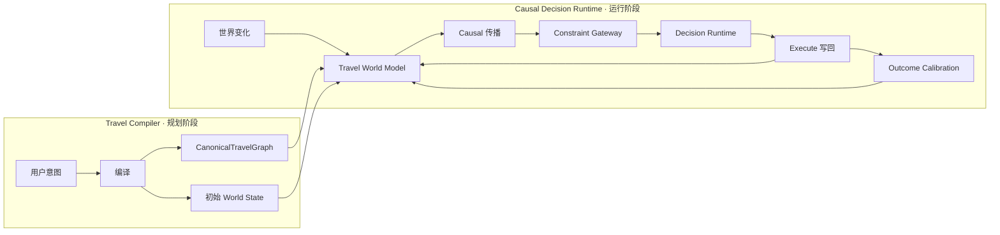
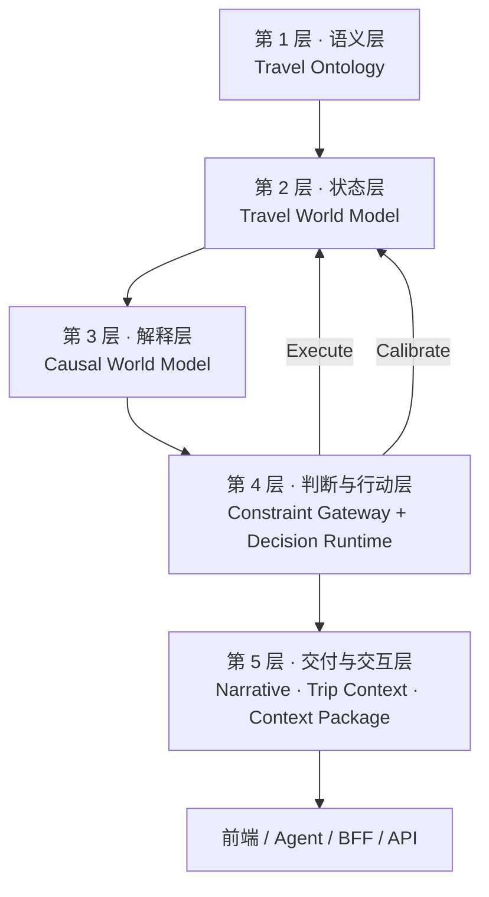
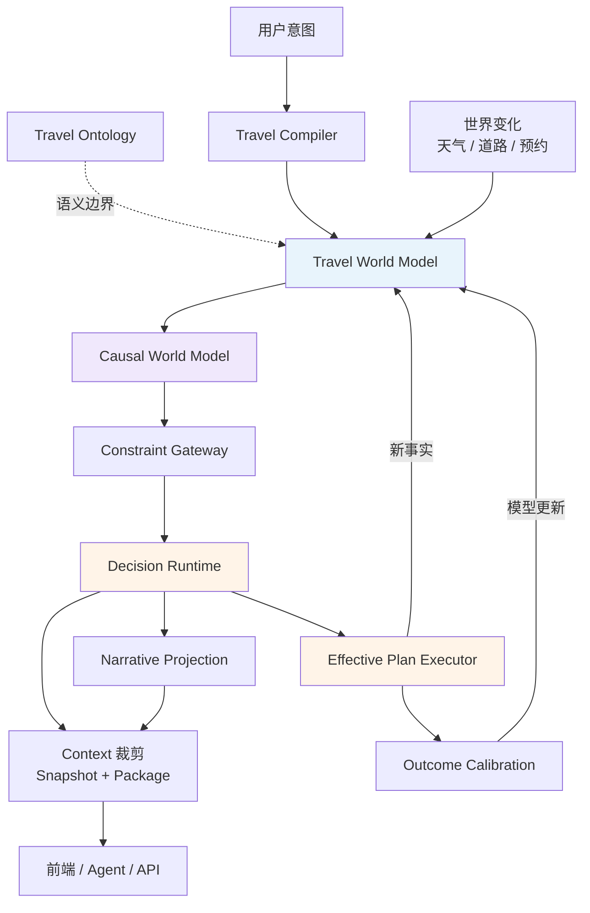
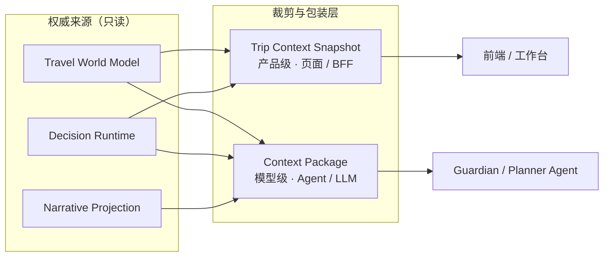

# TripNARA 旅行决策基础设施 — 产品叙事与融资框架

**文档版本：** 1.0.0  
**文档状态：** Draft（产品 / 融资 / 架构共用 SSOT 草案）  
**生效日期：** 2026-07-06  
**维护原则：** 本文定义 TripNARA **对外叙事**、**VC 沟通框架**与**算法栈产品化表述**；技术模块边界以 [旅行本体与世界模型架构说明](./travel-ontology-world-model-v1.md) 为准；工程成熟度以 [AI Native 产品定位](./TRIPNARA_AI_NATIVE_POSITIONING.md) 与 [Decision Runtime 成熟度](../../src/decision-runtime/DECISION_RUNTIME_MATURITY.md) 为准。

**上位文档：**

- [TripNARA AI Native 产品定位与收敛战略](./TRIPNARA_AI_NATIVE_POSITIONING.md)
- [旅行本体与世界模型架构说明](./travel-ontology-world-model-v1.md)
- [Travel Compiler 集成设计](./travel-compiler-integration-v1.md)
- [RFC-003 — Travel Context Protocol](./rfc-travel-context-protocol-v1.md)

**相关实现（现状）：**

- `src/travel-compiler/` — Travel Compiler（意图 → 可验证计划）
- `src/decision-runtime/` — Decision Runtime（约束、求解、执行）
- `src/causal-protocol/` — Canonical Causal Trace（Fact → Effect → Problem → Option）
- `src/travel-ontology/` — Travel Ontology 与 World Facts
- `src/travel-context/` — Travel Context Snapshot
- `src/agent/context-engine/` — Agent Context Package
- `src/harness/evals/` — Harness 验证与 Benchmark

**交互式架构图：**

- [TripNARA 产品架构 · 1200px Pitch 版](/home/devbox/.cursor/projects/home-devbox-project/canvases/tripnara-product-architecture-1200.canvas.tsx)（推荐用于 deck 导出）
- [TripNARA 产品架构 · 完整版](/home/devbox/.cursor/projects/home-devbox-project/canvases/tripnara-product-architecture.canvas.tsx)（可折叠详版）

---

## 〇、产品架构总览

> 本节为架构图的 Markdown 版本；交互式版本见上方 Canvas 链接。

### 0.1 对外叙事：Compiler + Runtime



### 0.2 对内工程：五层结构



### 0.3 主决策链路（含反馈闭环）



### 0.4 上下文交付（非 SSOT）



### 0.5 决策内核抽象

```text
Q = Detect(Wt, P, C)
E(a) = Propagate(Wt, Apply(P, a))
D = Rank(A, E, G, U, C, Policy)
Outcome = Compare(Prediction, Actual)
Model(t+1) = Calibrate(Model(t), Outcome)
```

---

## 一、总体判断

这套架构**有机会**构成「旅行决策基础设施」的核心算法系统，但当前更像一套**高质量的技术架构**，还不是 VC 一眼能理解、能相信的**投资故事**。

VC 不会因为项目拥有 Ontology、World Model、Causal Model、Context 和 Decision Runtime 就认为它是基础设施。VC 真正判断的是：

> **这套系统是否能持续做出比通用大模型、OTA 和人工规划师更可靠的旅行决策，并且随着执行数据积累越来越难被复制。**

### 1.1 当前评分（2026-07）

| 维度 | 当前判断 |
|------|----------|
| 技术架构完整度 | 8.5/10 |
| 产品差异化潜力 | 8/10 |
| VC 第一遍可理解度 | 5/10 |
| 当前算法护城河 | 6/10 |
| 完成执行闭环后的护城河 | 8.5/10 |
| 成为行业基础设施的可能性 | 有，但需要从产品结果长出来 |

### 1.2 两份 SSOT 的分工

| 文档 | 回答的问题 |
|------|-----------|
| [旅行本体与世界模型架构说明](./travel-ontology-world-model-v1.md) | 系统内部谁负责什么、边界在哪 |
| **本文** | 外部为什么要相信、凭什么难复制、怎么讲才不被当成「又一个 AI 行程助手」 |

```text
┌─────────────────────────────────────────────────────────┐
│  对外：VC / 用户 / 融资                                   │
│  用户痛点 → 可测量结果 → Compiler+Runtime → 数据飞轮       │
└───────────────────────────┬─────────────────────────────┘
                            │ 翻译层（当前最缺）
┌───────────────────────────▼─────────────────────────────┐
│  对内：工程 SSOT                                          │
│  Ontology → World Model → Causal → Gateway → Runtime     │
│  → Narrative / Context → Execute → Calibrate              │
└─────────────────────────────────────────────────────────┘
```

---

## 二、VC 第一遍会怎么理解

### 2.1 错误开场（技术名词先行）

若直接讲：

```text
Travel Ontology
→ Travel World Model
→ Causal World Model
→ Constraint Gateway
→ Decision Runtime
→ Narrative Projection
→ Context Package
```

大多数 VC 的第一反应**不是**「这是基础设施」，而会是：

- 架构很复杂，但**用户为什么需要**？
- 为什么 OpenAI、Google、Expedia、携程**不能直接做**？

甚至可能理解成：**为旅行规划做了一套知识图谱、规则引擎和 Agent 编排系统**——把真正价值淹没在技术名词里。

### 2.2 正确开场（结果先行）

**VC 需要听到的不是架构，而是结果。**

推荐先讲：

> 现有 AI 可以生成看起来合理的行程，但无法持续判断这趟行程在真实世界里能不能执行。TripNARA 建立的是**旅行决策引擎**：把天气、道路、预约、时间、成员和费用变化，转换成可解释、可执行、可验证的行程调整。

然后再解释底层为什么能做到：

| 模块 | 用户可理解表述 |
|------|---------------|
| 旅行本体 | 让系统理解旅行由什么构成 |
| 世界模型 | 知道这趟旅行当前发生了什么 |
| 因果模型 | 判断一个变化会影响哪里 |
| 决策引擎 | 选择应该采取什么行动 |
| 结果校准 | 验证判断是否正确并持续学习 |

这时 VC 才会把它理解成：**旅行行业的实时决策层**，而不是另一个 AI 行程生成器。

---

## 三、产品定位

### 3.1 不建议直接使用的表述

以下说法技术上正确，但离商业价值太远：

- 旅行世界模型平台
- 因果世界模型基础设施
- 旅行本体平台
- 多智能体旅行决策系统
- 旅行知识图谱

### 3.2 推荐定位

**产品版：**

> TripNARA 是面向复杂旅行的**可靠决策引擎**。它持续理解真实世界变化，判断变化如何影响行程，并给出经过验证的调整方案。

**基础设施版：**

> TripNARA 正在构建旅行行业的 **Decision Runtime**——连接实时世界、旅行计划和执行动作的决策层。

**最通俗的比喻：**

> 导航软件决定「这条路现在怎么走」，TripNARA 决定「整趟旅行现在应该怎么调整」。

这个比喻比「旅行操作系统」更具体。

### 3.3 一句话口径（分受众）

| 受众 | 一句话 |
|------|--------|
| 用户 | TripNARA 让复杂旅行在真实世界里持续可执行。 |
| 产品 | TripNARA 是能够理解变化、预测影响并主动调整行程的 AI 旅行决策系统。 |
| VC | TripNARA 正在构建旅行行业的因果决策运行时，把实时世界变化转化为可解释、可执行、可验证的行程决策。 |
| 基础设施 | We are building the decision layer between the changing world and the travel itinerary. |

---

## 四、为什么这个方向有真实需求

### 4.1 拥挤赛道：AI 生成旅行计划

当前大量 AI 旅行产品集中在：

- 对话式目的地推荐
- 内容生成
- 行程生成
- 地图和 POI 编排
- 从短视频或截图生成行程
- 预订导流

Mindtrip 已覆盖 AI 推荐、行程组织、协作和旅行中辅助，2025 年末累计融资约 2250 万美元；Airial 以 AI 推理和旅行物流规划获得 300 万美元种子轮。这说明 **「AI 生成旅行计划」已是拥挤赛道，而不是足够独立的护城河**。

### 4.2 明显缺口：真实世界可执行性

2025 年 TripTailor 基准使用超过 50 万个真实 POI 和近 4000 条真实行程评估，报告称参与测试的先进模型生成的人类水平行程比例**不足 10%**，主要困难包括可行性、合理性和个性化。TripCraft 研究也强调，现实旅行规划需要处理时间、空间、交通、事件可用性和人物偏好等复合约束。

### 4.3 TripNARA 的机会

| 其他产品主要解决 | TripNARA 主要解决 |
|-----------------|------------------|
| 「帮我生成一个行程」 | 「这个行程在真实世界里是否成立」 |
| | 「变化发生后应该怎么调整」 |
| | 「执行之后判断是否正确」 |

---

## 五、Compiler + Runtime：核心对外叙事

TripNARA 可以把用户的旅行意图理解为**源代码**：

```text
我想带父母自驾冰岛七天
不要太累
一定要看冰川
预算 3 万元
```

**Travel Compiler** 将其编译成：

- 结构化目标
- 成员需求
- 约束
- POI 实体
- 时间窗
- 交通关系
- 预约依赖
- 可执行计划

**Decision Runtime** 则持续处理：

- 天气变化
- 道路变化
- 预约变化
- 成员状态变化
- 计划执行结果

| 组件 | 职责 | 实现参考 |
|------|------|----------|
| Travel Compiler | 把模糊需求编译成可验证的旅行计划 | `src/travel-compiler/` |
| Decision Runtime | 让计划在变化的现实世界中持续成立 | `src/decision-runtime/` |

这比「AI 行程助手」更具有基础设施想象空间。

### 5.1 与内部架构的映射

| 对外叙事 | 内部模块 |
|----------|----------|
| Travel Compiler | Travel Ontology + 初始 World Model + Constraint 编译 |
| Decision Runtime | Causal Model + Constraint Gateway + Decision Core + Execute |
| 结果校准 | Outcome Calibration + Harness |
| 上下文交付 | Trip Context Snapshot + Context Package |

---

## 六、旅行决策基础设施算法栈

TripNARA **不是**一个单独算法，而是一套**面向旅行场景的因果决策算法栈**——类似自动驾驶由感知、预测、规划、控制和反馈组成，而不是一个大 Prompt。

### 6.1 七个算法模块

#### 1. 世界状态估计算法

**输入：** 天气、道路、POI 营业状态、预约、交通、成员状态、当前计划、外部事件

**输出：** 某一时刻的 Trip World State

**核心能力：**

- 不同数据源冲突处理
- 数据时效与置信度
- 有效时间窗
- 推断事实 vs 观测事实
- 世界状态版本

**核心问题不是「拿到数据」，而是：**

> 哪个事实在当前时刻对这趟旅行有效？

**实现参考：** `src/travel-ontology/`、`src/decision-runtime/snapshot/`、`CanonicalWorldStateSnapshot`

#### 2. 因果传播算法

**输入：** 世界状态变化

**输出：** 变化如何传导到路段、行程项、预约、成员和整趟旅行

**示例：**

```text
风速上升
→ 道路安全速度下降
→ P90 耗时上升
→ 抵达时间延后
→ 预约缓冲下降
→ 错过概率提高
```

**与普通知识库的差异：**

| 知识库 | 因果决策系统 |
|--------|-------------|
| 冰岛强风可能影响驾驶 | 这场风会让你明天第二段行程预计增加 48 分钟，导致冰川徒步预约缓冲变成 -13 分钟 |

**实现参考：** `src/causal-protocol/`、`src/trips/causal-runtime/`

#### 3. 约束求解与可行性算法

**职责：** 判断事实和影响是否违反约束，属于提醒、冲突还是阻断

**约束类型：**

- 时间窗约束
- 道路与车辆约束
- 营业和预约约束
- 签证与准入约束
- 成员体力约束
- 连续驾驶约束
- 预算约束
- 用户不可妥协条件

**实现参考：** `src/decision-runtime/constraints/`

#### 4. 反事实方案生成算法

**职责：** 不只发现问题，还要回答「改变什么，可以让问题消失？」

**示例：**

- 提前出发会怎样？
- 交换两个 POI 会怎样？
- 更换预约场次会怎样？
- 改走另一条路线会怎样？
- 删除哪个低优先级活动损失最小？

每个方案应**重新传播因果影响**，而不是让 LLM 随机编替代方案。

**实现参考：** Exploration check → options → apply；Neptune 修复候选

#### 5. 多目标方案排序算法

旅行没有唯一最优解。方案需在多个目标间权衡：

- 安全
- 可执行性
- 疲劳
- 体验价值
- 时间损失
- 费用
- 成员公平
- 用户偏好
- 可逆性
- 执行成本

推荐结果可能是：最安全 / 最轻松 / 最保留原体验 / 最低成本 / 综合推荐。

**Abu、Dr.Dre、Neptune 三人格的正确定位：**

> 对同一组合法方案采用**不同目标权重的决策投影**——不是三个独立做决定的 LLM。

**实现参考：** Decision Core + Optimization Strategy Selector

#### 6. Policy 与执行权限算法

**职责：**

- 哪些变化可以自动执行
- 哪些必须用户确认
- 哪些永远不能自主决定
- 方案是否仍基于最新世界状态
- 是否可以安全写回行程
- 执行失败如何回滚

这使 TripNARA 从「推荐系统」进入「决策运行时」。

**实现参考：** `TravelDecisionContract.automation`、Authorization Policy、Effective Plan Executor

#### 7. 结果校准算法

**这是最终形成护城河的关键：**

```text
预测结果 ↔ 实际执行结果
```

**示例：**

| 预测 | 实际 |
|------|------|
| 道路耗时增加 48 分钟 | 实际增加 61 分钟 |
| 老人疲劳评分 6.8 | 实际反馈 8.1 |
| 错过概率 64% | 用户提前出发后准时到达 |

**可校准的模型：**

- 路段动态耗时模型
- 目的地风险模型
- 用户节奏模型
- 疲劳模型
- 推荐方案接受率
- 方案真实有效率

没有这一步，只是一套规则和工作流；有了这一步，才会形成**旅行决策数据飞轮**。

**实现参考：** `src/trips/causal-reflection/`、`causal-feedback`、`CanonicalCausalTraceStatus: CALIBRATED`

### 6.2 决策内核抽象

```text
输入：
  旅行目标 G
  当前计划 P
  世界状态 Wt
  用户和成员状态 U
  约束集合 C
  历史执行结果 H

输出：
  问题集合 Q
  合法方案集合 A
  每个方案的预测结果 E
  推荐决策 D
  执行策略 X
```

**形式化：**

```text
Q = Detect(Wt, P, C)
E(a) = Propagate(Wt, Apply(P, a))
D = Rank(A, E, G, U, C, Policy)
Outcome = Compare(Prediction, Actual)
Model(t+1) = Calibrate(Model(t), Outcome)
```

**完整决策循环：**

```text
状态理解 → 问题识别 → 反事实模拟 → 方案排序 → 安全执行 → 结果学习
```

**推荐对外名称（择一）：**

- **Causal Travel Decision Runtime**（因果旅行决策运行时）
- **Travel Decision Compiler + Runtime**（旅行决策编译器与运行时）

不要包装成「一个超级因果算法」。

### 6.3 算法模块与工程模块对照

| VC 叙事（算法） | 技术架构 | 当前成熟度 |
|----------------|---------|-----------|
| 世界状态估计 | Travel World Model | 进行中，legacy WorldModelContext 仍并存 |
| 因果传播 | Causal World Model | 协议与 runtime 有，未统一入口 |
| 约束求解 | Constraint Gateway | 较成熟 |
| 反事实方案生成 | Decision Runtime（Option 层） | Exploration + Neptune 有骨架 |
| 多目标排序 | Decision Core + 三人格投影 | ADR-007 策略选择器在收敛 |
| Policy / 执行权限 | Authorization + Executor | automation 模型有，未完全接入 |
| 结果校准 | Outcome Calibration | 管道有，产品化不足 |

---

## 七、何时才能真正称为「基础设施」

只有满足以下条件，VC 才会相信它不仅是 TripNARA 内部架构。

### 7.1 输入输出具有标准协议

外部系统可以输入：

- Trip Plan
- Traveler Profile
- World Facts
- Constraints

得到：

- Decision Problems
- Causal Traces
- Options
- Predicted Effects
- Execution Policies

而不是只能服务 TripNARA 自己的页面。

**现状：** RFC-003、Causal Trace 协议在内，对外 API 未成产品。

### 7.2 跨目的地可迁移

必须证明：**全球通用 Runtime + 目的地约束包**，而不是冰岛一套、新西兰重写、瑞士再重写。

| 全球通用算法 | Destination Pack |
|-------------|------------------|
| 时间窗、交通衔接、预约、缓冲 | 冰岛 F 路 |
| 疲劳、成员需求、费用、风险 | 冬季道路、强风驾驶 |
| 反事实方案、执行权限 | 特定车辆规则、地区救援和准入 |

**现状：** 架构设计如此，仅 Iceland Pack 较深。

### 7.3 可验证地提高结果

| 指标 | 比较方向 |
|------|----------|
| 不可执行行程比例 | ↓ |
| 预约错过率 | ↓ |
| 行中临时重做行程次数 | ↓ |
| 用户方案接受率 | ↑ |
| 人工规划时间 | ↓ |
| 重大问题提前发现率 | ↑ |
| 决策预测误差 | 持续 ↓ |
| 旅行完成率 | ↑ |

没有这些指标，VC 会认为这是架构工程；有这些指标，才会认为是算法产品。

**现状：** Harness 有骨架，缺对外 benchmark 报告。

### 7.4 能为第三方提供决策能力

潜在消费者：

- OTA
- 高端定制旅行机构
- 旅行社
- 自驾平台
- 租车平台
- 保险公司
- 酒店和目的地机构
- 企业差旅平台
- AI 旅行 Agent

它们不一定需要 TripNARA 完整 UI，但可能需要：

| API | 能力 |
|-----|------|
| Feasibility API | 可行性评估 |
| Causal Impact API | 因果影响传播 |
| Trip Risk API | 行程风险 |
| Alternative Plan API | 替代方案 |
| Decision Trace API | 决策追溯 |
| In-trip Replanning API | 行中重规划 |

**现状：** 内部 BFF 为主，B 端 API 未商品化。

---

## 八、护城河在哪里

### 8.1 不是护城河的部分

| 可被复制 | 原因 |
|----------|------|
| 本体、数据模型、知识图谱 | 可被复制或重建 |
| 多 Agent 人格（Abu / Dr.Dre / Neptune） | 产品表达，非核心技术壁垒 |
| 因果链竖链 UI | 竞争对手容易模仿 |

### 8.2 真正护城河：四层叠加

```text
第一层：决策协议
  Fact → Effect → Problem → Option → Outcome
  （统一旅行决策的技术表达）

第二层：目的地因果规则与模型
  （知道不同世界变化如何影响具体旅行计划）

第三层：执行闭环数据
  （系统预测了什么 / 用户选择了什么 / 最终发生了什么）

第四层：评估与可靠性体系
  （Harness 持续证明：不漏风险、不生成非法方案、不执行过期决策、
   推荐越来越准、不同页面与人格不产生矛盾）
```

**最终护城河不是「我们知道冰岛有强风」，而是：**

> 我们知道一场具体的风会如何影响一类用户的具体行程，什么调整最可能被接受，以及调整后实际结果是否符合预测。

---

## 九、VC 可能提出的六个质疑与回答

### 质疑一：是不是做得太复杂？

**成立。** 回答不能是「旅行本来就很复杂，所以需要七层架构」，而应该是：

> 用户只看到一个可靠行程和少量关键决策。复杂性被系统吸收，而不是暴露给用户。

### 质疑二：普通用户真的需要这么强的决策吗？

**不是所有旅行都需要。** TripNARA 应优先面向：

- 多日自驾
- 户外和自然目的地
- 天气敏感目的地
- 多成员旅行
- 有预约和复杂交通衔接的行程
- 高客单价旅行
- 临时变化代价较大的旅行

不要声称用户周末去上海两天也需要完整因果决策引擎。

### 质疑三：为什么大模型不能直接推理？

通用模型可以生成建议，但缺少：

- 权威事实状态
- 稳定约束执行
- 确定性的版本控制
- 可回放决策依据
- 安全写回
- 预测与实际校准

研究基准也表明，现实旅行规划的可行性、时空合理性和个性化仍是现有模型的难点。

### 质疑四：OTA 为什么不能复制？

OTA 可以复制前端功能，也有更强库存和交易能力。TripNARA 必须证明自己积累的是：

> **跨库存、跨目的地、跨行程阶段的决策能力**——而不是更漂亮的行程生成页。

长期合作对象甚至可能是 OTA，而不一定只是竞争对手。

### 质疑五：数据从哪里来？

VC 会关注：

- 天气和道路数据是否稳定
- POI 营业和预约数据是否准确
- 数据授权和成本
- 缺失数据如何降级
- 用户执行结果如何获得
- 不同目的地覆盖成本

世界模型必须支持：`source`、`confidence`、`validity`、`evidence`、`fallback`。

### 质疑六：谁付钱？

这是最关键的问题。基础设施叙事不能掩盖商业模式。

| 阶段 | 路径 |
|------|------|
| 第一阶段 | 高价值复杂行程的 C 端规划与决策服务 |
| 第二阶段 | 旅行社、定制机构的规划与风控工作台 |
| 第三阶段 | 向 OTA、租车、保险、企业差旅提供决策 API |

> 先用产品验证决策价值，再把重复出现的能力抽象成基础设施。

---

## 十、2026 融资环境下的克制

2026 年第一季度旅行创业融资交易数量继续处于低位，资金更集中在少量能够证明商业价值和增长路径的项目上。Navan 等成熟企业差旅平台已把 AI 与预订、费用、支持和企业控制结合。

**VC 不太可能因为「旅行世界模型很先进」就投资。** 他们会要求看到：

1. 一个明确的高价值场景
2. 一个显著优于通用 AI 的结果
3. 一条可复用到更多国家和 B 端客户的路径
4. 一套越使用越准确的数据闭环

**融资时不要先展示 20 个模块。** 先展示一个强场景 Demo：

> 用户原本的冰岛计划会因为强风错过预约。TripNARA 提前发现问题，解释传播路径，生成三个合法方案，用户选择后系统更新行程，旅行中再用实际耗时校准模型。

**这个 Demo 比 50 页架构图更有说服力。**

---

## 十一、最推荐的 VC 叙事结构

### 1. 问题

AI 可以生成旅行计划，但无法保证计划在真实世界中成立。

### 2. 缺失层

旅行行业缺少一个连接实时世界状态与行程执行的**决策层**。

### 3. 产品

TripNARA 持续监控天气、道路、预约、成员和计划变化，提前发现问题并生成可执行替代方案。

### 4. 核心技术

我们构建了 **Travel Compiler** 和 **Causal Decision Runtime**，把旅行意图编译成可验证计划，并在世界变化时进行因果传播、约束求解和反事实方案比较。

### 5. 护城河

每一次预测、用户选择和实际结果都会回到模型中，形成独有的旅行决策数据。

### 6. 扩张路径

```text
复杂自驾和自然目的地
  → 多人和高价值旅行
  → 旅行社决策工作台
  → OTA 及旅行服务商 Decision API
```

---

## 十二、标准 Demo 场景（冰岛强风）

用户有一段冰岛行程：

| 项 | 值 |
|----|-----|
| 08:00 | 酒店出发 |
| 10:00 | 冰川徒步集合 |
| 标准行车 | 90 分钟 |
| 原计划缓冲 | 30 分钟 |

**Demo 应展示的完整闭环：**

```text
1. 世界模型记录：阵风 27m/s，路段 OPEN，计划出发 08:00
2. 因果传播：P90 138 分钟 → 预计 10:18 抵达 → 缓冲 -18 分钟 → 错过概率 64%
3. 约束网关：预约准时约束违反，severity = BLOCKER
4. 决策引擎：方案 A 提前出发 / 方案 B 改下午场 / 方案 C 换活动
5. 用户选择方案 B → 修改预约 → 重排下午行程
6. 行中校准：实际道路延误 61 分钟 → 更新强风耗时模型
```

**Demo 对应的技术链路：**

| 步骤 | 模块 |
|------|------|
| 1 | Travel World Model |
| 2 | Causal World Model → Canonical Causal Trace |
| 3 | Constraint Gateway |
| 4 | Decision Runtime → comparisonView |
| 5 | Effective Plan Executor |
| 6 | Outcome Calibration |

---

## 十三、当前差距与下一步

### 13.1 已成立

- 问题定义真实（benchmark 与竞品格局支持）
- 技术方向正确（分层避免 LLM 独揽权威推理）
- Compiler + Runtime 叙事与代码有对应物
- 商业模式路径合理（C 端验证 → B 端 API）

### 13.2 尚未成立

| 差距 | 说明 |
|------|------|
| Phase 3–4 产品能力 | 持续监控、主动触发、授权内自动执行——架构有，用户感知主链未收敛 |
| 可对外引用的指标 | Harness 有骨架，缺「比 GPT/OTA 早 X 小时发现 blocker」类公开证据 |
| 数据飞轮厚度 | Decision Trace 有管道，执行结果回写与模型更新尚未形成规模数据 |
| 谁付钱 | B 端 API 叙事清晰，C 端付费意愿与 B 端 pilot 需案例 |

### 13.3 三个最关键的证明

1. TripNARA 比通用大模型**更早、更准确地**发现不可执行问题
2. TripNARA 推荐的方案能**显著提高**行程完成率和用户接受率
3. 预测结果与实际执行结果形成**持续校准**的数据闭环

### 13.4 优先级（架构 → 证据）

当前最大 gap **不是**再设计一层架构，而是：

1. **收敛一条用户可感知的主链**（Exploration / Decision Center / Planning Workbench 不再分裂）
2. **跑通并量化冰岛 Demo 的五步闭环**（发现 → 传播 → 方案 → 写回 → 校准）
3. **把 Harness 产出变成对外 metrics**（从「接口 200」变成「不可执行率 -X%」）

---

## 十四、最终结论

### 这是不是一套好架构？

**是。** 它在逻辑上完整地区分了语义、事实、因果、约束、决策、表达、上下文、执行、校准，并避免让 LLM、BFF 或前端承担不该承担的权威推理职责。详见 [旅行本体与世界模型架构说明](./travel-ontology-world-model-v1.md)。

### VC 能否理解？

**能够，但不能从架构名词开始讲。** 必须按照：

```text
用户痛点 → 结果差异 → 核心引擎 → 数据闭环 → 基础设施扩张
```

### 能否构成旅行决策基础设施算法？

**可以**，但前提是从架构变成一个**可测量、可回放、可校准**的决策系统。

**真正有投资价值的不是：**

> TripNARA 有一个因果世界模型。

**而是：**

> TripNARA 正在积累其他平台没有的「世界变化 — 行程影响 — 用户决策 — 实际结果」数据，并把它转化为可复用的旅行决策能力。

---

## 附录 A：内部架构模块职责（技术附录）

> 对外沟通时放在附录，不要放在 pitch 第一页。

| 模块 | 核心问题 | 可以做 | 不应该做 |
|------|----------|--------|----------|
| Travel Ontology | 旅行世界由什么构成 | 定义类型、关系、语义 | 保存某趟旅行当前状态 |
| Travel World Model | 这趟旅行现在是什么状态 | 保存事实和状态 | 决定推荐哪个方案 |
| Causal World Model | 一个变化会如何传播 | 传播影响、生成 Effect | 做最终价值判断 |
| Constraint Gateway | 是否违反约束 | 判断约束是否违反 | 生成完整行程方案 |
| Decision Runtime | 应该怎么判断和行动 | 形成 Problem、Option、Decision | 成为天气和道路事实仓库 |
| Narrative Projection | 如何表达给用户 | 转成用户可读表达 | 重新计算因果和风险 |
| Trip Context / Context Package | 把哪些信息给谁 | 聚合、裁剪、排序 | 成为新的 SSOT |

**最核心的边界：**

- Ontology 不存实例状态
- World Model 不做最终决策
- Causal Model 不做价值判断
- Decision Runtime 不做事实仓库
- Narrative 不重新推理
- Context 不成为新的 SSOT
- BFF 不成为第二个决策引擎

---

## 附录 B：相关文档索引

| 文档 | 用途 |
|------|------|
| [TRIPNARA_AI_NATIVE_POSITIONING.md](./TRIPNARA_AI_NATIVE_POSITIONING.md) | 产品定位与 Phase 1–4 成熟度 |
| [travel-ontology-world-model-v1.md](./travel-ontology-world-model-v1.md) | 本体 / 世界模型 / 决策 SSOT |
| [travel-compiler-integration-v1.md](./travel-compiler-integration-v1.md) | Compiler 集成设计 |
| [rfc-travel-context-protocol-v1.md](./rfc-travel-context-protocol-v1.md) | Context Protocol + Harness |
| [DECISION_RUNTIME_MATURITY.md](../../src/decision-runtime/DECISION_RUNTIME_MATURITY.md) | Runtime 工程成熟度 |
| [ADR-007](../../src/decision-runtime/ADR-007-Decision-Runtime-v2.md) | Decision Runtime v2 架构决策 |
