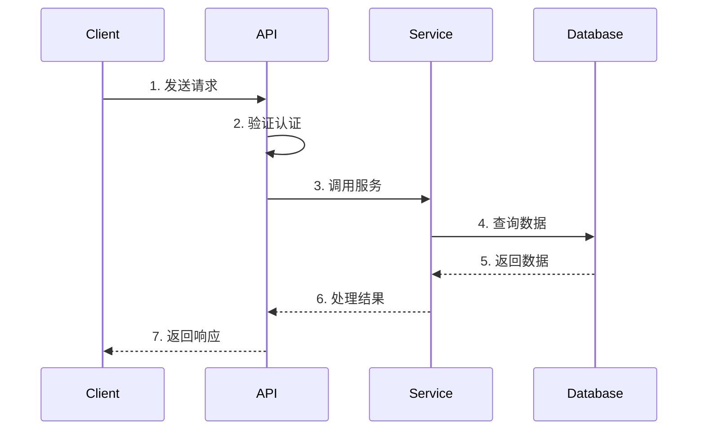

# [模块名称] API 接口文档

**版本**: 1.0.0  
**最后更新**: YYYY-MM-DD  
**基础路径**: `/api/[module]`

---

## 📋 目录

- [概述](#概述)
- [认证方式](#认证方式)
- [业务场景](#业务场景)
- [接口列表](#接口列表)
- [错误处理](#错误处理)
- [使用示例](#使用示例)
- [调用流程](#调用流程)
- [限流和配额](#限流和配额)
- [版本历史](#版本历史)

---

## 📖 概述

### 模块说明

[简要说明该模块的功能和用途]

### 核心能力

- ✅ [能力1]
- ✅ [能力2]
- ✅ [能力3]

### 适用场景

- 🎯 [场景1]: [说明]
- 🎯 [场景2]: [说明]
- 🎯 [场景3]: [说明]

---

## 🔐 认证方式

### 认证类型

[说明认证方式：JWT Bearer Token / OAuth 2.0 / API Key / 公开接口]

### 获取 Token

```bash
# 示例：获取 JWT Token
curl -X POST "https://api.example.com/api/auth/login" \
  -H "Content-Type: application/json" \
  -d '{
    "email": "user@example.com",
    "password": "password"
  }'
```

### 使用 Token

```bash
# 在请求头中添加 Authorization
curl -X GET "https://api.example.com/api/[module]/endpoint" \
  -H "Authorization: Bearer {token}"
```

---

## 🎯 业务场景

### 场景1: [场景名称]

**用户故事**: 作为[用户角色]，我希望[功能]，以便[价值]

**流程**:
1. [步骤1]
2. [步骤2]
3. [步骤3]

**涉及的接口**:
- `POST /api/[module]/action1` - [说明]
- `GET /api/[module]/result/:id` - [说明]

### 场景2: [场景名称]

[类似格式]

---

## 📡 接口列表

### 1. [接口名称]

**端点**: `[METHOD] /api/[module]/[endpoint]`

**说明**: [接口功能说明]

**认证**: [需要/不需要] 认证

#### 请求参数

**路径参数**:

| 参数 | 类型 | 必填 | 说明 |
|------|------|------|------|
| `id` | string | 是 | [说明] |

**查询参数**:

| 参数 | 类型 | 必填 | 说明 | 默认值 |
|------|------|------|------|--------|
| `page` | number | 否 | 页码 | 1 |
| `limit` | number | 否 | 每页数量 | 20 |

**请求体** (POST/PUT):

```json
{
  "field1": "value1",
  "field2": "value2"
}
```

| 字段 | 类型 | 必填 | 说明 |
|------|------|------|------|
| `field1` | string | 是 | [说明] |
| `field2` | number | 否 | [说明] |

#### 响应

**成功响应** (200):

```json
{
  "success": true,
  "data": {
    "id": "123",
    "field1": "value1",
    "field2": "value2"
  }
}
```

**错误响应** (400):

```json
{
  "success": false,
  "error": {
    "code": "INVALID_PARAMETER",
    "message": "参数验证失败",
    "details": {
      "field1": "字段不能为空"
    }
  }
}
```

#### 示例请求

```bash
curl -X GET "https://api.example.com/api/[module]/endpoint?id=123&page=1&limit=20" \
  -H "Authorization: Bearer {token}"
```

#### 示例响应

```json
{
  "success": true,
  "data": {
    "id": "123",
    "field1": "value1"
  }
}
```

---

### 2. [下一个接口]

[类似格式]

---

## ⚠️ 错误处理

### 错误响应格式

所有错误响应都遵循以下格式：

```json
{
  "success": false,
  "error": {
    "code": "ERROR_CODE",
    "message": "错误描述",
    "details": {}
  }
}
```

### 错误码列表

| 错误码 | HTTP 状态码 | 说明 | 解决方案 |
|--------|------------|------|---------|
| `INVALID_PARAMETER` | 400 | 参数验证失败 | 检查请求参数 |
| `UNAUTHORIZED` | 401 | 未认证 | 提供有效的 Token |
| `FORBIDDEN` | 403 | 无权限 | 联系管理员 |
| `NOT_FOUND` | 404 | 资源不存在 | 检查资源 ID |
| `RATE_LIMIT_EXCEEDED` | 429 | 请求过于频繁 | 降低请求频率 |
| `INTERNAL_ERROR` | 500 | 服务器内部错误 | 稍后重试或联系支持 |

### 错误处理最佳实践

1. **重试策略**: 
   - 5xx 错误：指数退避重试（最多3次）
   - 4xx 错误：不重试，检查请求参数

2. **降级策略**:
   - 服务不可用时，返回缓存数据或默认值
   - 提供友好的错误提示

---

## 💡 使用示例

### JavaScript/TypeScript

```typescript
// 示例：调用接口
async function callAPI() {
  try {
    const response = await fetch('https://api.example.com/api/[module]/endpoint', {
      method: 'GET',
      headers: {
        'Authorization': `Bearer ${token}`,
        'Content-Type': 'application/json',
      },
    });

    if (!response.ok) {
      const error = await response.json();
      throw new Error(error.error.message);
    }

    const data = await response.json();
    return data.data;
  } catch (error) {
    console.error('API调用失败:', error);
    throw error;
  }
}
```

### Python

```python
import requests

def call_api():
    headers = {
        'Authorization': f'Bearer {token}',
        'Content-Type': 'application/json',
    }
    
    response = requests.get(
        'https://api.example.com/api/[module]/endpoint',
        headers=headers
    )
    
    if response.status_code != 200:
        error = response.json()
        raise Exception(error['error']['message'])
    
    return response.json()['data']
```

### cURL

```bash
# GET 请求
curl -X GET "https://api.example.com/api/[module]/endpoint" \
  -H "Authorization: Bearer {token}"

# POST 请求
curl -X POST "https://api.example.com/api/[module]/endpoint" \
  -H "Authorization: Bearer {token}" \
  -H "Content-Type: application/json" \
  -d '{
    "field1": "value1",
    "field2": "value2"
  }'
```

---

## 🔄 调用流程

### 流程图



### 步骤说明

1. **客户端发送请求**: 包含认证信息和请求参数
2. **API 验证认证**: 检查 Token 有效性
3. **调用服务**: 执行业务逻辑
4. **查询数据**: 从数据库获取数据
5. **返回数据**: 数据返回给服务层
6. **处理结果**: 格式化响应数据
7. **返回响应**: 返回给客户端

---

## 🚦 限流和配额

### 限流规则

| 接口 | 限流规则 | 说明 |
|------|---------|------|
| `GET /api/[module]/list` | 100次/分钟 | 列表查询接口 |
| `POST /api/[module]/create` | 50次/分钟 | 创建接口 |
| `PUT /api/[module]/update` | 50次/分钟 | 更新接口 |

### 配额说明

- **免费用户**: [配额说明]
- **付费用户**: [配额说明]
- **企业用户**: [配额说明]

### 配额查询

```bash
# 查询当前配额使用情况
curl -X GET "https://api.example.com/api/quota/usage" \
  -H "Authorization: Bearer {token}"
```

### 配额超限处理

当配额超限时，API 会返回 `429 Too Many Requests` 错误：

```json
{
  "success": false,
  "error": {
    "code": "RATE_LIMIT_EXCEEDED",
    "message": "请求过于频繁，请稍后重试",
    "retryAfter": 60
  }
}
```

---

## 📚 版本历史

### v1.0.0 (YYYY-MM-DD)

- ✅ 初始版本
- ✅ 实现核心功能

### v1.1.0 (YYYY-MM-DD)

- ✅ 新增功能1
- ✅ 优化功能2
- ⚠️ 废弃功能3（将在 v2.0.0 移除）

### 版本迁移指南

**从 v1.0.0 升级到 v1.1.0**:

1. [迁移步骤1]
2. [迁移步骤2]
3. [迁移步骤3]

---

## 📞 支持

**技术支持**: [邮箱/联系方式]  
**文档反馈**: [GitHub Issues/邮箱]  
**API 状态**: [状态页面链接]

---

## 🔗 相关文档

- [认证文档](../auth/AUTH_API.md)
- [错误码定义](../API_ERROR_CODES.md)
- [版本管理规范](../API_VERSIONING.md)
