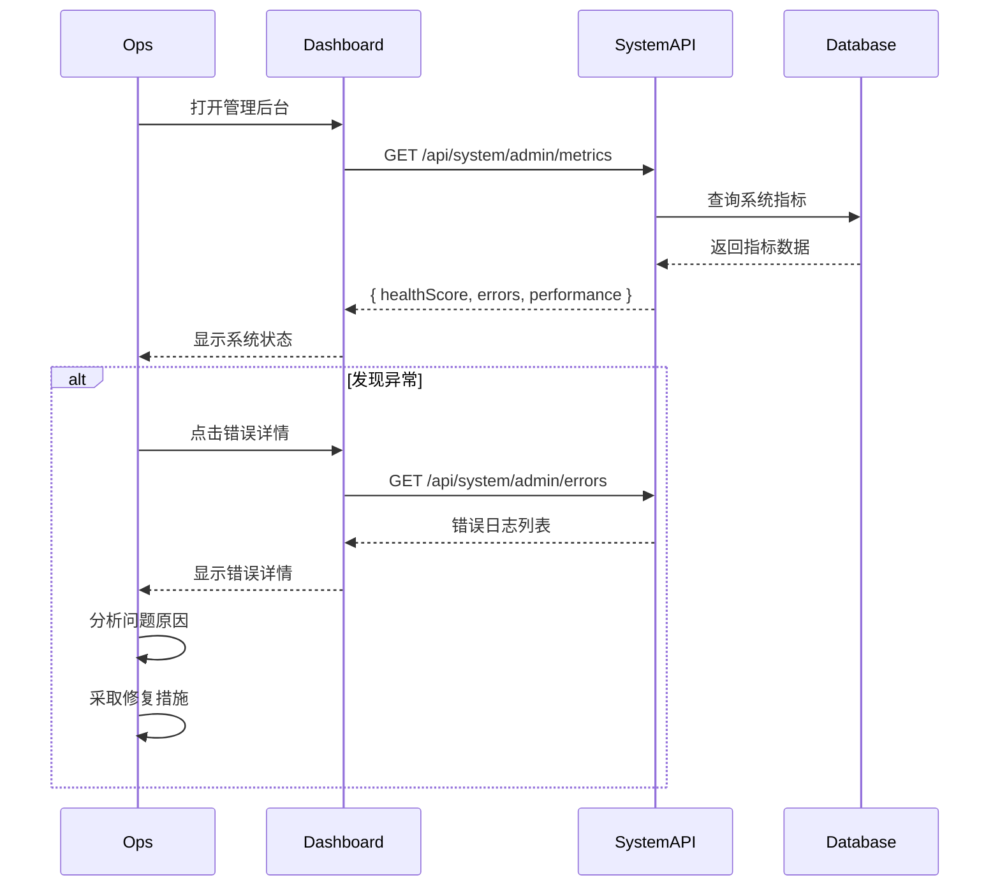
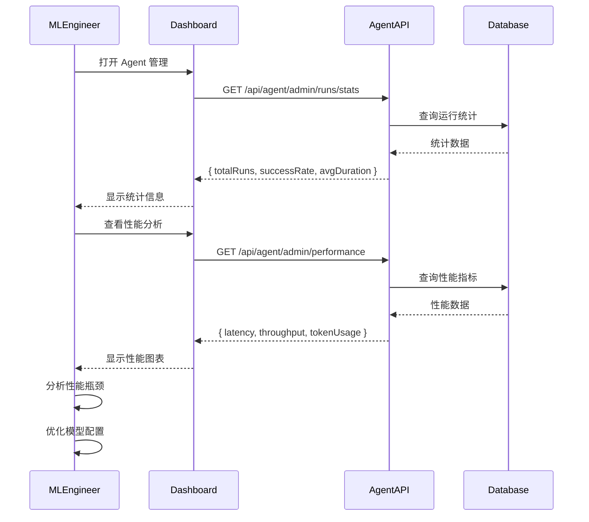
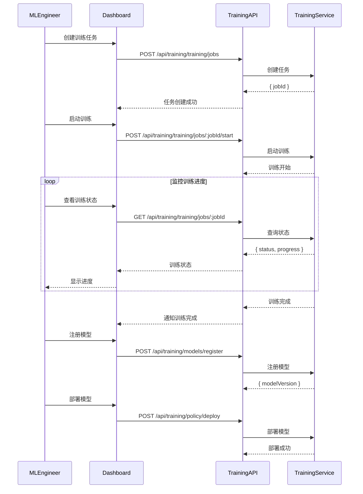
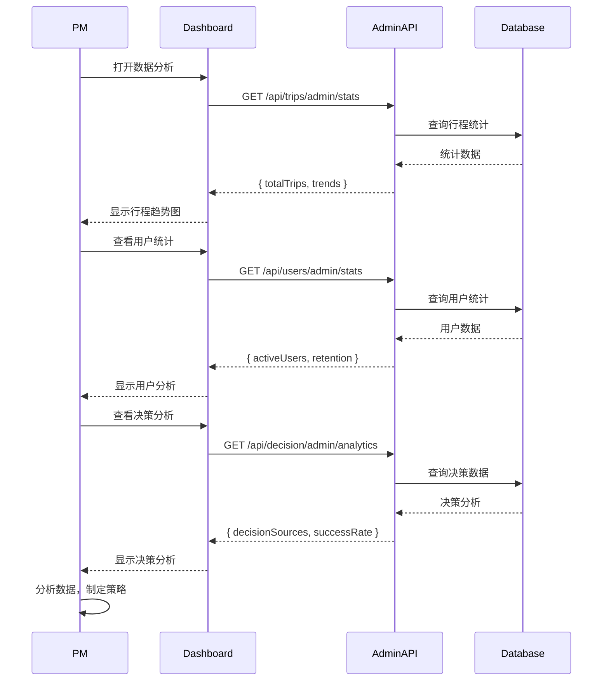
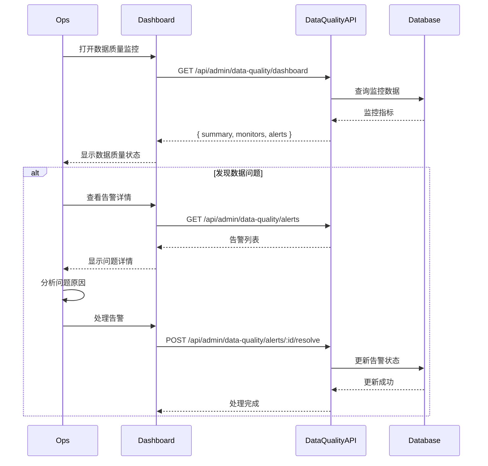
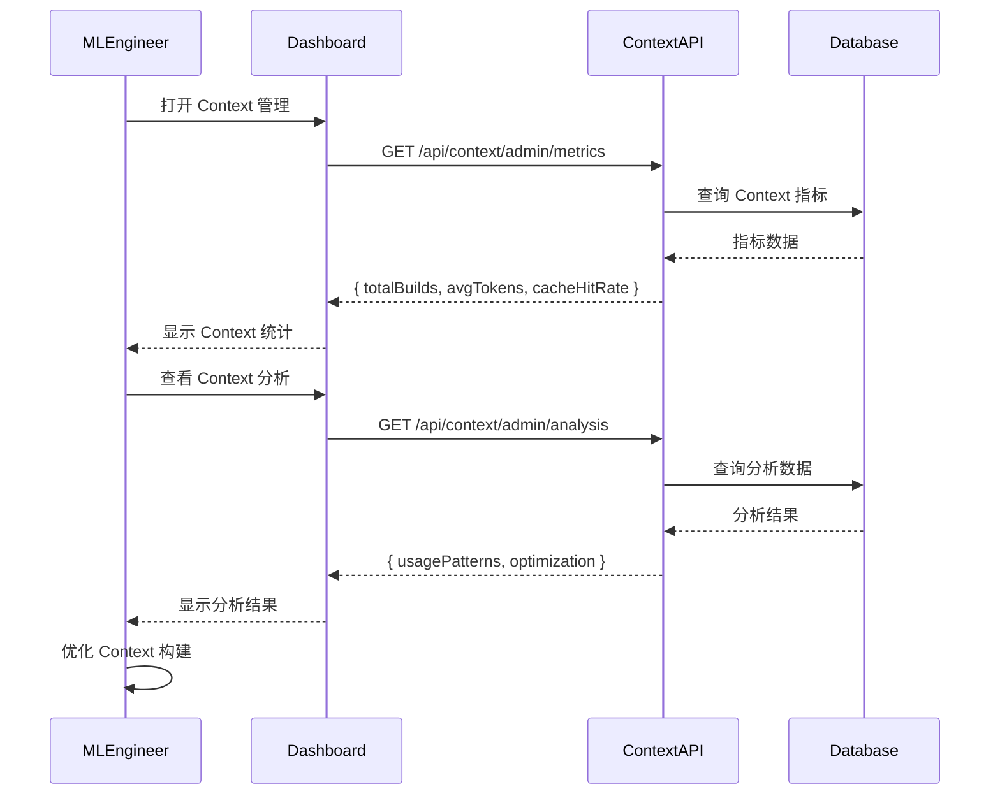
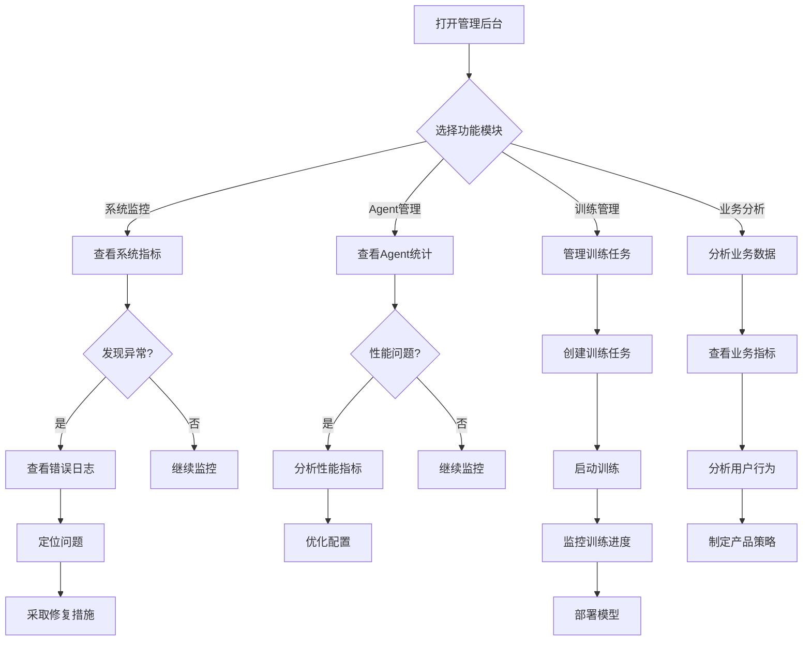

# 管理后台 API 业务场景文档

**版本**: 1.0.0  
**最后更新**: 2026-02-08  
**基础路径**: `/api/admin`, `/api/agent/admin`, `/api/training`, etc.

---

## 📋 目录

- [概述](#概述)
- [用户角色](#用户角色)
- [业务场景](#业务场景)
- [接口分类](#接口分类)
- [使用流程](#使用流程)

---

## 📖 概述

### 模块说明

管理后台 API 为运维人员、ML 工程师和产品经理提供系统管理、监控和分析能力。主要用于：

- **系统监控**: 监控系统健康状态、性能指标
- **问题排查**: 分析错误日志、追踪问题
- **数据管理**: 管理训练数据、模型版本
- **业务分析**: 分析用户行为、业务指标

### 核心能力

- ✅ **系统监控**: 实时监控系统状态和性能
- ✅ **问题诊断**: 快速定位和解决问题
- ✅ **数据分析**: 深入分析业务数据和用户行为
- ✅ **配置管理**: 动态调整系统配置
- ✅ **训练管理**: 管理 RL 训练流程和模型

---

## 👥 用户角色

### 1. 运维人员（Ops）

**职责**:
- 监控系统健康状态
- 处理系统告警
- 排查和解决系统问题
- 管理系统配置

**常用接口**:
- `/api/system/admin/*` - 系统监控
- `/api/agent/admin/*` - Agent 监控
- `/api/admin/data-quality/*` - 数据质量监控

---

### 2. ML 工程师（ML Engineer）

**职责**:
- 管理训练数据和模型
- 监控训练进度和性能
- 分析模型效果
- 优化模型性能

**常用接口**:
- `/api/training/*` - 训练管理
- `/api/agent/admin/performance` - 性能分析
- `/api/context/admin/*` - Context 分析

---

### 3. 产品经理（Product Manager）

**职责**:
- 分析业务指标
- 了解用户行为
- 优化产品功能
- 制定产品策略

**常用接口**:
- `/api/trips/admin/stats` - 行程统计
- `/api/users/admin/stats` - 用户统计
- `/api/decision/admin/analytics` - 决策分析

---

## 🎯 业务场景

### 场景1: 系统健康监控（运维人员）

**用户故事**: 作为运维人员，我希望实时监控系统健康状态，及时发现和处理问题。

**用户旅程**:
1. 打开管理后台首页
2. 查看系统健康度指标
3. 发现异常告警
4. 查看详细错误日志
5. 定位问题原因
6. 采取修复措施

**涉及的接口**:
- `GET /api/system/admin/metrics` - 获取系统指标
- `GET /api/system/admin/errors` - 获取错误日志
- `GET /api/system/admin/performance` - 获取性能指标
- `GET /api/admin/data-quality/dashboard` - 数据质量监控

**流程图**:

---

### 场景2: Agent 性能分析（ML 工程师）

**用户故事**: 作为 ML 工程师，我希望分析 Agent 的性能指标，优化模型效果。

**用户旅程**:
1. 打开 Agent 管理页面
2. 查看 Agent 运行统计
3. 分析性能指标（延迟、吞吐量、Token 使用）
4. 识别性能瓶颈
5. 优化模型配置
6. 验证优化效果

**涉及的接口**:
- `GET /api/agent/admin/runs/stats` - 运行统计
- `GET /api/agent/admin/performance` - 性能分析
- `GET /api/agent/admin/runs` - 运行列表
- `GET /api/agent/admin/runs/:runId` - 运行详情

**流程图**:

---

### 场景3: 训练任务管理（ML 工程师）

**用户故事**: 作为 ML 工程师，我希望管理训练任务，监控训练进度，部署新模型。

**用户旅程**:
1. 创建训练任务
2. 启动训练
3. 监控训练进度
4. 查看训练结果
5. 注册新模型
6. 部署模型到生产环境

**涉及的接口**:
- `POST /api/training/training/jobs` - 创建训练任务
- `POST /api/training/training/jobs/:jobId/start` - 启动训练
- `GET /api/training/training/jobs/:jobId` - 获取任务状态
- `POST /api/training/models/register` - 注册模型
- `POST /api/training/policy/deploy` - 部署模型

**流程图**:

---

### 场景4: 业务数据分析（产品经理）

**用户故事**: 作为产品经理，我希望分析业务数据，了解用户行为和产品表现。

**用户旅程**:
1. 打开数据分析页面
2. 查看核心业务指标
3. 分析用户行为趋势
4. 查看决策分析数据
5. 导出分析报告
6. 制定产品策略

**涉及的接口**:
- `GET /api/trips/admin/stats` - 行程统计
- `GET /api/users/admin/stats` - 用户统计
- `GET /api/decision/admin/analytics` - 决策分析
- `GET /api/agent/admin/runs/stats` - Agent 运行统计

**流程图**:

---

### 场景5: 数据质量监控（运维人员）

**用户故事**: 作为运维人员，我希望监控数据质量，及时发现和处理数据问题。

**用户旅程**:
1. 打开数据质量监控页面
2. 查看数据质量仪表板
3. 发现数据质量问题告警
4. 查看问题详情
5. 处理数据问题
6. 验证修复效果

**涉及的接口**:
- `GET /api/admin/data-quality/dashboard` - 数据质量仪表板
- `GET /api/admin/data-quality/monitors` - 监控列表
- `GET /api/admin/data-quality/alerts` - 告警列表
- `POST /api/admin/data-quality/alerts/:id/resolve` - 处理告警

**流程图**:

---

### 场景6: Context 引擎分析（ML 工程师）

**用户故事**: 作为 ML 工程师，我希望分析 Context 引擎的使用情况，优化 Context 构建效率。

**用户旅程**:
1. 打开 Context 管理页面
2. 查看 Context 指标统计
3. 分析 Context 使用模式
4. 识别优化机会
5. 优化 Context 构建策略
6. 验证优化效果

**涉及的接口**:
- `GET /api/context/admin/metrics` - Context 指标
- `GET /api/context/admin/packages` - Context Package 列表
- `GET /api/context/admin/analysis` - Context 分析

**流程图**:

---

## 📡 接口分类

### 1. 系统监控接口

**用途**: 监控系统健康状态和性能

| 接口 | 说明 | 使用角色 |
|------|------|---------|
| `GET /api/system/admin/metrics` | 系统指标 | 运维人员 |
| `GET /api/system/admin/performance` | 性能指标 | 运维人员 |
| `GET /api/system/admin/errors` | 错误日志 | 运维人员 |
| `GET /api/system/admin/requests` | 请求日志 | 运维人员 |

---

### 2. Agent 管理接口

**用途**: 监控和管理 Agent 运行

| 接口 | 说明 | 使用角色 |
|------|------|---------|
| `GET /api/agent/admin/runs/stats` | 运行统计 | ML 工程师、产品经理 |
| `GET /api/agent/admin/performance` | 性能分析 | ML 工程师 |
| `GET /api/agent/admin/runs` | 运行列表 | ML 工程师 |
| `GET /api/agent/admin/runs/:runId` | 运行详情 | ML 工程师 |

---

### 3. 训练管理接口

**用途**: 管理 RL 训练流程和模型

| 接口 | 说明 | 使用角色 |
|------|------|---------|
| `POST /api/training/training/jobs` | 创建训练任务 | ML 工程师 |
| `POST /api/training/training/jobs/:jobId/start` | 启动训练 | ML 工程师 |
| `GET /api/training/training/jobs/:jobId` | 任务状态 | ML 工程师 |
| `POST /api/training/models/register` | 注册模型 | ML 工程师 |
| `POST /api/training/policy/deploy` | 部署模型 | ML 工程师 |

---

### 4. 业务分析接口

**用途**: 分析业务数据和用户行为

| 接口 | 说明 | 使用角色 |
|------|------|---------|
| `GET /api/trips/admin/stats` | 行程统计 | 产品经理 |
| `GET /api/users/admin/stats` | 用户统计 | 产品经理 |
| `GET /api/decision/admin/analytics` | 决策分析 | 产品经理 |

---

### 5. 数据质量接口

**用途**: 监控和管理数据质量

| 接口 | 说明 | 使用角色 |
|------|------|---------|
| `GET /api/admin/data-quality/dashboard` | 数据质量仪表板 | 运维人员 |
| `GET /api/admin/data-quality/monitors` | 监控列表 | 运维人员 |
| `GET /api/admin/data-quality/alerts` | 告警列表 | 运维人员 |

---

### 6. Context 管理接口

**用途**: 管理 Context 引擎

| 接口 | 说明 | 使用角色 |
|------|------|---------|
| `GET /api/context/admin/metrics` | Context 指标 | ML 工程师 |
| `GET /api/context/admin/packages` | Package 列表 | ML 工程师 |
| `GET /api/context/admin/analysis` | Context 分析 | ML 工程师 |

---

## 🔄 使用流程

### 典型工作流程

---

## 🔗 相关文档

- [管理后台 API 文档](../.claude/roles/rl-infra/ADMIN_API_DOCUMENTATION.md)
- [API 文档模板](../API_DOCUMENTATION_TEMPLATE.md)
- [API 错误码定义](../API_ERROR_CODES.md)
- [产品经理接口梳理](../API_PRODUCT_MANAGER_REVIEW.md)

---

## 📝 更新日志

### v1.0.0 (2026-02-08)

- ✅ 初始版本
- ✅ 定义 6 个核心业务场景
- ✅ 添加用户角色说明
- ✅ 添加接口分类和使用流程

---

**文档维护**: 产品经理团队  
**技术支持**: 后端开发团队  
**最后更新**: 2026-02-08
