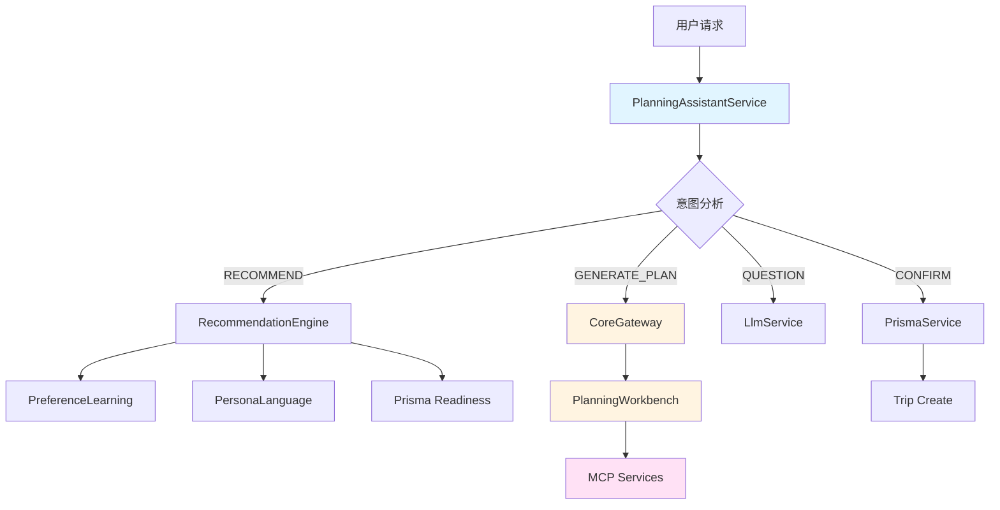

# 规划助手智能体使用的接口

**文档版本**: 1.0  
**更新日期**: 2026-02-08  
**架构版本**: V2.1

---

## 📋 概述

本文档列出规划助手智能体（Planning Assistant）在运行过程中调用的所有接口和服务。

---

## 🏗️ 架构层次

规划助手智能体采用 V2.1 架构，分为以下层次：

```
规划助手智能体 (PlanningAssistantService)
  ↓
Infra 层服务 (CoreGateway, LLMExecutor)
  ↓
核心服务 (PlanningWorkbench, PersonaShell)
  ↓
MCP 服务 / 数据库 / 外部 API
```

---

## 🔌 内部服务接口

### 1. CoreGatewayService（核心网关）

**用途**: 触发核心动作的统一入口

**主要方法**:

| 方法 | 说明 | 调用场景 |
|------|------|---------|
| `generatePlan(params)` | 生成旅行方案 | 用户选择目的地后，生成多个方案候选 |
| `comparePlans(params)` | 对比方案 | 用户需要对比多个方案时 |
| `execute(action)` | 执行核心动作 | 通用动作执行入口 |

**调用位置**:
- `handleGeneratePlanWithWorkbench()` - 方案生成
- `handleCompare()` - 方案对比

**代码示例**:
```typescript
const coreResult = await this.coreGateway.generatePlan({
  userId: request.userId || 'anonymous',
  sessionId: state.sessionId,
  destination: state.selectedDestination,
  preferences: { budget, travelers, dateRange, activities },
  constraints: { days, startDate, endDate },
});
```

---

### 2. PlanningWorkbenchAgentService（规划工作台）

**用途**: 规划工作台核心服务（降级方案）

**主要方法**:

| 方法 | 说明 | 调用场景 |
|------|------|---------|
| `execute(request)` | 执行规划操作 | CoreGateway 不可用时的降级方案 |
| `comparePlans(planIds)` | 对比方案 | 方案对比功能 |

**调用位置**:
- `handleGeneratePlanWithWorkbench()` - 降级调用
- `handleCompare()` - 方案对比

**代码示例**:
```typescript
const workbenchResponse = await this.planningWorkbench.execute({
  context: {
    destination: { country, city },
    days,
    constraints: { time, budget, companions },
  },
  userAction: 'generate',
});
```

---

### 3. LlmService（LLM 服务）

**用途**: 大语言模型调用

**主要方法**:

| 方法 | 说明 | 调用场景 |
|------|------|---------|
| `callLlmWithSchema(provider, prompt)` | 调用 LLM（结构化输出） | 意图分析、问答、通用对话 |

**调用位置**:
- `analyzeIntentWithLLM()` - 意图分析
- `handleQuestionWithLLM()` - 用户问答
- `handleGeneralWithLLM()` - 通用对话

**代码示例**:
```typescript
const result = await this.llmService.callLlmWithSchema(
  LlmProvider.DEEPSEEK,
  prompt
);
```

---

### 4. RecommendationEngineService（推荐引擎）

**用途**: 目的地推荐

**主要方法**:

| 方法 | 说明 | 调用场景 |
|------|------|---------|
| `getRecommendations(params)` | 获取目的地推荐 | 用户请求推荐时 |

**调用位置**:
- `handleRecommendWithReadiness()` - 推荐处理

**代码示例**:
```typescript
const scoredDestinations = await this.recommendationEngine.getRecommendations({
  preferences: mergedPreferences,
  countryCode: request.countryCode,
  limit: 10,
});
```

---

### 5. PreferenceLearningService（偏好学习）

**用途**: 用户偏好学习和合并

**主要方法**:

| 方法 | 说明 | 调用场景 |
|------|------|---------|
| `mergeWithLearnedPreferences(userId, preferences)` | 合并学习到的偏好 | 推荐前合并用户历史偏好 |
| `learnFromAction(params)` | 学习用户行为 | 用户选择目的地、生成方案、确认行程后 |

**调用位置**:
- `handleRecommendWithReadiness()` - 合并偏好
- `handleExplore()` - 学习目的地选择
- `handleGeneratePlanWithWorkbench()` - 学习方案生成
- `handleConfirmAndSaveTrip()` - 学习确认偏好

**代码示例**:
```typescript
mergedPreferences = await this.preferenceLearning.mergeWithLearnedPreferences(
  request.userId!,
  state.preferences
);

await this.preferenceLearning.learnFromAction({
  userId: request.userId,
  action: 'destination_selected',
  data: { destination: state.selectedDestination },
});
```

---

### 6. PersonaLanguageService（人格化语言）

**用途**: 生成人格化的回复和评价

**主要方法**:

| 方法 | 说明 | 调用场景 |
|------|------|---------|
| `generateAllPersonaStatements(context)` | 生成三人格评价 | 推荐、方案生成、确认后 |

**调用位置**:
- `handleRecommendWithReadiness()` - 推荐评价
- `handleGeneratePlanWithWorkbench()` - 方案评价
- `handleConfirmAndSaveTrip()` - 确认祝福

**代码示例**:
```typescript
const statements = await this.personaLanguage.generateAllPersonaStatements({
  type: 'recommendation',
  destinations: recommendations,
  preferences: state.preferences,
});
```

---

### 7. PersonaShellService（人格外壳）

**用途**: 三人格评估（降级方案）

**主要方法**:

| 方法 | 说明 | 调用场景 |
|------|------|---------|
| `wrapAsPersonas(planState)` | 包装为三人格评价 | PersonaLanguage 不可用时的降级 |

**调用位置**:
- `handleGeneratePlanWithWorkbench()` - 降级调用

---

### 8. PrismaService（数据库服务）

**用途**: 数据库操作

**主要方法**:

| 方法 | 说明 | 调用场景 |
|------|------|---------|
| `readinessPack.findMany()` | 查询 Readiness 数据 | 推荐引擎失败时的降级数据源 |
| `trip.create()` | 创建行程 | 用户确认方案后保存行程 |

**调用位置**:
- `handleRecommendWithReadiness()` - 查询 Readiness 数据
- `handleConfirmAndSaveTrip()` - 保存行程

**代码示例**:
```typescript
// 查询 Readiness 数据
const packs = await this.prisma.readinessPack.findMany({
  where: request.countryCode ? { countryCode: request.countryCode } : {},
  take: 10,
});

// 创建行程
const trip = await this.prisma.trip.create({
  data: {
    userId: state.userId || 'anonymous',
    title: selectedPlan.nameCN,
    startDate: new Date(startDate),
    endDate: new Date(endDate),
  },
});
```

---

## 🌐 MCP 服务接口（间接调用）

规划助手智能体通过 **CoreGateway** 和 **PlanningWorkbench** 间接调用 MCP 服务。

### MCP 服务列表

| MCP 服务 | 用途 | 调用场景 |
|---------|------|---------|
| **Exa MCP** | Web 搜索、目的地研究 | 方案生成时搜索目的地信息 |
| **Google Maps Direct** | 地点搜索、地理编码、路线规划 | 规划路线、计算距离 |
| **Hotel Direct API** | 酒店搜索、推荐 | 生成住宿方案 |
| **Restaurant Direct API** | 餐厅搜索、推荐、预订 | 生成餐饮方案 |
| **Weather Direct API** | 天气查询 | 规划时考虑天气因素 |
| **Vision Service + OCR** | 图片识别地点、OCR 提取文字 | 用户上传图片时识别 |
| **Translation Direct API** | 翻译服务、图片翻译 | 多语言支持 |
| **Google Calendar MCP** | 日历同步、提醒 | 同步行程到日历 |
| **Stripe Direct API** | 支付处理 | 预订支付 |
| **Airbnb MCP** | 民宿搜索 | 住宿方案生成 |
| **Amadeus MCP** | 航班搜索、改签 | 交通方案生成 |
| **Rail MCP** | 铁路查询、改签 | 交通方案生成 |
| **Image Direct API** | 目的地图片 | 推荐展示图片 |
| **PostgreSQL MCP** | 用户数据查询 | 查询用户历史数据 |
| **Currency Direct API** | 货币转换 | 预算计算 |

**调用路径**:
```
规划助手 → CoreGateway → PlanningWorkbench → Skills → MCP 服务
```

---

## 📊 接口调用流程图



---

## 🔄 接口调用顺序示例

### 场景1: 用户请求推荐目的地

```
1. PlanningAssistantService.chat()
   ↓
2. analyzeIntentWithLLM() → LlmService.callLlmWithSchema()
   ↓
3. handleRecommendWithReadiness()
   ↓
4. PreferenceLearningService.mergeWithLearnedPreferences()
   ↓
5. RecommendationEngineService.getRecommendations()
   ↓ (如果失败)
6. PrismaService.readinessPack.findMany()
   ↓
7. PersonaLanguageService.generateAllPersonaStatements()
   ↓
8. 返回推荐结果
```

### 场景2: 用户选择目的地，生成方案

```
1. PlanningAssistantService.chat()
   ↓
2. analyzeIntentWithLLM() → LlmService.callLlmWithSchema()
   ↓
3. handleGeneratePlanWithWorkbench()
   ↓
4. CoreGatewayService.generatePlan()
   ↓
5. PlanningWorkbenchAgentService.execute()
   ↓
6. Skills → MCP Services (Google Maps, Hotel API, etc.)
   ↓
7. PersonaShellService.wrapAsPersonas() 或 PersonaLanguageService
   ↓
8. PreferenceLearningService.learnFromAction()
   ↓
9. 返回方案候选
```

### 场景3: 用户确认方案

```
1. PlanningAssistantService.chat()
   ↓
2. analyzeIntentWithLLM() → LlmService.callLlmWithSchema()
   ↓
3. handleConfirmAndSaveTrip()
   ↓
4. PrismaService.trip.create()
   ↓
5. PreferenceLearningService.learnFromAction()
   ↓
6. PersonaLanguageService.generateAllPersonaStatements()
   ↓
7. 返回确认结果
```

---

## ⚠️ 降级策略

规划助手智能体实现了多层降级策略：

| 服务 | 主方案 | 降级方案1 | 降级方案2 |
|------|--------|----------|----------|
| **方案生成** | CoreGateway | PlanningWorkbench | 默认方案 |
| **推荐** | RecommendationEngine | Prisma Readiness | 默认推荐 |
| **LLM 调用** | LlmService | 关键词分析 | 默认回复 |
| **人格评价** | PersonaLanguage | PersonaShell | 无评价 |
| **偏好学习** | PreferenceLearning | 跳过学习 | - |

---

## 📝 接口依赖关系

```
PlanningAssistantService
├── CoreGatewayService (优先)
│   └── PlanningWorkbenchAgentService
│       └── Skills → MCP Services
├── PlanningWorkbenchAgentService (降级)
│   └── Skills → MCP Services
├── LlmService
│   └── DeepSeek API
├── RecommendationEngineService
│   └── 推荐算法
├── PreferenceLearningService
│   └── PrismaService (用户偏好表)
├── PersonaLanguageService
│   └── LlmService
├── PersonaShellService
│   └── PlanningWorkbench
└── PrismaService
    ├── readinessPack (Readiness 数据)
    └── trip (行程数据)
```

---

## 🔍 接口调用统计

根据代码分析，规划助手智能体主要调用：

| 接口类型 | 数量 | 说明 |
|---------|------|------|
| **内部服务接口** | 8 | CoreGateway, PlanningWorkbench, LLM, 推荐引擎等 |
| **数据库接口** | 2 | Readiness 查询、Trip 创建 |
| **MCP 服务接口** | 15+ | 通过 CoreGateway/PlanningWorkbench 间接调用 |
| **总计** | 25+ | 包含直接和间接调用 |

---

## 📚 相关文档

- [规划助手 API 文档](./API_DOCUMENTATION_V2.md)
- [MCP 能力配置](../AGENT_MCP_CAPABILITIES.md)
- [规划助手统一说明](../PLANNING_ASSISTANT_UNIFICATION_SUMMARY.md)
- [CoreGateway 服务](../../infra/core-gateway.service.ts)
- [PlanningWorkbench API](../../PLANNING_WORKBENCH_API.md)

---

**文档维护**: 后端开发团队  
**最后更新**: 2026-02-08
