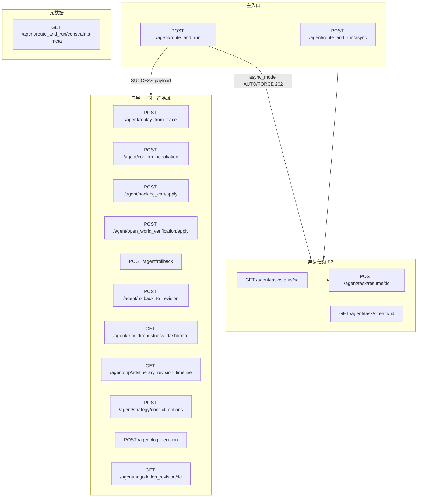

# TripNARA 智能体统一接口 — 能力范围与集成总览

> **主入口**：`POST /api/agent/route_and_run`  
> **路由协议 SSOT**：[ROUTE_AND_RUN_ROUTING_PROTOCOL.md](../routing/ROUTE_AND_RUN_ROUTING_PROTOCOL.md) · Golden Eval 28 条  
> **成功产物 Schema**：[ROUTE_AND_RUN_SUCCESS_ARTIFACTS_SCHEMA.md](../routing/ROUTE_AND_RUN_SUCCESS_ARTIFACTS_SCHEMA.md)  
> **前缀**：生产环境通常为 `/api/agent/*`（本文写相对路径 `/agent/*`）  
> **原则**：一次请求走完「路由 → 编排 → 门控 → 交付」；**正文读 narration，交互读结构化契约**（`ui_display` / `flawed_draft_v1` / `actionExecution`）。

---

## 1. 这件事管什么、不管什么

### 1.1 在范围内（统一入口及其卫星）

| 域 | 说明 |
|----|------|
| **意图与路由** | System 1（API/RAG） vs System 2（ReAct + 工具）；`routePolicy` 选 `CLAUDE_SM / CLAUDE_DYNAMIC / LEGACY` |
| **行程规划主链** | INTAKE → RESEARCH → GATE → PLAN → VERIFY ⇄ REPAIR → NARRATE |
| **三人格门控** | Abu / Dr.Dre / Neptune → `gate_result` · `explain.guardian_personas` |
| **SUCCESS 交付** | `result.payload.ui_display.*`（行程、地图、预订、语音等） |
| **未完全收敛** | 默认澄清终端；opt-in `allow_flawed_draft_narrate` → `flawed_draft_v1` Banner |
| **长耗时** | 同步 / `async_mode` 委托 / 显式 `route_and_run/async` + SSE + Worker Lease |
| **行程写操作卫星** | 协商确认、回滚、replay、修订时间轴、鲁棒性 Dashboard |
| **预订 checkout** | `booking_cart/apply`（状态机，不回写主链） |
| **开放世界核实** | `open_world_verification/apply`（稀疏区 provisional POI 核实，不回写主链） — [FRONTEND_OPEN_WORLD_DELIVERY.md](./FRONTEND_OPEN_WORLD_DELIVERY.md) |

### 1.2 不在范围内（平行管道，勿与主入口混为一谈）

| 管道 | 路径 | 关系 |
|------|------|------|
| **Consumer Exploration** | `/exploration/*` | C 端探索规划：Scenario → Trip 物化 → 原则 → 路线 variant → Unified ReadModel 问题投影；**复用** Plan 子服务与 Decision Gateway，**不**走 `route_and_run` 自然语言入口 — PRD [exploration V1.1](../../internal-docs/exploration/prd-exploration-reliability-closure-v1.1.md) |
| **Guide-to-Plan** | `/guide-to-plan/*` | 攻略导入 → 解析 → 草案对比 → 接受落地；与 Exploration **入口不同**，可靠性阶段可共用 Canonical Runtime |
| Planning Assistant v1/v2 | `/agent/planning-assistant/*` | 对话式助手；**未**并入 `route_and_run` 编排链 |
| Planning Workbench | `/planning-workbench/*` | MAC / 策略冲突写入端；冲突选项经 `strategy/conflict_options` 读回 |
| Action Execution | `/agent/actions/*` | Preview / Commit / Rollback；**需 Bearer**，生产非 Public |
| 外部供应商支付 | booking deep links | TripNara 采样报价 + 跳转，不代扣款 |

---

## 2. 帮用户能做什么事（用户视角）

用户只需发 **`message`**（可带 `trip_id` / 约束 / 对话上下文）；系统按意图自动选 **快答** 或 **深编排**，并在 SUCCESS 时附带可点 UI。

### 2.1 规划与改稿（核心）

| 用户想做的事 | 典型说法 | 系统行为 | 用户得到什么 |
|--------------|----------|----------|--------------|
| **从零规划** | 「规划 5 天冰岛南岸」「帮我排东京行程」 | 全链 INTAKE→…→NARRATE | 多日时间轴 + narration + 地图/证据 |
| **局部改稿** | 「第三天太赶，松一点」「把蓝湖挪到第二天」 | `ITINERARY_ADJUST` + VERIFY/REPAIR | 更新后的 timeline + 变更说明 |
| **指定哪天放什么** | 「黄金圈放在第几天？」 | 先澄清选日，再落槽 | 澄清卡 → 确认后写入行程 |
| **整单重排** | 「全部推翻重来」「按新日期重规划」 | 全量 `GENERAL_PLAN` | 新草案 + 可选协商 |
| **条件分支** | 「如果赶不上日落就去横滨」 | System 2 + 门控 | 主方案 + 备选/双轨（晴雨轨） |
| **专项场景** | 旺季避峰、F 路 2WD 合规、马拉松 deferred 等 | SKU 短路或专项 Gate | 针对性建议 + 硬约束提示 |

长耗时规划会自动/async：用户看到 **进度文案**（「正在调研…」「生成行程…」），不必干等白屏。

### 2.2 咨询与检索（绑定行程也可快答）

**不必每次触发整轮规划** — 下列问题走 **DATA_LOOKUP** 轻路径，秒级回答：

| 类别 | 示例 |
|------|------|
| 餐饮 | 「维克附近有什么好吃的」「推荐午餐」 |
| 住宿 | 「推荐酒店」「搜空房」 |
| 交通/租车 | 「冰岛 F 路 2WD 能走吗」「租车注意事项」 |
| 补给 | 「超市能买什么」「附近能买苹果吗」 |
| 单日可行性 | 「第 2 天傍晚还能徒步吗」「这天顺路吗」 |
| 事实/攻略 | 「蓝湖要提前多久订」「雷克雅未克现在几点」「申根签证是什么」 |
| 看某一天 | 「给我看第 3 天行程」 |
| 航班/库存 | 可执行航班库存类查询 |

返回：`answer_text` + 必要时 `payload.accommodations` 等结构化列表（**不是**整页新行程卡）。

### 2.3 行程小改（CRUD 快路径）

| 操作 | 示例 |
|------|------|
| 删 | 「删掉第 2 天的某某景点」 |
| 改时间 | 「把博物馆改成下午 3 点」 |
| 加 POI | 「把塞里雅兰瀑布加进第 1 天」 |

适合已绑定 `trip_id` 的 **单点编辑**；复杂连锁约束仍会升格到完整编排。

### 2.4 安全、节奏与协商（三人格）

| 人格 | 帮用户什么 | 用户侧体验 |
|------|------------|------------|
| **Abu（安全）** | 硬风险、Readiness 阻塞、一票否决 | 红色阻断 / 「需确认才能继续」 |
| **Dr.Dre（节奏）** | 疲劳、日程过满、午餐/日界 | 「这天太赶」+ 松紧建议 |
| **Neptune（空间）** | 绕路、替补 POI、改线 | 备选路段 / 替换方案 |

当 trade-off 超阈值 → **`NEED_CONFIRMATION`**：用户选方案后走 `confirm_negotiation` 写回行程。  
用户还可 **`rollback`** 回到历史 revision，或在 **决策时间轴** 里看每次改了什么。

### 2.5 规划成功后的「交付物」（可执行、可分享）

| 交付 | 用户价值 |
|------|----------|
| **双轨行程** | 晴/雨或主备方案，一键切换视图 |
| **地图图层** | POI + 酒店 + 取还车一图看清 |
| **避坑 / 路段证据** | 排队、入口、坡度、步行强度 |
| **预订优先级** | 什么必须先订、倒计时、官方链接 |
| **预订购物车** | 航班/酒店/租车采样比价 → 选组合 → checkout 跳转 |
| **语音解说** | TTS 口语版行程（适合路上听） |
| **日历 / PDF** | `delivery_artifacts` 导出分享 |
| **情绪/疲劳提示** | 共情语气 + 住宿健康度进度条 |

详见 [FRONTEND_BOOKING_DELIVERY.md](./FRONTEND_BOOKING_DELIVERY.md)。

### 2.6 澄清与「差一点就能做」

| 情况 | 系统怎么帮 | 用户要做什么 |
|------|------------|--------------|
| 缺日期/目的地/人数 | `NEED_MORE_INFO` + 澄清卡 HTML | 点选或补一句话 |
| 门控未过 | Abu BLOCK / 需确认 | 改约束或确认风险 |
| 自动修复仍不完美 | 默认停澄清；opt-in 可收 **瑕疵草案** | 人工确认后再订 ([FRONTEND_FLAWED_DRAFT_DELIVERY.md](./FRONTEND_FLAWED_DRAFT_DELIVERY.md)) |
| 后台 Worker 挂起 | async lease 自动续跑 | 一般无感；耗尽则提示重试 |

### 2.7 明确 **不会** 替用户做

| 不做 | 说明 |
|------|------|
| **代扣款 / 代下单** | 只给 deep link，用户在供应商页支付 |
| **无授权代操作浏览器** | 需 `allow_webbrowse` + 用户 consent |
| **保证 100% 可执行** | 草案可能带 `flawed_draft_v1`；硬阻塞会澄清而非静默交付 |
| **Planning Assistant 独立会话能力** | 若未走 `route_and_run`，不在本文统一入口范围 |

---

## 3. HTTP 接口地图



### 3.1 主入口（必知）

| 方法 | 路径 | 何时用 |
|------|------|--------|
| POST | `/agent/route_and_run` | **默认**；短请求同步等；长请求可 `options.async_mode: 'AUTO' \| 'FORCE'` 得 202 + `async_task` |
| POST | `/agent/route_and_run/async` | 显式异步；202 + `task_id`，SSE + poll |

请求体：`RouteAndRunRequestDto`（`message` · `user_id` · `trip_id` · `options` · `conversation_context` …）

常用 `options`：

| 字段 | 作用 |
|------|------|
| `max_seconds` / `max_steps` | System 2 预算（默认 30–60s） |
| `async_mode` | `OFF` · `AUTO`（超时倾向委托）· `FORCE` |
| `entry_point` | `trip_detail_page` · `planning_workbench` … UI 来源约束 |
| `durable_trip_run_id` | 断点续跑 / async resume 锚点 |
| `allow_flawed_draft_narrate` | REPAIR 预算耗尽仍 SUCCESS + 瑕疵 Banner |
| `allow_partial` | 硬缺口降级（仍可能带 `flawed_draft_v1`） |

### 3.2 异步任务

| 方法 | 路径 | 说明 |
|------|------|------|
| GET | `/agent/task/status/:taskId` | 轮询；含 **`task_lease_v1`**；STALE 时自动 resume |
| GET | `/agent/task/stream/:taskId` | SSE 进度（无 lease 字段） |
| POST | `/agent/task/resume/:taskId` | 显式 Worker 续跑（202） |

终态：`status=SUCCESS` 时 `data` === 完整 `RouteAndRunResponseDto`。

详见 [FRONTEND_ASYNC_TASK_LEASE.md](./FRONTEND_ASYNC_TASK_LEASE.md) · [route-and-run-sse-frontend-guide.md](../../../internal-docs/agent/route-and-run-sse-frontend-guide.md)

### 3.3 卫星接口（主链产出之后的写/读）

| 方法 | 路径 | 说明 |
|------|------|------|
| POST | `/agent/replay_from_trace` | 冻结记忆 + 轨迹重放（语义回归 / Time Machine 辅助） |
| POST | `/agent/confirm_negotiation` | 协商确认回灌（需 `expected_negotiation_hash`） |
| POST | `/agent/booking_cart/apply` | 购物车 checkout 状态机 |
| POST | `/agent/open_world_verification/apply` | 稀疏区 open-world stub 核实（mark_verified / discard_stub） |
| POST | `/agent/rollback` | 物理回滚到 revision |
| POST | `/agent/rollback_to_revision` | 指定 revision 回滚 |
| GET | `/agent/trip/:tripId/robustness_dashboard` | 鲁棒性 Dashboard |
| GET | `/agent/trip/:tripId/itinerary_revision_timeline` | 决策时间轴 |
| POST | `/agent/strategy/conflict_options` | MAC 策略冲突卡片 |
| POST | `/agent/log_decision` | 协商点埋点（best-effort） |
| GET | `/agent/negotiation_revision/:revisionId` | 修订快照审计 |
| GET | `/agent/route_and_run/constraints-meta` | 约束表单枚举（交通方式等） |

---

## 4. 主链内部：一次 `route_and_run` 做什么

```
Client
  → ExecutionGateway.runRouteAndRun()
      → DecisionRuntimeKernel.handleTick()
          → runRouteAndRunMainChain()
              ├── Memory 快照冻结 · 治理/DOS 水合
              ├── TripRun 创建 / durable 续跑
              ├── routePolicy() → 编排 mode
              ├── Shadow Routing Eval（观测，ROUTING_SHADOW_EVAL）
              ├── Claude Orchestrator 状态机
              │     GATE → PLAN → VERIFY ⇄ REPAIR → NARRATE
              └── Response Assembler → RouteAndRunResponseDto
```

**治理预算**（默认）：REPAIR max **3** · VERIFY 子图 max **8** 步 · RETURN_TO_RESEARCH max **1** 次。  
超预算默认 → **澄清终端**（非静默瑕疵 SUCCESS）。详见 [ORCHESTRATION_GOVERNANCE_MATRIX.md](../orchestration/ORCHESTRATION_GOVERNANCE_MATRIX.md)。

**路由观测**（Shadow，不影响线上路由）：

- `observability.trace.route_class_fork_v1` — 产品路由类真分支（`ROUTE_CLASS_FORK=1` 默认开）
- `observability.route_class_fork_v1` — 同上 **Response 镜像**（与 trace 同源）
- `observability.trace.route_class_eval_v1` — 产品路由类协议 vs 生产 proxy drift
- `observability.route_class_eval_v1` — 同上 **Response 镜像**
- `observability.trace.shadow_routing_eval_v1` — System 1/2 tier
- `observability.shadow_routing_eval_v1` — 同上 **Response 镜像**

**CI 门禁**：`npm run ci:route-and-run-routing`（Golden 28/28 + fork-aware drift 28/28 + Jest）；Readiness P1 默认包含。

详见 [ROUTING_SIGNALS_FEATURE_DICTIONARY.md](../routing/ROUTING_SIGNALS_FEATURE_DICTIONARY.md) · [ROUTE_AND_RUN_ROUTING_PROTOCOL.md](../routing/ROUTE_AND_RUN_ROUTING_PROTOCOL.md) §8。

---

## 5. 响应结构（前端四层）

```typescript
interface RouteAndRunResponseDto {
  request_id: string;
  route: { route: string; confidence: number; reasons: string[]; budget?: object };
  result: {
    status: ResultStatus;           // 见 §6
    answer_text: string;
    answer_html?: string;             // NEED_MORE_INFO 澄清卡 HTML
    payload: {
      timeline?: …;
      orchestrationResult?: …;
      ui_display?: DecisionUiDisplay; // ★ 结构化 UI 契约
      flawed_draft_v1?: …;           // ★ 瑕疵草案 Banner
      negotiation_payload?: …;
      travelOntologyState?: …;
    };
  };
  explain: {
    decision_log: …;
    guardian_personas?: …;
    flawed_draft_v1?: …;             // 与 payload 同源镜像
    failure_reason_codes?: …;
  };
  observability: {
    latency_ms?: number;
    durable_trip_run_id?: string;
    trace?: …;
  };
  async_task?: {                      // 202 委托时出现
    task_id: string;
    poll_path: string;
    is_async_delegated: true;
  };
}
```

**读取优先级**

1. **终态判断**：`result.status`
2. **人话摘要**：`result.answer_text` / `payload.narration.*`
3. **可渲染 UI**：`result.payload.ui_display`
4. **质量/风险标注**：`flawed_draft_v1` · `explain.failure_reason_codes`
5. **调试/Explain 面板**：`explain.decision_log` · `observability`

---

## 6. `result.status` 语义

| status | 含义 | 前端 |
|--------|------|------|
| `OK` | 成功（可能仍带 `flawed_draft_v1`） | 渲染行程 + 交付层 |
| `NEED_MORE_INFO` | 澄清 / 缺参 | 渲染 `answer_html` 或 clarification UI |
| `NEED_CONFIRMATION` | 协商 / 三人格待确认 | 协商 UI → `confirm_negotiation` |
| `NEED_CONSENT` | 浏览器/敏感操作需授权 |  consent 流 |
| `FAILED` / `TIMEOUT` | 硬失败 | 错误态 + explain |
| `PROCESSING` | 极少同步返回 | 一般见 async |
| `REDIRECT_REQUIRED` | 需跳转外部 | 按 payload 指示 |

---

## 7. 交付契约索引（`ui_display` 与子字段）

| Schema | 路径 | 前端文档 |
|--------|------|----------|
| `tripnara.booking_priority_list@v1` | `ui_display.booking_priority_list` | [FRONTEND_BOOKING_DELIVERY.md](./FRONTEND_BOOKING_DELIVERY.md) §3 |
| `tripnara.booking_cart@v1` | `ui_display.booking_cart` | 同上 §4–7 |
| `tripnara.booking_checkout_bundle@v1` | checkout apply 响应 | 同上 §8 |
| `tripnara.delivery_artifacts@v1` | `ui_display.delivery_artifacts` | 同上 §9 |
| `tripnara.unified_map_layer@v1` | `ui_display.unified_map_layer` | 同上 |
| `tripnara.flawed_draft@v1` | `payload.flawed_draft_v1` | [FRONTEND_FLAWED_DRAFT_DELIVERY.md](./FRONTEND_FLAWED_DRAFT_DELIVERY.md) |
| `tripnara.route_and_run_task_lease@v1` | `task/status.task_lease_v1` | [FRONTEND_ASYNC_TASK_LEASE.md](./FRONTEND_ASYNC_TASK_LEASE.md) |
| `tripnara.open_world_discovery@v1` | `ui_display.open_world_discovery` | [FRONTEND_OPEN_WORLD_DELIVERY.md](./FRONTEND_OPEN_WORLD_DELIVERY.md) |
| 双轨行程 / 证据 / 语音 / 情绪 | `dual_track_itinerary` · `leg_evidence_cards` · `voice_payload` · `emotional_context` | [FRONTEND_BOOKING_DELIVERY.md](./FRONTEND_BOOKING_DELIVERY.md) §12–13 |

**页面叠放建议（SUCCESS）**

```
flawed_draft Banner（若有）
→ booking_priority_list（P0）
→ narration 摘要
→ dual_track_itinerary / 时间轴
→ booking_cart（可折叠）
→ open_world_discovery（稀疏区：核实任务 + 留白说明）
→ poi_pitfall / leg_evidence
→ delivery_artifacts / map
```

---

## 8. 推荐前端集成路径

| 场景 | 路径 |
|------|------|
| 短问答 / CRUD | 同步 `POST route_and_run` |
| 行程生成（新 UI） | `POST route_and_run/async` → SSE + poll `task/status` |
| 存量统一入口 | 同步 POST + 处理 202 `async_task` |
| 预订 | SUCCESS 后读 `ui_display` → `POST booking_cart/apply` |
| 稀疏区核实 | SUCCESS 后读 `ui_display.open_world_discovery` → `POST open_world_verification/apply` — [FRONTEND_OPEN_WORLD_DELIVERY.md](./FRONTEND_OPEN_WORLD_DELIVERY.md) |
| 瑕疵草案 | 读 `flawed_draft_v1`；checkout 前二次确认 |
| Worker 挂起 | poll 读 `task_lease_v1`；`STALE`/`RESUMING` 非硬失败 |
| 用户改协商 | `confirm_negotiation` · 失败 409 重新协商 |
| 撤销 | `rollback` / `itinerary_revision_timeline` |

---

## 9. 后端 SSOT 文档（非前端必读）

| 文档 | 主题 |
|------|------|
| [ORCHESTRATION_GOVERNANCE_MATRIX.md](../orchestration/ORCHESTRATION_GOVERNANCE_MATRIX.md) | GATE / VERIFY / REPAIR 预算与终端行为 |
| [ROUTING_SIGNALS_FEATURE_DICTIONARY.md](../routing/ROUTING_SIGNALS_FEATURE_DICTIONARY.md) | 路由特征与 Shadow Eval |
| [ROUTE_AND_RUN_ROUTING_PROTOCOL.md](../routing/ROUTE_AND_RUN_ROUTING_PROTOCOL.md) | 产品路由类决策树 · Golden Eval · 门控 · V7.1 |
| [ROUTE_AND_RUN_SUCCESS_ARTIFACTS_SCHEMA.md](../routing/ROUTE_AND_RUN_SUCCESS_ARTIFACTS_SCHEMA.md) | 成功产物 schema（看/改/订/分享） |
| [ACTION_EXECUTION_RUNBOOK.md](../ACTION_EXECUTION_RUNBOOK.md) | `/agent/actions/*` 执行层 |
| [route-and-run-sse-rollout.md](../../../internal-docs/agent/route-and-run-sse-rollout.md) | SSE  rollout 与运维 |

---

## 10. 环境变量（与前端行为相关）

| 变量 | 默认 | 影响 |
|------|------|------|
| `ROUTE_AND_RUN_TASK_LEASE_SEC` | 90 | async `task_lease_v1` STALE 判定 |
| `ROUTE_AND_RUN_TASK_MAX_RESUME` | 2 | 续跑次数上限 |
| `ROUTING_SHADOW_EVAL` | 1 | 路由 shadow 日志（不改变路由） |
| `DECISION_MAX_REPAIR_COUNT` | 3 | REPAIR 环上限 |
| `DECISION_PLAN_VERIFY_MAX_GRAPH_STEPS` | 8 | VERIFY 子图步数 |
| `OPEN_WORLD_DISCOVERY_LLM` | 0 | 1 启用 LLM mention 抽取（规则仍始终运行） |
| `ORCHESTRATION_TRIAGE_LLM` | 1 | 1 合并 Intent+Route+Skills 单次 LLM；0 回退三步 |
| `NARRATOR_PERSONA_SSOT` | 1 | 1 人格叙事读 SSOT，正文不重复 Abu/Dr.Dre 散文 |

---

## 11. Checklist（接入统一入口）

- [ ] 所有规划/问答走 `route_and_run`，不绕过主链直调 orchestrator 内部 API
- [ ] 长任务：SSE + poll，poll 读 `task_lease_v1`
- [ ] SUCCESS 先判 `flawed_draft_v1`，再渲染预订/checkout
- [ ] 结构化 UI 只读 `ui_display`，不从 Markdown 正文解析
- [ ] 202 / `async_task` 与 `/async` 两条路径都支持
- [ ] 协商 / 回滚 / replay 走卫星接口，不伪造 `route_and_run` 请求体

---

*维护：与 `AgentController` · `RouteAndRunRequestDto` · `DecisionUiDisplayDto` 同步；Breaking 契约 bump `@v2`。*
