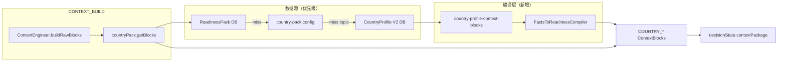

# CountryProfile V2 × Context Package 单轨改造方案

> 目标：让 `POST /api/agent/route_and_run` 的 **CONTEXT_BUILD** 能稳定使用国家知识库 V2（含 `entryRequirements.byNationality`、驾驶合规、季节窗口），同时 **不破坏** ReadinessPack 运营轨与 `TripDecisionEngine` 的 ETA 轨。

---

## 1. 现状与问题

| 数据 | 当前进 Context 的方式 | 缺口 |
|------|----------------------|------|
| ReadinessPack + `country-pack.config` | `countryPack.getBlocks` → `COUNTRY_*` blocks | 无 Pack 时仅静态 config，无 DB 事实 |
| CountryProfile V2 | 仅 `readiness.assess` 回退、`FactsToReadinessCompiler` | **不进** `contextPackage` |
| CountryProfile 驾驶系数 | `CountryKnowledgeService` → 决策 ETA | 正确，应保持算法轨 |
| POI / 路线 | `research_data` + DSO，非本方案 | 见主链路说明 |

**核心矛盾：** 管理端已维护 V2（全球入境、合规、季节），但 LLM 可见的 `COUNTRY_VISA` 等块仍从 Pack `rules[]` 关键词抽取，与 V2 双轨且易漂移。

---

## 2. 推荐策略（不新增对外 Skill）

**扩展现有 `countryPack.getBlocks`**，在 Pack/config 缺失主题时 **回退 CountryProfile V2** 生成同类型 `ContextBlock`。

原则：

1. **Pack 优先**：有 ReadinessPack 且 `extractTopicBlock` 成功 → 不改写（运营可覆盖）。
2. **Profile 补缺**：`missingTopics` 或 Pack 为空 → 从 `countryProfile` 表编译块。
3. **单一事实源编译**：复用 `prismaRowToCountryFacts` + `FactsToReadinessCompiler`（或薄封装），避免第三套文案逻辑。
4. **ETA 不动**：`CountryKnowledgeService` / `attachRouteExecutionOverlaysToPlan` 保持独立，不把系数长文塞进 prompt。

不推荐单独新增 `countryProfile.getBlocks` skill（除非未来要给管理端/调试单独调用）；减少 `tools.select` 与编排清单变更面。

---

## 3. 目标架构



---

## 4. 主题映射（Topic → V2 字段）

| Context topic | Block type | CountryProfile V2 来源 | Compiler 方法（已有） |
|---------------|------------|-------------------------|----------------------|
| `VISA` | `COUNTRY_VISA` | `entryRequirements.byNationality` | `compileEntryTransit`（需 `traveler.nationality`） |
| `ROAD_RULES` | `COUNTRY_ROAD_RULES` | `complianceInfo.drivingRules`、季节车辆 | `compileDrivingCompliance`, `compileTimeBoundaries` |
| `SAFETY` | `COUNTRY_SAFETY` | `emergency`, `complianceInfo.droneRules` | `compileSafety`, drone 可拆 `DRONE` |
| `MONEY` | `COUNTRY_MONEY` | `paymentType`, `paymentInfo`, 汇率 | `compileLogistics` |
| `WEATHER_WINDOWS` | `COUNTRY_WEATHER` | `timeBoundaries.seasons`, triggers | `compileTimeBoundaries` |
| `DRONE` | `COUNTRY_DRONE` | `complianceInfo.droneRules` | 新增 `compileDrone` 或从 compliance 提取 |
| `LOCAL_TRANSPORT` | `COUNTRY_TRANSPORT` | `travelCulture` / 未来字段 | Phase 3 |
| `BOOKING_NORMS` | `COUNTRY_BOOKING` | `travelCulture` | Phase 3 |

**块文本格式：** 将 `ReadinessFindingItem[]` 按 topic 过滤后格式化为 Markdown 列表（message + tasks），写入 `ContextBlock.text`；`data` 携带 `schemaVersion: 2`、`nationality`、`derivedFrom: 'countryProfile'`。

---

## 5. 分阶段实施

### Phase 1 — Profile 补缺（MVP，建议先做）

**行为**

- `CountryPackGetBlocksSkill.execute` 在返回前：
  - 若 `missingTopics.length > 0` 或 `packData` 仅为静态 config 且无 `rules`：
  - `prisma.countryProfile.findUnique({ isoCode })` → `prismaRowToCountryFacts`
  - 调用新模块 `buildContextBlocksFromCountryFacts(facts, { topics, travelerNationality })`
  - 仅填充仍缺失的 topic；`provenance.source = 'countryProfile'`，`dataSource = 'FACTS'`

**新增文件**

| 文件 | 职责 |
|------|------|
| `src/countries/context/country-profile-context-blocks.ts` | facts + compiler → `ContextBlock[]` |
| `src/countries/context/country-profile-context-blocks.spec.ts` | IS/NZ 快照：VISA/ROAD/SAFETY |

**修改文件**

| 文件 | 改动 |
|------|------|
| `src/skills/country-pack/country-pack-get-blocks.skill.ts` | 注入 `FactsToReadinessCompiler`（或静态调用）、Profile 回退逻辑 |
| `src/skills/country-pack/country-pack-get-blocks.skill.ts` | `CountryPackGetBlocksInput.travelerNationality?: string` |
| `src/skills/skills.module.ts` | 若需 `ReadinessModule` / `FactsToReadinessCompiler` provider |
| `src/countries/countries.module.ts` | `exports` 可选导出 mapper 工具（如仅 skill 内用 Prisma 则可不加） |

**测试**

- 单元：`country-profile-context-blocks.spec.ts`（CN/US 签证文案）
- 扩展：`country-pack-get-blocks.skill.spec.ts`：无 Pack、有 IS row → 产出 `COUNTRY_VISA`

**验收**

- `route_and_run` 对仅有 V2、无 ReadinessPack 的 `IS`/`NZ`，`contextPackage.blocks` 含 `COUNTRY_VISA` 且 text 含对应国籍表述。
- 有 Pack 时块仍来自 Pack，`provenance.source` 仍为 `pack`。

---

### Phase 2 — 国籍与行程上下文贯通

**问题：** VISA 块依赖 `traveler.nationality`；当前 `countryPack.getBlocks` 未接收国籍。

**改动**

1. `ContextPackageOptions` 增加 `travelerNationality?: string`。
2. `ContextEngineAdapterService.buildContextPackage` 解析国籍（按优先级）：
   - `DecisionState.userIntent` / metadata（若已有字段）
   - `Trip` 关联用户 profile（Prisma `user.passportCountry` 等，以 schema 为准）
   - `userQuery` 轻量解析（与 `extractCountryCodeFromMessage` 同级，**仅作兜底**）
3. `buildCountryPackBlocks` 将 `travelerNationality` 传入 skill。
4. 文档：`COUNTRY_PROFILE_ADMIN_API.md` 注明「Context VISA 块按请求国籍解析」。

**验收**

- 同一国家、CN vs US 护照，`COUNTRY_VISA` 的 `data.nationality` 与 text 不同。

---

### Phase 3 — 走向理想态（Strict Derivation + 解耦 LLM 投影）

**产品原则（一句话）**

- **国家知识库** = 「国」的长期知识资产（公式与数据库）。
- **准备度** = 「人 + 行 + 国」的即时行动指南（引擎与红绿灯）。

**痛点：** 双轨制带来的不是「缺数据」，而是 **运维一致性焦虑**——同一签证事实在 Profile、Pack、`COUNTRY_VISA` 块里各写一遍，改一处漏一处。

#### 3.1 强类型衍生（Strict Derivation）

**目标：** ReadinessPack 尽量退化为 **「纯动态过滤器」**——只承载 Profile 表达不了的复杂 `when`（季节 × 活动 × 能力包 × 运营特例），而不是再抄一遍签证/lead time 文案。

| 内容 | 归属 | 产出方式 |
|------|------|----------|
| `entryRequirements.byNationality`、`visaApplicationLeadTimeDays`、驾驶/季节/支付事实 | **CountryProfile** | 管理端 CRUD |
| 标准 must 任务（提前 N 天办签、IDP、4WD 等） | **Findings** | `FactsToReadinessCompiler` **唯一编译** |
| 复杂条件规则（例：仅冬季冰川团 + 无向导 → blocker） | **ReadinessPack.rules** | `rule-engine` 在 Findings 之上 **叠加** |
| 运营 checklist / hazards 叙事 | **ReadinessPack**（可选） | 不与 Profile 字段重复 |

**改造重心（相对 Phase 1/2 的「Pack 同步 Profile」）：**

- **不再**以「把 Compiler 结果写回 Pack.rules」为主方案（那会固化第二份真相源）。
- **改为：** `ReadinessService.check` 默认路径 = `compile(CountryProfile)` + `applyPackOverlays(pack, context)`；Pack 中 **禁止**（或 lint 拒绝）与 Profile 重复的 `entry_transit` / 标准 visa 规则 id。
- `countryPack.getBlocks`：**废弃**从 Pack `rules[]` 关键词抽 VISA 的长期路径；主题块统一 `Findings → formatContextBlock()`，Pack 仅贡献「额外 finding」或 WorldFact 投影。

**验收：** 改 IS 的 `entryRequirements.CN` 后，无需改 Pack，assess + Context VISA 块同步变；Pack 只影响带 `when` 的增量项。

#### 3.2 解耦 LLM 投影（Context = 只读视图）

**目标：** Context 块是 Findings 的 **只读摘要**，LLM 负责理解与叙述；**合规决策权不在 Prompt**。

| 能力 | 负责模块 | 禁止 |
|------|----------|------|
| `executable`、blockers、硬门控 | `readiness.assess` + `readiness-to-constraints` + 三守护者 | 用 `COUNTRY_VISA` 块文本推断可否出发 |
| 给用户看的国家提示 | `ContextPackage` `COUNTRY_*` | 块内不写「可执行/不可执行」裁决字段供模型自选 |
| 路程/ETA 乘数 | `CountryKnowledgeService` | 把系数表塞进 prompt 替代计算 |

**实现要点：**

- Context 块 `data` 携带 `findingIds` / `derivedFrom: 'findings'`（已有 Profile 回退时的 `findingIds`），**不**携带可写的 `executable`。
- `GATE_EVAL` 编排：**先** assess 写 DSO 门控状态，**再** CONTEXT_BUILD 注入摘要；Narrator/Planner prompt 显式声明「门控以 assess 输出为准」。
- Ranker/Compressor：blocker 级 finding 摘要可进 private 块，但门控结果以结构化 DSO 字段为准。

**验收：** 人为把 Context VISA 块改成「免签」文案，assess 仍返回 `executable: false` 若 Profile 要求签证。

#### 3.3 Phase 3 可选工具（辅助，非主路径）

- CI `scripts/lint-readiness-pack-derivation.ts`：检测 Pack 中与 Profile 重复的 entry/visa 规则。
- 管理端保存 Profile 时 **预览** Compiler 产出的 Findings diff（只读，不写回 Pack）。

---

### Phase 4 — POI / 路线（边界说明，非本方案主体）

| 能力 | 建议 |
|------|------|
| POI | 保持 `poi.search` + `poiPlanning`；若要在 Context 中加摘要块，新增 `POI_PLANNING_SUMMARY`（`STATE_UPDATE` 后写入），Phase 4+ |
| 路线 ETA | 保持决策引擎；可选在 `ROAD_RULES` 块末尾追加一行「ETA modifier hint」只读摘要，**不**替代 `applyEtaToBaseMinutes` |
| `plan.selectSlices` | 仍仅 DrDre/Neptune/repair agent |

---

## 6. 关键 API / 类型变更

```typescript
// country-pack-get-blocks.skill.ts
export interface CountryPackGetBlocksInput extends SkillInput {
  packId: string;
  topics: Array<'VISA' | 'ROAD_RULES' | ...>;
  phase?: string;
  /** ISO 3166-1 alpha-2；用于 entryRequirements.byNationality */
  travelerNationality?: string;
}

// context-package.types.ts（Phase 2）
export interface ContextPackageOptions {
  // ...
  travelerNationality?: string;
}
```

**ContextBlock 溯源约定**

```typescript
provenance: {
  source: 'countryProfile', // 回退时
  identifier: `countryProfile:${isoCode}`,
  version: String(schemaVersion), // 2
}
data: {
  derivedFrom: 'countryProfile',
  nationality?: string,
  topic: 'VISA',
}
```

---

## 7. 与现有模块的关系

| 模块 | 关系 |
|------|------|
| `FactsToReadinessCompiler` | **唯一** 标准 Findings 编译器；Phase 3 后 Context 块应统一由其衍生，而非 Pack 关键词抽取 |
| `readiness.assess` | **唯一** 红绿灯；输出 `executable`/blockers，与 Context 块解耦 |
| `CountryKnowledgeService` | 不注入 ContextEngineer；仅决策 ETA |
| `WorldFactReadinessProjection` | 继续在 skill 末尾 **追加** SAFETY/ROAD 块，与 Profile 块并存 |
| Admin CRUD | 无 API 变更；写好 Profile 即改善 Context（Phase 1 后） |

---

## 8. 风险与缓解

| 风险 | 缓解 |
|------|------|
| Token 膨胀（Profile 全文） | 只输出请求的 `topics`；Compressor 预算不变；单 topic 文本 ≤ ~1.5k 字符 |
| Pack 与 Profile 文案冲突 | Pack 优先；日志 `filledFromProfile: ['VISA']` |
| 无国籍时 VISA 含糊 | Phase 2 贯通；Phase 1 回退「请确认护照国籍」类 should 项 |
| 循环依赖 skill ↔ readiness | `country-profile-context-blocks` 只 import compiler **类** 或纯函数；skill 模块 import `FactsToReadinessCompiler` from readiness 需在 `skills.module` 加 `forwardRef(ReadinessModule)` |

---

## 9. 测试清单

- [x] `country-profile-context-blocks.spec.ts`：IS + CN/US（Phase 1 已落地）
- [x] `country-pack-get-blocks.skill.spec.ts`：无 pack，有 prisma countryProfile mock
- [ ] 集成：`ContextEngineer.build({ destinationCountryCode: 'IS', requiredTopics: ['VISA'] })` 含块
- [ ] 回归：有 ReadinessPack 的国家仍只走 Pack（mock pack rules 优先）
- [ ] `nest build` + 现有 `facts-to-readiness.compiler.v2.spec.ts` 不破坏

---

## 10. 实施顺序建议（给开发）

1. 落地 `country-profile-context-blocks.ts` + 单测（无 Nest 依赖）。
2. 改 `country-pack-get-blocks.skill.ts` 回退逻辑 + skill 单测。
3. Phase 2：`ContextEngineAdapter` + `ContextEngineer` 传国籍。
4. 文档：在本文件与 `ADMIN_API_GUIDE.md` §2.6 加一句「保存 Profile 后 Context 自动补缺」。
5. （可选）Phase 3 同步脚本。

---

## 11. 完成后用户可见效果

- 仅维护 **CountryProfile V2**（管理端）即可让智能体 **CONTEXT_BUILD** 出现签证/路况/季节类块，无需先建 ReadinessPack。
- 全球 `entryRequirements.byNationality` 与 `readiness.assess`、Context VISA 块 **同源**。
- 路线时间修正仍在决策层，prompt 不重复冗长系数表。

**Phase 1 已实现**（`country-profile-context-blocks.ts` + `countryPack.getBlocks` 回退）。

**Phase 3 已实现（核心）**：

- `checkCountryStrictDerivation` / `getMergedCountryFinding`：Profile Findings ⊕ Pack overlay（仅有 `when` 且非 derivable entry 规则）
- `countryPack.getBlocks`：Findings → Context 块（`derivedFrom: 'findings'`），不再从 Pack 关键词抽 VISA
- `scripts/lint-readiness-pack-derivation.ts`：检测可衍生 entry 规则
- 编排：`GATE_EVAL` 已在 `CONTEXT_BUILD` 之前（注释固化门控契约）

**Phase 2 已实现**：`travelerNationality` 解析链（override → `userIntent.preferences` → `UserProfile.preferences` → `userQuery` 兜底）经 `ContextEngineAdapter` → `ContextEngineer` → `countryPack.getBlocks`；`route_and_run` 另从 `AgentMemoryContext.userBasics` 传入 override。
