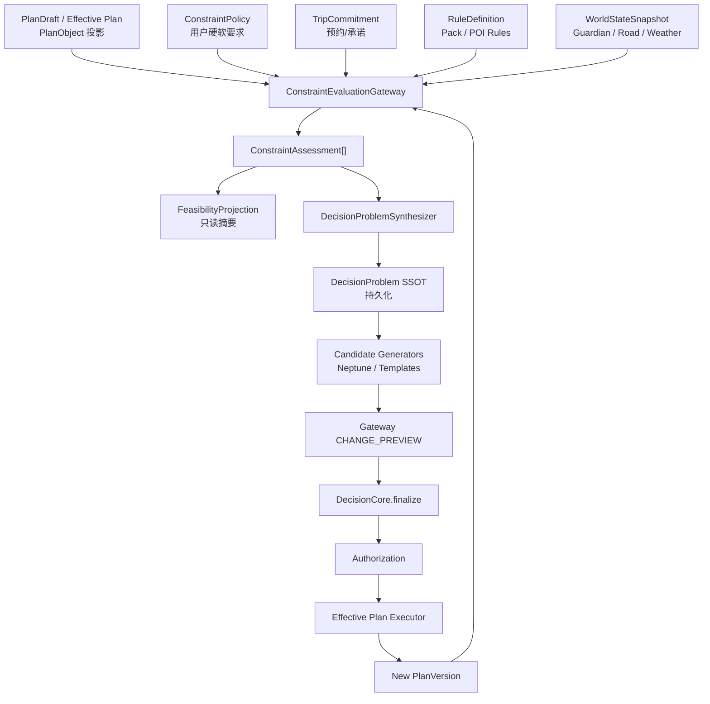

# 约束语义收口 — 规划对象、评估内核与决策问题 SSOT

> **Status:** Living document（2026-07-03）  
> **Audience:** 架构 / 后端 / Plan Studio 前端 / 决策中心 / QA  
> **Related:** [ADR-006](./constraints/ADR-006-Unified-Decision-Runtime.md) · [DECISION_RUNTIME_MATURITY](./DECISION_RUNTIME_MATURITY.md) · [DECISION_RUNTIME_ROADMAP](./DECISION_RUNTIME_ROADMAP.md) · [TRIP_CONSTRAINTS_API](../trips/trip-constraint-solver/TRIP_CONSTRAINTS_API.md) · [DECISION_SEMANTICS_V1.5](../trips/decision-semantics/DECISION_SEMANTICS_V1.5.md) · [DESTINATION_INSIGHT_BFF](../trips/decision-semantics/DESTINATION_INSIGHT_BFF.md)

---

## 0. 一句话结论

TripNARA **不是约束能力不够**，而是规划对象、用户要求、官方规则、世界状态、评估结果、决策问题在多个系统里**重复表达**。

**改造重点：** 收口事实源与评估输出，**不再**增加「餐饮约束引擎」「住宿约束 Provider」等新领域服务。

**目标形态：**

```
Plan Objects + User Policies + Commitments + Rules + World Assertions
        ↓
ConstraintEvaluationGateway（唯一正式评估内核）
        ↓
ConstraintAssessment（统一评估事实）
        ↓
DecisionProblem（唯一可操作问题 SSOT）
        ↓
DecisionCore.finalize → Authorization → Executor → Effective Plan
```

**读模型原则：** 一个评估内核，一个决策问题事实源，多个面向场景的投影（planning-conflicts、feasibility、decision-checker、约束控制台数字）。

---

## 1. 当前问题诊断（与代码核对）

### 1.1 五类核心问题

| # | 问题 | 代码表现 | 风险 |
|---|------|----------|------|
| 1 | **TripConstraint 混入不同性质对象** | `GET /trips/:id/constraints` 同时含用户偏好、午餐策略、冰岛官方 F 路、红警、POI 准入、交通住宿要求 | 每一层都在重新解释「约束」 |
| 2 | **两套正式/半正式可行性评估** | `trip-constraint-solver` → `FeasibilityIssue`；`ConstraintEvaluationGateway` → `ConstraintAssertion` | Plan Studio 与 Canonical Runtime 可能对同一事实给出不同 BLOCK/PASS |
| 3 | **planning-conflicts 与 decision-problems 重复表达** | `DecisionProblemCollector` 从 `FeasibilityIssue` 再 `adapt`；`planning-conflicts` 在 unified 关闭时仍从 `report.issues` 组装 | 同一问题三四个 DTO、多个生命周期 |
| 4 | **Agent 约束旁路** | `ConstraintEngineService`、`Agent ConstraintsEngineService`、Gateway 三套规则入口 | Agent 预筛与正式评估不一致 |
| 5 | **缺少规划对象层** | 餐饮/住宿/缓冲多为 itinerary item 或约束卡片，非一等 `PlanObject` | 时间窗、衔接、承诺难以统一评估 |

### 1.2 性质混淆示例

| 内容 | 正确性质 | 当前常被标为 |
|------|----------|--------------|
| 午餐希望 12:00–13:30 | **ConstraintPolicy**（用户规划政策） | TripConstraint |
| Day 2 安排了一顿午餐 | **PlanObject.MEAL_WINDOW** | itinerary item / 约束 |
| 某餐厅 13:00 关门 | **WorldAssertion** 或 RuleDefinition | 混在 feasibility 文案 |
| 预计 13:20 到达 | **ConstraintAssessment**（评估结果） | FeasibilityIssue |
| 要不要换餐厅 | **DecisionProblem** | planning-conflict + decision-checker |
| F208 当前关闭 | **WorldAssertion** | Guardian + 可能再生成 issue |
| 冬季 F 路通常关闭 | **RuleDefinition**（Destination Pack） | EXTERNAL TripConstraint |
| 用户车辆两驱 | **Trip 事实**（输入上下文） | 约束卡片 |

### 1.3 已部分对齐的能力（不必推倒）

| 能力 | 现状 | 收口方向 |
|------|------|----------|
| `ConstraintAssertion` | Gateway 已输出 PASS/BLOCK/WARNING/UNKNOWN/REQUIRES_VERIFICATION | **扩展为 ConstraintAssessment**，不新建平行类型 |
| `CanonicalConstraintReport` | `tripnara.canonical_constraint_report@v1` | 评估批次 SSOT |
| `planning-conflicts` unified 投影 | `DECISION_GATEWAY_UNIFIED=1` 时走 `UnifiedDecisionProblemReadModelService` | 成为**默认**路径，去掉 legacy 分叉 |
| Guardian RFC-001 | 路政/天气/日负荷 → decision problem store | 统一写入 **WorldAssertion**，再由 Gateway 评估 |
| Destination Pack / POI Access | 规则与准入 | **RuleDefinition Provider**，不进用户 Constraint SSOT |
| ADR-006 | DecisionCore.finalize 为正式决策权威 | 保持不变 |
| authorize / execute | 唯一 Effective Plan 写入 | 保持不变 |

---

## 2. 目标领域模型（六类对象）

> 不再用一个宽泛的 `Constraint` 包含所有东西。

### 2.1 PlanObject — 计划里实际安排了什么

```typescript
type PlanObjectType =
  | 'VISIT'
  | 'ACTIVITY'
  | 'TRANSFER'
  | 'MEAL_WINDOW'
  | 'DINING'           // 具体餐厅/预约槽
  | 'STAY'
  | 'BUFFER'
  | 'SUPPLY_STOP';

interface PlanObject {
  planObjectId: string;
  type: PlanObjectType;
  dayId: string;
  startWindow?: string;
  endWindow?: string;
  durationMinutes?: number;
  locationMode?: 'FIXED_POI' | 'ROUTE_CORRIDOR' | 'AREA';
  locationRef?: string;
  status: 'PLANNED' | 'CONFIRMED' | 'TENTATIVE';
  sourceItineraryItemId?: string;  // 迁移期反向链接
}
```

**示例 — 午餐窗口：**

```json
{
  "planObjectId": "meal-day2-lunch",
  "type": "MEAL_WINDOW",
  "dayId": "day-2",
  "startWindow": "12:00",
  "endWindow": "14:00",
  "durationMinutes": 60,
  "locationMode": "ROUTE_CORRIDOR",
  "status": "PLANNED"
}
```

**示例 — 住宿：**

```json
{
  "planObjectId": "stay-day2",
  "type": "STAY",
  "dayId": "day-2",
  "locationRef": "area:vik",
  "startWindow": "18:00",
  "endWindow": "22:00",
  "status": "PLANNED"
}
```

**迁移来源：** 现有 `ItineraryItem`、`accommodation-overview` 每晚卡片、`metadata.lunch_strategy` — 渐进抽取，不一次性替换 itinerary 表。

### 2.2 ConstraintPolicy — 用户要求与规划政策

只存「用户希望怎样规划」，**不含**官方规则与世界状态。

```typescript
interface ConstraintPolicy {
  policyId: string;
  category:
    | 'TIME'
    | 'BUDGET'
    | 'PACE'
    | 'TRANSPORT'
    | 'DINING'
    | 'STAY'
    | 'MEMBER'
    | 'ACTIVITY'
    | 'CUSTOM';
  hardness: 'HARD' | 'SOFT';
  scope: ConstraintScope;
  expression: ConstraintExpression;
  source: 'USER' | 'PROFILE' | 'TRIP_DEFAULT';
  version: number;
}
```

**对应现状：** `TripConstraint` 中 `source.type ∈ {USER, MEMBER, AI_INFERRED, …}` 的条目；合成 ID 如 `c_max_segment_distance`、`c_must_places`。

**API 演进：** `GET/POST/PATCH /trips/:id/constraint-policies`（新）；`/constraints` 暂保留组合读模型兼容。

### 2.3 TripCommitment — 已锁定的现实承诺

```typescript
interface TripCommitment {
  commitmentId: string;
  type:
    | 'ACCOMMODATION'
    | 'ACTIVITY_BOOKING'
    | 'TRANSPORT_BOOKING'
    | 'DINING_RESERVATION';
  startTime: string;
  endTime?: string;
  locationRef: string;
  changeability: 'FIXED' | 'CHANGEABLE_WITH_COST' | 'FLEXIBLE';
  status: 'HELD' | 'CONFIRMED' | 'CANCELLED';
}
```

区分：「希望住维克」= Policy；「已订维克酒店」= Commitment。

**迁移来源：** accommodation booking、activity 预约、trip files 确认号、租车取还时间。

### 2.4 RuleDefinition — 稳定规则（只读）

由 Destination Pack、POI Access fixtures、`applicable-rules` 提供：

- F 路车辆要求、冬季道路规则
- POI 预约/年龄/装备要求
- 交通法规、活动限制

**不是** TripConstraint，**不是** World State。  
**代码落点：** `data/destination-packs/`、`PoiAccessRule`、未来 `GET /trips/:tripId/applicable-rules`。

### 2.5 WorldAssertion — 当前世界事实

```typescript
interface WorldAssertion {
  assertionId: string;
  semanticKey: string;
  subjectRef: string;
  status: 'TRUE' | 'FALSE' | 'UNKNOWN';
  validFrom: string;
  validUntil?: string;
  evidenceRefs: string[];
  worldRevision: string;
}
```

**来源：** Guardian 事件、Road.is、天气、POI 容量/停业、景区临时关闭。

**写入路径：** Guardian → Evidence → WorldAssertion → WorldStateSnapshot（**不**同时直写 feasibility issue / planning-conflict / decision-problem 三套 DTO）。

### 2.6 ConstraintAssessment — 约束评估结果（核心 SSOT）

在现有 `ConstraintAssertion` 上扩展，**避免**与 Decision Semantics 的 `ConstraintAssertion` 长期并存第三套命名。

```typescript
type ConstraintEvaluationMode =
  | 'CANDIDATE_FILTER'
  | 'PLAN_VERIFY'
  | 'CHANGE_PREVIEW'
  | 'WORLD_RECHECK';

interface ConstraintAssessment {
  assessmentId: string;
  evaluationMode: ConstraintEvaluationMode;
  status: 'PASS' | 'BLOCK' | 'WARNING' | 'UNKNOWN' | 'REQUIRES_VERIFICATION';
  semanticKey: string;
  subjectRefs: string[];
  affectedScope: {
    tripId: string;
    dayIds?: string[];
    planObjectIds?: string[];
    memberIds?: string[];
    routeSegmentIds?: string[];
  };
  policyRefs?: string[];
  ruleRefs?: string[];
  assertionRefs?: string[];      // WorldAssertion
  commitmentRefs?: string[];
  explanationCode: string;
  measuredValue?: unknown;
  thresholdValue?: unknown;
  evidenceRefs: string[];
  message: string;
  overridable?: boolean;
  /** 四维版本上下文 */
  planVersionId: string;
  policyVersion: number;
  worldRevision: string;
  rulePackVersion: string;
  evaluatedAt: string;
}
```

**与现有代码映射：**

| 新字段 | 现有 |
|--------|------|
| `status` | `ConstraintAssertion.status` |
| `semanticKey` | `constraintType` / pack `semanticKey` |
| `affectedScope` | `ConstraintAssertion.scope`（扩展 planObjectIds） |
| `evaluationMode` | **新增** |
| 四维版本 | 部分有 `constraintsVersion`；需扩展 |

**批次容器：** 继续使用 `CanonicalConstraintReport`，增加 `assessments: ConstraintAssessment[]`（或 assertions 升级别名）。

---

## 3. 目标主链



**三条铁律：**

1. 所有**正式** BLOCK/PASS 经 Gateway 产出。  
2. 所有需用户/系统**处理**的问题进入 DecisionProblem SSOT。  
3. 只有 Executor（authorize → execute）可写 Effective Plan。

---

## 4. 评估模式（同一内核，不同副作用）

| evaluationMode | 用途 | BLOCK 行为 | 持久化 Assessment | 创建 DecisionProblem |
|----------------|------|------------|-------------------|----------------------|
| `CANDIDATE_FILTER` | 候选生成/Agent 预筛 | 淘汰候选 | 可选（debug） | 否 |
| `PLAN_VERIFY` | 计划确认、Tab 可执行性 | 阻断 Gate / 标红 | **是** | 按 Actionability Policy |
| `CHANGE_PREVIEW` | 改约束、预览 repair option | 标为不可应用 | 否（diff only） | 否 |
| `WORLD_RECHECK` | F208 CLOSED 等事件 | 增量重评 scope | **是** | 新增/升级 |

Agent / `ConstraintEngineService.isFeasible` **必须**走 `CANDIDATE_FILTER`  Facade，**禁止**独立正式规则。

```typescript
// 目标 Facade（示意）
class CandidateConstraintFacade {
  constructor(private readonly gateway: ConstraintEvaluationGatewayService) {}

  async isFeasible(candidate: PlanCandidate) {
    const report = await this.gateway.evaluatePlan({
      ...input,
      evaluationMode: 'CANDIDATE_FILTER',
    });
    const blocked = report.assessments.some((a) => a.status === 'BLOCK');
    return { feasible: !blocked, assessments: report.assessments };
  }
}
```

---

## 5. 四维版本与 STALE

```typescript
interface EvaluationContextVersion {
  planVersionId: string;
  policyVersion: number;      // 现 constraintsVersion
  worldRevision: string;
  rulePackVersion: string;    // destination pack + poi rules
}
```

任一维度变化 → 关联 Assessment 可标 `STALE`（不立即删除，供审计与 diff）。

**前端：** 除 `constraintsVersion` 外，逐步暴露 `worldRevision` / `planVersionId` 用于 decision-problem / feasibility 缓存失效。

---

## 6. DecisionProblem 生成规则（Problem Synthesizer）

**创建 DecisionProblem：**

- BLOCK 影响正式计划；
- WARNING 需用户做体验取舍；
- UNKNOWN / REQUIRES_VERIFICATION 涉及安全或关键预约；
- Commitment 与计划冲突；
- 世界状态变化导致原 DecisionRecord 失效；
- 无法自动修复。

**不创建（信息提示 / 自动修复）：**

- 自动 +10min 缓冲；
- 午餐 12:30→12:45 微调；
- 等价 POI 顺序交换；
- 纯信息提示且不要求行动。

```
ConstraintAssessment → Actionability Policy → 自动修复 | 信息提示 | DecisionProblem
```

---

## 7. 现有模块迁移表

| 模块 | 当前职责 | 目标职责 | 阶段 |
|------|----------|----------|------|
| **Trip Constraints API** | 用户约束 + 官方规则 + 评估态混合 | **ConstraintPolicy** 读写；官方规则迁至只读 `applicable-rules` | P1–P4 |
| **trip-constraint-solver / FeasibilityReport** | 独立领域判断 + 聚合 | **FeasibilityProjectionService**：读 Assessment + 结构检查 | P2–P3 |
| **planning-conflicts** | 从 issues 组装或 unified 投影 | **DecisionProblem 规划投影**（默认 unified） | P3 |
| **decision-checker** | 发现问题 + 建议 + 预检 | **OptionEvaluationService**（CHANGE_PREVIEW + plan diff） | P3–P4 |
| **ConstraintEvaluationGateway** | Canonical 热路径 | **唯一正式评估内核** | P2 |
| **ConstraintEngineService** | isFeasible + Gateway/legacy 双轨 | Gateway `CANDIDATE_FILTER` Facade | P2 |
| **Agent ConstraintsEngineService** | 独立 HARD/SOFT 规则 | 删除或降为 Rule 输入适配器 | P5–P6 |
| **Guardian RFC-001** | 多 DTO 写入 | WorldAssertion → Gateway → Synthesizer | P2–P3 |
| **Destination Pack / POI Access** | 部分在 assembler 重复判断 | Gateway Provider only | P2 |
| **Decision Semantics** | 从 feasibility adapt 问题 | 读 DecisionProblem SSOT + 解释层 | P3 |
| **DecisionCore.finalize** | 正式决策权威 | 不变 | — |
| **authorize / execute** | 写 Effective Plan | 不变 | — |

### 7.1 明确不做

- ❌ 餐饮约束引擎、住宿约束 Provider（新领域服务）
- ❌ 新的 EXTERNAL TripConstraint 类型承载官方规则
- ❌ Agent 独立 PASS/BLOCK 或直写 itinerary
- ❌ planning command / repair 绕过 DecisionCore 写 Effective Plan

### 7.2 保留接口兼容

| 接口 | 兼容策略 |
|------|----------|
| `GET /trips/:id/constraints` | 组合读模型；写入逐步收窄到 policies |
| `GET /trips/:id/planning-conflicts` | 保留路径；内部改为 DecisionProblem 投影 |
| `GET /trips/:id/decision-problems` | SSOT 读路径（加强） |
| `GET /trips/:id/decision-checker` | 逐步合并到 `option preview` |

---

## 8. 餐饮 / 住宿 / 交通边界

| 概念 | 类型 | 示例 |
|------|------|------|
| 午餐策略 | ConstraintPolicy | 12:00–13:30、老人连续活动 ≤3h |
| 实际午餐安排 | PlanObject.MEAL_WINDOW | Day2 12:30–13:30 维克走廊 |
| 具体餐厅预约 | PlanObject.DINING + TripCommitment | 13:00 Restaurant A |
| 住宿偏好 | ConstraintPolicy | 不连续换酒店、要停车位 |
| 当晚住哪 | PlanObject.STAY | Day3 冰河湖区域 |
| 已订酒店 | PlanObject.STAY + TripCommitment | CONFIRMED |
| 住宿导致折返 | ConstraintAssessment | BLOCK/WARNING |
| 是否换酒店 | DecisionProblem | 用户选择 |

---

## 9. 前端收口（Plan Studio）

侧栏可保持物理位置，逻辑拆三层：

| 区块 | 用户心智 | 数据源 | 可编辑 |
|------|----------|--------|--------|
| **规划条件** | 我的要求与偏好 | ConstraintPolicy | 是 |
| **可执行性** | 当前哪里不行 | ConstraintAssessment 摘要 + Feasibility 投影 | 否 |
| **待决策问题** | 需要我选择的事 | DecisionProblem SSOT | 操作（evaluate/apply） |

### 9.1 目标调用链

```
1. constraint-policies     编辑用户要求
2. effective-plan / draft  编辑 POI、餐饮、住宿、交通（PlanObject 投影）
3. feasibility             评估摘要（投影）
4. decision-problems       待处理问题（SSOT）
5. option preview          方案会如何改行程
6. authorize / execute     正式应用
```

`planning-conflicts`：兼容保留；**新页面不以之为独立事实源**。

### 9.2 与 DESTINATION_INSIGHT_BFF 关系

Destination Insight 仍为**解释层**（`explanatoryOnly`），不替代 ConstraintAssessment 或 DecisionProblem。

### 9.3 写链 + Feasibility 投影（前端对接）

**运行时探测**

```http
GET /api/decision-runtime/ops/write-chain
GET /api/decision-engine/v1/runtime-capabilities
```

| 字段 | 含义 | 前端行为 |
|------|------|----------|
| `writeChainEnabled` | 写链开启 | 禁止直调 `apply-repair` / `resolveConflicts` / agent 行程写 |
| `gatewayDomainRulesExclusive` | Gateway 独占域规则 | Feasibility 以 Gateway 投影为准，忽略 legacy 同域重复 issue |
| `constraintPlanVerifyProjection` | PLAN_VERIFY 投影 | `poi_access` / `schedule` / `guardian` 来自 Gateway |
| `phase6LegacyDeprecation` | Phase 6 总开关 | 配合上两项启用完整语义收口 |

**写链阻断响应（统一）**

```json
{
  "success": false,
  "error": {
    "code": "EFFECTIVE_PLAN_WRITE_CHAIN_REQUIRED",
    "message": "Plan mutation blocked (...)",
    "details": {
      "caller": "FeasibilityReportService.applyRepair",
      "authorizedPaths": [
        "POST /trips/:tripId/decision-problems/:problemId/resolutions",
        "POST /trips/:tripId/decision-problems/:problemId/apply"
      ],
      "writeChain": true
    }
  }
}
```

检测：`error.code === 'EFFECTIVE_PLAN_WRITE_CHAIN_REQUIRED'` → 引导用户走 **待决策问题** 流程。

**正式应用路径**

```
1. GET  /trips/:tripId/decision-problems          # SSOT 待处理问题
2. POST /trips/:tripId/decision-problems/:id/resolutions   # 生成方案
3. POST /trips/:tripId/decision-problems/:id/apply         # authorize → execute
```

**Agent draft-only**

- `commitPlan` / agent 建议：读 `metadata.agentPlanDraftMutation`，不期待时间轴立即物化
- `TripPlannerService.applySuggestion` / `fixNightActivities`：写链 on 时返回上述错误码

**Feasibility 投影语义（`gatewayDomainRulesExclusive=true`）**

- `poi_access` / `schedule` / `guardian` 域 issue **仅**来自 Gateway 投影
- legacy readiness findings / conflicts 中同域重复行已被 assembler 剥离
- `planning-conflicts` 仅为投影；**决策 SSOT** 为 `decision-problems`
- Training `constraints/check` 在 narrate-only 模式返回 `usage: 'narrate_only'` — 勿用于正式 BLOCK UI

**RL / DAG 编排**

- `RLIntegration.preDecision` 可能返回 `writeChainRequired: true` + `authorizedPaths`
- DAG orchestrator 识别 `writeChainRequired` 结构化拒绝

---

## 10. 分阶段迁移（最小路径）

> **原则：** 先统一评估输出 + 问题 SSOT，再动 PlanObject；每阶段可交付、可回滚。

### Phase 0 — 冻结扩 scope（立即）

- [ ] 架构评审确认：不再新增餐饮/住宿 Provider
- [ ] 新能力 checklist：必须说明落入 Policy / PlanObject / Rule / WorldAssertion / Assessment 哪一类

### Phase 1 — 语义契约与溯源（1–2 周）✅ 已启动

**交付：**

- [x] `ConstraintAssessment` 类型定义（扩展 `ConstraintAssertion`）
- [x] `EvaluationContextVersion` 四维版本
- [x] 适配器（只增不改行为）：
  - `FeasibilityIssueDto` → `ConstraintAssessment`
  - `ConstraintAssertion` → `ConstraintAssessment`
  - `DecisionProblem` ↔ `assessmentIds[]`（link util）
- [x] Trace API：`GET /api/trips/:id/constraint-trace?semanticKey=...`

**完成标准：** 同一 `semanticKey` 可追踪 policy → assertion → assessment → problem，不要求三表状态已统一。

**代码落点：**

- `src/decision-runtime/constraints/contracts/constraint-assessment.types.ts`
- `src/decision-runtime/constraints/contracts/evaluation-context-version.types.ts`
- `src/decision-runtime/constraints/adapters/feasibility-issue-to-assessment.adapter.ts`
- `src/decision-runtime/constraints/adapters/assertion-to-assessment.adapter.ts`
- `src/decision-runtime/constraints/adapters/decision-problem-assessment-link.util.ts`
- `src/decision-runtime/constraints/utils/evaluation-context-version.util.ts`
- `src/decision-runtime/constraints/services/constraint-assessment-trace.service.ts`
- `src/decision-runtime/constraints/controllers/constraint-assessment-trace.controller.ts`

### Phase 2 — Gateway 为唯一 BLOCK 裁决（2–3 周）✅ 完成

**交付：**

- [x] `evaluationMode` 贯穿 `EvaluatePlanInput` + `CanonicalConstraintReport`
- [x] **POI Access** → `PoiAccessConstraintProvider` → Gateway 断言 → `FeasibilityProjectionService`
- [x] **Schedule**（日驾驶 / 跨天交通 / 缓冲不足）→ `ScheduleConstraintProvider` → conflict 投影
- [x] **Guardian** → `GuardianFeasibilityCollectorService` → workspace 断言补充进 feasibility report
- [x] `FeasibilityReportService` 在 `CONSTRAINT_GATEWAY_PLAN_VERIFY_PROJECTION=1` 时走投影
- [x] `CandidateConstraintFacade` + `ConstraintEngineService` 在 `CONSTRAINT_CANDIDATE_FACADE=1` 时使用 `CANDIDATE_FILTER`
- [x] Agent `ConstraintsEngineService` 在 `CONSTRAINT_AGENT_BLOCK_DELEGATED=1` 时不再独立 `is_blocked`

**环境变量：**

| 变量 | 默认 | 作用 |
|------|------|------|
| `CONSTRAINT_GATEWAY_PLAN_VERIFY_PROJECTION` | off | POI + Schedule + Guardian 经 Gateway 投影 |
| `CONSTRAINT_CANDIDATE_FACADE` | 随 projection | 候选 `isFeasible` 走 Facade |
| `CONSTRAINT_AGENT_BLOCK_DELEGATED` | 随 projection | Agent 正式 BLOCK 权威移交 Gateway |

**完成标准：**

- POI Access 类 BLOCK 在 `constraint-trace` 与 feasibility report 中可追到 `evaluator.engine=poi-access-capacity`
- 日驾驶 / `inter_day_travel` / `buffer_insufficient` 可追到 `evaluator.engine=trip-schedule-conflicts`
- F208 / 天气禁入等 Guardian BLOCK 可追到 `evaluator.engine=guardian-assertion`（workspace 有断言时）
- Agent `checkConstraints().is_blocked === false` 且 `block_authority === 'gateway'`（flag 开启时）；violations 仍供叙述/红队使用

**代码落点：**

- `providers/poi-access-constraint.provider.ts`
- `providers/schedule-constraint.provider.ts`
- `services/guardian-feasibility-collector.service.ts`
- `services/feasibility-projection.service.ts`
- `services/candidate-constraint-facade.service.ts`
- `adapters/guardian-assertion-to-feasibility-issue.adapter.ts`
- `adapters/feasibility-issue-to-assertion.adapter.ts`
- `adapters/conflict-to-assertion.adapter.ts`
- `adapters/assertion-to-feasibility-issue.adapter.ts`
- `utils/schedule-domain.util.ts`
- `agent/training/services/constraints-engine.service.ts`

### Phase 3 — DecisionProblem SSOT（2 周）✅ 收尾完成

**交付：**

- [x] `DecisionProblemSynthesizerService`：Assessment → Problem（含 Actionability Policy）
- [x] `DecisionProblemSsotStoreService`：`loadAuthoritative` 读优先，stale 才 synthesize + persist
- [x] Collector enrich-only：SSOT 命中 store 时跳过重复 synthesize
- [x] `planning-conflicts` SSOT / problem-only 时默认 Unified read model
- [x] `decision-checker` CHANGE_PREVIEW 对接 `getProblemOptions` + `previewAction`
- [x] `DECISION_GATEWAY_UNIFIED` **默认开启**；SSOT 开启时不可关闭

**环境变量：**

| 变量 | 默认 | 作用 |
|------|------|------|
| `DECISION_PROBLEM_SSOT_STORE` | off | Assessment → Problem 持久化为权威 |
| `PLANNING_CONFLICTS_FROM_PROBLEM_ONLY` | 随 SSOT | 去掉 issues 组装回退 |
| `DECISION_CHECKER_CHANGE_PREVIEW` | 随 SSOT | checker 走 option preview API |
| `DECISION_GATEWAY_UNIFIED` | **on** | unified API；仅显式 `=0` 可关（SSOT 时无效） |

**完成标准：** 同一 `semanticKey` 在 store / conflicts / checker `counterfactual.scenarios` 间 `problemId` + `actionId` 对齐；planVersion 不变时 collector 不重复写 store。

**代码落点：**

- `decision-problems/persistence/decision-problem-ssot.store.ts`（`loadAuthoritative`）
- `utils/decision-checker-option-preview.util.ts`
- `services/decision-checker.service.ts`（`loadOptionPreviews`）
- `gateway/config/decision-gateway.config.ts`

### Phase 4 — PlanObject 最小切片（2–3 周）✅ 完成

**交付：**

- [x] `PlanObject` 类型契约（`plan-object.types.ts`）
- [x] itinerary / accommodation / `lunch_strategy` → PlanObject 投影
- [x] 日内轻量评估：STAY / MEAL / TRANSFER / BUFFER / FATIGUE
- [x] 读 API：`GET /api/trips/:tripId/plan-objects`（`PLAN_OBJECT_PROJECTION_ENABLED=1`）
- [x] Gateway PLAN_VERIFY 接入 + legacy 午餐/缓冲/疲劳委托
- [x] Timeline BFF：`include=planobjects` 返回规划对象摘要
- [ ] **不做** 餐厅实时预约、酒店交易

**完成标准：** 一个 Day 可表达 Stay → Transfer → Visit → Meal Window → Activity → Transfer → Stay End。

**代码落点：**

- `plan-objects/contracts/plan-object.types.ts`
- `plan-objects/projectors/itinerary-to-plan-object.projector.ts`
- `plan-objects/projectors/plan-object-day-assessment.util.ts`
- `plan-objects/services/plan-object-projection.service.ts`
- `plan-objects/controllers/plan-objects.controller.ts`
- `constraints/providers/plan-object-constraint.provider.ts`
- `constraints/adapters/plan-object-assessment-to-assertion.adapter.ts`
- `trips/utils/timeline-plan-objects.util.ts`

### Phase 5 — 写链收口（2 周）🔄 已启动

**交付：**

- [x] `EFFECTIVE_PLAN_WRITE_CHAIN=1`：直写 repair 须经 execute 授权上下文
- [x] `FeasibilityReportService.applyRepair` 写链门禁
- [x] `DecisionSemanticsService.createDecision` + unified `apply` 包裹 `runWithAuthority('execute')`
- [x] Ops：`GET /ops/runtime/write-chain` 写链状态 API
- [x] Agent / Planner draft-only：`buildAgentPlanDraftMutationSet` + `commitPlan` 跳过时间轴物化
- [x] `Rfc001ItineraryMaterializer.applyPlanOperations` 写链门禁
- [x] `EFFECTIVE_PLAN_WRITE_CHAIN` 联动 `AGENTIC_MUTATION_WRITE_GUARD`（未显式 OFF 时 ENFORCE）
- [x] 审计 CI：`p5-architecture:lint` 扩展 applyRepair / resolveConflicts 调用方检查
- [x] 生产环境默认 `EFFECTIVE_PLAN_WRITE_CHAIN=1`（`NODE_ENV=production`）
- [x] bypass 收口：`resolveConflicts` / `ReadinessRepairService.applyRepair` 写链门禁
- [x] `ExecutionAgentService` / `TripPlannerService` 直接行程写入门禁
- [x] `p5-architecture:lint` 扩展 agent itinerary 写链审计（guarded + pending allowlist）
- [x] 4 条 agent pending 写链迁移：`planning-assistant-v2` / `system1-executor` / `trip.apply_user_edit` / `materializePlanStateToTimeline`

**完成标准（Phase 5）：**

- [x] 全部 Effective Plan 写入经 DecisionCore → authorize → execute（写链 + guard 默认 prod on）
- [x] Planner / Agent / repair 产出 PlanDraft / TripMutationSet（draft-only 路径）
- [x] 审计：`p5-architecture:lint` 禁止 bypass 写路径（含 applyRepair / resolveConflicts / agent itinerary）

**环境变量：**

| 变量 | 默认 | 作用 |
|------|------|------|
| `EFFECTIVE_PLAN_WRITE_CHAIN` | off | 禁止 bypass applyRepair；Agent 时间轴 draft-only |
| `EFFECTIVE_PLAN_WRITE_GUARD` | prod=ENFORCE | `setEffective` 仅 execute/rollback |
| `LEGACY_MUTATION_WRITE_GUARD` | ENFORCE | Legacy mutation 须带 authority envelope |
| `AGENTIC_MUTATION_WRITE_GUARD` | ENFORCE（write chain 时强制） | MCP TRIP_MUTATION 须 MutationAuthorityEnvelope |

**代码落点：**

- `execution/effective-plan-write-chain.config.ts`（`isAgentPlanDraftOnlyEnabled`）
- `execution/effective-plan-write-guard.service.ts`（`assertAuthorizedPlanMutation`）
- `execution/effective-plan-write-chain-status.util.ts`
- `execution/agentic-tool-side-effect.util.ts`（write chain → agentic guard）
- `agent/utils/agent-plan-draft.util.ts`
- `agent/services/planning-workbench-agent.service.ts`（`commitPlan` draft-only）
- `guardian-decision-core/execution/rfc001-itinerary-materializer.service.ts`
- `agent/services/execution-agent.service.ts`
- `agent/assistants/trip-planner/services/trip-planner.service.ts`
- `execution/effective-plan-write-architecture.config.ts`（agent itinerary allowlist）

### Phase 6 — 删旁路与双重状态 ✅ 完成

**交付：**

- [x] `PHASE6_LEGACY_DEPRECATION=1` 主开关 + ops `write-chain.phase6LegacyDeprecation`
- [x] Agent `ConstraintsEngine` 正式 BLOCK 在 Phase 6 下始终委托 Gateway
- [x] 禁止 CREATE `OFFICIAL_RULE` / `EXTERNAL` 约束写入 unified store（`OFFICIAL_RULE_NOT_PERSISTED`）
- [x] Collector 跳过 `OFFICIAL_RULE` TripConstraint → Problem 重复合成
- [x] unified apply 拒绝 legacy writeChain（`NON_CANONICAL_APPLY_DEPRECATED`）
- [x] Assembler：`filterAssemblerLegacyIssuesWhenProjected` 去重 Gateway 已覆盖域
- [x] `GateEvalExecutor` 正式 BLOCK → `ADJUST_REQUIRED`（Phase 6）
- [x] `readiness.applyRepair` action/skill 写链阻断（返回 `EFFECTIVE_PLAN_WRITE_CHAIN_REQUIRED`）
- [x] HTTP 层写链响应规范化：`readiness` / `feasibility` / `trips.resolveConflicts` 统一 `authorizedPaths`
- [x] `RLIntegration.preDecision` 写链门禁 + Gateway 委托 violations→warnings
- [x] DAG `orchestrator` 识别 `writeChainRequired` 结构化拒绝
- [x] `ExecutionAgentService.reorder` / `applyFallback` 写链门禁 + HTTP 规范化
- [x] `TripPlannerService.applySuggestion` / `fixNightActivities` 写链门禁
- [x] Agent `ConstraintsEngine` 叙述层专用：`narrate_only` + `approval_authority` 委托 + RL/红队/审计收口
- [x] Gateway 域规则独占：`isPhase6GatewayDomainRulesExclusive` + assembler `gatewayDomainCoverage` 移除 legacy 重复域

**环境变量：**

| 变量 | 默认 | 作用 |
|------|------|------|
| `PHASE6_LEGACY_DEPRECATION` | off | Phase 6 旁路收口总开关 |
| `CONSTRAINT_AGENT_BLOCK_DELEGATED` | Phase6 或 projection 时 on | Agent 不独立 `is_blocked` |
| `CONSTRAINT_GATEWAY_PLAN_VERIFY_PROJECTION` | off | Gateway PLAN_VERIFY → Feasibility 投影 |
| Phase6 + PLAN_VERIFY | `gatewayDomainRulesExclusive` | assembler 剥离 legacy poi_access/schedule/guardian |

**代码落点：**

- `phase6-legacy-deprecation.config.ts`
- `constraints/constraint-plan-verify.config.ts`
- `trip-constraint-registry.service.ts`（官方规则不可持久化）
- `collectors/decision-problem.collector.ts`
- `gateway/services/unified-decision-resolution.service.ts`
- `services/trip-conflicts.service.ts`
- `utils/assembler-gateway-coverage.util.ts`
- `constraints/constraint-plan-verify.config.ts`（`isPhase6GatewayDomainRulesExclusive`）
- `execution/effective-plan-write-chain-blocked.util.ts`
- `agent/execution/gate-eval-executor.service.ts`
- `agent/services/actions/readiness.actions.ts`
- `skills/readiness/readiness-apply-repair.skill.ts`
- `execution/agent-orchestration-write-gate.util.ts`
- `agent/training/services/rl-integration.service.ts`
- `agent/plan-execute/orchestrator.service.ts`
- `agent/services/execution-agent.service.ts`
- `agent/execution.controller.ts`
- `agent/assistants/trip-planner/services/trip-planner.service.ts`
- `constraints/constraint-agent-narrate-only.util.ts`
- `agent/training/services/constraints-engine.service.ts`
- `agent/training/services/rl-integration.service.ts`
- `agent/training/services/security-red-team.service.ts`
- `agent/training/services/compliance-audit.service.ts`

---

## 11. 验收清单（跨阶段）

| ID | 验收项 |
|----|--------|
| ACC-01 | 同一 semanticKey 在 trace API 可串起 policy / rule / assertion / assessment / problem |
| ACC-02 | PATCH `c_max_segment_distance` 后，conflicts / checker / assessment 在同一 `policyVersion` 下文案一致 |
| ACC-03 | F208 CLOSED 只经 WorldAssertion → Gateway → Problem，不直写三套 DTO |
| ACC-04 | Agent 候选被 Gateway BLOCK 时，assessment 与 Plan Studio 展示一致 |
| ACC-05 | `planning-conflicts` 与 `decision-problems` 同 trip 下 open 问题 instanceKey 对齐 |
| ACC-06 | apply 成功后 `planVersionId` 变化，旧 assessment 标 STALE |
| ACC-07 | 官方规则在 `applicable-rules` 只读展示，PATCH 官方卡返回 400 |

---

## 12. 环境与开关（建议）

| 变量 | 用途 | 阶段 |
|------|------|------|
| `CONSTRAINT_ASSESSMENT_TRACE_ENABLED` | 开启 trace API | P1 |
| `CONSTRAINT_GATEWAY_PLAN_VERIFY_ONLY` | feasibility 仅投影 gateway | P2 |
| `DECISION_PROBLEM_SSOT_STORE` | problem 持久化为权威 | P3 |
| `PLANNING_CONFLICTS_FROM_PROBLEM_ONLY` | 去掉 issues 组装回退 | P3 |
| `DECISION_GATEWAY_UNIFIED` | 默认 on；SSOT 时不可关 | P3 |
| `PLAN_OBJECT_PROJECTION_ENABLED` | PlanObject 读投影 API | P4 |
| `PLAN_OBJECT_GATEWAY_EVALUATION` | PlanObject → Gateway PLAN_VERIFY（默认同上+plan-verify） | P4 |
| `EFFECTIVE_PLAN_WRITE_CHAIN` | prod=on | 禁止 bypass applyRepair / 冲突直写 |
| `EFFECTIVE_PLAN_WRITE_GUARD` | prod=ENFORCE | setEffective 仅 execute/rollback |
| `PHASE6_LEGACY_DEPRECATION` | off | 旁路收口总开关 |

---

## 13. 文档与代码索引

| 主题 | 路径 |
|------|------|
| 统一 Runtime ADR | `src/decision-runtime/constraints/ADR-006-Unified-Decision-Runtime.md` |
| Gateway 实现 | `src/decision-runtime/constraints/constraint-evaluation.gateway.service.ts` |
| Assertion 契约 | `src/decision-runtime/constraints/contracts/constraint-assertion.ts` |
| **Assessment 契约（P1）** | `src/decision-runtime/constraints/contracts/constraint-assessment.types.ts` |
| **Trace API（P1）** | `GET /api/trips/:tripId/constraint-trace` |
| Trip 约束 API | `src/trips/trip-constraint-solver/TRIP_CONSTRAINTS_API.md` |
| Feasibility 组装 | `src/trips/trip-constraint-solver/utils/feasibility-assembler.util.ts` |
| Planning conflicts | `src/trips/trip-constraint-solver/services/planning-conflicts.service.ts` |
| Decision problem 收集 | `src/trips/decision-semantics/collectors/decision-problem.collector.ts` |
| Unified 读模型 | `src/decision-runtime/gateway/services/unified-decision-problem-read-model.service.ts` |
| **PlanObject 投影（P4）** | `GET /api/trips/:tripId/plan-objects` |
| 决策语义 API | `src/trips/decision-semantics/DECISION_SEMANTICS_V1.5.md` |
| 前端 SSOT 迁移 | `src/trips/decision-semantics/DECISION_SSOT_FRONTEND_MIGRATION.md` |

---

## 15. 前端对接（Phase 1–2）

### 15.1 现阶段：几乎无破坏性变更

| 区域 | Phase 1–2 影响 | 前端动作 |
|------|----------------|----------|
| Tab BFF / `loadFirstPaint` | 无 | 不变 |
| `GET /constraints` | 无 | 不变 |
| `GET /planning-conflicts` | POI + Schedule 文案来源可能一致化（env 开启后） | 无需改字段；继续渲染 `message` / `issue` |
| `GET /decision-problems` | 无 | 不变 |
| `GET /decision-checker` | 无 | 补 `destination_knowledge` evidence 文案（若按 kind 分组） |

### 15.2 可选接入（调试 / 未来 SSOT）

**Trace API（内部 / 联调）：**

```
GET /api/trips/:tripId/constraint-trace?semanticKey=poi_access_reservation_required
```

用于验证同一问题在 assessment ↔ problem ↔ policy 间的溯源；**不要**放进 Tab 首屏。

### 15.3 Phase 2 开启后建议

1. 后端 staging 设置 `CONSTRAINT_GATEWAY_PLAN_VERIFY_PROJECTION=1`
2. 回归：POI 准入 + 日驾驶/交通衔接类冲突在 planning-conflicts 与 constraint-trace 中 `semanticKey` 一致
3. 继续用 `constraintsVersion` 失效 planning-conflicts 缓存（已有）

### 15.4 Phase 3 起前端应收口

- 规划侧栏拆为：**规划条件** / **可执行性** / **待决策**
- `planning-conflicts` 降级为投影，不以之为 SSOT
- 主调用链：`constraint-policies` → `decision-problems` → `option preview` → `apply`

详见 §9。

---

## 14. 变更记录

| 日期 | 说明 |
|------|------|
| 2026-07-03 | 初稿：问题诊断、六类模型、主链、模块迁移、六阶段路线、前端收口 |
| 2026-07-03 | **Phase 1 实现**：ConstraintAssessment 契约、适配器、constraint-trace API |
| 2026-07-03 | **Phase 3 收尾**：`DECISION_GATEWAY_UNIFIED` 默认 on |
| 2026-07-03 | **Phase 4 完成**：PlanObject 全日程评估 + timeline BFF |
| 2026-07-03 | **Phase 5 启动**：写链门禁 + ops write-chain API |
| 2026-07-03 | **Phase 5 Agent draft-only**：`agent-plan-draft` + workbench `commitPlan` + RFC001 gate |
| 2026-07-03 | **Phase 5 收尾**：写链 bypass 审计 + 生产默认 on + architecture lint 扩展 |
| 2026-07-03 | **Phase 6 启动**：`PHASE6_LEGACY_DEPRECATION` + 官方规则不可写 + legacy apply 阻断 |
| 2026-07-03 | **Phase 6 slice-2**：assembler 去重 + GateEval 委托 + readiness action 写链阻断 |
| 2026-07-03 | **Phase 6 slice-3**：HTTP 写链响应规范化（`mapWriteChainBlockedToErrorResponse`） |
| 2026-07-03 | **Phase 6 slice-4**：RLIntegration + DAG orchestrator 写链/委托收口 |
| 2026-07-03 | **Phase 6 slice-5**：`execution-agent` + `trip-planner` 直接行程写入门禁 |
| 2026-07-03 | **Phase 6 slice-6**：`ConstraintsEngine` narrate-only 收口（approval 委托 + RL/红队/审计） |
| 2026-07-03 | **Phase 6 slice-7**：Gateway 域规则独占 — assembler legacy domain rules 移除 |
| 2026-07-03 | **收口验收**：P5 agent itinerary lint + 观察窗 writeChainStatus + 前端对接 §9.3 |
| 2026-07-03 | **Agent pending 写链迁移**：planning-assistant-v2 / system1 / trip.actions / plan-gate materializer |
