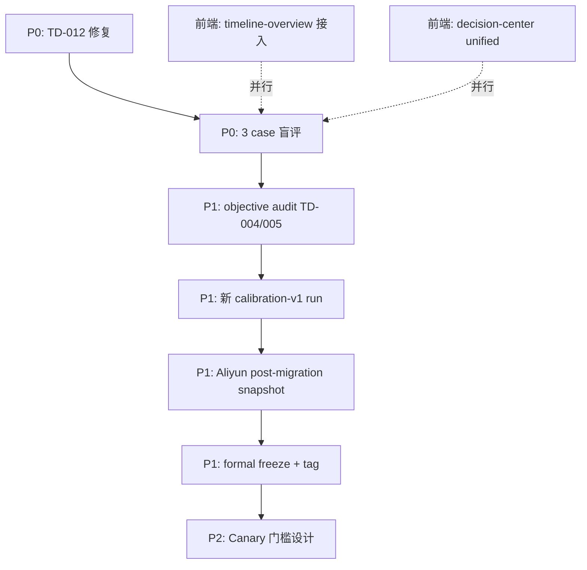

# 下一阶段任务清单

> **基线日期：** 2026-07-01  
> **当前状态：** E1 故障注入 29/29 PASS · 3-instance smoke PASS · 15-instance exploratory-v0 完成  
> **Staging Shadow：** `http://localhost:3001/api`（`DECISION_RUNTIME_MODE=SHADOW`）  
> **架构上下文：** 六层成熟度、概念校正与 calibration 后优先级见 [`DECISION_RUNTIME_MATURITY.md`](../DECISION_RUNTIME_MATURITY.md)

---

## 0. 已完成（勿重复）

| 项 | Run / 产物 |
|----|------------|
| E1 migration | `20260701170000_benchmark_batch_runner` |
| 故障注入门禁 | `artifacts/task-e1-benchmark/.fault-injection-gate.json` |
| 3-instance smoke | `bench_86c96cb1-9ed6-4f92-be13-ebe3944481bf` |
| 15-instance 探索标定 | `bench_3139558d-ac36-479d-a79a-af4e663865ae`（label: `exploratory-v0`） |
| TD-012 修复后 smoke | `bench_56625dc6-44ff-4874-94f7-bcaf876d0f48` |
| **calibration-v1**（15-instance） | `bench_eab3892f-b7e7-4f15-b1e5-440fea2b3047` |
| TD-009 MISSING_WINNER 修复验证 | `bench_a5e0e9f8-...` |
| 测试环境 freeze manifest（非正式） | `artifacts/task-e1-freeze/calibration-v1-freeze-manifest.json`（可 `--allow-skip-post-migration-snapshot`） |

**硬规则：**

- 代码变更后 → 重跑 fault injection + smoke + manual review + **新** calibration run
- **不要** resume / 覆盖 `exploratory-v0` run
- 15-instance 结论仅作语义/行为校准，**不能**推导「Lex 优于 Legacy」
- `Lex Shadow` = CP-SAT-compatible Lexicographic **Candidate Selector**，非 native CP-SAT 全行程生成

---

## 1. P0 — 阻塞 formal freeze

### 1.1 盲评 3 条 Materialized Review Cases ✅（2026-07-01）

calibration-v1（`bench_eab3892f-…`）**3/15 MATERIALIZED** 已全部提交盲评 verdict。

| reviewCaseId | tripId | preferred | submittedAt |
|--------------|--------|-----------|-------------|
| `rev_0391cf41-…` | `bench_calibration_REAL_MULTI_CANDIDATE_001` | A | 2026-07-01 |
| `rev_8b9efde6-…` | `bench_calibration_REAL_MULTI_CANDIDATE_002` | B | 2026-07-01 |
| `rev_909e8a46-…` | `bench_calibration_TD_006_three_way` | A | 2026-07-01 |

产物：`bench_eab3892f-…/reports/blind-review-submissions.json` · reviewer=`formal-calibration-closure`

~~exploratory-v0 中 **3/15 MATERIALIZED**，需人工盲评后才能声称标定证据链完整。~~

| 步骤 | 命令 / 接口 |
|------|-------------|
| 拉队列 | `GET /decision-engine/v1/shadow-reviews/queue?status=PENDING` |
| 读 case（盲化 A/B） | `GET /decision-engine/v1/shadow-reviews/:reviewCaseId` |
| 提交 verdict | `POST .../shadow-reviews/:reviewCaseId/submit` |

**提交契约：**

- `preferredOption`: `A` \| `B` \| `EQUIVALENT` \| `BOTH_INVALID` \| `INSUFFICIENT_INFORMATION`
- `scores`: reasonableness / executability / requirementFit / paceFit（1–5）
- `tradeOffSummary`, `confidence`（1–5）
- **禁止**客户端传 `preferredStrategy` / `classification`

**环境：** `:3001` SHADOW + `SHADOW_OBSERVABILITY_ENABLED=1` + blinding key 已配置。

**交付物：** 3 份 review submission 落库；汇总写入 manual evidence review notes。

**可选：** 内部 Shadow Review 小页面（见 §4.3）；CLI/curl 亦可。

---

### 1.2 TD-012 INPUT_MISMATCH 接线修复 ✅（2026-07-01）

**根因：** `canonical-plan-selection` 仅在 `DECISION_LAB_ENABLED=1` 时透传 `stagingShadowOptions`；`:3001` SHADOW 标定环境通常未开 Lab，导致 TD-012/010/011 故障注入被静默丢弃。

**修复：** `resolveStagingShadowOptionsForRequest()` — SHADOW / DUAL_RUN 模式下同样允许 fault injection；benchmark runner 合并 `stagingShadowOptions` 字段。

**验收：**

```bash
npm run test:benchmark-fault-injection          # 29/29
npx tsx scripts/decision-runtime/run-task-d-staging-shadow.ts http://localhost:3001/api --all  # 15/15 含 TD-012
```

**`:3001` 重启（加载新代码）：** 需 blinding key + SHADOW env；可用 `ts-node --transpile-only src/main.ts`（nest build 当前有无关 TS 错误时）。

---

## 2. P1 — formal calibration-v1 前

### 2.1 Objective Audit（TD-004 / TD-005）✅（2026-07-01）

```bash
npm run task-e1:objective-audit -- bench_eab3892f-b7e7-4f15-b1e5-440fea2b3047
```

产物：`bench_eab3892f-.../reports/objective-audit-TD-004.json`、`objective-audit-TD-005.json` — 均 **PASS**（L2 lex chain、same winner、cp-sat-lex-v1）。

---

### 2.2 新 Calibration Run（calibration-v1）✅（2026-07-01）

Run ID：`bench_eab3892f-b7e7-4f15-b1e5-440fea2b3047` — 15/15，TD-012 EXCLUDED，3 materialized。

---

### 2.3 Formal Post-Migration Snapshot（Aliyun）

测试环境可跳过；**正式 freeze 前**必须在 RDS 上记录 post-migration baseline。

```bash
npm run task-e1:record-post-migration-snapshot
# deployment-manifest.json → postMigrationBaselineSnapshot.status === available
```

与 pre-migration backup 是**两条独立轨道**，manifest 须同时保留两者事实。

---

### 2.4 Formal Freeze + Git Tag ✅（2026-07-02）

- **formal** freeze manifest：`artifacts/task-e1-freeze/calibration-v1-freeze-manifest.json`（`freezeTier=formal`）
- RDS post-migration snapshot：`BackupSetId=42732583`
- Git tag：`decision-benchmark-calibration-v1` @ `ba166c9af` → `origin`
- P0 状态：`artifacts/task-e1-freeze/p0-freeze-status.json` → `COMPLETE`

~~正式生产 freeze 仍须 Aliyun post-migration snapshot + git tag。~~

归档：`artifacts/task-e1-benchmark/archive/decision-runtime-2026-07-01.json`（随新 run 更新）。

---

## 3. P2 — 标定通过后（ADR-007 Sprint 5+）

> 详细优先级与「不应立即做的事」见 [`DECISION_RUNTIME_MATURITY.md` §7–§8](../DECISION_RUNTIME_MATURITY.md#7-当前不应立即做的事)。

| 优先级 | 任务 | 说明 |
|--------|------|------|
| **P1** | Decision Trigger Gateway | ✅ 骨架：`src/decision-runtime/trigger/`（`DECISION_TRIGGER_GATEWAY_ENABLED=1` 启用） |
| **P2** | Agent 收敛为 Provider | Candidate/Repair/Research/Narration/Critic 结构化输出 |
| **P2** | Constraint Gateway 渐进默认化 | OFF → SHADOW_COMPARE → ON；Grafana：`monitoring/GRAFANA_CONSTRAINT_SHADOW_IMPORT.md` |
| **P2** | Constraint shadow staging | `npm run constraint-shadow:staging` · `npm run formal-calibration:status` |
| P2 | Sprint 5 全量规划 Shadow 指标门槛 | 基于 calibration-v1 统计，定义 canary 准入 |
| P2 | Sprint 6 Canary | `DECISION_RUNTIME_MODE=CANARY`，小流量对比 |
| P2 | Objective Registry 实现 | 合同已有，Registry 代码待做（ADR-007 Sprint 3） |
| P2 | Canonical WorldStateSnapshot 实现迁移 | 合同 ✅，WorldStateStore 对齐待做 |
| P3 | AuthorizationPolicyGateway | ✅ 骨架 + authorize/execute 接线（`AUTHORIZATION_POLICY_GATEWAY_ENABLED=1`） |
| P3 | ReplanningTriggerPolicy | ✅ 骨架 + monitoring metadata enrich |
| P3 | Sprint 8 Legacy Runtime 收敛 | Canonical 达标后 deprecate **Legacy 端到端路径**（≠ legacy-frozen 策略） |
| P3 | `canonical-plan-selection` 产品化 | 前端/决策中心接入；当前仅 benchmark / lab |

---

## 4. 并行轨道 — 前端（不阻塞 E1）

### 4.1 行程详情 Tab BFF（用户默认 Tab）

**后端已就绪**，前端按 `TRIP_DETAIL_TAB_FRONTEND.md` 接入即可。

| Tab | API | 优先级 |
|-----|-----|--------|
| 时间轴 | `GET /trips/:id/timeline-overview` | **P1 高**（替换 mock stats / 待办） |
| 成员 | `GET /trips/:id/collab-overview` | P1 |
| 文件 | `tripFilesApi.*` | P0 已文档化 |

**接入步骤：** 复制 `frontend-trip-detail-tab-api.types.ts` + client → 配置 auth → 首屏 `getById` + `timeline-overview` 并行。

**Decision Runtime 变更：** 无 — 今日工作不影响上述 BFF 契约。

---

### 4.2 决策中心 Unified Gateway

按 `FE_INTEGRATION_HANDOFF.md` / `UNIFIED_DECISION_FRONTEND_INTEGRATION.md` 继续：

| 里程碑 | 内容 |
|--------|------|
| FE-UD-1 | `VITE_DECISION_GATEWAY_UNIFIED=1` + `GET decision-center` |
| L2 联调 | 冰岛 fixture `3e4a1058-...` — 日负荷 / F208 |
| 回归 | `npm run decision-center:unified-qa` |

**注意：** Staging 联调须 `RFC001_SHADOW_MODE=0`（shadow 不产生 Effective Plan）。

---

### 4.3 Shadow Review 内部 UI（可选，P0 盲评加速器）

若不用 curl，新建**内部**模块（非 C 端）：

```
GET  /decision-engine/v1/shadow-reviews/queue
GET  /decision-engine/v1/shadow-reviews/:id
POST /decision-engine/v1/shadow-reviews/:id/submit
```

Base URL 指向 `:3001` SHADOW 实例。

---

## 5. 建议执行顺序



---

## 6. 快速命令参考

```bash
# Shadow staging
npm run task-d:staging-shadow   # 或现有 :3001 启动脚本

# E1 流水线
npm run test:benchmark-fault-injection
npm run task-e1:calibration-smoke
npm run task-e1:manual-evidence-review -- bench_<id>
npm run task-e1:benchmark-batch
npm run task-e1:freeze -- bench_<id>

# 前端 QA（决策中心，:3000）
npm run decision-center:unified-env-check
npm run decision-center:unified-qa -- 3e4a1058-9218-467f-988a-c18008a14385 http://localhost:3000/api
```

---

## 7. 变更记录

| 版本 | 日期 | 说明 |
|------|------|------|
| 1.0.0 | 2026-07-01 | 初版：E1 标定收尾 + 前端并行轨道 |
| 1.1.0 | 2026-07-02 | 链至 DECISION_RUNTIME_MATURITY.md；P2 表补充治理收敛项 |
