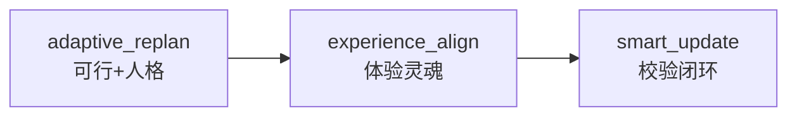

# Skill: `itinerary.experience_align` (Travel Experience Align)

> **定位**：Decision OS 的「体验灵魂」—— 在 `adaptive_replan`（可行+人格边界）之上，优化**感官节奏、情绪摩擦与惊喜留白**。

---

## 与相邻 Skill 的分工

| Skill | 回答的问题 | 决策轴 |
|-------|-----------|--------|
| `itinerary.verify` | 能不能去？ | 硬约束 |
| `itinerary.adaptive_replan` | 在人格与环境约束下怎么改才可行？ | CSP + Persona |
| **`itinerary.experience_align`** | 改完之后**好不好玩、舒不舒服**？ | Experience Flow |
| `decision.drdrePace` | 身体能不能扛住？ | 人体能力 |
| Consultation | 用户想了解什么？ | 问答，不写 itinerary |

---

## 体验四维评分

| 维度 | 含义 |
|------|------|
| `rhythm_arc` | 高潮活动是否落在日中、早晚是否留白 |
| `diversity` | 瀑布/沙滩/室内/小镇等品类是否交错 |
| `friction_budget` | 转场次数是否在 `ExperienceFlow.currentFrictionCapacity` 内 |
| `rest_quality` | 午餐/咖啡/REST 留白是否充足 |

输入可来自 `research_data.__experience_flow`，或由 `userIntent` / `personaSnapshot` 投影默认 Flow。

---

## When to Invoke

### DO

- `adaptive_replan` 之后，需要提升**旅行体验质量**而非仅满足约束
- 用户提到「体验更好」「不要太赶」「想要惊喜」「审美疲劳」
- `ITINERARY_ADJUST` 草案评分偏低（`overall < 72`）需轻量 craft

### DO NOT

- 纯可行性修补 → `itinerary.smart_update`
- 封路/天气硬约束 → `adaptive_replan`
- 单点 CRUD → `trip.applyEdit`

---

## Code Map

| 文件 | 职责 |
|------|------|
| `itinerary-experience-align.skill.ts` | Skill 入口 |
| `experience-align.types.ts` | 合同 |
| `experience-align-score.util.ts` | 四维评分 |
| `experience-align-craft.util.ts` | 轻量改排（品类交错、午餐留白） |
