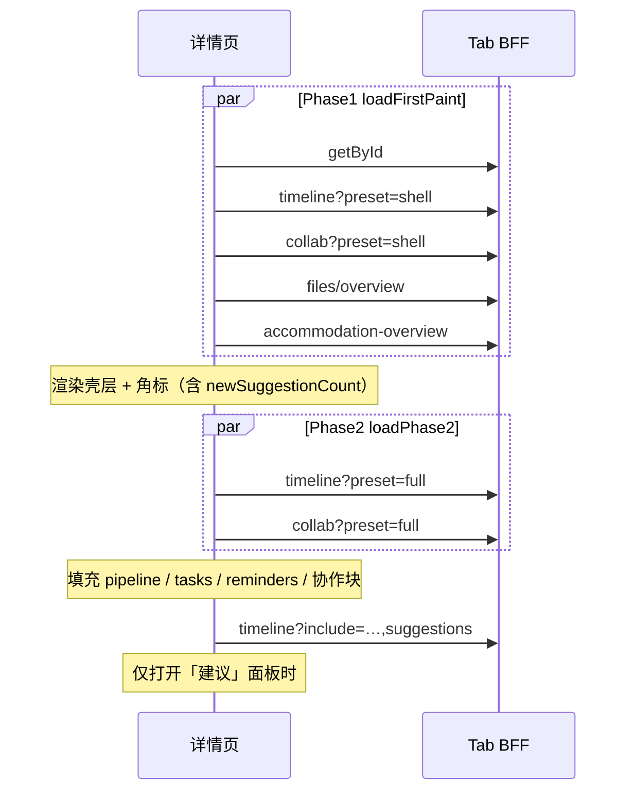

# 行程详情 Tab · 前端集成指南

> 后端类型与客户端示例：`src/trips/dto/frontend-trip-detail-tab-api.types.ts`、`frontend-trip-detail-tab-api-client.ts`  
> 复制到前端建议路径：`src/api/trip-detail-tab.types.ts`、`src/api/trip-detail-tab-client.ts`  
> **决策六层读模型边界：** [DECISION_RUNTIME_MATURITY.md §11](../decision-runtime/DECISION_RUNTIME_MATURITY.md#11-前端与决策中心如何读六层)（Tab BFF ≠ 决策写链）

---

## 1. 接入步骤

### 1.1 复制文件

| 后端文件 | 前端目标 |
|----------|----------|
| `dto/frontend-trip-detail-tab-api.types.ts` | `src/api/trip-detail-tab.types.ts` |
| `dto/frontend-trip-detail-tab-api-client.ts` | `src/api/trip-detail-tab-client.ts` |

### 1.2 配置鉴权（生产必做）

```typescript
import { configureTripDetailTabApi } from '@/api/trip-detail-tab-client';

configureTripDetailTabApi({
  baseUrl: '/api',
  getHeaders: () => ({
    Authorization: `Bearer ${getAccessToken()}`,
  }),
});
```

若已有 `apiClient` 封装，可只保留 **types**，用 axios/fetch 包装相同路径。

---

## 2. Tab 首屏调用

### 时间轴 Tab（默认）

```typescript
import { tripsApi } from '@/api/trips';
import { tripTimelineApi } from '@/api/trip-detail-tab-client';

const [trip, overview] = await Promise.all([
  tripsApi.getById(tripId),
  tripTimelineApi.getOverview(tripId),
]);

// 替换 mock
overview.stats.feasibilityScore;  // 可行性 %
overview.stats.paceScore;         // 节奏
overview.stats.conflictCount;
overview.tasks;                   // 侧栏待办
overview.todayReminders;
overview.planning.progressPercent;
```

### 成员 Tab

```typescript
import { tripCollabApi } from '@/api/trip-detail-tab-client';

const collab = await tripCollabApi.getOverview(tripId);

collab.teamHealth.progressPercent;   // 替代 collab-team-health heuristic
collab.teamHealth.discussionCount;
collab.collaborators;
collab.collaborativeTasks;

// Optimization V2 团队（二段）
if (collab.team?.teamId) {
  await teamApi.get(collab.team.teamId);
}
```

### 文件 Tab

```typescript
import { tripFilesApi } from '@/api/trip-detail-tab-client';

const overview = await tripFilesApi.loadTabData(tripId);
// overview.stats.categories → 分类卡片（含 itinerary 推导项）
// overview.items → 合并列表（trip_file + 确认号/链接/待补充）
// overview.sources → 各数据源计数
```

### 住宿 Tab

```typescript
import { tripAccommodationApi } from '@/api/trip-detail-tab-client';

const overview = await tripAccommodationApi.loadTabData(tripId);
// overview.stats → 总晚数 / 已订 / 待订 / 缺凭证
// overview.nights → 按晚卡片（含 crossDayInfo、资料、路线）
// overview.reminders → 提醒条
```

### 活动 Tab

```typescript
import { tripActivityFavoritesApi } from '@/api/trip-detail-tab-client';

const { itineraryItemIds } = await tripActivityFavoritesApi.list(tripId);

await tripActivityFavoritesApi.toggleItineraryItem(tripId, activityItem.id, true);
```

---

## 3. API 速查

| 客户端 | 方法 | HTTP |
|--------|------|------|
| `tripFilesApi` | `getOverview` / `loadTabData` | `GET /trips/:id/files/overview` |
| `tripFilesApi` | `getList` | `GET /trips/:id/files` |
| `tripFilesApi` | `getStats` | `GET /trips/:id/files/stats` |
| `tripFilesApi` | `upload` | `POST /trips/:id/files` |
| `tripFilesApi` | `createPending` | `POST /trips/:id/files/pending` |
| `tripFilesApi` | `getDownloadUrl` | `GET /trips/:id/files/:fileId/download` |
| `tripFilesApi` | `delete` | `DELETE /trips/:id/files/:fileId` |
| `tripTimelineApi` | `getOverview` | `GET /trips/:id/timeline-overview` |
| `tripCollabApi` | `getOverview` | `GET /trips/:id/collab-overview` |
| `tripAccommodationApi` | `getOverview` / `loadTabData` | `GET /trips/:id/accommodation-overview` |
| `tripActivityFavoritesApi` | `list` | `GET /trips/:id/activity-favorites` |
| `tripActivityFavoritesApi` | `setFavorite` / `toggleItineraryItem` | `POST /trips/:id/activity-favorites` |

---

## 4. 与现有 `tripsApi` 的关系

| 数据 | 仍用页面级 `tripsApi` | 改用 Tab BFF |
|------|-------------------------|--------------|
| 行程主体 / 日程项 | `getById` | — |
| 时间轴顶部统计 + 侧栏 | — | `tripTimelineApi.getOverview` |
| 成员协作聚合 | — | `tripCollabApi.getOverview` |
| 住宿按晚卡片 | `getById` 推导 | `tripAccommodationApi.getOverview` |
| 活动收藏 Heart | 纯前端状态 | `tripActivityFavoritesApi.list` + `setFavorite` |
| 文件列表/统计 | — | `tripFilesApi.getOverview`（推荐）或 `getList` + `getStats` |
| 预算 / 地图 / 决策记录 | 各 Tab 原 API | 不变 |

**决策写操作**（evaluate / authorize / execute）不在 Tab BFF 内完成，见 [Decision Center 对接](../decision-semantics/UNIFIED_DECISION_FRONTEND_INTEGRATION.md) 与 [六层前端读法](../decision-runtime/DECISION_RUNTIME_MATURITY.md#11-前端与决策中心如何读六层)。

进入详情页建议 **两段加载**：

```typescript
import { tripDetailTabApi } from '@/api/trip-detail-tab-client';

// Phase 1 — 首屏（与 getById 并行，~600ms 级）
const firstPaint = await tripDetailTabApi.loadFirstPaint(tripId);

// Phase 2 — 进入时间轴/成员 Tab 或 requestIdleCallback
const phase2 = await tripDetailTabApi.loadPhase2(tripId);

// Phase 3 — 打开建议面板时
const withSuggestions = await tripTimelineApi.getOverviewWithSuggestions(tripId);
```

单 Tab 也可用 `getShellOverview` → `getPhase2Overview` → `getOverviewWithSuggestions`。

### 6. 性能（2026-07-02 本地 profiling）

| 端点 | 优化前 p95 | 优化后 p95 | `preset=shell` p95 |
|------|-----------|-----------|-------------------|
| timeline-overview (default) | ~1756ms | **~990ms** | **~550ms** |
| collab-overview (full) | ~2788ms | **~186ms** | **~90ms** |
| collaborative-tasks | ~2132ms | **~150ms** | — |
| **loadFirstPaint**（shell×2+files+accommodation） | — | **~497ms** | — |
| **loadPhase2**（timeline+collab full） | — | **~1291ms** | — |
| **page-first-paint**（getById + loadFirstPaint） | ~4s+ | **~582ms** | — |
| **并行 4 Tab**（无 preset，旧写法） | ~3885ms | ~1390ms | — |

**Timeline 优化：** 合并 persona-alerts / conflicts 单次拉取；`useRouteApi:false`；pipeline/tasks/suggestions 共享 trip context；stats 含轻量 `newSuggestionCount`。

**Collab 优化：** `listOpenProblemSeedsLite` + batch activeRounds。

脚本：`npm run trip-detail-tab:bff-profile`、`npm run trip-detail-tab:bff-perf`

---

## 7. 接口变更与前端迁移（v1.7）

> **Decision Runtime / E1 标定** 不要求前端改接口；本节仅 **Tab BFF 性能优化** 相关。

### 7.1 后端改了什么（摘要）

| 接口 | 变更 | 兼容性 |
|------|------|--------|
| `GET /trips/:id/timeline-overview` | 新增 Query `preset=shell\|full`；**默认 include 去掉 `suggestions`**；`stats.newSuggestionCount` 仍返回 | ⚠️ 见 7.3 |
| `GET /trips/:id/collab-overview` | 新增 `preset=shell\|full`；collab 全量后端更快 | ✅ 响应结构不变 |
| `GET /trips/:id/collaborative-tasks` | 无路径/字段变更；服务端轻量实现 | ✅ |
| 其余 Tab BFF | 无变更 | ✅ |

**Query 优先级：** 显式 `include=` **始终优先于** `preset`。

| preset | timeline 等价 include | collab 等价 include |
|--------|----------------------|---------------------|
| `shell` | `stats` | `members,health` |
| `full` | `stats,pipeline,tasks,reminders`（**无** suggestions 列表） | 全量 members/tasks/domain/… |

### 7.2 推荐加载时序（三段）



### 7.3 Breaking：谁必须改

| 场景 | 旧行为 | 现在 | 前端动作 |
|------|--------|------|----------|
| 裸调 `timeline-overview` 且用响应里的 **suggestions 派生列表** | 默认带 suggestions | 默认**不带** | 加 `include=suggestions` 或 `getOverviewWithSuggestions()` |
| 仅用 **角标数字** `stats.newSuggestionCount` | 有 | **仍有**（轻量计数） | **无需改** |
| 首屏一次拉全量 timeline/collab | 3–4s | 仍慢 | 改用 **Phase1 shell** |
| 已写 `preset=shell` | — | 不变 | **无需改** |

### 7.4 Client 复制清单

从后端复制到前端（若尚未复制）：

- `dto/frontend-trip-detail-tab-api.types.ts` → `src/api/trip-detail-tab.types.ts`
- `dto/frontend-trip-detail-tab-api-client.ts` → `src/api/trip-detail-tab-client.ts`

**新增/变更 API（client）：**

```typescript
import {
  tripDetailTabApi,
  tripTimelineApi,
  tripCollabApi,
  TRIP_DETAIL_TAB_BFF_INCLUDES,
} from '@/api/trip-detail-tab-client';

// Phase 1 — 首屏四 Tab（≈ loadFirstPaint）
const { timeline, collab, files, accommodation } =
  await tripDetailTabApi.loadFirstPaint(tripId);

// 与 getById 并行（整页首屏）
const [trip, firstPaint] = await Promise.all([
  tripsApi.getById(tripId),
  tripDetailTabApi.loadFirstPaint(tripId),
]);

// Phase 2 — idle / 进入时间轴或成员 Tab
const { timeline: t2, collab: c2 } = await tripDetailTabApi.loadPhase2(tripId);

// Phase 3 — 建议面板
const withSuggestions = await tripTimelineApi.getOverviewWithSuggestions(tripId);

// 常量（与后端 BFF_INCLUDE_PRESETS 对齐）
TRIP_DETAIL_TAB_BFF_INCLUDES.timelineShell;           // 'stats'
TRIP_DETAIL_TAB_BFF_INCLUDES.timelinePhase2;          // 'stats,pipeline,tasks,reminders'
TRIP_DETAIL_TAB_BFF_INCLUDES.timelineWithSuggestions; // + suggestions
```

### 7.5 页面状态合并示例

```typescript
const [timeline, setTimeline] = useState<TimelineOverviewResponse | null>(null);

useEffect(() => {
  let cancelled = false;
  (async () => {
    const shell = await tripTimelineApi.getShellOverview(tripId);
    if (!cancelled) setTimeline(shell);

    const phase2 = await tripTimelineApi.getPhase2Overview(tripId);
    if (!cancelled) setTimeline((prev) => ({ ...prev, ...phase2 }));
  })();
  return () => { cancelled = true; };
}, [tripId]);
```

**注意：** Phase2 会覆盖 `stats`（含 `newSuggestionCount`）、`planning`、`tasks`、`todayReminders`；不要在 Phase1 后长期只展示 shell 的 `tasks: []`。

### 7.6 仍走原 REST 的场景

| 能力 | 接口 | 说明 |
|------|------|------|
| 建议完整 CRUD / 应用 | `GET/POST /trips/:id/suggestions` | 与 BFF 独立；面板可只用此 API |
| 决策写链 | Decision Center / Gateway | 见 Decision Runtime 文档 |
| 行程主体 | `GET /trips/:id` | 不变 |

### 7.7 验收清单

- [ ] 首屏改为 `loadFirstPaint` 或 shell preset，不再并行 4 个**无 preset** 的 overview
- [ ] 时间轴角标读 `stats.newSuggestionCount`，不依赖 suggestions 列表
- [ ] 侧栏 tasks / reminders 在 Phase2 后展示
- [ ] 建议面板打开时再拉 `getOverviewWithSuggestions` 或 `GET /suggestions`
 - [ ] 成员 Tab：首屏 `collab?preset=shell`，协作块 lazy `preset=full`

---

## 5. 变更记录

| 版本 | 日期 | 说明 |
|------|------|------|
| 1.0.0 | 2026-07-02 | 初版：files + timeline-overview + collab-overview 类型与 client |
| 1.1.0 | 2026-07-02 | 新增 `files/overview` 聚合 BFF 与 `getOverview` / `loadTabData` |
| 1.2.0 | 2026-07-02 | 新增 `accommodation-overview` BFF 与 `tripAccommodationApi` |
| 1.3.0 | 2026-07-02 | 新增 `activity-favorites` API 与 `tripActivityFavoritesApi` |
| 1.4.0 | 2026-07-02 | `preset=shell|full` 首屏优化；client `getShellOverview()` |
| 1.5.0 | 2026-07-02 | collaborative-tasks 轻量路径（`listOpenProblemSeedsLite`） |
| 1.6.0 | 2026-07-02 | timeline-overview 子调用 dedup + stats 轻量 suggestionCount |
| 1.7.0 | 2026-07-02 | 默认 include 不含 suggestions；`loadFirstPaint` / `loadPhase2` client |
