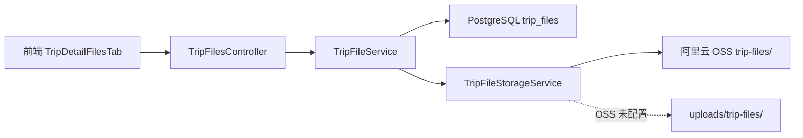
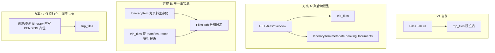

# 行程详情 · 文件 Tab API

> **版本**: 1.0.0  
> **Base**: `/api/trips/:tripId/files`（`apiClient` 默认前缀 `/api`）  
> **状态**: 已实现 · 待 migration 部署 + 前端对接  
> **关联 UI**: `TripDetailFilesTab`  
> **关联契约**: 行程详情 Tab 后端接口契约 §3.7（前端文档）
> **关联文档**: [TRIP_DETAIL_API_DOCUMENTATION.md](./TRIP_DETAIL_API_DOCUMENTATION.md)  
> **实现**: `src/trips/trip-files/`

**最后更新**: 2026-07-02

---

## 1. 概述

文件 Tab 原先为前端 mock（分类卡片、最近更新、空间配额）。本模块提供 **行程级文件 CRUD + 统计读模型**，替代 mock，支撑详情页「文件」Tab 首屏与交互。

| 能力 | 说明 |
|------|------|
| 列表 / 分页 | 按分类、状态筛选 |
| 统计 BFF | 总数、已上传、待补充、即将过期、空间用量、分类计数 |
| **聚合读模型** | `GET /files/overview` 合并 `trip_files` + 行程项预订资料（方案 A） |
| 上传 | multipart，OSS 优先、本地降级 |
| 待补充占位 | 无附件记录，用于 checklist 式「缺什么补什么」 |
| 下载 | OSS 签名 URL（1h）或本地/CDN 直链 |
| 删除 | 软删 DB + 尽力删存储对象 |

---

## 2. 鉴权与访问控制

| 项 | 行为 |
|----|------|
| 生产环境 | 需登录；`CurrentUser.userId` 必须为行程成员 |
| 成员判定 | `TripCollaborator` 含该 userId，或 `trip.metadata.userId` 为 owner |
| 非生产 | 无 token 时使用 `anonymous-dev-user`（与 silent-votes 等模块一致） |
| Controller | 当前 `@Public()`，成员校验在 Service 层 |

**403** — 非成员访问  
**401** — 生产环境未登录

---

## 3. 数据模型

### 3.1 持久化 `trip_files`

| 字段 | 类型 | 说明 |
|------|------|------|
| `id` | UUID | 主键 |
| `trip_id` | string | 关联 `Trip.id`，CASCADE 删除 |
| `uploaded_by_user_id` | string | 上传者 / 创建者 |
| `category` | string | 见 §3.2 |
| `status` | string | `UPLOADED` \| `PENDING` \| `EXPIRED` |
| `file_name` | string? | 原始文件名（PENDING 可为空） |
| `mime_type` | string? | |
| `storage_key` | string? | OSS key 或本地绝对路径 |
| `file_url` | string? | 公开/CDN URL（可选） |
| `file_size_bytes` | int | 默认 0 |
| `title` | string? | 展示标题 |
| `description` | string? | |
| `expires_at` | timestamptz? | 过期时间；读时自动标记 EXPIRED |
| `itinerary_item_id` | UUID? | 可选关联行程项 |
| `metadata` | jsonb? | 扩展预留 |

Migration: `prisma/migrations/20260702120000_trip_files`

### 3.2 文件分类 `category`

| `id` | 标题 | 说明 |
|------|------|------|
| `booking` | 预订凭证 | 机票、酒店、活动预订确认 |
| `travel` | 出行资料 | 行程单、交通票、地图 |
| `insurance` | 保险 | 旅行保险单及理赔资料 |
| `receipts` | 收据 | 消费收据与报销凭证 |
| `visa` | 签证 | 签证、护照复印件 |
| `team` | 团队共享 | 团队内共享文件 |

### 3.3 状态 `status`

| 值 | 含义 |
|----|------|
| `UPLOADED` | 已有附件，可下载 |
| `PENDING` | 占位，待用户上传 |
| `EXPIRED` | `expires_at` 已过（列表/stats 读前自动批量更新） |

**即将过期**（stats）：`UPLOADED` 且 `expires_at` 在未来 30 天内。

---

## 4. 接口列表

| 优先级 | 方法 | 路径 | 说明 |
|--------|------|------|------|
| **P0** | GET | `/trips/:tripId/files/overview` | 聚合读模型（trip_files + itinerary） |
| **P0** | GET | `/trips/:tripId/files` | 文件列表 |
| **P0** | GET | `/trips/:tripId/files/stats` | 统计与空间 |
| P1 | POST | `/trips/:tripId/files` | multipart 上传 |
| P1 | POST | `/trips/:tripId/files/pending` | 创建待补充占位 |
| P1 | DELETE | `/trips/:tripId/files/:fileId` | 删除 |
| P2 | GET | `/trips/:tripId/files/:fileId/download` | 下载签名 URL |

统一响应包装：

```typescript
// 成功
{ success: true, data: T }

// 失败（部分 4xx 直接抛 Nest 异常体）
{ success: false, error: { code: string, message: string } }
```

---

## 5. 接口明细

### 5.0 `GET /trips/:tripId/files/overview`

**方案 A 聚合 BFF**：一次返回 Files Tab 首屏所需的统计 + 合并列表，数据源包括：

| `source` | 含义 | 来源 |
|----------|------|------|
| `trip_file` | 已上传/占位文件 | `trip_files` 表 |
| `itinerary_booking` | 确认号 / note 内嵌资料 | `ItineraryItem.bookingConfirmation`、`note.bookingDocuments` |
| `itinerary_link` | 预订链接 | `ItineraryItem.bookingUrl` 或内嵌 doc URL |
| `itinerary_pending` | 缺资料占位 | 需预订但无附件/确认号/链接的行程项 |

#### Query

| 参数 | 类型 | 说明 |
|------|------|------|
| `category` | string | 同 §3.2 |
| `status` | string | `UPLOADED` / `PENDING` / `EXPIRED` / `REFERENCE` / `LINK` |
| `source` | string | 见上表 |
| `limit` | number | 默认 50，最大 200 |
| `offset` | number | 默认 0 |
| `includePending` | boolean | 默认 `true`；`false` 隐藏 `itinerary_pending` |

#### Response `data`

```typescript
interface TripFileOverviewResponse {
  tripId: string;
  stats: TripFileStatsResponse; // 合并后的统计（pending 含 itinerary 缺口）
  items: TripFileOverviewItem[];
  total: number;
  limit: number;
  offset: number;
  sources: {
    tripFileCount: number;
    itineraryDocumentCount: number;
    itineraryPendingCount: number;
    itineraryLinkCount: number;
  };
  generatedAt: string;
}
```

**前端建议**：Files Tab 首屏优先调用本接口（`tripFilesApi.getOverview` / `loadTabData`），替代分别请求 `stats` + `list`。

---

### 5.1 `GET /trips/:tripId/files`

行程文件列表，按 `updatedAt` 降序。

#### Query

| 参数 | 必填 | 默认 | 说明 |
|------|------|------|------|
| `category` | 否 | — | `booking` / `travel` / … |
| `status` | 否 | — | `UPLOADED` / `PENDING` / `EXPIRED` |
| `limit` | 否 | `50` | 1～200 |
| `offset` | 否 | `0` | ≥ 0 |

#### 响应 `data`

```typescript
interface TripFileListResponse {
  items: TripFileItem[];
  total: number;
  limit: number;
  offset: number;
}

interface TripFileItem {
  id: string;
  tripId: string;
  category: string;
  status: 'UPLOADED' | 'PENDING' | 'EXPIRED';
  fileName: string | null;
  mimeType: string | null;
  fileSizeBytes: number;
  title: string | null;
  description: string | null;
  expiresAt: string | null;      // ISO 8601
  itineraryItemId: string | null;
  uploadedByUserId: string;
  createdAt: string;
  updatedAt: string;
}
```

#### 示例

```bash
curl -s "http://localhost:3000/api/trips/{tripId}/files?category=booking&limit=20"
```

```json
{
  "success": true,
  "data": {
    "items": [
      {
        "id": "a1b2c3d4-e5f6-7890-abcd-ef1234567890",
        "tripId": "trip-uuid",
        "category": "booking",
        "status": "UPLOADED",
        "fileName": "hotel-confirmation.pdf",
        "mimeType": "application/pdf",
        "fileSizeBytes": 245760,
        "title": "雷克雅未克酒店确认单",
        "description": null,
        "expiresAt": "2026-08-01T00:00:00.000Z",
        "itineraryItemId": null,
        "uploadedByUserId": "user-uuid",
        "createdAt": "2026-07-01T10:00:00.000Z",
        "updatedAt": "2026-07-01T10:00:00.000Z"
      }
    ],
    "total": 1,
    "limit": 20,
    "offset": 0
  }
}
```

---

### 5.2 `GET /trips/:tripId/files/stats`

Tab 首屏：分类卡片 + 空间用量 + 汇总数字。

#### 响应 `data`

```typescript
interface TripFileStatsResponse {
  totalCount: number;
  uploadedCount: number;
  pendingCount: number;
  expiringSoonCount: number;
  storageUsedBytes: number;
  storageQuotaBytes: number;
  categories: Array<{
    id: string;
    title: string;
    description: string;
    count: number;
  }>;
}
```

| 字段 | 计算规则 |
|------|----------|
| `uploadedCount` | `status === 'UPLOADED'` |
| `pendingCount` | `status === 'PENDING'` |
| `expiringSoonCount` | `UPLOADED` 且 `expires_at` ∈ [now, now+30d] |
| `storageUsedBytes` | 所有 `UPLOADED` 的 `file_size_bytes` 之和 |
| `storageQuotaBytes` | 默认 10 GB；见 §7 环境变量 |
| `categories[].count` | 该 trip 下该 category 记录总数（含 PENDING） |

#### 示例

```json
{
  "success": true,
  "data": {
    "totalCount": 12,
    "uploadedCount": 9,
    "pendingCount": 2,
    "expiringSoonCount": 1,
    "storageUsedBytes": 1331691520,
    "storageQuotaBytes": 10737418240,
    "categories": [
      { "id": "booking", "title": "预订凭证", "description": "机票、酒店、活动预订确认", "count": 4 },
      { "id": "travel", "title": "出行资料", "description": "行程单、交通票、地图", "count": 2 },
      { "id": "insurance", "title": "保险", "description": "旅行保险单及理赔资料", "count": 1 },
      { "id": "receipts", "title": "收据", "description": "消费收据与报销凭证", "count": 0 },
      { "id": "visa", "title": "签证", "description": "签证、护照复印件", "count": 3 },
      { "id": "team", "title": "团队共享", "description": "团队内共享文件", "count": 2 }
    ]
  }
}
```

**前端对接建议**：首屏并行 `GET /files/stats` + `GET /files?limit=10`（最近更新）；点击分类再带 `category` 过滤。

---

### 5.3 `POST /trips/:tripId/files`

multipart 上传。

#### Body（multipart/form-data）

| 字段 | 必填 | 说明 |
|------|------|------|
| `file` | 是 | 二进制 |
| `category` | 是 | §3.2 |
| `title` | 否 | 默认 `file.originalname` |
| `description` | 否 | |
| `expiresAt` | 否 | ISO 8601 |
| `itineraryItemId` | 否 | 关联住宿/活动等 |

#### 约束

| 项 | 值 |
|----|-----|
| 单文件上限 | 20 MB |
| 允许 MIME | pdf, jpeg/png/webp/gif, doc/docx, xls/xlsx, txt, csv |
| 配额 | 上传前校验 `storageUsedBytes + size ≤ storageQuotaBytes` |

#### 响应

`201` + `data: TripFileItem`（`status: UPLOADED`）

#### 错误

| 场景 | HTTP |
|------|------|
| 分类无效 | 400 |
| 文件过大 / MIME 不支持 | 400 |
| 空间不足 | 400 `行程文件空间配额不足` |

---

### 5.4 `POST /trips/:tripId/files/pending`

创建无附件占位（checklist / 系统预置「待补充项」）。

#### Body（JSON）

```typescript
{
  category: string;           // 必填
  title?: string;
  description?: string;
  expiresAt?: string;
  itineraryItemId?: string;
}
```

#### 响应

`201` + `data: TripFileItem`（`status: PENDING`，`fileName`/`mimeType`/`storageKey` 为 null）

---

### 5.5 `GET /trips/:tripId/files/:fileId/download`

#### 响应 `data`

```typescript
{
  fileId: string;
  fileName: string;
  mimeType: string | null;
  downloadUrl: string;   // OSS signatureUrl（1h）或 CDN/本地 URL
  expiresAt: string;     // URL 过期时间 ISO 8601
}
```

| 场景 | HTTP |
|------|------|
| 文件不存在 | 404 |
| `status !== UPLOADED` | 400 `文件尚未上传，无法下载` |

---

### 5.6 `DELETE /trips/:tripId/files/:fileId`

删除 DB 记录；若存在 `storage_key` 则尽力删除 OSS/本地对象（失败不阻塞 DB 删除）。

#### 响应

```json
{ "success": true, "data": { "deleted": true } }
```

---

## 6. 存储架构



| 环境 | 行为 |
|------|------|
| OSS 已配置 | `ALIYUN_OSS_*` → key `trip-files/{uuid}.ext` |
| OSS 未配置 | 写入 `TRIP_FILES_UPLOAD_DIR` 或 `uploads/trip-files/` |
| 下载 | OSS → `signatureUrl` 1h；本地 → `FILE_STORAGE_BASE_URL` + 相对路径 |

---

## 7. 环境变量

| 变量 | 默认 | 说明 |
|------|------|------|
| `TRIP_FILES_STORAGE_QUOTA_BYTES` | `10737418240` (10 GB) | 每行程空间配额 |
| `TRIP_FILES_UPLOAD_DIR` | `{cwd}/uploads/trip-files` | 本地存储目录 |
| `ALIYUN_OSS_REGION` | — | OSS 区域 |
| `ALIYUN_OSS_ACCESS_KEY_ID` | — | |
| `ALIYUN_OSS_ACCESS_KEY_SECRET` | — | |
| `ALIYUN_OSS_BUCKET` | — | |
| `ALIYUN_OSS_CDN_DOMAIN` | — | 上传后 `file_url` |
| `FILE_STORAGE_BASE_URL` | — | 本地下载 URL 前缀 |

---

## 8. 代码索引

| 路径 | 说明 |
|------|------|
| `trip-files/trip-files.controller.ts` | 路由 |
| `trip-files/services/trip-file.service.ts` | 业务逻辑 |
| `trip-files/services/trip-file-storage.service.ts` | OSS / 本地 |
| `trip-files/services/trip-file-access.service.ts` | 成员校验 |
| `trip-files/dto/trip-file.dto.ts` | 响应类型 |
| `trip-files/trip-file.constants.ts` | 分类 / 限额 |
| `trip-files/trip-files.module.ts` | Nest 模块 |
| `trips.module.ts` | 注册 `TripFilesModule` |

---

## 9. 部署清单

- [ ] `npx prisma migrate deploy`（或 dev 环境 `migrate dev`）
- [ ] 生产配置 OSS + CDN
- [ ] 移除 Controller `@Public()` 或保留并与全局 Auth 策略对齐（见 §10）
- [ ] 前端 `src/api/trips.ts` 新增 `getFiles` / `getFileStats` / `uploadFile` 等

---

## 10. 架构师 · 现状评估与下一步决策

### 10.1 当前实现边界（V1 已做什么 / 没做什么）

| 维度 | V1 状态 | 说明 |
|------|---------|------|
| 独立文件库 | ✅ | `trip_files` 表 |
| Tab 首屏 P0 | ✅ | `overview` 聚合 + `stats` + `list` |
| 行程项资料聚合 | ✅ | `GET /files/overview`（方案 A） |
| 上传 / 删除 | ✅ | 基础 CRUD |
| 待补充占位 | ✅ | `POST .../pending` + itinerary 缺口推导 |
| 行程项关联 | ⚠️ 仅字段 | `itineraryItemId` 可写；overview 会按关联去重 pending |
| pending 推导 | ✅ | overview 合并 `trip_files.PENDING` + itinerary 缺资料 |
| 权限粒度 | ⚠️ | 成员只读/写相同；无「仅 owner 可删」 |
| 审计 / 版本 | ❌ | 无历史版本、无操作日志 |
| 病毒扫描 | ❌ | 无 |
| 生产鉴权 | ⚠️ | `@Public()` + Service 层成员校验 |

### 10.2 与详情页其他 Tab 缺口的对照

按行程详情 Tab 契约 §5，文件 Tab P0 **已补齐**；其余 P0/P1 缺口仍在：

| Tab | 缺口 | 建议 BFF / 动作 | 优先级建议 |
|-----|------|-----------------|------------|
| **时间轴** | 规划进度 / 待办 mock | `GET /trips/:id/timeline-overview` 或对接现有 `tasks` + `health` | **P1 高**（用户默认 Tab） |
| **成员** | 协作统计 heuristic | `GET /trips/:id/collab-overview` | P1 |
| **住宿** | 预订资料在 item metadata | ✅ `accommodation-overview` BFF | — |
| **活动** | 封面 / 收藏 | 扩展 Place 或 favorites API | P2 |
| **文件** | 与 itinerary 资料统一 | ✅ 方案 A `files/overview` 已实现 | — |

### 10.3 文件模块 · 三条演进路线（需产品/架构选型）



| 方案 | 适用 | 优点 | 代价 |
|------|------|------|------|
| **A. files-overview BFF** | 短期最快统一 UI | 前端一次请求；pending 可合并 itinerary 缺口 | 双数据源一致性、缓存失效 |
| **B. itinerary 为 SOT** | 资料强绑定 POI/住宿 | 模型清晰 | 大改住宿 Tab + 迁移 metadata |
| **C. 独立表 + 同步占位** | 维持 V1 表结构 | 渐进；checklist 可自动化 | 需定义同步规则与冲突策略 |

**建议**：若 Files Tab 要展示「酒店确认单还缺 2 份」，选 **A 或 C**；若资料只在住宿卡片管理、Files Tab 只做「行程级文档库」，维持 **V1 + 前端分 Tab 入口** 即可。

### 10.4 推荐实施顺序（架构视角）

| 阶段 | 动作 | 负责 | 阻塞 |
|------|------|------|------|
| **S0** | migration 部署 + 前端对接 `stats`/`list` 去 mock | BE + FE | 无 |
| **S1** | 上传/删除 UI 对接；生产 OSS | FE + DevOps | OSS 凭证 |
| **S2** | 方案 A `files/overview` 前端对接 | FE | ✅ BE 已实现 |
| **S3** | `timeline-overview` BFF（默认 Tab 体验） | BE | ✅ 已实现，见 [TIMELINE_OVERVIEW_API.md](./TIMELINE_OVERVIEW_API.md) |
| **S4** | `collab-overview` BFF（成员 Tab） | BE | ✅ 已实现，见 [COLLAB_OVERVIEW_API.md](./COLLAB_OVERVIEW_API.md) |
| **S5** | 文件：鉴权收紧、owner 删、审计日志 | BE | 合规需求时 |

### 10.5 快速决策树

```
Files Tab 是否要展示「住宿/活动缺资料」？
├─ 否 → S0+S1 完成即可，V1 闭环
└─ 是 → 是否与 accommodation Tab 共用同一份资料？
    ├─ 是 → 倾向方案 B（长期）或 A（过渡）
    └─ 否 → 方案 C：itinerary 变更时 POST /files/pending 预置
```

### 10.6 前端 API 封装建议

```typescript
// src/api/trip-files.ts（建议新建，与 trips.ts 解耦）
tripFilesApi.getOverview(tripId, { category?, status?, source?, limit?, offset?, includePending? })
tripFilesApi.loadTabData(tripId) // 等价 getOverview({ limit: 50 })
tripFilesApi.getList(tripId, { category?, limit?, offset?, status? })
tripFilesApi.getStats(tripId)
tripFilesApi.upload(tripId, FormData)
tripFilesApi.createPending(tripId, body)
tripFilesApi.getDownloadUrl(tripId, fileId)
tripFilesApi.delete(tripId, fileId)
```

---

## 11. 变更记录

| 版本 | 日期 | 说明 |
|------|------|------|
| 1.1.0 | 2026-07-02 | 新增 `GET /files/overview` 方案 A 聚合 BFF |
| 1.0.0 | 2026-07-02 | 初版：P0 list/stats + P1 上传/删除/pending + P2 download |
