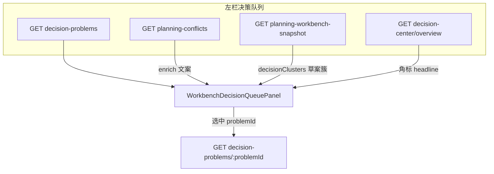

# 决策空间左栏 — 决策队列 Workbench BFF 对接文档

> **读者：** 规划工作台 / 决策空间前端  
> **组件：** `WorkbenchDecisionQueuePanel` · `DecisionQueueClusterList` · `useDecisionProblemSpaceContent`  
> **相关契约：** [DECISION_SEMANTICS_FRONTEND_API.md](./DECISION_SEMANTICS_FRONTEND_API.md) · [DECISION_SSOT_FRONTEND_MIGRATION.md](./DECISION_SSOT_FRONTEND_MIGRATION.md) · [ARRANGE_ITINERARY_API.md](../arrange-itinerary/ARRANGE_ITINERARY_API.md)  
> **前缀：** `/api/trips/:tripId/` · 响应壳 `{ success, data, error }`

---

## 1. 产品定位

决策空间左侧 **「决策队列」不是单一 REST 接口**，而是多源 BFF 合并读模型：

| 数据源 | 职责 |
|--------|------|
| `decision-problems` | **列表 SSOT** — 每一行 = 一个待处理决策问题（含已 publish 的 DecisionCase） |
| `decision-opportunities` | **机会 inbox** — 未过门槛；默认不进决策空间（见 [DECISION_CASE_BACKEND_HANDOFF](../../decision-runtime/decision-cases/DECISION_CASE_BACKEND_HANDOFF.md)） |
| `planning-conflicts` | 文案 enrich（category / priority / message）与数量对齐验收 |
| `planning-workbench-snapshot` | **草案级**决策簇标题（来自待确认 `PlanProposal`） |
| `decision-center/overview` | 角标、headline、进度摘要 |

中栏详情与左栏列表 **分开请求**：选中 `problemId` 后调 `GET decision-problems/:problemId`。

**决策检查器（四 Tab）** — 决策空间无草案时：

```http
GET /api/trips/:tripId/arrange-itinerary/decision-inspector?problemId={decision-problems[].problemId}
```

响应 `mode: "problem"` + `tabEmptyState` 标示各 Tab 是否空态；详见 [ARRANGE_ITINERARY_API.md §决策检查器](../arrange-itinerary/ARRANGE_ITINERARY_API.md)。

---

## 2. 前端路径（Gateway 开 / 关）

### 2.1 主路径（`useDecisionProblemsBff = true`，默认）

```
WorkbenchDecisionQueuePanel
  ├─ useDecisionProblemsList        → GET decision-problems
  ├─ usePlanningConflicts           → GET planning-conflicts（enrich）
  ├─ usePlanningWorkbenchSnapshot   → GET arrange-itinerary/planning-workbench-snapshot
  ├─ useDecisionCenterOverview      → GET decision-center/overview（可选）
  └─ DecisionQueueClusterList       → 展示 decisionProblems[]
        enrichDecisionProblemsForQueueDisplay(problems, conflicts)
        bffClusters={scheduleDecisionQueueClusters}  // 来自 snapshot.copilot.decisionClusters
```

### 2.2 兜底路径（`useLegacy = true`）

当 `decision-problems` 不可用时，左侧直接渲染：

```
GET planning-conflicts?includeConstraintsSummary=1&includeDecisionChecker=1
```

决策空间下可带 `focusConflictId`。选中后仍应尽量切 `decision-problems/:id`（若 Gateway 部分可用）。

---

## 3. 数据流



---

## 4. 接口详解与示例

以下示例来自冰岛联调行程 `3e4a1058-9218-467f-988a-c18008a14385`（字段已裁剪）。

### 4.1 列表主体 — `GET /decision-problems`

**Hook：** `useDecisionProblemsList` → `fetchDecisionProblemsList`

```http
GET /api/trips/:tripId/decision-problems
```

```json
{
  "success": true,
  "data": {
    "schemaId": "tripnara.unified_decision_problems@v2",
    "tripId": "3e4a1058-9218-467f-988a-c18008a14385",
    "generatedAt": "2026-07-06T10:32:43.343Z",
    "meta": {
      "total": 1,
      "openCount": 1,
      "actionableCount": 1,
      "occurrenceCount": 1,
      "byEnforcement": { "REQUIRE_ADJUSTMENT": 1 }
    },
    "items": [
      {
        "problemId": "dp_id:plan_object_plan_object_meal_late_arrival_po_..._meal_windo",
        "semanticKey": "id",
        "instanceKey": "id:trip:3e4a1058:problem:dp_id:plan_object_...",
        "type": "RISK",
        "dimension": "SCHEDULE",
        "enforcement": "REQUIRE_ADJUSTMENT",
        "phase": "PLANNING",
        "workflowStatus": "ASSESSING",
        "executionStatus": "NOT_STARTED",
        "title": "预计 红沙滩 结束于 16:00，晚于午餐窗 12:00",
        "summary": "预计 红沙滩 结束于 16:00，晚于午餐窗 12:00",
        "actionability": {
          "requiresAction": true,
          "allowedActions": ["REPAIR", "ALTERNATIVE", "PLAN_B", "DEFER"],
          "recommendedAction": "REPAIR"
        },
        "detectors": [
          { "detectorId": "FEASIBILITY", "label": "可行性分析" }
        ],
        "origin": {
          "authority": "LEGACY",
          "primaryDetector": "FEASIBILITY",
          "engineId": "LEGACY_V15_ADAPTER"
        }
      }
    ]
  }
}
```

**列表渲染字段映射：**

| UI 区域 | 字段 | 注意 |
|---------|------|------|
| React `key` | `instanceKey` | 去重键；fallback `problemId` |
| 主标题 | `title` | |
| 副文案 | `summary` | 可被 planning-conflicts enrich |
| 严重程度样式 | `enforcement` | 不用 `type` |
| 状态标签 | `workflowStatus` | `RESOLVED` / `DISMISSED` 应收起 |
| 角标数字 | `meta.openCount` / `meta.actionableCount` | **不用** `items.length` |

类型 SSOT：`@/generated/unified-decision-contracts` → `UnifiedDecisionProblemListView`。

---

### 4.2 冲突 enrich — `GET /planning-conflicts`

**Hook：** `usePlanningConflicts` → `tripsApi.getPlanningConflicts`

```http
GET /api/trips/:tripId/planning-conflicts?includeConstraintsSummary=1&includeDecisionChecker=1
```

```json
{
  "success": true,
  "data": {
    "tripId": "3e4a1058-9218-467f-988a-c18008a14385",
    "summary": {
      "total": 1,
      "mustHandle": 0,
      "suggestAdjust": 1,
      "pendingConfirm": 0,
      "byCategory": { "schedule": 1 }
    },
    "conflicts": [
      {
        "id": "dp_id:plan_object_plan_object_meal_late_arrival_po_..._meal_windo",
        "source": "feasibility",
        "priority": "suggest_adjust",
        "category": "schedule",
        "title": "预计 红沙滩 结束于 16:00，晚于午餐窗 12:00",
        "message": "预计 红沙滩 结束于 16:00，晚于午餐窗 12:00",
        "semanticKey": "id:trip:3e4a1058:problem:dp_id:plan_object_..."
      }
    ],
    "constraintsVersion": 0,
    "isStale": false
  }
}
```

**与列表对齐（Gateway 开启时）：**

- `conflicts[].id` === `items[].problemId`
- `summary.total` 应与 `meta.openCount` 一致（同源 `listProblems(queueOnly)`）

```typescript
function enrichDecisionProblemsForQueueDisplay(
  problems: UnifiedDecisionProblemListItem[],
  conflicts: PlanningConflictItem[],
): EnrichedQueueRow[] {
  const byId = new Map(conflicts.map((c) => [c.id, c]));
  return problems.map((p) => {
    const c = byId.get(p.problemId);
    return {
      ...p,
      category: c?.category,
      priority: c?.priority,
      displayMessage: c?.message ?? p.summary,
      affectedDayNumbers: c?.affectedDayNumbers ?? c?.affectedDays,
    };
  });
}
```

---

### 4.3 编排快照 — `GET /arrange-itinerary/planning-workbench-snapshot`

**Hook：** `usePlanningWorkbenchSnapshot`  
**传入：** `bffClusters={scheduleDecisionQueueClusters}` ← `data.copilot.decisionClusters`

```http
GET /api/trips/:tripId/arrange-itinerary/planning-workbench-snapshot
```

```json
{
  "success": true,
  "data": {
    "tripId": "3e4a1058-9218-467f-988a-c18008a14385",
    "orchestration": {
      "phase": "IDLE",
      "activeProposalId": null,
      "contextVersion": 1457641143
    },
    "conflicts": { "total": 0, "blocking": 0 },
    "activeProposals": 1,
    "copilot": {
      "suggestionCount": 7,
      "decisionClusters": [
        {
          "id": "candidate_placement",
          "title": "候选与路线",
          "diagnosticCount": 1,
          "resolvesCount": 1,
          "dependsOn": []
        }
      ],
      "topSuggestions": [
        {
          "kind": "active_proposal",
          "title": "有待确认的行程草案",
          "detail": "INSERT_REST_GAP · 1 项变更"
        }
      ]
    }
  }
}
```

**重要语义：**

| 字段 | 来源 | 与决策队列关系 |
|------|------|----------------|
| `copilot.decisionClusters` | 待确认草案 `decisionPack.decisionClusters` | **草案内**诊断聚类，不是 `decision-problems` 的全局聚类 |
| `conflicts.total` | `TripConflictsService` | 与 `planning-conflicts.summary.total` **可能不一致** |
| `activeProposals` | 内存草案 store | 有待确认草案时应单独分区展示 |

完整草案方案卡见 [ARRANGE_ITINERARY_API.md § P6](../arrange-itinerary/ARRANGE_ITINERARY_API.md)。

---

### 4.4 决策中心总览 — `GET /decision-center/overview`

**Hook：** `useDecisionCenterOverview`

```http
GET /api/trips/:tripId/decision-center/overview
```

Gateway 完整包亦可 `GET /decision-center`（含 `activePacks`，体积大）；角标场景优先 overview。

```json
{
  "success": true,
  "data": {
    "schemaId": "tripnara.unified_decision_center_overview@v2",
    "headline": "建议尽快调整行程（1 项）",
    "totalOpenProblemCount": 1,
    "actionableProblemCount": 1,
    "blockingProblemCount": 0,
    "waitingUserDecisionCount": 0,
    "byEnforcement": { "REQUIRE_ADJUSTMENT": 1 },
    "problems": ["…与 decision-problems.items 同构…"]
  }
}
```

| 用途 | 字段 |
|------|------|
| 顶栏文案 | `headline` |
| 可执行角标 | `actionableProblemCount` |
| 开放问题数 | `totalOpenProblemCount` |

---

### 4.5 中栏详情 — `GET /decision-problems/:problemId`

**Hook：** `useDecisionProblemSpaceContent`（与左栏列表分开请求）

```http
GET /api/trips/:tripId/decision-problems/:problemId
```

`problemId` 含特殊字符时需 URL encode（如 `dp_id:plan_object_...`）。

```json
{
  "success": true,
  "data": {
    "schemaId": "tripnara.unified_decision_problem_detail@v2",
    "problem": {
      "problemId": "dp_id:plan_object_...",
      "title": "预计 红沙滩 结束于 16:00，晚于午餐窗 12:00",
      "workflowStatus": "ASSESSING",
      "enforcement": "REQUIRE_ADJUSTMENT"
    },
    "actions": [
      {
        "actionId": "shift_meal_later",
        "type": "REPAIR",
        "source": "CONSTRAINT_SOLVER",
        "title": "将午餐窗后移 30 分钟",
        "summary": "推迟午餐开始时间，等待上一站结束后再用餐。",
        "allowed": true,
        "navigationTarget": {
          "command": "OPEN_PLAN_GATE",
          "params": {
            "tripId": "…",
            "problemId": "dp_id:…",
            "actionId": "shift_meal_later"
          }
        }
      }
    ],
    "actionability": {
      "writeChain": "APPLY_AND_POLL"
    },
    "causalTraceRef": {
      "traceId": "ct_7ade9a42cd1e1702",
      "worldStateVersion": "ws_2026-07-06T…",
      "protocolVersion": "causal-trace-v1"
    },
    "causalStoryView": {
      "traceId": "ct_7ade9a42cd1e1702",
      "headline": "强侧风可能使路段耗时超出计划缓冲",
      "assessment": "…",
      "chain": [{ "nodeId": "…", "type": "FACT", "title": "…", "description": "…" }],
      "technicalTraceRef": "ct_7ade9a42cd1e1702"
    },
    "guardianCausalStoryView": {
      "traceId": "ct_7ade9a42cd1e1702",
      "headline": "Abu：侧风路段建议提前出发或加缓冲",
      "assessment": "…",
      "chain": [],
      "technicalTraceRef": "ct_7ade9a42cd1e1702"
    }
  }
}
```

**因果叙事字段（Gateway v1）：**

| UI 区域 | 字段 | 注意 |
|---------|------|------|
| 因果链面板 | `causalStoryView.chain[]` | 优先于 Legacy `planning-decision-causal-chain` |
| Abu 安全条 | `guardianCausalStoryView.headline` | 与 overview `guardianHeadline` 同源 |
| Apply 身份 | `causalTraceRef` | submit / apply 回传；stale → `CAUSAL_TRACE_STALE` |
| 调试回放 | `GET …/causal-trace` | 含完整 `trace` + 双 persona story |

中栏「修复方案」= `actions[]`（`actionId`），**不是**编排侧 `decisionPack.options[]`（方案卡）。写路径见 [DECISION_SEMANTICS_FRONTEND_API.md §2.3](./DECISION_SEMANTICS_FRONTEND_API.md#23-canonical-causal-trace-v1gateway-统一读模型)。

---

### 4.6 因果回放 — `GET /decision-problems/:problemId/causal-trace`

可选调试 / Memory Console 深链；确保 problem 已有 trace（通常先调 §4.5 详情）。

```http
GET /api/trips/:tripId/decision-problems/:problemId/causal-trace
```

响应 `data.schemaId = tripnara.causal_trace_replay@v1`，含 `ref`、`trace`（事实/效应/问题/选项）、`causalStoryView`、`guardianCausalStoryView`。Trace 持久化在 `trip.metadata.canonicalCausalTracesV1`，服务重启后可 hydrate。

---

## 5. 左栏其他区块（非队列列表）

| 区块 | 接口 / Hook |
|------|-------------|
| 成员 | 协作者查询 `collaboratorsQuery` |
| 相关约束 | `constraints-summary` / `GET constraints` |

---

## 6. ID 与方案卡关系（易混）

| 概念 | 典型 ID | 链路 |
|------|---------|------|
| 队列行 | `problemId` | `decision-problems` |
| 中栏修复方案 | `actionId` | `decision-problems/:id` → `actions[]` |
| 编排方案卡 | `proposal_xxx_primary` | `PlanProposal.decisionPack.options[]` |
| 草案簇锚点 | `decision_schedule_conflicts` | `decisionPack.decisionClusters[].decisionId`（非 `decisions/:decisionId`） |
| 执行记录 | `decisionId` | `POST resolutions` → `POST apply` 之后 |

队列选中 `problemId` 后，若用户通过编排生成草案，才出现 `proposalId` + 方案卡；二者是上下游，无稳定 1:1 映射。

---

## 7. 推荐 UI 分区（避免列表「怪」）

```
┌─ 决策空间左栏 ─────────────────────────┐
│ [角标] decision-center/overview        │
│                                      │
│ ▼ 待确认草案（activeProposals > 0）   │  ← snapshot.topSuggestions + decisionClusters
│   · 有待确认的行程草案                │
│   · 簇：候选与路线                    │
│                                      │
│ ▼ 待决策问题（decision-problems）     │  ← items[] 为 SSOT
│   · 预计 红沙滩…晚于午餐窗            │
│                                      │
│ ▼ 成员 / 相关约束                     │
└──────────────────────────────────────┘
```

**禁止：**

- 用 `snapshot.conflicts.total` 作队列角标
- 用 `decisionClusters[].title` 包裹 `decision-problems` 行（除非明确在「待确认草案」分区）
- 混用 `actionId` 与 `decisionPack.options[].id`

---

## 8. 常见异常与排查

| 现象 | 原因 | 处理 |
|------|------|------|
| 簇标题「候选与路线」，行却是「红沙滩午餐」 | `decisionClusters` 来自草案，`items` 来自可行性 | 分区展示，勿硬合并 |
| `openCount=1` 但 `snapshot.conflicts.total=0` | 不同服务计数 | 队列用 `meta.openCount` |
| `semanticKey: "id"` | 后端投影异常 | 聚类用 `instanceKey`，展示用 `title` |
| Legacy 与 Gateway 数量不一致 | Gateway 未开或缓存 | 查 `DECISION_GATEWAY_UNIFIED` |
| 列表有项但详情 404 | `problemId` 未 encode | `encodeURIComponent(problemId)` |

---

## 9. 请求预算（性能）

| 场景 | 建议请求 |
|------|----------|
| 仅打开左栏列表 | 1× `decision-problems`（无 `options`） |
| 列表 + enrich | +1× `planning-conflicts`（可并行） |
| 带草案徽章 | +1× `planning-workbench-snapshot` |
| 点开单条 | +1× `decision-problems/:id` |
| **决策空间首屏（推荐）** | **1× `decision-space-bundle?surface=default`** — 见 [DECISION_SPACE_BUNDLE_API.md](./DECISION_SPACE_BUNDLE_API.md) |

详见 [DECISION_SSOT_FRONTEND_MIGRATION.md § 轮询](./DECISION_SSOT_FRONTEND_MIGRATION.md)。

---

## 10. 自测 curl

```bash
# 一键延迟检查（阈值 300ms，预热后 5 次采样）
npx ts-node scripts/decision-space-latency-check.ts [tripId] [baseUrl] [thresholdMs]
```

```bash
TRIP=3e4a1058-9218-467f-988a-c18008a14385
BASE=http://localhost:3000/api/trips/$TRIP

# 队列主体 + 角标
curl -s "$BASE/decision-problems" | jq '.data.meta, .data.items[].title'

# 数量应对齐
curl -s "$BASE/planning-conflicts" | jq '.data.summary.total'
curl -s "$BASE/decision-problems" | jq '.data.meta.openCount'

# 草案簇（可能与队列无关）
curl -s "$BASE/arrange-itinerary/planning-workbench-snapshot" \
  | jq '.data.copilot.decisionClusters, .data.activeProposals'

# 详情（替换 PROB）
PROB='dp_id:plan_object_plan_object_meal_late_arrival_po_d6e7f8a9-b0c1-4234-f567-890123456789_meal_windo'
curl -s "$BASE/decision-problems/$(python3 -c "import urllib.parse; print(urllib.parse.quote('$PROB', safe=''))")" \
  | jq '.data.actions[].title'
```

---

## 11. 相关文档索引

| 文档 | 内容 |
|------|------|
| [DECISION_SEMANTICS_FRONTEND_API.md](./DECISION_SEMANTICS_FRONTEND_API.md) | 决策问题 / options / preview / apply 全链路 |
| [DECISION_SSOT_FRONTEND_MIGRATION.md](./DECISION_SSOT_FRONTEND_MIGRATION.md) | v2 迁移、数量对齐、invalidate 键 |
| [ARRANGE_ITINERARY_API.md](../arrange-itinerary/ARRANGE_ITINERARY_API.md) | 方案卡、决策检查器、工作台快照 |
| [HARNESS_DECISION_CENTER_BASELINE.md](./HARNESS_DECISION_CENTER_BASELINE.md) | MVP 主读模型约定 |
