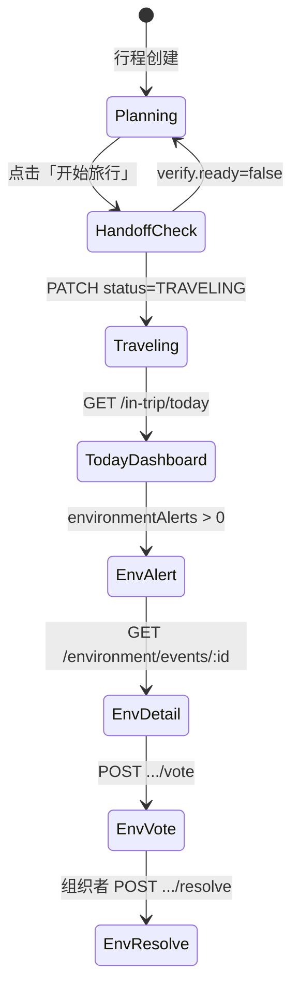

# 行中执行阶段 — 前端接口文档（M7–M11）

> **Global prefix**：所有路径前缀为 `/api`（如 `GET /api/trips/:tripId/in-trip/today`）  
> **响应格式**：`{ success: boolean, data?: T, error?: { code, message, details? } }`  
> **鉴权**：生产环境 Bearer Token + 行程成员；开发环境 `NODE_ENV !== 'production'` 可用 `anonymous-dev-user`  
> **Swagger Tag**：`trip-in-trip-execution` / `trip-in-trip-environment` / `trip-in-trip-money` / `trip-in-trip-pulse` / `trip-in-trip-split` / `trip-in-trip-experience`  
> **功能开关**：
> - `IN_TRIP_EXECUTION_ENABLED=true` — 行中模块总开关
> - `IN_TRIP_ENVIRONMENT_MONITOR_ENABLED=true` — 环境 30min 自动扫描
> - `IN_TRIP_MONEY_BRAIN_ENABLED=true` — Money Brain（默认随总开关启用）
> - `IN_TRIP_EXPERIENCE_LOOP_ENABLED=true` — 微调查 + 权重 Cron（默认随总开关启用）

---

## 后端部署前置（首次）

```bash
# M7
npx prisma db execute --schema prisma/schema.prisma \
  --file prisma/migrations/add_in_trip_execution.sql

# M8
npx prisma db execute --schema prisma/schema.prisma \
  --file prisma/migrations/add_in_trip_environment_radar.sql

# M9
npx prisma db execute --schema prisma/schema.prisma \
  --file prisma/migrations/add_in_trip_money_brain.sql

# M10
npx prisma db execute --schema prisma/schema.prisma \
  --file prisma/migrations/add_in_trip_group_pulse_split.sql

# M11
npx prisma db execute --schema prisma/schema.prisma \
  --file prisma/migrations/add_in_trip_experience_loop.sql

npx prisma generate

export IN_TRIP_EXECUTION_ENABLED=true
export IN_TRIP_ENVIRONMENT_MONITOR_ENABLED=true
export IN_TRIP_EXPERIENCE_LOOP_ENABLED=true
```

未执行 migration 时，对应接口会 **500**（表不存在）。

---

## 一、页面与接口映射

| UI 区域 | 主要接口 | 说明 |
|--------|---------|------|
| 行前「进入行中」就绪检查 | `POST .../anchor-snapshot/verify` | 展示缺失项清单，引导补齐 |
| 行中首屏 Today Dashboard | `GET .../in-trip/today` | 天气/脆弱度/时间线/预算摘要 |
| 锚点锁定状态条 | `GET .../anchor-snapshot` | 脱敏摘要：预算、团队、行程规模 |
| 组织者补救物化 | `POST .../anchor-snapshot/materialize` | 手动触发移交 |
| **环境预警列表** | `GET .../environment/events` | 打开中的黄/红事件 |
| **环境事件详情 + 投票** | `GET/POST .../environment/events/:id` | 替代方案 + 连锁影响 + 投票 |
| **脆弱度仪表盘** | `GET .../environment/vulnerability` | 按日稳定性评分 |
| 组织者手动扫描 | `POST .../environment/scan` | 调试 / 立即拉取天气风险 |
| **Money Brain 仪表盘** | `GET .../money/dashboard` | 6 桶进度 + 今日消费流 |
| **智能记账** | `POST .../money/transactions` | 拍照/语音/手输记账 + 助推 |
| **消费流** | `GET .../money/transactions` | 分页历史 |
| **今日助推** | `GET .../money/nudges/today` | 当日已触发助推 |
| **预算再平衡** | `GET/POST .../money/rebalance` | 滑移/超支/节奏差建议 |
| **Mood Check** | `POST .../pulse/mood-check` | 每日 1–5 签到 |
| **团队温度计** | `GET .../pulse/team-thermometer` | 组织者可见 |
| **保护性干预** | `GET .../pulse/interventions` | L1–L3 建议卡片 |
| **分组方案** | `POST .../split/propose` | 摩擦感知分组 |
| **体验微调查** | `GET/POST .../experience/pending|pulses` | 五类触发器 |
| **推荐权重** | `GET .../experience/weight-adjustments` | 晚间自动调整 |
| **行后总结** | `GET .../experience/post-trip-summary` | `COMPLETED` 后 |

**关联行前接口**（移交前置，见 §二）：

| 前置项 | 关联模块接口 |
|--------|-------------|
| L1 总预算 | `GET/PUT /api/trips/:tripId/budget/intent` |
| L2 预算结构 | `GET/PUT /api/trips/:tripId/budget/structure` |
| L3 钱包规则 | `GET/PUT /api/trips/:tripId/budget/wallet/rule` |
| 分摊机制锁定 | `POST .../decision-profiling/split-consensus/confirm`（全员确认后锁定） |
| 决策画像 | `GET .../decision-profiling/onboarding` |
| 行程锁定 | `PATCH /api/trips/:id` 写入 `metadata.planConfirmed: true` |
| 进入行中 | `PATCH /api/trips/:id` 设置 `status: "TRAVELING"` |

---

## 二、推荐用户流程

### 2.1 行前 → 行中切换（组织者）

```
1. 完成决策画像 + 分摊共识（见 DECISION_PROFILING_API.md）
2. 完成 Budget OS L1–L3（见 trip-budget-os 接口）
3. 锁定行程方案 → metadata.planConfirmed = true
4. POST /in-trip/anchor-snapshot/verify
   ├─ ready=false → 按 missing[] 跳转对应补齐页
   └─ ready=true  → 允许推进状态
5. PATCH /api/trips/:id { status: "TRAVELING" }
   └─ 后端自动物化锚点（fail-open，失败不阻断状态变更）
6. 全员打开 App → GET /in-trip/today（行中首屏）
```

### 2.2 行中每日打开（成员）

```
GET /in-trip/today
  → 展示 dayNumber、今日计划时间线、预算进度、快捷入口
  → vulnerability 来自 environment/vulnerability（有数据时 source=environment_radar）
  → pendingCards.environmentAlerts 来自打开中的黄/红环境事件数
```

### 2.3 环境突变响应（黄/红事件）

```
GET /environment/events          → 列表角标
GET /environment/events/:id      → 详情页：替代方案卡片 + 连锁影响
POST /environment/events/:id/vote   → 成员投票（偏好强度 1–5）
POST /environment/events/:id/resolve → 组织者锁定方案
```

---

## 三、移交就绪校验

### `POST /trips/:tripId/in-trip/anchor-snapshot/verify`

**用途**：规划阶段末尾或「开始旅行」按钮前，检查锚点是否齐全。  
**权限**：行程成员。  
**阶段**：不要求 `TRAVELING`（规划态也可调用）。

**请求体**：无。

**响应示例（未就绪）**：

```json
{
  "success": true,
  "data": {
    "tripId": "trip-iceland-1",
    "ready": false,
    "missing": [
      "plan_confirmed",
      "budget_intent",
      "split_mechanism_locked"
    ],
    "warnings": [
      "decision_profiling_completion_60%"
    ]
  }
}
```

**响应示例（就绪）**：

```json
{
  "success": true,
  "data": {
    "tripId": "trip-iceland-1",
    "ready": true,
    "missing": [],
    "warnings": []
  }
}
```

### `missing` 字段对照表

| 值 | 含义 | 前端跳转建议 |
|----|------|-------------|
| `plan_confirmed` | 行程方案未锁定 | 规划工作台「确认方案」 |
| `budget_intent` | 未设置 L1 总预算 | `/budget/intent` |
| `budget_structure` | 未设置 L2 分桶结构 | `/budget/structure` |
| `wallet_rule` | 未设置 L3 分摊规则 | `/budget/wallet/rule` |
| `split_mechanism_locked` | 分摊机制未全员锁定 | `/decision-profiling/split-consensus` |
| `itinerary_days` | 无行程日数据 | 规划工作台 |
| `trip_members` | 无成员 | 协作者邀请页 |
| `trip_not_found` | 行程不存在 | 404 页 |

### `warnings` 字段

| 模式 | 含义 | 是否阻断 |
|------|------|----------|
| `decision_profiling_completion_{N}%` | 决策画像团队完成率 &lt; 80% | 否，仅提示 |

**前端逻辑建议**：

- `ready === false` → 禁用「开始旅行」主按钮，展示缺失项 checklist
- `warnings.length > 0` → 黄色 Banner「建议全员完成画像调查」
- 可缓存 `verify` 结果，在用户从子页返回时 `invalidate` 重拉

---

## 四、锚点快照（脱敏摘要）

### `GET /trips/:tripId/in-trip/anchor-snapshot`

**用途**：行中页展示「已锁定约束」摘要条（预算上限、分摊已锁定、行程天数等）。  
**权限**：行程成员。  
**阶段**：不要求 `TRAVELING`。

**响应示例**：

```json
{
  "success": true,
  "data": {
    "tripId": "trip-iceland-1",
    "materializedAt": "2026-07-01T08:00:00.000Z",
    "schemaVersion": 1,
    "metadata": {
      "destination": "IS",
      "startDate": "2026-07-01T00:00:00.000Z",
      "endDate": "2026-07-07T00:00:00.000Z",
      "totalDays": 7,
      "timezone": "Atlantic/Reykjavik"
    },
    "team": {
      "memberCount": 4,
      "profilingCompletionRate": 100,
      "compatibilityScore": 72,
      "highRiskAlertCount": 1
    },
    "budget": {
      "total": 48000,
      "currency": "CNY",
      "splitMechanismLocked": true
    },
    "itinerary": {
      "dayCount": 7,
      "itemCount": 42,
      "nonRefundableCount": 6
    }
  }
}
```

| 字段 | 类型 | 说明 |
|------|------|------|
| `materializedAt` | string (ISO) | 锚点物化时间（`PLANNING→TRAVELING` 或手动 materialize） |
| `team.compatibilityScore` | number | 消费兼容性 0–100 |
| `team.highRiskAlertCount` | number | 行前摩擦红色预警数量 |
| `budget.splitMechanismLocked` | boolean | 分摊机制是否已锁定 |
| `itinerary.nonRefundableCount` | number | 不可退/已付费项数量（行中变更约束参考） |

**未物化时**：

```json
{
  "success": false,
  "error": {
    "code": "NOT_FOUND",
    "message": "锚点快照尚未物化"
  }
}
```

**隐私说明**：本接口**不返回**成员摩擦矩阵、Money DNA 向量、完整行程项列表；完整锚点仅服务端内部使用。

---

## 五、手动物化锚点（组织者 / 调试）

### `POST /trips/:tripId/in-trip/anchor-snapshot/materialize`

**用途**：补救自动物化失败；或 staging 调试。正常流程依赖 `status → TRAVELING` 自动触发。  
**权限**：`OWNER` 或 `EDITOR`（组织者）。

**请求体**：无。

**响应示例（首次物化）**：

```json
{
  "success": true,
  "data": {
    "tripId": "trip-iceland-1",
    "materialized": true,
    "alreadyExists": false,
    "snapshot": {
      "tripId": "trip-iceland-1",
      "materializedAt": "2026-07-01T08:00:00.000Z",
      "schemaVersion": 1,
      "metadata": { "destination": "IS", "totalDays": 7, "timezone": "Atlantic/Reykjavik" },
      "team": { "memberCount": 4, "profilingCompletionRate": 100, "compatibilityScore": 72, "highRiskAlertCount": 1 },
      "budget": { "total": 48000, "currency": "CNY", "splitMechanismLocked": true },
      "itinerary": { "dayCount": 7, "itemCount": 42, "nonRefundableCount": 6 }
    },
    "verify": {
      "tripId": "trip-iceland-1",
      "ready": true,
      "missing": [],
      "warnings": []
    }
  }
}
```

**响应示例（已存在，幂等）**：

```json
{
  "success": true,
  "data": {
    "tripId": "trip-iceland-1",
    "materialized": true,
    "alreadyExists": true,
    "snapshot": { "...": "同上脱敏结构" },
    "verify": { "ready": true, "missing": [], "warnings": [] }
  }
}
```

**条件未满足时**：

```json
{
  "success": false,
  "error": {
    "code": "VALIDATION_ERROR",
    "message": "行前→行中移交条件未满足",
    "details": {
      "message": "行前→行中移交条件未满足",
      "missing": ["wallet_rule"],
      "warnings": []
    }
  }
}
```

---

## 六、今日概览仪表盘（行中首屏）

### `GET /trips/:tripId/in-trip/today`

**用途**：行中 App 打开后的首屏聚合数据。  
**权限**：行程成员。  
**阶段**：**必须** `Trip.status === "TRAVELING"` 且 `IN_TRIP_EXECUTION_ENABLED=true`。

**请求体**：无。

**响应示例**：

```json
{
  "success": true,
  "data": {
    "dayNumber": 3,
    "date": "2026-07-03",
    "weather": {
      "summary": "数据同步中",
      "tempMin": null,
      "tempMax": null,
      "icon": "unknown",
      "source": "stub"
    },
    "vulnerability": {
      "severity": "yellow",
      "stabilityScore": 0.62,
      "source": "environment_radar"
    },
    "timeline": {
      "planned": [
        {
          "id": "item-glacier",
          "type": "ACTIVITY",
          "title": "冰川徒步",
          "startTime": "2026-07-03T09:00:00.000Z",
          "refundable": false,
          "estimatedCost": 3200,
          "category": "activities"
        }
      ],
      "actual": [],
      "deviations": []
    },
    "quickActions": ["record_expense", "mood_check", "ask_ai"],
    "teamThermometer": {
      "level": "green",
      "visible": true,
      "source": "stub"
    },
    "pendingCards": {
      "environmentAlerts": 1,
      "interventions": 0,
      "experiencePulses": 0,
      "rebalanceSuggestions": 0
    },
    "budgetSnapshot": {
      "overallUsagePercent": 58,
      "topBucket": {
        "category": "experience",
        "usagePercent": 72
      },
      "source": "budget_os"
    },
    "anchorMaterialized": true
  }
}
```

### 字段说明

| 字段 | 类型 | M7 状态 | 说明 |
|------|------|---------|------|
| `dayNumber` | number | ✅ 真实 | 相对出发日的第 N 天（出发前为 1，结束后为最后一天） |
| `date` | string | ✅ 真实 | 当日日期 `YYYY-MM-DD` |
| `vulnerability.*` | object | ✅ 真实* | `GET /environment/vulnerability` 有数据时 `source=environment_radar` |
| `timeline.planned` | array | ✅ 真实 | 来自锚点快照当日行程项 |
| `timeline.actual` | array | 🔶 空 | M9+ 实际执行轨迹 |
| `pendingCards.environmentAlerts` | number | ✅ 真实 | 打开中黄/红环境事件数 |
| `budgetSnapshot` | object | ✅/⚠️ | 有 Budget OS 数据时为真实值；否则 `source: "unavailable"` |
| `anchorMaterialized` | boolean | ✅ 真实 | 是否已有锚点快照 |

### `quickActions` 前端映射建议

| 值 | 按钮文案 | M7 行为 |
|----|---------|---------|
| `record_expense` | 记一笔 | 跳转 Budget OS 记账（`/budget/wallet/ledger`） |
| `mood_check` | 今日签到 | M10 前可展示「即将上线」或隐藏 |
| `ask_ai` | 问 AI | 跳转 Agent 对话页 |

### `teamThermometer.level` 色标

| 值 | 色 | 含义（M10 后生效） |
|----|-----|-------------------|
| `green` | 绿 | 团队状态良好 |
| `yellow` | 黄 | 轻微疲劳 / 分歧 |
| `orange` | 橙 | 需关注 |
| `red` | 红 | 建议干预 |

### `vulnerability.severity` 色标（M8 后生效）

| 值 | 稳定性评分参考 |
|----|---------------|
| `green` | ≥ 80% 按计划执行概率 |
| `yellow` | 50%–80% |
| `red` | &lt; 50% |

---

## 七、环境感知引擎（M8 — Environment Radar）

> 路径前缀：`/api/trips/:tripId/in-trip/environment`  
> 要求：`Trip.status === TRAVELING'` 且 `IN_TRIP_EXECUTION_ENABLED=true`

### `GET /trips/:tripId/in-trip/environment/events`

**用途**：环境预警列表（首屏角标、预警页列表）。仅返回 `status ∈ {open, voting}` 的事件。

**响应示例**：

```json
{
  "success": true,
  "data": [
    {
      "id": "evt-uuid",
      "tripId": "trip-1",
      "type": "weather",
      "severity": "red",
      "description": "未来 72 小时冰岛最大风速约 18 m/s，户外/高地活动可能受影响",
      "status": "voting",
      "detectedAt": "2026-07-03T08:00:00.000Z",
      "affectedItemCount": 2,
      "alternativePlanCount": 3,
      "silentVoteId": "vote-uuid"
    }
  ]
}
```

| 字段 | 说明 |
|------|------|
| `type` | `weather` / `traffic` / `attraction` / `other` |
| `severity` | `green`（列表不出现）/ `yellow` / `red` |
| `status` | `open` → 仅展示；`voting` → 可投票；`resolved` 不在列表 |
| `silentVoteId` | 红色事件关联的 Silent Vote ID（投票用） |

---

### `GET /trips/:tripId/in-trip/environment/events/:eventId`

**用途**：环境事件详情页 — 替代方案卡片 + 连锁影响。

**响应示例**：

```json
{
  "success": true,
  "data": {
    "id": "evt-uuid",
    "tripId": "trip-1",
    "type": "weather",
    "severity": "red",
    "description": "未来 72 小时冰岛最大风速约 18 m/s...",
    "status": "voting",
    "detectedAt": "2026-07-03T08:00:00.000Z",
    "affectedItemCount": 1,
    "alternativePlanCount": 3,
    "silentVoteId": "vote-uuid",
    "affectedItems": [
      {
        "itemType": "activity",
        "itemId": "glacier-1",
        "itemName": "冰川徒步",
        "originalTime": "2026-07-03T09:00:00.000Z",
        "refundable": false
      }
    ],
    "alternativePlans": [
      {
        "planId": "plan-uuid-1",
        "name": "顺延：冰川徒步",
        "description": "将「冰川徒步」延后至下一可用时段，保留原体验强度",
        "timeAdjustment": "延后 4–24 小时",
        "costDifference": 0,
        "experienceEquivalence": 0.88,
        "bookingRequired": true,
        "silentVoteOptionId": "opt-plan-u1"
      }
    ],
    "cascadeImpact": [
      {
        "affectedDay": 3,
        "affectedItem": "冰川徒步",
        "impactType": "time",
        "impactDescription": "该风险可能影响 1 天、2 个行程项..."
      }
    ]
  }
}
```

**前端展示建议**：

- 每张 `alternativePlans` 卡片展示：`name`、`timeAdjustment`、`costDifference`（正=更贵）、`experienceEquivalence`（心价比 0–1）
- `cascadeImpact` 折叠面板：「选这个方案，后面会怎么变」
- `severity=red` 且 `status=voting` → 展示投票 UI

---

### `POST /trips/:tripId/in-trip/environment/events/:eventId/vote`

**用途**：成员对替代方案投票（偏好强度 1–5）。内部写入 Silent Vote ballot。

**请求体**：

```json
{
  "planId": "plan-uuid-1",
  "preferenceStrength": 4,
  "comment": "可选备注"
}
```

| 字段 | 类型 | 必填 | 说明 |
|------|------|------|------|
| `planId` | string | 是 | `alternativePlans[].planId` |
| `preferenceStrength` | number | 是 | 1–5，映射 Silent Vote `intensity` |
| `comment` | string | 否 | 仅回显，不入库 |

**响应示例**：

```json
{
  "success": true,
  "data": {
    "eventId": "evt-uuid",
    "ballot": {
      "optionId": "opt-plan-u1",
      "intensity": 4,
      "submittedAt": "2026-07-03T08:15:00.000Z",
      "updatedAt": "2026-07-03T08:15:00.000Z"
    },
    "comment": null
  }
}
```

**注意**：可重复提交（upsert），以最后一次为准。投票后事件 `status` 变为 `voting`。

---

### `POST /trips/:tripId/in-trip/environment/events/:eventId/resolve`

**用途**：组织者锁定最终方案。  
**权限**：`OWNER` / `EDITOR`。

**请求体**：

```json
{
  "planId": "plan-uuid-1"
}
```

`planId` 可省略 — 省略时按 Silent Vote 加权得分最高方案自动选取。

**响应**：与 `GET .../events/:eventId` 相同结构，`status: "resolved"`，`resolution` 填充：

```json
{
  "resolution": {
    "selectedPlanId": "plan-uuid-1",
    "voteResults": {
      "opt-plan-u1": { "ballots": 3, "weightedScore": 11 }
    },
    "resolvedAt": "2026-07-03T09:00:00.000Z",
    "resolvedBy": "user-owner"
  },
  "resolvedAt": "2026-07-03T09:00:00.000Z"
}
```

---

### `GET /trips/:tripId/in-trip/environment/vulnerability`

**用途**：行程脆弱度仪表盘 — 按日稳定性评分（绿/黄/红）。

**响应示例**：

```json
{
  "success": true,
  "data": [
    {
      "tripId": "trip-1",
      "dayNumber": 3,
      "date": "2026-07-03",
      "stabilityScore": 0.62,
      "severity": "yellow",
      "factors": [
        { "code": "outdoor_exposure", "message": "当日含 2 项户外/高地活动", "weight": 0.12 },
        { "code": "active_red_events", "message": "存在未解决红色环境事件", "weight": 0.25 }
      ],
      "computedAt": "2026-07-03T08:30:00.000Z"
    }
  ]
}
```

| `severity` | `stabilityScore` |
|------------|-------------------|
| `green` | ≥ 0.8 |
| `yellow` | 0.5 – 0.8 |
| `red` | &lt; 0.5 |

**与 Today 首屏关系**：`GET /today` 的 `vulnerability` 字段取当日 `dayNumber` 对应条目；需先执行扫描才有数据。

---

### `POST /trips/:tripId/in-trip/environment/scan`

**用途**：组织者手动触发环境扫描（不等 30min Cron）。  
**权限**：`OWNER` / `EDITOR`。

**响应示例**：

```json
{
  "success": true,
  "data": {
    "tripId": "trip-1",
    "createdEvents": 1
  }
}
```

**调试流程**：`POST /scan` → `GET /events` → `GET /vulnerability` → 刷新 `GET /today`。

---

## 八、Money Brain（M9 — 行中层）

> **完整前端对接文档**（6 个接口、类型、封装、UI 规范）：[`MONEY_BRAIN_API.md`](./MONEY_BRAIN_API.md)

> 路径前缀：`/api/trips/:tripId/in-trip/money`  
> 不重复实现 Budget OS L1–L3；记账后同步写入 L3 `TripWalletLedgerEntry`。

### `GET /trips/:tripId/in-trip/money/dashboard`

**用途**：心理账户 6 桶（交通/住宿/体验/餐饮/其他/应急）进度 + 今日消费摘要。  
**权限**：行程成员 + `TRAVELING`。

**响应示例**：

```json
{
  "success": true,
  "data": {
    "tripId": "trip-1",
    "currency": "CNY",
    "dailyBudget": 800,
    "buckets": [
      {
        "bucket": "food",
        "label": "餐饮",
        "planned": 2400,
        "actual": 520,
        "usagePercent": 22,
        "currency": "CNY"
      }
    ],
    "todaySpendCny": 1456,
    "todayTransactions": [],
    "pendingRebalanceCount": 1
  }
}
```

---

### `POST /trips/:tripId/in-trip/money/transactions`

**用途**：智能记账；自动汇率换算、心理账户归类、四类数字助推、L3 钱包分录。  
**权限**：行程成员。

**请求体**：

```json
{
  "captureMethod": "manual",
  "amountLocal": 28000,
  "currencyLocal": "ISK",
  "category": "dining",
  "merchant": "Blue Lagoon Restaurant",
  "description": "4人午餐",
  "splitAmongUserIds": ["u1", "u2", "u3", "u4"],
  "paidByUserId": "u1"
}
```

| 字段 | 类型 | 说明 |
|------|------|------|
| `captureMethod` | `manual` \| `photo` \| `voice` | 采集方式（OCR/ASR Phase 2） |
| `amountLocal` | number | 当地货币金额 |
| `currencyLocal` | string | 如 `ISK`、`CNY` |
| `category` | string | 如 `dining`、`transport`、`activities` |
| `splitAmongUserIds` | string[] | AA 分摊成员 |
| `paidByUserId` | string | 付款人 |

**响应示例**：

```json
{
  "success": true,
  "data": {
    "transaction": {
      "id": "tx-1",
      "amountCny": 1456,
      "bucketAssignment": "food",
      "nudgesTriggered": [
        { "type": "progress_bar", "message": "已记入food账户，继续留意今日节奏" },
        { "type": "reference_point", "message": "这笔约合 ¥1456，约为日均预算的 182%" }
      ],
      "recordedAt": "2026-07-02T12:30:00.000Z"
    },
    "ledgerEntryId": "ledger-1",
    "nudgesTriggered": [],
    "rebalanceSuggestionsCreated": 0
  }
}
```

**助推类型**：

| 类型 | 触发条件 |
|------|----------|
| `progress_bar` | 任意消费记录后 |
| `reference_point` | 外币消费 ≥ 日均预算 20% |
| `cooling_off` | 2h 内消费 > 日均 × Money DNA 倍数（默认 2.0×） |
| `fomo_hedge` | 非计划高价体验类消费 |

---

### `GET /trips/:tripId/in-trip/money/transactions`

**Query**：`limit`（默认 30）、`offset`（默认 0）。

---

### `GET /trips/:tripId/in-trip/money/nudges/today`

**用途**：聚合今日所有记账触发的助推历史。

---

### `GET /trips/:tripId/in-trip/money/rebalance`

**用途**：待处理的预算再平衡建议（`surplus` / `overspend` / `pace_gap`）。

**响应示例**：

```json
{
  "success": true,
  "data": [
    {
      "id": "rb-1",
      "scenario": "overspend",
      "message": "体验桶已超支，建议从应急桶调剂或降低该类别强度",
      "proposal": {
        "fromBucket": "experience",
        "toBucket": "contingency",
        "amount": 800,
        "rationale": "实际达计划的 118%"
      },
      "status": "pending",
      "createdAt": "2026-07-02T20:00:00.000Z"
    }
  ]
}
```

---

### `POST /trips/:tripId/in-trip/money/rebalance/:suggestionId/respond`

**权限**：`OWNER` / `EDITOR`。

**请求体**：`{ "response": "accept" }` 或 `{ "response": "keep" }`

| `response` | 含义 |
|------------|------|
| `accept` | 接受滑移/调剂建议 |
| `keep` | 保持当前预算结构 |

**与 Today 关系**：`GET /today` 的 `pendingCards.rebalanceSuggestions` 取待处理数量。

---

## 九、行程状态切换（既有接口）

行中模块不单独提供状态 API，使用既有 Trip 更新接口：

### `PATCH /api/trips/:id`

**进入行中示例**：

```json
{
  "status": "TRAVELING",
  "metadata": {
    "planConfirmed": true
  }
}
```

| 要点 | 说明 |
|------|------|
| 前置校验 | `PLANNING → TRAVELING` 需 `planConfirmed` + `startDate` |
| 自动物化 | 状态变更成功后后端调用 `materializeOnTransition`（fail-open） |
| 幂等 | 锚点快照只写入一次；重复进入 TRAVELING 不覆盖 |

**错误示例（未确认方案）**：

```json
{
  "statusCode": 400,
  "message": "进入旅行阶段需要：计划确认"
}
```

---

## 十、错误码

| HTTP | `error.code` | 场景 |
|------|--------------|------|
| 401 | `UNAUTHORIZED` | 未登录（生产环境） |
| 403 | `FORBIDDEN` | 非行程成员；materialize/resolve/scan 时非组织者 |
| 400 | `VALIDATION_ERROR` | 非 TRAVELING；物化/投票/resolve 条件不满足 |
| 404 | `NOT_FOUND` | 行程/锚点/环境事件不存在 |
| — | `BUSINESS_ERROR` | `IN_TRIP_EXECUTION_ENABLED=false` 时调用 `today` |
| 500 | `INTERNAL_ERROR` | DB 表未迁移等 |

**注意**：本模块控制器对可预期错误返回 `success: false`（HTTP 200），与 `decision-profiling` 一致；仅未捕获异常走 HTTP 5xx。

---

## 十一、TypeScript 类型（可直接复制到前端）

```typescript
interface ApiResponse<T> {
  success: boolean;
  data?: T;
  error?: {
    code: string;
    message: string;
    details?: Record<string, unknown>;
  };
}

type HandoffMissingCode =
  | 'plan_confirmed'
  | 'budget_intent'
  | 'budget_structure'
  | 'wallet_rule'
  | 'split_mechanism_locked'
  | 'itinerary_days'
  | 'trip_members'
  | 'trip_not_found';

type QuickAction = 'record_expense' | 'mood_check' | 'ask_ai';

type ThermometerLevel = 'green' | 'yellow' | 'orange' | 'red';

type VulnerabilitySeverity = 'green' | 'yellow' | 'red';

interface HandoffVerifyResult {
  tripId: string;
  ready: boolean;
  missing: HandoffMissingCode[];
  warnings: string[];
}

interface InTripAnchorSnapshotPublic {
  tripId: string;
  materializedAt: string;
  schemaVersion: number;
  metadata: {
    destination: string;
    startDate: string;
    endDate: string;
    totalDays: number;
    timezone: string;
  };
  team: {
    memberCount: number;
    profilingCompletionRate: number;
    compatibilityScore: number;
    highRiskAlertCount: number;
  };
  budget: {
    total: number;
    currency: string;
    splitMechanismLocked: boolean;
  };
  itinerary: {
    dayCount: number;
    itemCount: number;
    nonRefundableCount: number;
  };
}

interface HandoffMaterializeResult {
  tripId: string;
  materialized: boolean;
  alreadyExists: boolean;
  snapshot?: InTripAnchorSnapshotPublic;
  verify: HandoffVerifyResult;
}

interface AnchorItineraryItem {
  id: string;
  type: string;
  title: string;
  startTime?: string;
  refundable: boolean;
  estimatedCost?: number;
  category: string;
}

interface TodayDashboardSnapshot {
  dayNumber: number;
  date: string;
  weather: {
    summary: string;
    tempMin: number | null;
    tempMax: number | null;
    icon: string;
    source: 'stub';
  };
  vulnerability: {
    severity: VulnerabilitySeverity;
    stabilityScore: number;
    source: 'stub' | 'environment_radar';
  };
  timeline: {
    planned: AnchorItineraryItem[];
    actual: AnchorItineraryItem[];
    deviations: unknown[];
  };
  quickActions: QuickAction[];
  teamThermometer: {
    level: ThermometerLevel;
    visible: boolean;
    source: 'stub';
  };
  pendingCards: {
    environmentAlerts: number;
    interventions: number;
    experiencePulses: number;
    rebalanceSuggestions: number;
  };
  budgetSnapshot: {
    overallUsagePercent: number | null;
    topBucket: { category: string; usagePercent: number } | null;
    source: 'budget_os' | 'unavailable';
  };
  anchorMaterialized: boolean;
}

type EnvironmentEventType = 'weather' | 'traffic' | 'attraction' | 'other';
type EnvironmentEventStatus = 'open' | 'voting' | 'resolved' | 'dismissed';

interface EnvironmentEventSummary {
  id: string;
  tripId: string;
  type: EnvironmentEventType;
  severity: VulnerabilitySeverity;
  description: string;
  status: EnvironmentEventStatus;
  detectedAt: string;
  affectedItemCount: number;
  alternativePlanCount: number;
  silentVoteId?: string;
}

interface EnvironmentAlternativePlan {
  planId: string;
  name: string;
  description: string;
  timeAdjustment: string;
  costDifference: number;
  experienceEquivalence: number;
  bookingRequired: boolean;
  silentVoteOptionId?: string;
}

interface EnvironmentEventDetail extends EnvironmentEventSummary {
  affectedItems: Array<{
    itemType: string;
    itemId: string;
    itemName: string;
    originalTime?: string;
    refundable: boolean;
  }>;
  alternativePlans: EnvironmentAlternativePlan[];
  cascadeImpact: Array<{
    affectedDay: number;
    affectedItem: string;
    impactType: string;
    impactDescription: string;
  }>;
  resolution?: {
    selectedPlanId?: string;
    voteResults?: Record<string, { ballots: number; weightedScore: number }>;
    resolvedAt?: string;
    resolvedBy?: string;
  };
  resolvedAt?: string;
}

interface DayVulnerabilityScore {
  tripId: string;
  dayNumber: number;
  date: string;
  stabilityScore: number;
  severity: VulnerabilitySeverity;
  factors: Array<{ code: string; message: string; weight: number }>;
  computedAt: string;
}
```

### 推荐 API 封装

```typescript
const base = (tripId: string) => `/api/trips/${tripId}/in-trip`;
const env = (tripId: string) => `${base(tripId)}/environment`;
const money = (tripId: string) => `${base(tripId)}/money`;

export const inTripApi = {
  verifyHandoff: (tripId: string) =>
    fetch(`${base(tripId)}/anchor-snapshot/verify`, { method: 'POST' }),

  getAnchorSnapshot: (tripId: string) =>
    fetch(`${base(tripId)}/anchor-snapshot`),

  materializeHandoff: (tripId: string) =>
    fetch(`${base(tripId)}/anchor-snapshot/materialize`, { method: 'POST' }),

  getToday: (tripId: string) =>
    fetch(`${base(tripId)}/today`),

  listEnvironmentEvents: (tripId: string) =>
    fetch(`${env(tripId)}/events`),

  getEnvironmentEvent: (tripId: string, eventId: string) =>
    fetch(`${env(tripId)}/events/${eventId}`),

  voteEnvironmentEvent: (tripId: string, eventId: string, body: {
    planId: string;
    preferenceStrength: number;
    comment?: string;
  }) =>
    fetch(`${env(tripId)}/events/${eventId}/vote`, {
      method: 'POST',
      headers: { 'Content-Type': 'application/json' },
      body: JSON.stringify(body),
    }),

  resolveEnvironmentEvent: (tripId: string, eventId: string, body?: { planId?: string }) =>
    fetch(`${env(tripId)}/events/${eventId}/resolve`, {
      method: 'POST',
      headers: { 'Content-Type': 'application/json' },
      body: JSON.stringify(body ?? {}),
    }),

  getVulnerability: (tripId: string) =>
    fetch(`${env(tripId)}/vulnerability`),

  scanEnvironment: (tripId: string) =>
    fetch(`${env(tripId)}/scan`, { method: 'POST' }),

  getMoneyDashboard: (tripId: string) =>
    fetch(`${money(tripId)}/dashboard`),

  recordTransaction: (tripId: string, body: {
    captureMethod: 'manual' | 'photo' | 'voice';
    amountLocal: number;
    currencyLocal: string;
    category: string;
    merchant?: string;
    description?: string;
    splitAmongUserIds: string[];
    paidByUserId: string;
  }) =>
    fetch(`${money(tripId)}/transactions`, {
      method: 'POST',
      headers: { 'Content-Type': 'application/json' },
      body: JSON.stringify(body),
    }),

  listTransactions: (tripId: string, params?: { limit?: number; offset?: number }) => {
    const q = new URLSearchParams();
    if (params?.limit != null) q.set('limit', String(params.limit));
    if (params?.offset != null) q.set('offset', String(params.offset));
    const suffix = q.toString() ? `?${q}` : '';
    return fetch(`${money(tripId)}/transactions${suffix}`);
  },

  getTodayNudges: (tripId: string) =>
    fetch(`${money(tripId)}/nudges/today`),

  listRebalanceSuggestions: (tripId: string) =>
    fetch(`${money(tripId)}/rebalance`),

  respondRebalance: (tripId: string, suggestionId: string, response: 'accept' | 'keep') =>
    fetch(`${money(tripId)}/rebalance/${suggestionId}/respond`, {
      method: 'POST',
      headers: { 'Content-Type': 'application/json' },
      body: JSON.stringify({ response }),
    }),
};
```

---

## 十二、前端状态机建议



| 状态 | 主接口 | UI |
|------|--------|-----|
| `PLANNING` | `verify` | 就绪 checklist |
| `TRAVELING` | `today` | 行中首屏 |
| `TRAVELING` + 预警 | `environment/events` | 环境预警页 |
| 任意 | `anchor-snapshot` | 顶部锁定摘要条 |

---

## 十三、能力成熟度（M7–M11）

| 能力 | 状态 | 说明 |
|------|------|------|
| 锚点移交 verify / snapshot | ✅ M7 | — |
| Today 时间线 planned | ✅ M7 | — |
| 环境事件检测 + 替代方案 | ✅ M8 | 冰岛 Open-Meteo；Cron 30min |
| 脆弱度按日评分 | ✅ M8 | 扫描后写入 |
| Today `environmentAlerts` 角标 | ✅ M8 | — |
| 智能记账 + 心理账户 6 桶 | ✅ M9 | 固定汇率表；OCR/ASR Phase 2 |
| 四类数字助推 | ✅ M9 | Money DNA 调 cooling_off 阈值 |
| 预算再平衡建议 | ✅ M9 | 消费后自动 scan |
| Today `rebalanceSuggestions` 角标 | ✅ M9 | — |
| Mood Check + 五维状态 | ✅ M10 | — |
| 团队温度计 + 干预卡片 | ✅ M10 | Today 已接入 |
| Split 分组 + 费用路由 | ✅ M10 | 活跃 session 联动 Money Brain |
| 体验微调查五类触发 | ✅ M11 | — |
| 推荐权重 nightly 调整 | ✅ M11 | Cron 22:00 UTC |
| 行后总结 + Money DNA 校准 | ✅ M11 | `COMPLETED` 自动生成 |
| Today `experiencePulses` 角标 | ✅ M11 | — |
| Today 实时气温 | 🔶 stub | 后续接天气详情 |

---

## 十四、相关文档

- 技术设计：[`IN_TRIP_EXECUTION_TECH_DESIGN.md`](./IN_TRIP_EXECUTION_TECH_DESIGN.md)
- Money Brain：[`MONEY_BRAIN_API.md`](./MONEY_BRAIN_API.md)
- Group Pulse + Split：[`GROUP_PULSE_SPLIT_API.md`](./GROUP_PULSE_SPLIT_API.md)
- Experience Loop：[`EXPERIENCE_LOOP_API.md`](./EXPERIENCE_LOOP_API.md)
- 决策画像（移交前置）：[`../decision-profiling/DECISION_PROFILING_API.md`](../decision-profiling/DECISION_PROFILING_API.md)
- 过程公平性：[`../process-fairness/PROCESS_FAIRNESS_API.md`](../process-fairness/PROCESS_FAIRNESS_API.md)

---

*文档版本：M7 + M8 · 同步 `trip-in-trip.controller.ts` + `trip-environment-radar.controller.ts`*
