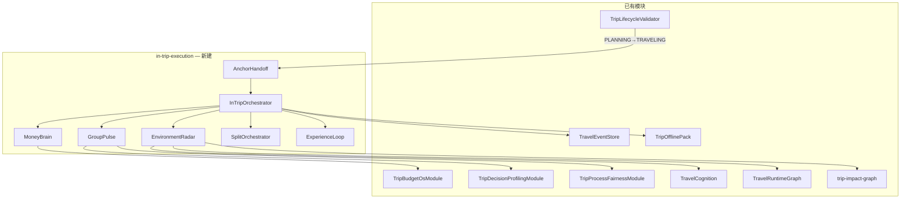

# TripNARA 行中执行阶段 — 详细技术设计

> **版本**：v1.0（对应 PRD v2.0）  
> **日期**：2026-06-18  
> **状态**：Draft — 待 M7 评审  
> **Global prefix**：`/api`  
> **响应格式**：`{ success: boolean, data?: T, error?: { code, message } }`  
> **鉴权**：生产环境 Bearer Token + 行程成员；开发环境 `NODE_ENV !== 'production'` 可用 `anonymous-dev-user`

---

## 0. 文档目的与范围

本文档将 **行中执行阶段 PRD v2.0** 转化为可落地的后端技术方案，覆盖：

- 模块边界与依赖关系
- 数据模型（Prisma + 事件类型）
- 行前 → 行中 **数据移交协议**
- 五大引擎服务设计与 API 契约
- 与现有模块（`budget-os`、`decision-profiling`、`travel-cognition`、`travel-event-store`）的集成点
- Phase 2 里程碑（M7–M12）交付切片

**不在本文档范围**：前端 UI 实现、冰岛具体 API 密钥管理、支付网关对接（标记为 Phase 3）。

---

## 1. 设计原则

| 原则 | 说明 |
|------|------|
| **锚点不可变** | 行中干预不得突破行前锁定的总预算、大交通、不可退预订、分摊机制 |
| **事件驱动** | 所有触发 → 干预链路经 `TravelEventStore` 持久化（fail-open） |
| **复用优先** | 扩展 `TravelRuntimeGraph`、`TripWalletLedgerEntry`、`TripSilentVote`，避免平行实现 |
| **离线优先** | 读路径走 `TripOfflinePack` 快照；写路径走本地队列 + 增量同步 |
| **隐私最小化** | 成员详细状态默认仅本人 + 授权角色可见；位置数据拆队结束即删 |
| **阶段门禁** | 所有行中 API 要求 `Trip.status === 'TRAVELING'`（或开发 override） |

---

## 2. 系统架构

### 2.1 模块拓扑

```
src/trips/in-trip-execution/
├── in-trip-execution.module.ts          # Nest 根模块
├── controllers/
│   ├── trip-today.controller.ts           # Today Dashboard 聚合
│   ├── trip-environment-radar.controller.ts
│   ├── trip-group-pulse.controller.ts
│   ├── trip-money-brain.controller.ts     # 行中消费层（扩展 budget-os）
│   ├── trip-split-orchestrator.controller.ts
│   └── trip-experience-loop.controller.ts
├── services/
│   ├── in-trip-access.service.ts          # TRAVELING 门禁 + 角色
│   ├── anchor-handoff.service.ts          # 行前→行中数据移交
│   ├── in-trip-orchestrator.service.ts    # 每日循环 + 事件分发
│   ├── environment-radar.service.ts
│   ├── environment-monitor.job.ts         # 30min cron / queue worker
│   ├── alternative-plan-generator.service.ts
│   ├── vulnerability-score.service.ts
│   ├── group-pulse.service.ts
│   ├── member-state-vector.service.ts
│   ├── relation-risk.service.ts
│   ├── protective-intervention.service.ts
│   ├── money-brain-nudge.service.ts
│   ├── budget-rebalance.service.ts
│   ├── smart-transaction.service.ts
│   ├── split-orchestrator.service.ts
│   ├── experience-pulse.service.ts
│   ├── recommendation-weight.service.ts
│   └── post-trip-summary.service.ts
├── jobs/
│   └── in-trip-scheduler.service.ts       # 晨间同步 / 夜间权重调整
├── dto/
│   └── in-trip-execution.dto.ts
├── types/
│   ├── anchor-handoff.types.ts
│   ├── member-realtime-state.types.ts
│   ├── environment-event.types.ts
│   ├── smart-transaction.types.ts
│   ├── experience-pulse.types.ts
│   └── split-party-session.types.ts
├── bridge/
│   ├── travel-runtime.bridge.ts           # → travel-cognition
│   ├── budget-os.bridge.ts                # → budget-os
│   └── decision-profiling.bridge.ts       # → friction-radar / money-dna
└── IN_TRIP_EXECUTION_TECH_DESIGN.md       # 本文档
```

### 2.2 依赖关系



### 2.3 核心运行时流程

```
触发事件检测
  → 锚点约束校验（AnchorHandoffService）
  → 影响范围评估（TravelRuntimeGraph / trip-impact-graph）
  → 方案生成（引擎专属 Service）
  → 干预投递（Push / SilentVote / Agent hint）
  → TravelEvent 持久化
  → 用户确认 → 执行副作用（钱包分录 / 行程 patch / 权重更新）
```

---

## 3. 行前 → 行中数据移交协议

### 3.1 触发时机

当 `TripLifecycleValidatorService` 验证 `PLANNING → TRAVELING` 通过时，`AnchorHandoffService.materialize()` 被调用（挂在 `TripsService.update()` 状态变更后）。

**新增前置条件**（扩展 `validatePlanningToTraveling`）：

| 条件 | 来源 | 必需 |
|------|------|------|
| `planConfirmed` | `trip.metadata` | 是 |
| L1 预算意图 | `TripBudgetIntentService` | 是 |
| L2 预算结构 | `BudgetStructureService` | 是 |
| L3 钱包规则 | `TravelWalletService` | 是 |
| 分摊机制共识 | `SplitConsensusService.getConsensus()` | 是（`confirmedAt` 非空） |
| 决策画像完成率 | `DecisionProfilingService` | ≥80% 成员完成 quiz |
| 锁定行程方案 | `PlanningPlan` active + `ItineraryItem` | 是 |

### 3.2 移交数据包 `InTripAnchorSnapshot`

持久化至新表 `trip_in_trip_anchor_snapshots`（单行 per trip，不可变）：

```typescript
interface InTripAnchorSnapshot {
  tripId: string;
  materializedAt: string;
  schemaVersion: 1;

  // 锚点层
  budget: {
    intent: TripBudgetIntent;
    structure: BudgetStructure;
    walletRule: PaymentRule;
    splitMechanism: TripSplitMechanismConsensus;
  };

  team: {
    members: Array<{ userId: string; displayName: string; role: string }>;
    travelStyles: Record<string, TravelStyleCardSummary>;  // 脱敏摘要
    moneyDnaVectors: Record<string, MoneyDnaVector>;       // 仅系统内部用
    frictionMatrix: FrictionPair[];
    compatibilityScore: number;
    highRiskAlerts: FrictionAlert[];
  };

  itinerary: {
    planId: string;
    lockedAt: string;
    days: Array<{
      date: string;
      items: Array<{
        id: string;
        type: string;
        title: string;
        startTime?: string;
        refundable: boolean;
        estimatedCost?: number;
        category: string;
      }>;
    }>;
    bigTransportRefs: string[];   // 不可变更的交通项 ID
    nonRefundableItemIds: string[];
  };

  conflictWatchlist: Array<{
    domain: string;
    riskLevel: 'medium' | 'high';
    memberPair?: [string, string];
    note: string;
  }>;

  metadata: {
    destination: string;
    startDate: string;
    endDate: string;
    totalDays: number;
    timezone: string;  // IANA, e.g. Atlantic/Reykjavik
  };
}
```

### 3.3 移交 API

| 方法 | 路径 | 说明 |
|------|------|------|
| `GET` | `/trips/:tripId/in-trip/anchor-snapshot` | 读取锁定锚点（全员可读摘要版） |
| `POST` | `/trips/:tripId/in-trip/anchor-snapshot/verify` | 校验移交完整性（管理/调试） |

`verify` 响应示例：

```json
{
  "success": true,
  "data": {
    "ready": true,
    "missing": [],
    "warnings": ["2/5 members incomplete Money DNA quiz"]
  }
}
```

---

## 4. 数据模型（Prisma）

> Migration 文件建议：`prisma/migrations/add_in_trip_execution.sql`  
> 遵循现有 `@@map` snake_case 惯例。

### 4.1 `trip_in_trip_anchor_snapshots`

```prisma
model TripInTripAnchorSnapshot {
  tripId           String   @id @map("trip_id")
  schemaVersion    Int      @default(1) @map("schema_version")
  snapshot         Json     // InTripAnchorSnapshot
  materializedAt   DateTime @map("materialized_at") @db.Timestamptz(6)
  materializedBy   String?  @map("materialized_by") @db.Text
  Trip             Trip     @relation(fields: [tripId], references: [id], onDelete: Cascade)

  @@map("trip_in_trip_anchor_snapshots")
}
```

### 4.2 `trip_member_realtime_states`

每成员每旅行日最新状态向量（upsert，非 append-only）：

```prisma
model TripMemberRealtimeState {
  id                 String   @id @default(uuid()) @db.Uuid
  tripId             String   @map("trip_id")
  userId             String   @map("user_id") @db.Text
  dayNumber          Int      @map("day_number")
  physicalLevel      String   @map("physical_level") @db.VarChar(16)
  emotionalLevel     String   @map("emotional_level") @db.VarChar(16)
  spendingLevel      String   @map("spending_level") @db.VarChar(16)
  socialLevel        String   @map("social_level") @db.VarChar(16)
  decisionFatigue    String   @map("decision_fatigue") @db.VarChar(16)
  confidenceScore    Float    @map("confidence_score")
  signals            Json     @default("{}")  // 原始信号摘要
  computedAt         DateTime @map("computed_at") @db.Timestamptz(6)
  Trip               Trip     @relation(fields: [tripId], references: [id], onDelete: Cascade)

  @@unique([tripId, userId, dayNumber])
  @@index([tripId, dayNumber])
  @@map("trip_member_realtime_states")
}
```

枚举值对齐 PRD §0.9.1：

- `physicalLevel`: `energetic | normal | fatigued | exhausted`
- `emotionalLevel`: `joyful | stable | low | irritable`
- `spendingLevel`: `surplus | normal | tight | overspent`
- `socialLevel`: `harmonious | normal | subtle | tense`
- `decisionFatigue`: `fresh | normal | fatigued | depleted`

### 4.3 `trip_environment_events`

```prisma
model TripEnvironmentEvent {
  id                  String    @id @default(uuid()) @db.Uuid
  tripId              String    @map("trip_id")
  type                String    @db.VarChar(16)   // weather|traffic|attraction|other
  severity            String    @db.VarChar(8)    // green|yellow|red
  description         String    @db.Text
  affectedItems       Json      @default("[]") @map("affected_items")
  alternativePlans    Json      @default("[]") @map("alternative_plans")
  cascadeImpact       Json      @default("[]") @map("cascade_impact")
  runtimeGraph        Json?     @map("runtime_graph")  // TravelRuntimeGraph 快照
  resolution          Json?     // selected plan + vote results
  detectedAt          DateTime  @map("detected_at") @db.Timestamptz(6)
  resolvedAt          DateTime? @map("resolved_at") @db.Timestamptz(6)
  status              String    @default("open") @db.VarChar(16)
  Trip                Trip      @relation(fields: [tripId], references: [id], onDelete: Cascade)

  @@index([tripId, status, severity])
  @@map("trip_environment_events")
}
```

### 4.4 `trip_day_vulnerability_scores`

```prisma
model TripDayVulnerabilityScore {
  id              String   @id @default(uuid()) @db.Uuid
  tripId          String   @map("trip_id")
  dayNumber       Int      @map("day_number")
  date            DateTime @db.Date
  stabilityScore  Float    @map("stability_score")  // 0..1
  severity        String   @db.VarChar(8)           // green|yellow|red
  factors         Json     @default("[]")
  computedAt      DateTime @map("computed_at") @db.Timestamptz(6)
  Trip            Trip     @relation(fields: [tripId], references: [id], onDelete: Cascade)

  @@unique([tripId, dayNumber])
  @@map("trip_day_vulnerability_scores")
}
```

### 4.5 `trip_smart_transactions`

扩展 `TripWalletLedgerEntry` 概念，增加心理账户与助推记录：

```prisma
model TripSmartTransaction {
  id                String   @id @default(uuid()) @db.Uuid
  tripId            String   @map("trip_id")
  memberId          String   @map("member_id") @db.Text
  ledgerEntryId     String?  @map("ledger_entry_id") @db.Uuid
  amountLocal       Float    @map("amount_local")
  currencyLocal     String   @map("currency_local") @db.VarChar(8)
  amountCny         Float    @map("amount_cny")
  exchangeRate      Float    @map("exchange_rate")
  category          String   @db.VarChar(16)
  merchant          String?  @db.VarChar(256)
  description       String?  @db.Text
  captureMethod     String   @map("capture_method") @db.VarChar(16)
  splitGroupId      String?  @map("split_group_id") @db.Uuid
  splitRule         String   @map("split_rule") @db.VarChar(16)
  splitDetails      Json     @default("[]") @map("split_details")
  bucketAssignment  String   @map("bucket_assignment") @db.VarChar(16)
  spendRationality  String?  @map("spend_rationality") @db.VarChar(16)
  nudgesTriggered   Json     @default("[]") @map("nudges_triggered")
  recordedAt        DateTime @map("recorded_at") @db.Timestamptz(6)
  Trip              Trip     @relation(fields: [tripId], references: [id], onDelete: Cascade)

  @@index([tripId, recordedAt])
  @@index([tripId, memberId])
  @@map("trip_smart_transactions")
}
```

**与 `TripWalletLedgerEntry` 关系**：`SmartTransactionService.record()` 先写 `trip_smart_transactions`，再调用 `TravelWalletService.createManualLedger()` 生成 `ledgerEntryId` 关联。保持 L3 钱包为结算真相源。

### 4.6 `trip_budget_rebalance_suggestions`

```prisma
model TripBudgetRebalanceSuggestion {
  id            String    @id @default(uuid()) @db.Uuid
  tripId        String    @map("trip_id")
  scenario      String    @db.VarChar(16)  // surplus|overspend|pace_gap
  message       String    @db.Text
  proposal      Json      // { fromBucket, toBucket, amount, rationale }
  status        String    @default("pending") @db.VarChar(16)
  userResponse  String?   @map("user_response") @db.VarChar(16)
  respondedBy   String?   @map("responded_by") @db.Text
  createdAt     DateTime  @default(now()) @map("created_at") @db.Timestamptz(6)
  respondedAt   DateTime? @map("responded_at") @db.Timestamptz(6)
  Trip          Trip      @relation(fields: [tripId], references: [id], onDelete: Cascade)

  @@index([tripId, status])
  @@map("trip_budget_rebalance_suggestions")
}
```

### 4.7 `trip_split_party_sessions`

```prisma
model TripSplitPartySession {
  id                String    @id @default(uuid()) @db.Uuid
  tripId            String    @map("trip_id")
  dayNumber         Int       @map("day_number")
  triggerReason     String    @map("trigger_reason") @db.VarChar(32)
  status            String    @default("proposed") @db.VarChar(16)
  groups            Json      @default("[]")
  sharedNodes       Json      @default("[]") @map("shared_nodes")
  costRouting       Json      @default("{}") @map("cost_routing")
  experienceSharing Json      @default("[]") @map("experience_sharing")
  reunion           Json?
  satisfaction      Json?
  proposedAt        DateTime  @map("proposed_at") @db.Timestamptz(6)
  executedAt        DateTime? @map("executed_at") @db.Timestamptz(6)
  Trip              Trip      @relation(fields: [tripId], references: [id], onDelete: Cascade)

  @@index([tripId, dayNumber, status])
  @@map("trip_split_party_sessions")
}
```

### 4.8 `trip_experience_pulses`

```prisma
model TripExperiencePulse {
  id                       String   @id @default(uuid()) @db.Uuid
  tripId                   String   @map("trip_id")
  memberId                 String   @map("member_id") @db.Text
  triggerType              String   @map("trigger_type") @db.VarChar(16)
  activityName             String?  @map("activity_name") @db.VarChar(256)
  expectationConfirmation  Int?     @map("expectation_confirmation")
  emotionalValueScore      Int?     @map("emotional_value_score")
  senseOfControl           Int?     @map("sense_of_control")
  spendWorthIt             Int?     @map("spend_worth_it")
  teamAtmosphere           Int?     @map("team_atmosphere")
  freeText                 String?  @map("free_text") @db.Text
  emotionPolarity          Float?   @map("emotion_polarity")
  weightAdjustmentApplied  Json?    @map("weight_adjustment_applied")
  submittedAt              DateTime @map("submitted_at") @db.Timestamptz(6)
  Trip                     Trip     @relation(fields: [tripId], references: [id], onDelete: Cascade)

  @@index([tripId, memberId, submittedAt])
  @@map("trip_experience_pulses")
}
```

### 4.9 `trip_mood_checks`

```prisma
model TripMoodCheck {
  id        String   @id @default(uuid()) @db.Uuid
  tripId    String   @map("trip_id")
  userId    String   @map("user_id") @db.Text
  dayNumber Int      @map("day_number")
  score     Int      // 1..5
  source    String   @default("mood_check") @db.VarChar(16)
  createdAt DateTime @default(now()) @map("created_at") @db.Timestamptz(6)
  Trip      Trip     @relation(fields: [tripId], references: [id], onDelete: Cascade)

  @@unique([tripId, userId, dayNumber, source])
  @@map("trip_mood_checks")
}
```

### 4.10 `trip_team_thermometer_snapshots`

```prisma
model TripTeamThermometerSnapshot {
  id           String   @id @default(uuid()) @db.Uuid
  tripId       String   @map("trip_id")
  dayNumber    Int      @map("day_number")
  level        String   @db.VarChar(8)  // green|yellow|orange|red
  score        Float
  factors      Json     @default("[]")
  computedAt   DateTime @map("computed_at") @db.Timestamptz(6)
  Trip         Trip     @relation(fields: [tripId], references: [id], onDelete: Cascade)

  @@unique([tripId, dayNumber])
  @@map("trip_team_thermometer_snapshots")
}
```

### 4.11 `trip_in_trip_offline_queue`

离线写操作队列（客户端或服务端暂存）：

```prisma
model TripInTripOfflineQueueEntry {
  id            String    @id @default(uuid()) @db.Uuid
  tripId        String    @map("trip_id")
  userId        String    @map("user_id") @db.Text
  operationType String    @map("operation_type") @db.VarChar(32)
  payload       Json
  clientSeq     BigInt    @map("client_seq")
  recordedAt    DateTime  @map("recorded_at") @db.Timestamptz(6)
  syncedAt      DateTime? @map("synced_at") @db.Timestamptz(6)
  conflictStatus String?  @map("conflict_status") @db.VarChar(16)
  Trip          Trip      @relation(fields: [tripId], references: [id], onDelete: Cascade)

  @@index([tripId, syncedAt])
  @@map("trip_in_trip_offline_queue")
}
```

### 4.12 Trip 模型关系扩展

在 `model Trip` 中增加：

```prisma
TripInTripAnchorSnapshot      TripInTripAnchorSnapshot?
TripMemberRealtimeState       TripMemberRealtimeState[]
TripEnvironmentEvent          TripEnvironmentEvent[]
TripDayVulnerabilityScore     TripDayVulnerabilityScore[]
TripSmartTransaction          TripSmartTransaction[]
TripBudgetRebalanceSuggestion TripBudgetRebalanceSuggestion[]
TripSplitPartySession         TripSplitPartySession[]
TripExperiencePulse           TripExperiencePulse[]
TripMoodCheck                 TripMoodCheck[]
TripTeamThermometerSnapshot   TripTeamThermometerSnapshot[]
TripInTripOfflineQueueEntry   TripInTripOfflineQueueEntry[]
```

---

## 5. Travel Event Store 扩展

在 `travel-event.types.ts` 的 `TravelEventType` 枚举中追加（`segment` 均为 `DECISION` 或 `ACTION`）：

| eventType | segment | 触发方 |
|-----------|---------|--------|
| `trip.in_trip.anchor_materialized` | STATE | AnchorHandoff |
| `trip.in_trip.environment_detected` | DECISION | EnvironmentRadar |
| `trip.in_trip.environment_resolved` | ACTION | EnvironmentRadar |
| `trip.in_trip.state_vector_updated` | ACTION | MemberStateVector |
| `trip.in_trip.relation_risk_raised` | DECISION | RelationRisk |
| `trip.in_trip.intervention_triggered` | ACTION | ProtectiveIntervention |
| `trip.in_trip.transaction_recorded` | ACTION | SmartTransaction |
| `trip.in_trip.nudge_shown` | ACTION | MoneyBrainNudge |
| `trip.in_trip.rebalance_suggested` | DECISION | BudgetRebalance |
| `trip.in_trip.split_proposed` | DECISION | SplitOrchestrator |
| `trip.in_trip.split_executed` | ACTION | SplitOrchestrator |
| `trip.in_trip.experience_pulse_submitted` | RESULT | ExperiencePulse |
| `trip.in_trip.weight_adjusted` | ACTION | RecommendationWeight |
| `trip.in_trip.daily_loop_completed` | STATE | InTripScheduler |

新增 `TravelEventSource.IN_TRIP_EXECUTION = 'trip.in_trip'`。

持久化策略与现有一致：`TRAVEL_EVENT_STORE_ENABLED=false` 时仅内存 emit，fail-open。

---

## 6. 模块一：Environment Radar

### 6.1 服务职责

| Service | 职责 |
|---------|------|
| `EnvironmentMonitorJob` | 每 30min 拉取天气/路况/景点状态；对比锚点行程 |
| `VulnerabilityScoreService` | 计算每日 `stabilityScore`（绿≥0.8，黄 0.5–0.8，红<0.5） |
| `EnvironmentRadarService` | 事件 CRUD、severity 分级、状态机 `open → voting → resolved` |
| `AlternativePlanGeneratorService` | 红色事件 5min 内生成 2–3 方案 |

### 6.2 与现有代码集成

```
EnvironmentMonitorJob
  → physical-validator / evidence providers（已有）
  → TravelRiskEvent（risk-event.types.ts）
  → buildTripImpactGraph() + propagateWithEventConfidence()
  → buildTravelRuntimeGraphFromReplan()
  → 写入 trip_environment_events.runtimeGraph
```

**替代方案生成约束**（`AlternativePlanGeneratorService`）：

1. `AnchorHandoffService.assertWithinAnchors(plan)` — 预算/不可退项/大交通
2. `FatiguePredictionEngine` + `MemberStateVectorService` — 状态适配
3. `TripValueFeedbackService` / 历史心价比 — 体验等价度 `experienceEquivalence`
4. 输出写入 `alternativePlans[]`，并创建 `TripSilentVote`（复用现有投票基础设施）

### 6.3 API

| 方法 | 路径 | 说明 |
|------|------|------|
| `GET` | `/trips/:tripId/in-trip/environment/events` | 打开的环境事件列表 |
| `GET` | `/trips/:tripId/in-trip/environment/events/:eventId` | 详情含替代方案 + 连锁影响 |
| `POST` | `/trips/:tripId/in-trip/environment/events/:eventId/vote` | 群体投票（偏好强度 1–5） |
| `POST` | `/trips/:tripId/in-trip/environment/events/:eventId/resolve` | 锁定选中方案 |
| `GET` | `/trips/:tripId/in-trip/environment/vulnerability` | 脆弱度仪表盘（按日） |

**投票请求体**：

```json
{
  "planId": "uuid",
  "preferenceStrength": 4,
  "comment": "optional"
}
```

### 6.4 定时任务

```typescript
// EnvironmentMonitorJob — cron: */30 * * * *
// 仅处理 status=TRAVELING 且 startDate <= now <= endDate 的 trips
// Feature flag: IN_TRIP_ENVIRONMENT_MONITOR_ENABLED
```

### 6.5 验收映射

| PRD 指标 | 技术实现 |
|----------|----------|
| 检测延迟 ≤30min | cron 周期 + `detectedAt - sourceObservedAt` 监控 |
| 方案生成 ≤5min | `AlternativePlanGeneratorService` 超时 4.5min，降级为 1 方案 |
| 采纳率 ≥60% | `resolution.selectedPlan` / 总 red events |

---

## 7. 模块二：Group Pulse

### 7.1 信号采集

| 信号类型 | 来源 | Service |
|----------|------|---------|
| Mood Check | `POST .../mood-check` | `GroupPulseService` |
| 体验微反馈 | `POST .../micro-feedback` | `ExperiencePulseService`（轻量版） |
| 步数/速度 | 客户端上报 `POST .../signals/motion` | `MemberStateVectorService` |
| 互动频率 | 群消息/webhook 计数（Phase 2B） | `RelationRiskService` |
| 消费节奏 | `SmartTransaction` 流 | `MemberStateVectorService` |
| 决策疲劳 | 当日投票/决策次数 | `MemberStateVectorService` |

### 7.2 状态向量计算

`MemberStateVectorService.compute()` 每 30min 或由信号触发：

```typescript
interface StateComputeInput {
  anchor: InTripAnchorSnapshot;
  userId: string;
  dayNumber: number;
  moodCheck?: TripMoodCheck;
  motionSignals?: { steps: number; avgSpeed: number; restMinutes: number };
  spendingPace: BucketPace[];
  socialSignals: { interactionPerHour: number; participationRate: number };
  decisionSignals: { decisionsToday: number; avgResponseSec: number };
  profilingCalibration: { travelStyle: TravelStyleCard; moneyDna: MoneyDnaVector };
}
```

**个性化校准**：高适应型成员 Mood=3 → 内部映射为 `fatigued`；高体验倾向成员 Mood=3 → `normal`。

### 7.3 团队温度计

`GroupPulseService.computeTeamThermometer()`:

```
teamScore = weighted_mean(memberEmotional, memberSocial, memberPhysical)
level: green (≥0.75) | yellow (0.55–0.75) | orange (0.35–0.55) | red (<0.35)
```

### 7.4 关系风险与保护性干预

`RelationRiskService.evaluate()` 规则：

| 规则 ID | 条件 | 干预级别 |
|---------|------|----------|
| `SINGLE_FATIGUE` | physical=fatigued/exhausted + 当日高强度项 | L1 |
| `FRICTION_PAIR_COLD` | 行前 red pair + interaction -50% | L2 |
| `PARTICIPATION_COLLAPSE` | 连续 3 决策节点未参与 | L2 |
| `TEAM_ORANGE` | 温度计 orange/red | L2 |
| `SPLIT_SIGNAL` | ≥2 成员 split_party_signal | L3 |

`ProtectiveInterventionService.deliver()` 输出 `InterventionCard`：

```typescript
interface InterventionCard {
  id: string;
  level: 1 | 2 | 3;
  framing: 'positive';           // 禁止出现「拆队」字样
  messageZh: string;
  actions: Array<{ id: string; label: string; actionType: string }>;
  privateChannelAvailable?: boolean;  // L2+
  splitSessionId?: string;            // L3
}
```

### 7.5 API

| 方法 | 路径 | 说明 |
|------|------|------|
| `POST` | `/trips/:tripId/in-trip/pulse/mood-check` | 每日签到 score 1–5 |
| `POST` | `/trips/:tripId/in-trip/pulse/micro-feedback` | 节点微反馈 1–5 |
| `POST` | `/trips/:tripId/in-trip/pulse/signals/motion` | 运动数据上报 |
| `GET` | `/trips/:tripId/in-trip/pulse/my-state` | 本人五维状态 |
| `GET` | `/trips/:tripId/in-trip/pulse/team-thermometer` | 团队温度计（需 organizer 角色） |
| `GET` | `/trips/:tripId/in-trip/pulse/interventions` | 当前待处理干预卡片 |
| `POST` | `/trips/:tripId/in-trip/pulse/interventions/:id/ack` | 确认/拒绝干预 |

**隐私**：`team-thermometer` 返回成员卡片仅含 `level` 枚举，不含具体分数；完整雷达图仅 `OWNER` 可见。

---

## 8. 模块三：Money Brain（行中层）

### 8.1 架构定位

行中 Money Brain **不重复**实现 L1–L3，而是：

```
SmartTransactionService  → 心理账户归类 + 助推 + 偏差标签
BudgetRebalanceService   → 再平衡建议
MoneyBrainNudgeService   → 四类数字助推
TravelWalletService      → 分录与结算（已有）
TripBudgetProfileService → 桶消耗进度（已有）
```

### 8.2 智能记账流程

```
POST /transactions
  → OCR/ASR（可选 providers，Phase 2 先 manual + voice transcript）
  → 汇率换算（已有 exchange 工具或固定表）
  → bucketAssignment（AI 分类，默认映射 category→bucket）
  → MoneyBrainNudgeService.evaluate() — 是否触发助推
  → SmartTransaction 持久化
  → TravelWalletService.createManualLedger() — splitGroupId 来自活跃拆队 session
  → TravelEvent: transaction_recorded + nudge_shown
```

### 8.3 数字助推四类型

| 类型 | 触发条件 | Service 方法 |
|------|----------|--------------|
| `progress_bar` | 任意消费记录后 | `maybeProgressBar()` |
| `reference_point` | 外币消费 ≥ 日均预算 20% | `maybeReferencePoint()` |
| `cooling_off` | 2h 内消费 > 日均 200%（按 Money DNA 调阈值） | `maybeCoolingOff()` |
| `fomo_hedge` | 非计划高价自费项 | `maybeFomoHedge()` |

**阈值个性化**（`MoneyBrainNudgeService`）：

```typescript
const coolingOffMultiplier = mapMoneyDnaToThreshold(moneyDna);
// experienceSensitivity > 0.7 → 2.5x; frugalityIndex > 0.7 → 1.5x; default 2.0x
```

### 8.4 预算动态再平衡

`BudgetRebalanceService.scan()` 在消费后 + 每日晚间运行：

| 场景 | 触发 | 输出 |
|------|------|------|
| `surplus` | 某桶实际 < 计划 20% | 滑移建议 → `trip_budget_rebalance_suggestions` |
| `overspend` | 某桶 > 计划 15% | 调剂路径（应急桶/降强度） |
| `pace_gap` | 成员间消耗进度差 > 25% | 节奏提示 / 拆队建议联动 |

### 8.5 API

| 方法 | 路径 | 说明 |
|------|------|------|
| `GET` | `/trips/:tripId/in-trip/money/dashboard` | 心理账户 6 桶进度 + 今日消费流 |
| `POST` | `/trips/:tripId/in-trip/money/transactions` | 智能记账（photo/voice/manual） |
| `GET` | `/trips/:tripId/in-trip/money/transactions` | 消费流分页 |
| `GET` | `/trips/:tripId/in-trip/money/nudges/today` | 今日助推历史 |
| `GET` | `/trips/:tripId/in-trip/money/rebalance` | 待处理再平衡建议 |
| `POST` | `/trips/:tripId/in-trip/money/rebalance/:id/respond` | `accept` / `keep` |

**记账请求体**：

```json
{
  "captureMethod": "manual",
  "amountLocal": 28000,
  "currencyLocal": "ISK",
  "category": "dining",
  "merchant": "Blue Lagoon Restaurant",
  "description": "4人午餐",
  "splitAmongUserIds": ["u1","u2","u3","u4"],
  "paidByUserId": "u1"
}
```

响应含 `nudgesTriggered[]` 与 `ledgerEntryId`。

---

## 9. 模块四：Split Orchestrator

### 9.1 与 `split-consensus` 的边界

| 能力 | split-consensus（行前） | split-orchestrator（行中） |
|------|-------------------------|----------------------------|
| 分摊机制选择 | ✅ | 只读锚点 |
| 子群体路线规划 | ❌ | ✅ |
| 共享节点 | ❌ | ✅ |
| 拆队期间费用路由 | ❌ | ✅ |
| 位置共享 | ❌ | ✅（可选） |

### 9.2 方案生成

`SplitOrchestratorService.propose()`:

1. 分组：`groupByInterestAndStamina()` — 摩擦 pair 默认分在不同组
2. 安全：每组 ≥2 人（除非 `forceSolo: true` + 双确认）
3. 路线：调用 `TripDraftService` 轻量变体或 template 路线
4. 共享节点：至少 1 个 `meal` + 1 个 `meeting_point`
5. 文案：`framingService.toPositiveCopy()` — 禁止「拆队」

### 9.3 费用分路由

活跃 `split_party_session` 存在时：

```typescript
// SmartTransactionService.resolveSplitGroup()
if (activeSession && payerGroup) {
  splitGroupId = groupId;
  splitAmongUserIds = group.memberIds;
} else if (isSharedNode(transaction, session.sharedNodes)) {
  splitAmongUserIds = allMemberIds;  // 回到全团 AA
}
```

### 9.4 API

| 方法 | 路径 | 说明 |
|------|------|------|
| `POST` | `/trips/:tripId/in-trip/split/propose` | 生成方案（AI 或手动触发） |
| `GET` | `/trips/:tripId/in-trip/split/sessions` | 历史 + 活跃 session |
| `GET` | `/trips/:tripId/in-trip/split/sessions/:id` | 详情 |
| `POST` | `/trips/:tripId/in-trip/split/sessions/:id/execute` | 确认执行 |
| `POST` | `/trips/:tripId/in-trip/split/sessions/:id/share` | 体验分享卡片 |
| `PATCH` | `/trips/:tripId/in-trip/split/sessions/:id/reunion` | 更新汇合实况 |
| `POST` | `/trips/:tripId/in-trip/split/sessions/:id/location` | 位置心跳（拆队期间） |

**位置数据**：写入 Redis GEO，TTL = session 结束 + 1h；不落盘 PostgreSQL。

---

## 10. 模块五：Experience Loop

### 10.1 微调查触发器

`ExperiencePulseService.getPendingTriggers()`:

| triggerType | 条件 |
|-------------|------|
| `post_activity` | 高预算项完成（itinerary item status = done） |
| `post_decision` | environment resolved / split executed / rebalance accepted |
| `daily_review` | 每日 18:00–21:00 本地时区 |
| `split_party` | 拆队汇合后 1h |
| `last_day` | `dayNumber === totalDays` |

### 10.2 动态推荐权重

`RecommendationWeightService.adjustNightly()`:

- 输入：近 3 日 `TripExperiencePulse` 聚合 + 团队温度计
- 输出：写入 `trip.metadata.inTripRecommendationWeights`
- 联动：`TripDraftService` / agent context 读取权重偏移

```typescript
interface RecommendationWeightPatch {
  activityIntensityDelta: number;   // -1..+1
  diningQualityDelta: number;
  museumDensityDelta: number;
  bufferDayInserted?: boolean;
  explanationZh: string;
}
```

### 10.3 行后总结

`TRAVELING → COMPLETED` 后 24h 内生成 `PostTripSummary`（可缓存 JSON）：

| 区块 | 数据源 |
|------|--------|
| 体验高光 | `TripExperiencePulse` top emotionalValue |
| 消费回顾 | `TripSmartTransaction` + 锚点预算 |
| 团队回顾 | `TripTeamThermometerSnapshot` 曲线 |
| 画像校准 | `MoneyDnaService.calibrateFromTrip()` |

### 10.4 API

| 方法 | 路径 | 说明 |
|------|------|------|
| `GET` | `/trips/:tripId/in-trip/experience/pending` | 待完成微调查 |
| `POST` | `/trips/:tripId/in-trip/experience/pulses` | 提交微调查 |
| `GET` | `/trips/:tripId/in-trip/experience/pulses` | 历史 |
| `GET` | `/trips/:tripId/in-trip/experience/weight-adjustments` | 权重变更通知 |
| `GET` | `/trips/:tripId/in-trip/experience/post-trip-summary` | 行后总结（COMPLETED 后） |

---

## 11. Today Dashboard 聚合 API

对应 PRD §0.8.1 首屏，单接口减少行中弱网往返：

### `GET /trips/:tripId/in-trip/today`

```json
{
  "success": true,
  "data": {
    "dayNumber": 3,
    "date": "2026-07-15",
    "weather": { "summary": "多云", "tempMin": 8, "tempMax": 14, "icon": "cloudy" },
    "vulnerability": { "severity": "yellow", "stabilityScore": 0.62 },
    "timeline": {
      "planned": [],
      "actual": [],
      "deviations": []
    },
    "quickActions": ["record_expense", "mood_check", "ask_ai"],
    "teamThermometer": { "level": "yellow", "visible": false },
    "pendingCards": {
      "environmentAlerts": 1,
      "interventions": 0,
      "experiencePulses": 1,
      "rebalanceSuggestions": 0
    },
    "budgetSnapshot": {
      "overallUsagePercent": 58,
      "topBucket": { "category": "experience", "usagePercent": 72 }
    }
  }
}
```

实现：`TripTodayController` 并行调用各引擎 `getSnapshot()` 方法。

---

## 12. 离线策略

### 12.1 晨间同步包 `InTripMorningPack`

扩展 `TripOfflinePack.data` schema：

```typescript
interface InTripMorningPack {
  schemaVersion: 1;
  syncedAt: string;
  anchorSummary: InTripAnchorSnapshot;  // 精简版
  todayTimeline: TimelineDay;
  vulnerability: TripDayVulnerabilityScore;
  budgetSnapshot: BudgetActualsSnapshot;
  walletBalances: WalletBalances;
  pendingOperations: TripInTripOfflineQueueEntry[];
}
```

`GET /trips/:tripId/offline-pack` 在 `TRAVELING` 时合并行中字段（扩展 `TripsController` 现有端点）。

### 12.2 离线写队列

客户端离线时：

1. 操作写入本地 IndexedDB + `clientSeq`
2. 联网后 `POST /trips/:tripId/in-trip/offline/sync`
3. 服务端按 `clientSeq` 排序应用；冲突走 `timestamp_wins + manual_review` 标记

---

## 13. Agent 集成

### 13.1 Context Engine 扩展

在 `context-package.types.ts` 增加 `inTripContext`：

```typescript
interface InTripContextPackage {
  anchor: InTripAnchorSnapshot;
  dayNumber: number;
  memberState?: MemberRealtimeState;
  teamThermometer?: TeamThermometer;
  activeEnvironmentEvents: EnvironmentEventSummary[];
  activeSplitSession?: SplitPartySessionSummary;
  budgetPulse: BudgetPulseSummary;
  pendingInterventions: InterventionCard[];
}
```

由 `RouteAndRunContextEnricherService` 在 `Trip.status === TRAVELING'` 时注入。

### 13.2 行中 Tool 注册

| Tool name | 用途 |
|-----------|------|
| `in_trip_record_expense` | 语音/对话记账 |
| `in_trip_suggest_rest` | L1 疲劳干预 |
| `in_trip_propose_alternative` | 环境事件方案 |
| `in_trip_propose_split` | L3 正面框架分组 |

### 13.3 Proactive UX Hints

扩展 `proactive-ux-hints.ts`：

- `IN_TRIP` 阶段新增 `reason: 'BUDGET_PACE' | 'RELATION_RISK' | 'ENVIRONMENT'`
- 从高优先级 `pendingCards` 自动生成 `ProactiveUxHint`

---

## 14. Feature Flags

| 环境变量 | 默认 | 说明 |
|----------|------|------|
| `IN_TRIP_EXECUTION_ENABLED` | `false` | 模块总开关 |
| `IN_TRIP_ENVIRONMENT_MONITOR_ENABLED` | `false` | 30min 环境轮询 |
| `IN_TRIP_NUDGES_ENABLED` | `true` | 数字助推（用户可关闭） |
| `IN_TRIP_SPLIT_ENABLED` | `false` | 拆队执行 |
| `IN_TRIP_MOTION_SIGNALS_ENABLED` | `false` | 运动数据采集 |
| `IN_TRIP_LOCATION_SHARING_ENABLED` | `false` | 拆队位置 |
| `TRAVEL_EVENT_STORE_ENABLED` | `false` | 已有，行中事件依赖 |

---

## 15. 非功能需求

| 指标 | 目标 | 实现要点 |
|------|------|----------|
| 环境检测延迟 | ≤30min | cron + 多源交叉验证 |
| 红色方案生成 | ≤5min | 异步 job + push notification |
| 消费入账 | ≤3s | DB write + wallet 同事务 |
| 助推触发 | ≤2s | 同步 nudge evaluate，无 LLM |
| 状态向量刷新 | ≤30min | cron + event-driven 增量 |
| 离线→在线同步 | ≤30s | 增量队列 batch |
| 日推送上限 | ≤5 条 | `InTripNotificationGovernor` |
| 位置隐私 | 拆队结束删除 | Redis TTL only |

---

## 16. 安全与权限

`InTripAccessService` 封装：

```typescript
async assertInTripPhase(tripId: string): Promise<Trip>
async assertTripMember(tripId: string, userId: string): Promise<void>
async assertOrganizer(tripId: string, userId: string): Promise<void>  // OWNER/EDITOR
async canViewTeamDetails(tripId: string, userId: string): Promise<boolean>
```

| 操作 | 最低权限 |
|------|----------|
| 查看 today / 本人状态 | 成员 |
| 查看团队温度计详情 | OWNER/EDITOR |
| 环境事件投票 | 成员 |
| 确认拆队执行 | OWNER 或 全员 2/3（可配置） |
| 再平衡 accept | 触发成员本人；团队滑移需 OWNER |

---

## 17. 实施里程碑

### M7 — 架构与移交（4 周）

- [ ] Prisma migration `add_in_trip_execution.sql`（anchor + mood + offline queue）
- [ ] `InTripExecutionModule` 骨架 + `InTripAccessService`
- [ ] `AnchorHandoffService` + 扩展 `validatePlanningToTraveling`
- [ ] Travel Event Type 扩展
- [ ] `GET /in-trip/anchor-snapshot` + `GET /in-trip/today`（只读聚合 stub）

### M8 — Environment Radar（4 周）

- [ ] `trip_environment_events` + `trip_day_vulnerability_scores`
- [ ] `EnvironmentMonitorJob` + Iceland 天气 adapter（stub → real）
- [ ] `AlternativePlanGeneratorService` + SilentVote 联动
- [ ] 环境 API 全套 + 指标埋点

### M9 — Money Brain 行中（4 周）

- [ ] `trip_smart_transactions` + `trip_budget_rebalance_suggestions`
- [ ] `SmartTransactionService` + `MoneyBrainNudgeService`
- [ ] `BudgetRebalanceService`
- [ ] Money API + budget-os bridge

### M10 — Group Pulse + Split（4 周）

- [ ] `trip_member_realtime_states` + `trip_team_thermometer_snapshots`
- [ ] `MemberStateVectorService` + `RelationRiskService` + `ProtectiveInterventionService`
- [ ] `trip_split_party_sessions` + `SplitOrchestratorService`
- [ ] Pulse + Split API

### M11 — Experience Loop + 集成（4 周）

- [ ] `trip_experience_pulses` + `RecommendationWeightService`
- [ ] `PostTripSummaryService` + Money DNA 校准
- [ ] Context Engine + route-and-run 注入
- [ ] 五引擎集成测试 + Today Dashboard 完整版

### M12 — 冰岛内测（4 周）

- [ ] 离线包扩展 + sync 端点
- [ ] 性能 / 流量 / 电池策略调优
- [ ] 50 团内测 + 验收指标 dashboard

---

## 18. 测试策略

### 18.1 单元测试

```
src/trips/in-trip-execution/**/*.spec.ts
```

重点：

- `AnchorHandoffService` — 缺失字段拒绝移交
- `MemberStateVectorService` — 画像校准逻辑
- `MoneyBrainNudgeService` — 四类助推阈值
- `SplitOrchestratorService` — 摩擦 pair 分组
- `BudgetRebalanceService` — surplus/overspend 触发

### 18.2 集成测试

```
trip-in-trip-phase0.spec.ts  — 移交 + today 聚合
trip-in-trip-environment.spec.ts — 红事件 → 投票 → resolve
trip-in-trip-money.spec.ts — 记账 → 助推 → 钱包分录
trip-in-trip-split.spec.ts —  propose → execute → 费用路由
```

### 18.3 Golden Path Fixture

`src/trips/in-trip-execution/fixtures/iceland-day3-storm.fixture.ts`

模拟：第 3 天暴风雪 → 冰川徒步取消 → 替代方案投票 → 餐饮预算滑移 → 拆队建议。

---

## 19. 部署前置

```bash
# 1. 行中表结构
npx prisma db execute --schema prisma/schema.prisma \
  --file prisma/migrations/add_in_trip_execution.sql
npx prisma generate

# 2. 启用模块（staging）
export IN_TRIP_EXECUTION_ENABLED=true
export TRAVEL_EVENT_STORE_ENABLED=true

# 3. 冒烟
npm test -- --testPathPatterns="in-trip-execution"
```

---

## 20. 附录：与 PRD 功能编号对照

| PRD | 技术交付 |
|-----|----------|
| F-ER.1 | `EnvironmentMonitorJob` + `VulnerabilityScoreService` |
| F-ER.2 | `AlternativePlanGeneratorService` |
| F-ER.3 | `TravelRuntimeGraph` bridge + cascade UI |
| F-GP.1 | `MemberStateVectorService` + mood/motion API |
| F-GP.2 | `RelationRiskService` + `ProtectiveInterventionService` |
| F-MB.1 | `SmartTransactionService` |
| F-MB.2 | `BudgetRebalanceService` |
| F-MB.3 | `MoneyBrainNudgeService` |
| F-MB.4 | `TravelWalletService` bridge + split cost routing |
| F-SO.1–4 | `SplitOrchestratorService` |
| F-EL.1–3 | `ExperiencePulseService` + `PostTripSummaryService` |

---

## 21. 开放问题（待 M7 评审）

1. **环境数据源**：冰岛气象局 API 由 `evidence-fetch` 还是新建 `iceland-environment.adapter`？
2. **投票法定人数**：环境替代方案需 ≥50% 成员还是 ≥2/3？
3. **拆队确认**：OWNER 单方确认 vs 全员确认 — 默认建议 OWNER + 不反对成员 24h
4. **LLM 介入点**：替代方案文案生成用 LLM；助推默认规则引擎，LLM 仅 FOMO 对冲
5. **行程 patch 执行**：替代方案确认后走 `TripAdjustmentService` 还是新 `InTripItineraryPatchService`？

---

*文档维护：行中模块负责人。变更请同步更新 §4 Prisma 与 §17 里程碑勾选状态。*
