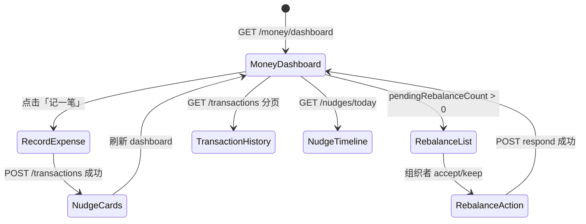

# Money Brain 行中层 — 前端接口文档（M9）

> **Global prefix**：所有路径前缀为 `/api`（如 `GET /api/trips/:tripId/in-trip/money/dashboard`）  
> **响应格式**：`{ success: boolean, data?: T, error?: { code, message, details? } }`  
> **鉴权**：生产环境 Bearer Token + 行程成员；开发环境 `NODE_ENV !== 'production'` 可用 `anonymous-dev-user`  
> **Swagger Tag**：`trip-in-trip-money`  
> **功能开关**：
> - `IN_TRIP_EXECUTION_ENABLED=true` — 行中模块总开关（必填）
> - `IN_TRIP_MONEY_BRAIN_ENABLED=true` — 可选；未设置时随总开关启用

---

## 后端部署前置（首次）

```bash
npx prisma db execute --schema prisma/schema.prisma \
  --file prisma/migrations/add_in_trip_money_brain.sql
npx prisma generate

export IN_TRIP_EXECUTION_ENABLED=true
```

未执行 migration 时，本模块接口会 **500**（表不存在）。

**前置数据**（行前应已完成，否则 dashboard 桶计划额为 0）：

| 前置项 | 关联接口 |
|--------|---------|
| L1 总预算 + 日均 | `GET/PUT /api/trips/:tripId/budget/intent` |
| L2 六类结构 | `GET/PUT /api/trips/:tripId/budget/structure` |
| L3 钱包规则 | `GET/PUT /api/trips/:tripId/budget/wallet/rule` |
| Money DNA（调助推阈值） | `GET/POST .../decision-profiling/my/money-dna` |
| 进入行中 | `PATCH /api/trips/:id` → `status: "TRAVELING"` |

---

## 一、页面与接口映射

| UI 区域 | 主要接口 | 说明 |
|--------|---------|------|
| Money 首屏 / 6 桶进度环 | `GET .../money/dashboard` | 心理账户进度 + 今日消费摘要 |
| 记一笔（手输 / 拍照 / 语音） | `POST .../money/transactions` | 记账 + 即时助推 + 同步 L3 钱包 |
| 消费流水列表 | `GET .../money/transactions` | 全行程分页，不限今日 |
| 今日助推时间线 | `GET .../money/nudges/today` | 当日所有助推消息 |
| 预算再平衡卡片 | `GET .../money/rebalance` | 待处理 surplus/overspend/pace_gap |
| 接受 / 保留建议 | `POST .../money/rebalance/:id/respond` | 仅 OWNER / EDITOR |
| Today 角标（再平衡） | `GET .../in-trip/today` | `pendingCards.rebalanceSuggestions` |
| 快捷入口「记消费」 | `GET .../in-trip/today` | `quickActions` 含 `record_expense` |

**模块边界**：Money Brain **不替代** Budget OS。结算真相源仍是 L3 `TripWalletLedgerEntry`；本模块在记账时自动调用 `createManualLedger`。

---

## 二、推荐用户流程

### 2.1 打开 Money 页（成员）

```
1. 确认行程 status = TRAVELING
2. GET /in-trip/money/dashboard
   ├─ buckets[] → 渲染 6 桶进度条/环图
   ├─ todaySpendCny + todayTransactions → 今日区块
   └─ pendingRebalanceCount > 0 → 展示再平衡入口角标
3. （可选）GET /in-trip/money/rebalance → 再平衡详情列表
```

### 2.2 记一笔（成员）

```
1. 用户填写金额 / 选类别 / 选分摊人
2. POST /in-trip/money/transactions
3. 读取 data.nudgesTriggered[] → 按类型展示助推卡片（见 §七）
4. 若 rebalanceSuggestionsCreated > 0 → 提示「预算建议已更新」并刷新 rebalance 列表
5. 刷新 dashboard +（可选）GET /today 更新角标
```

### 2.3 处理再平衡（组织者）

```
1. GET /in-trip/money/rebalance
2. 展示 message + proposal（fromBucket → toBucket, amount）
3. POST .../rebalance/:suggestionId/respond { response: "accept" | "keep" }
4. 刷新 dashboard + today 角标
```

---

## 三、心理账户 6 桶

| `bucket` | `label` | 计划额来源 |
|----------|---------|-----------|
| `transportation` | 交通 | L2 `allocations.transportation` |
| `accommodation` | 住宿 | L2 `allocations.accommodation` |
| `experience` | 体验 | L2 `allocations.experience` |
| `food` | 餐饮 | L2 `allocations.food` |
| `other` | 其他 | L2 `allocations.other` |
| `contingency` | 应急 | L1 `total × 10%`（无 L2 时可能为 0） |

`usagePercent = round(actual / planned × 100)`；`planned = 0` 时返回 `0`。

**记账类别 → 桶映射**（`POST /transactions` 的 `category`）：

| 前端 category 建议值 | 归入桶 |
|---------------------|--------|
| `dining` / `food` / `restaurant` | `food` |
| `transport` / `transportation` / `taxi` / `flight` | `transportation` |
| `accommodation` / `hotel` / `lodging` | `accommodation` |
| `activities` / `experience` / `sightseeing` / `ticket` | `experience` |
| `shopping` / `souvenir` / `other` | `other` |
| `emergency` / `contingency` | `contingency` |
| 未识别 | `other` |

---

## 四、接口详情

### 4.1 `GET /trips/:tripId/in-trip/money/dashboard`

**用途**：Money 首屏数据 — 6 桶进度 + 今日消费流（最多 20 条）+ 待处理再平衡数量。

**权限**：行程成员 + `TRAVELING` + `IN_TRIP_EXECUTION_ENABLED=true`

**请求**：无 body；无 query。

**响应 `data`**：

```json
{
  "tripId": "trip-1",
  "currency": "CNY",
  "dailyBudget": 800,
  "buckets": [
    {
      "bucket": "transportation",
      "label": "交通",
      "planned": 3000,
      "actual": 1200,
      "usagePercent": 40,
      "currency": "CNY"
    },
    {
      "bucket": "accommodation",
      "label": "住宿",
      "planned": 5000,
      "actual": 5000,
      "usagePercent": 100,
      "currency": "CNY"
    },
    {
      "bucket": "experience",
      "label": "体验",
      "planned": 4000,
      "actual": 2100,
      "usagePercent": 53,
      "currency": "CNY"
    },
    {
      "bucket": "food",
      "label": "餐饮",
      "planned": 2400,
      "actual": 520,
      "usagePercent": 22,
      "currency": "CNY"
    },
    {
      "bucket": "other",
      "label": "其他",
      "planned": 600,
      "actual": 0,
      "usagePercent": 0,
      "currency": "CNY"
    },
    {
      "bucket": "contingency",
      "label": "应急",
      "planned": 1500,
      "actual": 0,
      "usagePercent": 0,
      "currency": "CNY"
    }
  ],
  "todaySpendCny": 1456,
  "todayTransactions": [],
  "pendingRebalanceCount": 1
}
```

| 字段 | 类型 | 说明 |
|------|------|------|
| `currency` | string | 来自 L1 预算意图，默认 `CNY` |
| `dailyBudget` | number \| null | L1 日均预算；无 intent 时为 `null` |
| `buckets` | `BucketProgress[]` | 固定 6 项，顺序见上表 |
| `todaySpendCny` | number | 今日 0 点（行程时区）起累计，CNY |
| `todayTransactions` | `SmartTransactionSummary[]` | 今日最近 20 条，按时间倒序 |
| `pendingRebalanceCount` | number | 待处理再平衡条数，可驱动角标 |

**前端展示建议**：

- `usagePercent >= 100` → 桶标红；`>= 85` → 黄色预警
- `dailyBudget` 与 `todaySpendCny` 可并排展示「今日 / 日均」
- `pendingRebalanceCount > 0` 时在首屏或 Tab 显示红点

**错误示例**：

```json
{
  "success": false,
  "error": {
    "code": "VALIDATION_ERROR",
    "message": "行中接口要求行程处于 TRAVELING 状态，当前为 PLANNING"
  }
}
```

---

### 4.2 `POST /trips/:tripId/in-trip/money/transactions`

**用途**：智能记账。流程：汇率换算 → 心理账户归类 → 四类助推评估 → 写 `trip_smart_transactions` → 同步 L3 钱包分录 → 触发再平衡扫描。

**权限**：行程成员 + `TRAVELING`

**请求体**：

```json
{
  "captureMethod": "manual",
  "amountLocal": 28000,
  "currencyLocal": "ISK",
  "category": "dining",
  "merchant": "Blue Lagoon Restaurant",
  "description": "4人午餐",
  "splitAmongUserIds": ["u1", "u2", "u3", "u4"],
  "paidByUserId": "u1"
}
```

| 字段 | 类型 | 必填 | 说明 |
|------|------|------|------|
| `captureMethod` | `'manual' \| 'photo' \| 'voice'` | ✅ | Phase 1 三种方式逻辑相同；`photo`/`voice` 的 OCR/ASR 后续接入 |
| `amountLocal` | number | ✅ | 必须 > 0 |
| `currencyLocal` | string | ✅ | 如 `ISK`、`CNY`、`USD` |
| `category` | string | ✅ | 见 §三类别映射表 |
| `merchant` | string | — | 商户名；空时用 `description` 或类别作账本 title |
| `description` | string | — | 备注 |
| `splitAmongUserIds` | string[] | ✅ | 至少 1 人；须在行程成员内 |
| `paidByUserId` | string | ✅ | 付款人 userId |
| `voiceTranscript` | string | — | 预留，Phase 2 |
| `photoRef` | string | — | 预留，Phase 2 |

**汇率（Phase 1 固定表，换算为 CNY 入账）**：

| 货币 | 兑 CNY |
|------|--------|
| CNY | 1 |
| ISK | 0.052 |
| USD | 7.25 |
| EUR | 7.85 |
| GBP | 9.15 |
| JPY | 0.048 |
| 其他 | 1（兜底） |

**响应 `data`**：

```json
{
  "transaction": {
    "id": "a1b2c3d4-e5f6-7890-abcd-ef1234567890",
    "tripId": "trip-1",
    "memberId": "u1",
    "ledgerEntryId": "ledger-uuid",
    "amountLocal": 28000,
    "currencyLocal": "ISK",
    "amountCny": 1456,
    "exchangeRate": 0.052,
    "category": "dining",
    "merchant": "Blue Lagoon Restaurant",
    "description": "4人午餐",
    "captureMethod": "manual",
    "bucketAssignment": "food",
    "spendRationality": "planned",
    "nudgesTriggered": [
      {
        "type": "progress_bar",
        "message": "已记入food账户，继续留意今日节奏",
        "metadata": { "bucket": "food", "amountCny": 1456 }
      },
      {
        "type": "reference_point",
        "message": "这笔约合 ¥1456，约为日均预算的 182%",
        "metadata": {
          "amountCny": 1456,
          "dailyBudget": 800,
          "ratio": 1.82,
          "currencyLocal": "ISK"
        }
      }
    ],
    "recordedAt": "2026-07-02T12:30:00.000Z"
  },
  "ledgerEntryId": "ledger-uuid",
  "nudgesTriggered": [],
  "rebalanceSuggestionsCreated": 1
}
```

| 字段 | 类型 | 说明 |
|------|------|------|
| `transaction` | object | 完整记账记录 |
| `ledgerEntryId` | string | L3 钱包分录 ID，可与 Budget OS wallet 接口关联 |
| `nudgesTriggered` | `MoneyNudge[]` | 与 `transaction.nudgesTriggered` 相同（便于直接渲染） |
| `rebalanceSuggestionsCreated` | number | 本次记账后新产生的待处理建议数 |
| `spendRationality` | string \| null | `planned` / `rapid`（触发 cooling_off）/ `impulse`（触发 fomo_hedge） |

**校验错误**：

```json
{
  "success": false,
  "error": {
    "code": "VALIDATION_ERROR",
    "message": "amountLocal 必须大于 0"
  }
}
```

```json
{
  "success": false,
  "error": {
    "code": "VALIDATION_ERROR",
    "message": "paidByUserId 与 splitAmongUserIds 必填"
  }
}
```

---

### 4.3 `GET /trips/:tripId/in-trip/money/transactions`

**用途**：全行程消费流分页（不限今日）。

**权限**：行程成员 + `TRAVELING`

**Query 参数**：

| 参数 | 类型 | 默认 | 说明 |
|------|------|------|------|
| `limit` | number | 30 | 每页条数 |
| `offset` | number | 0 | 偏移量 |

**响应 `data`**：

```json
{
  "items": [
    {
      "id": "tx-1",
      "tripId": "trip-1",
      "memberId": "u1",
      "ledgerEntryId": "ledger-1",
      "amountLocal": 28000,
      "currencyLocal": "ISK",
      "amountCny": 1456,
      "exchangeRate": 0.052,
      "category": "dining",
      "merchant": "Blue Lagoon Restaurant",
      "description": "4人午餐",
      "captureMethod": "manual",
      "bucketAssignment": "food",
      "spendRationality": "planned",
      "nudgesTriggered": [],
      "recordedAt": "2026-07-02T12:30:00.000Z"
    }
  ],
  "total": 42,
  "limit": 30,
  "offset": 0
}
```

**前端分页**：`offset + items.length < total` 时加载下一页。

---

### 4.4 `GET /trips/:tripId/in-trip/money/nudges/today`

**用途**：聚合今日（行程时区 0 点起）所有记账触发的助推，按记账时间倒序扁平化。

**权限**：行程成员 + `TRAVELING`

**响应 `data`**：`MoneyNudge[]`

```json
{
  "success": true,
  "data": [
    {
      "type": "cooling_off",
      "message": "近 2 小时消费偏高，建议稍作停顿再决定下一笔",
      "metadata": {
        "recentSpendCny2h": 2400,
        "threshold": 1600,
        "multiplier": 2
      }
    },
    {
      "type": "progress_bar",
      "message": "已记入food账户，继续留意今日节奏",
      "metadata": { "bucket": "food", "amountCny": 1456 }
    }
  ]
}
```

**说明**：同一笔账可能产生多条助推；与 `POST /transactions` 返回的 `nudgesTriggered` 结构一致。适合「今日助推时间线」页；记账成功页可直接用 POST 响应，无需再调此接口。

---

### 4.5 `GET /trips/:tripId/in-trip/money/rebalance`

**用途**：列出 `status = pending` 的预算再平衡建议。

**权限**：行程成员 + `TRAVELING`

**响应 `data`**：`RebalanceSuggestionSummary[]`

```json
{
  "success": true,
  "data": [
    {
      "id": "rb-1",
      "tripId": "trip-1",
      "scenario": "overspend",
      "message": "体验桶已超支，建议从应急桶调剂或降低该类别强度",
      "proposal": {
        "fromBucket": "experience",
        "toBucket": "contingency",
        "amount": 800,
        "rationale": "实际达计划的 118%"
      },
      "status": "pending",
      "createdAt": "2026-07-02T20:00:00.000Z"
    },
    {
      "id": "rb-2",
      "tripId": "trip-1",
      "scenario": "pace_gap",
      "message": "成员消费节奏差异较大，建议对齐预期或考虑分组活动",
      "proposal": {
        "rationale": "进度差 32% 超过 25% 阈值",
        "memberIds": ["u1", "u3", "u2"]
      },
      "status": "pending",
      "createdAt": "2026-07-02T21:00:00.000Z"
    }
  ]
}
```

**`scenario` 含义**：

| 值 | 触发条件 | UI 文案方向 |
|----|----------|------------|
| `surplus` | 某桶实际 < 计划 80% | 「XX 桶有结余，可滑移到 YY」 |
| `overspend` | 某桶实际 > 计划 115% | 「XX 桶超支，建议从应急桶调剂」 |
| `pace_gap` | 成员消耗进度差 > 25% | 「团队节奏不一致」；`proposal.memberIds` 供组织者查看 |

**与 Today 联动**：`GET /in-trip/today` → `pendingCards.rebalanceSuggestions` 等于本接口 `data.length`（仅 pending 数量）。

---

### 4.6 `POST /trips/:tripId/in-trip/money/rebalance/:suggestionId/respond`

**用途**：组织者对再平衡建议表态。

**权限**：`OWNER` / `EDITOR` + `TRAVELING`

**路径参数**：`suggestionId` — 来自 `GET /rebalance` 的 `id`

**请求体**：

```json
{ "response": "accept" }
```

| `response` | 后端 `status` | 前端含义 |
|------------|---------------|----------|
| `accept` | `accepted` | 接受滑移/调剂（Phase 1 仅记录态度，不自动改 L2 结构） |
| `keep` | `dismissed` | 保持当前预算结构 |

**响应 `data`**：更新后的 `RebalanceSuggestionSummary`（`status` 变为 `accepted` 或 `dismissed`）。

**错误**：

```json
{
  "success": false,
  "error": { "code": "FORBIDDEN", "message": "需要 OWNER 或 EDITOR 权限" }
}
```

```json
{
  "success": false,
  "error": { "code": "VALIDATION_ERROR", "message": "该建议已处理" }
}
```

```json
{
  "success": false,
  "error": { "code": "NOT_FOUND", "message": "再平衡建议 xxx 不存在" }
}
```

---

## 五、数字助推（Nudge）UI 规范

| `type` | 触发条件 | 建议 UI |
|--------|----------|---------|
| `progress_bar` | 任意记账后 | 轻量 toast / 桶进度动画 |
| `reference_point` | 外币消费 ≥ 日均预算 20% | 金额对照卡片（当地币 ↔ CNY ↔ 日均%） |
| `cooling_off` | 2h 内消费 > 日均 × Money DNA 倍数（默认 2.0×） | 温和拦截 / 「稍后再买」CTA |
| `fomo_hedge` | 非计划高价体验消费 | 确认弹窗：「不在原计划内，仍要记录吗？」 |

**Money DNA 对 `cooling_off` 阈值的影响**（用户完成 Money DNA 问卷后生效）：

| 画像 | 倍数 |
|------|------|
| `experienceTendency > 0.7` | 2.5× 日均 |
| `qualityTendency > 0.7` 且 `experienceTendency < 0.4` | 1.5× 日均 |
| 默认 / 未完成问卷 | 2.0× 日均 |

---

## 六、错误码

| HTTP | `error.code` | 典型 `message` |
|------|--------------|----------------|
| 200 | `UNAUTHORIZED` | 需要登录 |
| 200 | `FORBIDDEN` | 需要为行程成员 / 需要 OWNER 或 EDITOR 权限 |
| 200 | `VALIDATION_ERROR` | 非 TRAVELING；字段校验失败；建议已处理 |
| 200 | `NOT_FOUND` | 再平衡建议不存在 |
| 200 | `SERVICE_UNAVAILABLE` | 行中执行模块未启用 |
| 500 | — | DB 表未迁移等未捕获异常 |

**注意**：可预期业务错误返回 HTTP 200 + `success: false`，与 `decision-profiling` 一致。

---

## 七、TypeScript 类型（可直接复制到前端）

```typescript
interface ApiResponse<T> {
  success: boolean;
  data?: T;
  error?: {
    code: string;
    message: string;
    details?: Record<string, unknown>;
  };
}

type CaptureMethod = 'manual' | 'photo' | 'voice';

type PsychologicalBucket =
  | 'transportation'
  | 'accommodation'
  | 'experience'
  | 'food'
  | 'other'
  | 'contingency';

type NudgeType =
  | 'progress_bar'
  | 'reference_point'
  | 'cooling_off'
  | 'fomo_hedge';

type RebalanceScenario = 'surplus' | 'overspend' | 'pace_gap';

type RebalanceResponse = 'accept' | 'keep';

type SpendRationality = 'planned' | 'rapid' | 'impulse' | null;

interface MoneyNudge {
  type: NudgeType;
  message: string;
  metadata?: Record<string, unknown>;
}

interface RecordTransactionInput {
  captureMethod: CaptureMethod;
  amountLocal: number;
  currencyLocal: string;
  category: string;
  merchant?: string;
  description?: string;
  splitAmongUserIds: string[];
  paidByUserId: string;
  voiceTranscript?: string;
  photoRef?: string;
}

interface SmartTransactionSummary {
  id: string;
  tripId: string;
  memberId: string;
  ledgerEntryId: string | null;
  amountLocal: number;
  currencyLocal: string;
  amountCny: number;
  exchangeRate: number;
  category: string;
  merchant: string | null;
  description: string | null;
  captureMethod: CaptureMethod;
  bucketAssignment: PsychologicalBucket;
  spendRationality: SpendRationality;
  nudgesTriggered: MoneyNudge[];
  recordedAt: string;
}

interface RecordTransactionResult {
  transaction: SmartTransactionSummary;
  ledgerEntryId: string;
  nudgesTriggered: MoneyNudge[];
  rebalanceSuggestionsCreated: number;
}

interface BucketProgress {
  bucket: PsychologicalBucket;
  label: string;
  planned: number;
  actual: number;
  usagePercent: number;
  currency: string;
}

interface MoneyDashboard {
  tripId: string;
  currency: string;
  dailyBudget: number | null;
  buckets: BucketProgress[];
  todaySpendCny: number;
  todayTransactions: SmartTransactionSummary[];
  pendingRebalanceCount: number;
}

interface TransactionListResult {
  items: SmartTransactionSummary[];
  total: number;
  limit: number;
  offset: number;
}

interface RebalanceProposal {
  fromBucket?: PsychologicalBucket;
  toBucket?: PsychologicalBucket;
  amount?: number;
  rationale: string;
  memberIds?: string[];
}

interface RebalanceSuggestionSummary {
  id: string;
  tripId: string;
  scenario: RebalanceScenario;
  message: string;
  proposal: RebalanceProposal;
  status: 'pending' | 'accepted' | 'dismissed';
  createdAt: string;
}

interface RespondRebalanceInput {
  response: RebalanceResponse;
}
```

---

## 八、推荐 API 封装

```typescript
const moneyBase = (tripId: string) => `/api/trips/${tripId}/in-trip/money`;

async function parseJson<T>(res: Response): Promise<ApiResponse<T>> {
  return res.json();
}

export const moneyBrainApi = {
  getDashboard: (tripId: string) =>
    parseJson<MoneyDashboard>(fetch(`${moneyBase(tripId)}/dashboard`)),

  recordTransaction: (tripId: string, body: RecordTransactionInput) =>
    parseJson<RecordTransactionResult>(
      fetch(`${moneyBase(tripId)}/transactions`, {
        method: 'POST',
        headers: { 'Content-Type': 'application/json' },
        body: JSON.stringify(body),
      }),
    ),

  listTransactions: (
    tripId: string,
    params?: { limit?: number; offset?: number },
  ) => {
    const q = new URLSearchParams();
    if (params?.limit != null) q.set('limit', String(params.limit));
    if (params?.offset != null) q.set('offset', String(params.offset));
    const suffix = q.toString() ? `?${q}` : '';
    return parseJson<TransactionListResult>(
      fetch(`${moneyBase(tripId)}/transactions${suffix}`),
    );
  },

  getTodayNudges: (tripId: string) =>
    parseJson<MoneyNudge[]>(fetch(`${moneyBase(tripId)}/nudges/today`)),

  listRebalanceSuggestions: (tripId: string) =>
    parseJson<RebalanceSuggestionSummary[]>(
      fetch(`${moneyBase(tripId)}/rebalance`),
    ),

  respondRebalance: (
    tripId: string,
    suggestionId: string,
    response: RebalanceResponse,
  ) =>
    parseJson<RebalanceSuggestionSummary>(
      fetch(`${moneyBase(tripId)}/rebalance/${suggestionId}/respond`, {
        method: 'POST',
        headers: { 'Content-Type': 'application/json' },
        body: JSON.stringify({ response }),
      }),
    ),
};
```

生产环境请在 `fetch` 上统一加 `Authorization: Bearer <token>`。

---

## 九、前端状态机建议



---

## 十、能力成熟度

| 能力 | 状态 | 说明 |
|------|------|------|
| 6 桶 dashboard | ✅ | 依赖行前 L1/L2 |
| 手输记账 + L3 同步 | ✅ | — |
| 固定汇率换算 | ✅ | ISK/USD/EUR 等 |
| 四类数字助推 | ✅ | Money DNA 调 cooling_off |
| 再平衡建议 + 组织者响应 | ✅ | accept 不自动改 L2 |
| 拍照 OCR / 语音 ASR | ⏳ Phase 2 | `captureMethod` 已预留 |
| 拆队费用路由 | ⏳ M10 | `splitGroupId` 字段已预留 |

---

## 十一、相关文档

- 行中总览（Today / 环境）：[`IN_TRIP_EXECUTION_API.md`](./IN_TRIP_EXECUTION_API.md)
- 技术设计：[`IN_TRIP_EXECUTION_TECH_DESIGN.md`](./IN_TRIP_EXECUTION_TECH_DESIGN.md) §8
- 行前 Budget OS：trip-budget-os 控制器 / `DECISION_PROFILING_API.md`（Money DNA）
