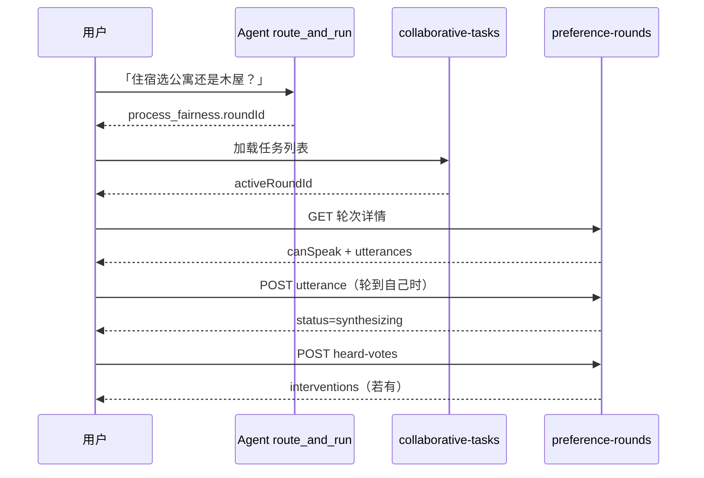

# 过程公平性工具 — 前端接口文档（F3）

> **Global prefix**：所有路径前缀为 `/api`（如 `GET /api/trips/:tripId/collaborative-tasks`）  
> **响应格式**：`{ success: boolean, data?: T, error?: { code, message } }`  
> **鉴权**：生产环境 Bearer Token + 行程成员；开发环境 `NODE_ENV !== 'production'` 可用 `anonymous-dev-user`

---

## 后端必须提供的支持（自查清单）

### 1. 数据库（首次部署）

```bash
./scripts/apply-process-fairness-migration.sh
# 或
npx prisma db execute --schema prisma/schema.prisma \
  --file prisma/migrations/add_trip_process_fairness.sql
npx prisma generate
```

未执行 migration 时，`preference-rounds` / `voice-guard` 会 **500**（表不存在）。

### 2. 任务列表 — `GET /api/trips/:tripId/collaborative-tasks`

**已实现**。响应示例：

```json
{
  "success": true,
  "data": {
    "tasks": [
      {
        "id": "task:accommodation",
        "domain": "accommodation",
        "title": "住宿",
        "crossLevel": "medium",
        "status": "in_discussion",
        "statusLabel": "讨论中",
        "activeRoundId": "uuid-of-preference-round",
        "claimCount": 2,
        "leaderDisplayName": "莎莎",
        "endorsementSummary": "莎莎 2/4 · 妈妈 1/4"
      }
    ]
  }
}
```

| 要点 | 后端行为 |
|------|---------|
| `domain` 枚举 | `destination_route` / `accommodation` / `activities` / `dining` 等（见 `WISH_CATEGORIES`） |
| 空列表 | 仅返回 **中/高交叉** 领域；全为 low 或未认领时可能 `tasks: []` |
| `activeRoundId` | `status === "in_discussion"` 且成员≥2 时：**懒创建**活跃轮次并返回 ID |
| `source` | `domain_influence`（F2.3 领域任务）或 `decision_problem`（决策问题预生成入口） |
| `problemId` | 当 `source=decision_problem` 时，对应 `GET decision-problems/:problemId` |

**决策问题预生成任务**（2026-07）：开放且需多人协商的 decision problem 会追加 `id: task:problem:{problemId}` 条目；前端选中后可用 `activeRoundId` 或下方 POST 进入讨论。

### 2.1 从决策问题一键发起协商（P0 编排）

`POST /api/trips/:tripId/decision-problems/:problemId/negotiations`

`GET /api/trips/:tripId/decision-problems/:problemId/negotiations/preflight?focusConflictId=`

**POST Request（可选 body）**

```json
{
  "focusConflictId": "issue-gap-3",
  "selectedOptionId": "opt-a",
  "note": "希望团队先对齐节奏",
  "closesAt": "2026-07-05T18:00:00Z",
  "autoClaimDomain": true
}
```

**POST Response `data.action`**

| action | 含义 |
|--------|------|
| `created` | 新建轮次成功 → 直接开讨论弹窗 |
| `enter_existing` | 该问题已有进行中协商 → 直接开弹窗 |
| `claim_required` | 需先认领领域（`autoClaimDomain: false` 时） |

**兼容接口：** `POST .../decision-problems/:problemId/preference-round`（Unified Gateway）仍可用，内部委托编排器。

### 2.2 从决策问题创建/绑定协商轮次（兼容）

`POST /api/trips/:tripId/decision-problems/:problemId/preference-round`

幂等：若该问题映射的 wish `domain` 已有进行中轮次，则复用并返回 `boundExisting: true`。

**响应 `data`**

```json
{
  "problemId": "problem_xxx",
  "tripId": "trip-uuid",
  "domain": "activities",
  "decisionNode": "activity",
  "roundId": "round-uuid",
  "created": true,
  "boundExisting": false,
  "memberCount": 3,
  "clientNavigation": {
    "route": "structured_negotiation",
    "tripId": "trip-uuid",
    "roundId": "round-uuid",
    "domain": "activities",
    "problemId": "problem_xxx"
  }
}
```

**前端推荐流程**

1. Decision Center 打开问题 → `GET collaborative-tasks`，按 `problemId` 选中 `source=decision_problem` 任务；或
2. 直接 `POST .../decision-problems/:problemId/negotiations` → 用 `clientNavigation.roundId` 加载 `GET preference-rounds/:roundId`

### 2.3 P1 — 决策问题详情协商投影

`GET /api/trips/:tripId/decision-problems/:problemId?focusConflictId=issue-gap-3`

Legacy 流程：字段在 `data` 内；Unified Canonical：同名字段在响应顶层（与 `data` 并列）。

```json
{
  "suggestedNegotiationDomain": "activities",
  "suggestedDecisionNode": "activity",
  "negotiation": {
    "taskId": "nt:dp_id:coverage-gap:3",
    "roundId": "round-uuid",
    "roundDomain": "activities",
    "status": "in_discussion",
    "canStart": true,
    "buttonLabel": "进入协商",
    "focusConflictId": "issue-gap-3",
    "closedOutcome": null
  }
}
```

| `negotiation.status` | `buttonLabel` |
|----------------------|---------------|
| `in_discussion` | 进入协商 |
| `pending` / `none`（且 `canStart`） | 发起协商 |
| `closed` | `null`（可读 `closedOutcome` 衔接方案草案） |

轮次 `closed` 时后端写回 `trip.metadata.decisionProblemNegotiations.byProblemId[problemId].outcome`（含 `recommendedOptionId`、`summaryCN`）。

**会出现在列表中的领域**（crossLevel ≠ low）：`destination_route`、`accommodation`、`activities`、`dining`。

### 3. 讨论区 — `preference-rounds` 系列

| 接口 | 状态 |
|------|------|
| `GET .../preference-rounds/:roundId` | ✅ 轮次详情、`canSpeak`、发言列表 |
| `POST .../preference-rounds/:roundId/utterances` | ✅ 仅当前发言者可提交 |
| `POST .../preference-rounds/:roundId/heard-votes` | ✅ 「你被听见了吗？」 |
| `POST .../preference-rounds` | ✅ 手动/Agent 发起 |

### 4. Agent 自动跳转 — `route_and_run`

**已实现**。GATE 通过后、PLAN 前，成员≥2 且消息命中决策关键词时：

```json
{
  "result": {
    "status": "OK",
    "payload": {
      "process_fairness": {
        "triggered": true,
        "decisionNode": "accommodation",
        "roundId": "uuid",
        "agentIntroZh": "我们进入住宿的结构化偏好分享轮次…",
        "clientNavigation": {
          "route": "structured_negotiation",
          "tripId": "trip-1",
          "roundId": "uuid",
          "domain": "accommodation"
        }
      }
    }
  }
}
```

### 5. 快速自查（Network）

| 请求 | 预期 |
|------|------|
| `GET /api/trips/{tripId}/collaborative-tasks` | 200 + `data.tasks[].domain` → 左侧出现 |
| 同上但 `tasks: []` | 暂无中/高交叉协商任务（常见） |
| 404/500 | migration 未执行或 tripId 无效 |
| `GET .../preference-rounds/{activeRoundId}` | 200 → 讨论区加载 |
| Agent 发「住宿选公寓还是木屋？」 | `process_fairness.triggered: true` |

---

## 一、页面与接口映射

| UI 区域 | 主要接口 |
|--------|---------|
| 左侧「结构化协商」任务列表 | `GET /trips/:tripId/collaborative-tasks` |
| 右侧讨论区（Round Robin） | `GET /trips/:tripId/preference-rounds/:roundId` |
| 发言输入框 | `POST .../preference-rounds/:roundId/utterances` |
| 「你被听见了吗？」投票 | `POST .../preference-rounds/:roundId/heard-votes` |
| Voice Guard 介入条 | `GET /trips/:tripId/voice-guard/status` |
| Agent 自动发起轮次 | `route_and_run` 响应 `payload.process_fairness` |

---

## 二、结构化协商任务列表

### `GET /trips/:tripId/collaborative-tasks`

返回中/高交叉领域任务，状态与 mockup 对齐。

**响应 `data`**

```json
{
  "tasks": [
    {
      "id": "task:accommodation",
      "domain": "accommodation",
      "title": "住宿",
      "description": "影响：…",
      "crossLevel": "high",
      "status": "in_discussion",
      "statusLabel": "讨论中",
      "claimCount": 2,
      "leaderDisplayName": "莎莎",
      "endorsementSummary": "莎莎 2/4 · 妈妈 1/4",
      "weightSource": "computed",
      "closesAt": "2026-06-18T21:00:00.000Z",
      "activeRoundId": "uuid-of-preference-round"
    }
  ]
}
```

| 字段 | 说明 |
|------|------|
| `status` | `pending` \| `in_discussion` \| `consensus_reached` |
| `activeRoundId` | 仅 `in_discussion` 时有值；用于加载右侧讨论区 |

---

## 三、偏好分享轮次（F3.1 Round Robin）

### 3.1 列表

`GET /trips/:tripId/preference-rounds`

```json
{
  "items": [
    {
      "id": "uuid",
      "tripId": "trip-1",
      "domain": "accommodation",
      "decisionNode": "accommodation",
      "status": "collecting",
      "statusLabel": "收集团队意见…",
      "closesAt": "2026-06-18T21:00:00.000Z",
      "utteranceCount": 1,
      "memberCount": 4
    }
  ],
  "count": 1
}
```

### 3.2 查询进行中轮次

`GET /trips/:tripId/preference-rounds/active?domain=accommodation`

```json
{
  "domain": "accommodation",
  "activeRoundId": "uuid-or-null"
}
```

### 3.3 发起轮次（Agent 或手动）

`POST /trips/:tripId/preference-rounds`

**Body**

```json
{
  "decisionNode": "accommodation",
  "turnOrder": ["user-a", "user-b"],
  "closesAt": "2026-06-18T21:00:00.000Z"
}
```

| `decisionNode` | 映射领域 |
|----------------|---------|
| `destination` | `destination_route` |
| `accommodation` | `accommodation` |
| `activity` | `activities` |
| `budget` | `shopping` |

- `turnOrder` 可选，缺省随机打乱成员顺序  
- 同一领域已有 `collecting` / `synthesizing` 轮次时返回 409

### 3.4 轮次详情（讨论区主接口）

`GET /trips/:tripId/preference-rounds/:roundId`

```json
{
  "id": "uuid",
  "tripId": "trip-1",
  "domain": "accommodation",
  "decisionNode": "accommodation",
  "status": "collecting",
  "statusLabel": "收集团队意见…",
  "turnOrder": ["u1", "u2", "u3"],
  "currentTurn": 1,
  "currentSpeakerUserId": "u2",
  "currentSpeakerDisplayName": "妈妈",
  "closesAt": "2026-06-18T21:00:00.000Z",
  "closedAt": null,
  "utterances": [
    {
      "id": "uuid",
      "userId": "u1",
      "displayName": "莎莎",
      "turnIndex": 0,
      "modality": "text",
      "content": "我更想住黑沙滩木屋，风景好",
      "reason": "愿意多花一点",
      "viaProxy": false,
      "createdAt": "2026-06-18T19:00:00.000Z"
    }
  ],
  "heardRates": null,
  "interventions": [],
  "canSpeak": false,
  "canSubmitHeardVotes": false,
  "myHeardVotesSubmitted": false
}
```

| 字段 | 说明 |
|------|------|
| `status` | `collecting` → `synthesizing` → `closed` |
| `canSpeak` | 当前用户是否可发言（轮到且未发过言） |
| `canSubmitHeardVotes` | `synthesizing` 阶段是否可提交「被听见」投票 |
| `heardRates` | 合成阶段后展示各成员被听见率 |
| `interventions` | 被听见率 &lt; 80% 时的群体提示 |

**轮次状态机**

```
collecting（依次发言）
    → synthesizing（「你被听见了吗？」投票）
    → closed
```

### 3.5 提交发言

`POST /trips/:tripId/preference-rounds/:roundId/utterances`

**Body**

```json
{
  "modality": "text",
  "content": "偏好内容或媒体 URL",
  "reason": "可选理由",
  "viaProxy": false
}
```

| `modality` | 说明 |
|------------|------|
| `text` | 纯文字 |
| `voice` | 语音片段 URL（1–2 分钟，前端上传后传 URL） |
| `image` | 图片 URL |
| `link` | 外链分享 |

- 非当前发言者提交 → `400`：「尚未轮到你发言…」
- 返回更新后的完整轮次详情（同 3.4）

### 3.6 「你被听见了吗？」投票

`POST /trips/:tripId/preference-rounds/:roundId/heard-votes`

**Body**

```json
{
  "votes": [
    { "targetUserId": "u1", "heard": true },
    { "targetUserId": "u2", "heard": false }
  ]
}
```

- 不能对自己投票  
- 投票匿名聚合；API 不返回谁投了谁  
- 全员完成后自动 `closed`

**`interventions` 示例**

```json
{
  "targetUserId": "u2",
  "displayName": "妈妈",
  "heardRate": 0.5,
  "messageCN": "我们需要再给妈妈一个表达机会——「被听见」反馈尚未达到共识（50%）。"
}
```

### 3.7 手动结束

`POST /trips/:tripId/preference-rounds/:roundId/close`

---

## 四、发言权保障（F3.3 Voice Guard）

### `GET /trips/:tripId/voice-guard/status`

```json
{
  "tripId": "trip-1",
  "memberCount": 4,
  "averageEngagementScore": 6.5,
  "members": [
    {
      "userId": "u3",
      "displayName": "爸爸",
      "preferenceSubmits": 0,
      "voteParticipations": 0,
      "discussionUtterances": 0,
      "consecutiveSilentRounds": 2,
      "lastSpokeAt": null,
      "engagementScore": 0
    }
  ],
  "interventions": [
    {
      "userId": "u3",
      "displayName": "爸爸",
      "reason": "consecutive_silent",
      "privateMessageCN": "你的想法对我们很重要，要不要花 2 分钟看看大家的选择，告诉我们你的感受？",
      "groupMessageCN": "目前爸爸还没有对当前方案发表意见，我们要不要等一等，听听 TA 的想法？",
      "severity": "medium"
    }
  ]
}
```

---

## 五、Agent 编排自动发起（Orchestrator）

当用户通过 `route_and_run` 绑定 `trip_id` 且行程成员 ≥ 2 人时，**GATE_EVAL 通过后**系统会检测消息中的决策节点关键词并自动发起轮次。

**响应路径**：`result.payload.process_fairness`

```json
{
  "triggered": true,
  "decisionNode": "accommodation",
  "roundId": "uuid",
  "round": { },
  "agentIntroZh": "我们进入住宿的结构化偏好分享轮次（已开启）。请按顺序表达…",
  "clientNavigation": {
    "route": "structured_negotiation",
    "tripId": "trip-1",
    "roundId": "uuid",
    "domain": "accommodation"
  }
}
```

**前端建议**

1. 若 `process_fairness.triggered === true`，展示 Agent 开场白并导航至结构化协商页  
2. 使用 `clientNavigation.roundId` 加载 `GET .../preference-rounds/:roundId`  
3. 轮询或 WebSocket 刷新讨论区（当前无 push，建议 5–10s 轮询或用户操作后刷新）

**关键词触发（后端检测）**

| decisionNode | 示例关键词 |
|--------------|-----------|
| destination | 目的地、路线、去哪 |
| accommodation | 住宿、酒店、民宿、住哪 |
| activity | 活动、景点、玩什么、必去 |
| budget | 预算、花费、人均 |

---

## 六、错误码

| HTTP / `error.code` | 场景 |
|---------------------|------|
| `401` / `UNAUTHORIZED` | 生产环境未登录 |
| `403` | 非行程成员 |
| `400` / `BAD_REQUEST` | 非发言轮次、阶段不匹配 |
| `409` | 重复发言、领域已有进行中轮次 |
| `404` | 轮次不存在 |

---

## 七、推荐前端流程



---

## 八、数据库

首次部署执行：

```bash
psql "$DATABASE_URL" -f prisma/migrations/add_trip_process_fairness.sql
npx prisma generate
```
