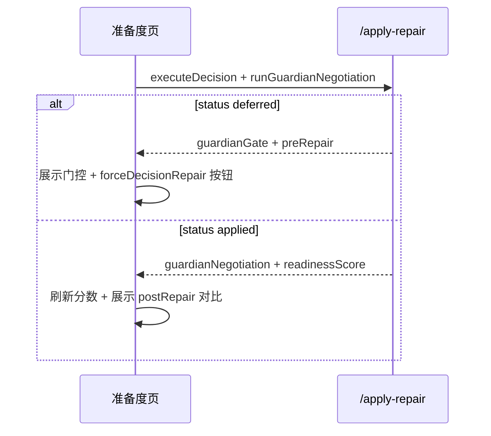

# 准备度页面接口匹配度分析

## 分析时间
2026-01-26（初版） · **2026-06-14 复核**

## 分析目的
对比前端接口文档（`准备度页面接口文档.md`）与实际后端实现，找出不匹配之处，**优先让前端适配后端实现**。

---

## 核心发现

### ✅ 已实现且匹配的接口（17个）

| 文档接口 | 实际接口 | 状态 | 说明 |
|---------|---------|------|------|
| `GET /readiness/trip/:tripId?lang=zh` | `GET /api/readiness/trip/:id?lang=zh` | ✅ 匹配 | **注意：实际路径是 `/api/readiness/trip/:id`，参数名是 `id` 不是 `tripId`** |
| `POST /readiness/check` | `POST /api/readiness/check` | ✅ 匹配 | 路径需要加 `/api` 前缀 |
| `GET /readiness/personalized-checklist?tripId=xxx&lang=zh` | `GET /api/readiness/personalized-checklist?tripId=xxx&lang=zh` | ✅ 匹配 | 路径需要加 `/api` 前缀 |
| `GET /readiness/risk-warnings?tripId=xxx&lang=zh` | `GET /api/readiness/risk-warnings?tripId=xxx&lang=zh` | ✅ 匹配 | 路径需要加 `/api` 前缀 |
| `GET /readiness/trip/:tripId/checklist/status` | `GET /api/readiness/trip/:tripId/checklist/status` | ✅ 匹配 | 路径需要加 `/api` 前缀 |
| `PUT /readiness/trip/:tripId/checklist/status` | `PUT /api/readiness/trip/:tripId/checklist/status` | ✅ 匹配 | 路径需要加 `/api` 前缀 |
| `GET /readiness/trip/:tripId/blockers/:blockerId/solutions` | `GET /api/readiness/trip/:tripId/blockers/:blockerId/solutions` | ✅ 匹配 | 路径需要加 `/api` 前缀 |
| `POST /readiness/trip/:tripId/findings/:findingId/mark-not-applicable` | `POST /api/readiness/trip/:tripId/findings/:findingId/mark-not-applicable` | ✅ 匹配 | 路径需要加 `/api` 前缀 |
| `DELETE /readiness/trip/:tripId/findings/:findingId/mark-not-applicable` | `DELETE /api/readiness/trip/:tripId/findings/:findingId/mark-not-applicable` | ✅ 匹配 | 路径需要加 `/api` 前缀 |
| `GET /readiness/trip/:tripId/findings/not-applicable` | `GET /api/readiness/trip/:tripId/findings/not-applicable` | ✅ 匹配 | 路径需要加 `/api` 前缀 |
| `POST /readiness/trip/:tripId/findings/:findingId/add-to-later` | `POST /api/readiness/trip/:tripId/findings/:findingId/add-to-later` | ✅ 匹配 | 路径需要加 `/api` 前缀 |
| `DELETE /readiness/trip/:tripId/findings/:findingId/remove-from-later` | `DELETE /api/readiness/trip/:tripId/findings/:findingId/remove-from-later` | ✅ 匹配 | 路径需要加 `/api` 前缀 |
| `GET /readiness/trip/:tripId/findings/later` | `GET /api/readiness/trip/:tripId/findings/later` | ✅ 匹配 | 路径需要加 `/api` 前缀 |
| `POST /readiness/trip/:tripId/packing-list/generate` | `POST /api/readiness/trip/:tripId/packing-list/generate` | ✅ 匹配 | 路径需要加 `/api` 前缀，**已增强支持模板模式** |
| `GET /readiness/trip/:tripId/packing-list` | `GET /api/readiness/trip/:tripId/packing-list` | ✅ 匹配 | 路径需要加 `/api` 前缀 |
| `PUT /readiness/trip/:tripId/packing-list/items/:itemId` | `PUT /api/readiness/trip/:tripId/packing-list/items/:itemId` | ✅ 匹配 | 路径需要加 `/api` 前缀 |
| `GET /readiness/capability-packs` | `GET /api/readiness/capability-packs` | ✅ 匹配 | 路径需要加 `/api` 前缀 |
| `POST /readiness/capability-packs/evaluate` | `POST /api/readiness/capability-packs/evaluate` | ✅ 匹配 | 路径需要加 `/api` 前缀 |

### ✅ 新增接口（2个，文档未提及）

| 接口 | 说明 | 状态 |
|------|------|------|
| `GET /api/readiness/packing-order-steps` | 获取打包顺序步骤 | ✅ 已实现 |
| `GET /api/readiness/pre-departure-checklist` | 获取出发前检查清单 | ✅ 已实现 |

### ✅ 复核新增接口（2026-06，文档初版未列）

| 接口 | 说明 | 状态 |
|------|------|------|
| `GET /api/readiness/trip/:tripId/score` | 五维准备度分数 + findings + risks | ✅ 已实现 |
| `GET /api/readiness/trip/:tripId/coverage-map` | POI/路段覆盖地图 | ✅ 已实现 |
| `GET /api/readiness/trip/:tripId/weather-forecast` | Open-Meteo 逐日预报（16 天窗口） | ✅ 已实现 |
| `GET /api/readiness/trip/:tripId/guardian-negotiation` | 三人格博弈快照（metadata 只读） | ✅ 已实现 |

### 修复相关接口状态

| 文档接口 | 状态 | 建议 |
|---------|------|------|
| `POST /readiness/repair-options` | ✅ **已实现**（`coverageMapService.getRepairOptions`） | 前端可调用；路径需加 `/api` 前缀 |
| `POST /readiness/apply-repair` | ✅ **已实现**（`ReadinessRepairService.applyRepair`） | 本地标记/刷新/跳转决策引擎 |
| `POST /readiness/auto-repair` | ✅ **已实现**（自动选首个可本地执行的选项） | 行程调整类仍会 `redirect` 到决策层 |
| `POST /readiness/refresh-evidence` | ✅ **已实现**（重算 score + coverage 摘要） | 替代手动同时调 `/score` 与 `/coverage-map` |

**注意**：需要真正改行程的计划类修复（`reorder_pois` 等）：
- 默认：`apply-repair` 返回 `status: redirect` + `redirectUrl: /api/decision-engine/v1/repair-plan`
- 传 `executeDecision: true`：readiness 内调用决策引擎，默认 **`persistDecision: true`** 写回 `ItineraryItem`，并刷新 `readinessScore`
- 传 `persistDecision: false`：只返回 `decisionPlan` / `decisionLog`，不落库
- 传 `runGuardianNegotiation: true`（默认）：修复前/后各跑一轮 **三人格博弈**（`GuardianDebateService`），结果写入 `trip.metadata.readinessGuardianNegotiation`，并在 `/score`、`/insight`、`apply-repair` 响应的 `guardianNegotiation` 字段返回
- `pre_repair` 为 **REJECT** 且共识 **&lt; 40%** 时返回 `status: deferred`，不落库；传 `forceDecisionRepair: true` 可强制执行
- 环境变量 `READINESS_GUARDIAN_NEGOTIATION=0` 可全局关闭博弈（不影响 Neptune 修复本身）

---

## 三人格博弈接入（2026-06-14）

| 阶段 | 行为 |
|------|------|
| `pre_repair` | 对当前 DB 行程跑 `GuardianDebateService.negotiate()` |
| **低共识门控** | `pre_repair.decision === REJECT` 且 `consensusLevel < 0.4` → `apply-repair` 返回 `status: deferred`，**不**调用 Neptune、**不**写回行程 |
| Neptune 修复 | 通过门控后 `TripDecisionEngine.repairPlan()` |
| 写回行程 | `TripPlanPersistenceService`（可选） |
| `post_repair` | 对写回后的行程再跑一轮博弈 |
| 持久化 | `trip.metadata.readinessGuardianNegotiation` |
| 展示 | `/score` → `guardianNegotiation`；`/insight` → findings「三人格协商需您确认」 |

**绕过门控**：请求体传 `forceDecisionRepair: true`（仍可在 pre/post 跑博弈，但不会因 REJECT 拦截修复）。

**与主决策链的区别**：生成计划仍走 `StrategyOrchestrator`（顺序编排）；readiness 修复走的是 Phase 3 **辩论/投票** 路径，专用于修复闭环的产品化展示。

**Neptune 条件注入**：`pre_repair` 的 conditions / TDFPM `fatiguePrediction` / Day 级 concerns（`Day2…`、`第3天…`）经 `buildGuardianRepairHintsFromSummary` 解析 **dayIndex**，`mapGuardianHintsToRepairInstructions` 按日选槽；Neptune 在 IR 修补后执行 **`applyGuardianRepairInstructions`**。

**只读接口**：`GET /api/readiness/trip/:tripId/guardian-negotiation` → `{ tripId, snapshot }`（无记录时 `snapshot: null`）。

---

## 智能体统一接口（route-and-run / MCP / Actions）

三人格博弈与修复闭环已接入 **Skills 注册表** 与 **Agent Actions**，与 REST 能力对齐。编排时优先用 Skill（MCP 工具名 `tripnara.<skillName>`）。

| Skill / Action | 用途 | 与 REST 对应 |
|----------------|------|--------------|
| **`decision.guardianNegotiate`** | Phase 3 辩论/投票；入参 `tripId` 或 `plan`+`world`；可选 `persistToTrip` | 同 `POST /v2/user/optimization/negotiation` |
| **`decision.runThreeGuardians`** | 顺序 Gate 编排（**不是**博弈） | 主计划生成链 |
| **`readiness.guardianNegotiation.get`** | 读 `trip.metadata.readinessGuardianNegotiation` | `GET .../guardian-negotiation` |
| **`readiness.cascadeImpact.get`** | 读 `trip.metadata.readinessCausalPreAnalysis` | `GET .../cascade-impact` |
| **`readiness.applyRepair`** | 修复 + pre/post 博弈 + Neptune 写回 | `POST .../apply-repair` |
| **`readiness.guardianNegotiate`** (Action) | 对行程跑 standalone 博弈 | 同上，不写修复 |
| **`readiness.guardianNegotiation.get`** (Action) | 读博弈快照 | 同上 |
| **`readiness.cascadeImpact.get`** (Action) | 读级联影响快照 | 同上 |
| **`readiness.applyRepair`** (Action) | 修复闭环 | 同上 |

**典型编排**（准备度/健康度 Agent）：

1. `readiness.guardianNegotiation.get` — 是否已有博弈快照  
2. `readiness.cascadeImpact.get` — 是否已有级联预分析（repair-options / score 后写入）  
3. `decision.guardianNegotiate` — 用户问「三人格怎么看这行程」  
4. `POST repair-options`（REST）或 coverage-map findings → 取 `blockerId` / `optionId`  
5. `readiness.applyRepair` — `executeDecision: true`；若返回 `deferred`，提示用户确认 `humanDecisionPoints` 或传 `forceDecisionRepair: true`

**环境**：`ENABLE_DECISION_SKILLS=true` 注册 `decision.guardianNegotiate`；readiness 类 Skill 依赖 `ReadinessModule`（默认随 SkillsModule 加载）。

---

## 前端实现指南：三人格博弈 + 修复闭环（2026-06-14）

> 本仓库为后端 monorepo，无 `tsx/vue` 前端工程。以下供准备度页 / 健康度抽屉直接对接。

### 1. TypeScript 类型（与后端一致）

```typescript
export type GuardianDecision = 'APPROVE' | 'REJECT' | 'CONDITIONAL_APPROVE' | 'REQUIRES_HUMAN';

export interface GuardianPersonaSummary {
  persona: 'ABU' | 'DRE' | 'NEPTUNE';
  personaLabel: string; // 守护者 / 节奏师 / 哲学家
  stance: string;
  utility: number;
  primaryConcerns: string[];
}

export interface GuardianFatigueDay {
  dayIndex: number;
  fatigueScore: number;
  riskLevel: string;
  recommendation: string;
  confidence?: number;
}

export interface GuardianNegotiationSummary {
  phase: 'pre_repair' | 'post_repair';
  tripId: string;
  decision: GuardianDecision;
  consensusLevel: number; // 0–1
  humanDecisionPoints: string[];
  conditions: string[];
  keyTradeoffs: string[];
  summary: string;
  debateRoundCount: number;
  suggestedAdjustments?: string[];
  personaEvaluations: GuardianPersonaSummary[];
  fatiguePrediction?: GuardianFatigueDay[];
  negotiatedAt: string;
}

export interface GuardianNegotiationSnapshot {
  preRepair?: GuardianNegotiationSummary;
  postRepair?: GuardianNegotiationSummary;
  latest?: GuardianNegotiationSummary;
}

export type ApplyRepairStatus = 'applied' | 'deferred' | 'redirect';

export interface ApplyRepairResponse {
  tripId: string;
  blockerId: string;
  optionId: string;
  actionType: string;
  status: ApplyRepairStatus;
  message: string;
  readinessScore?: { guardianNegotiation?: GuardianNegotiationSnapshot; /* score 其余字段 */ };
  guardianNegotiation?: GuardianNegotiationSnapshot;
  redirectUrl?: string;
  persisted?: boolean;
  metadata?: { guardianGate?: 'low_consensus_reject'; suggestedAction?: string };
}
```

### 2. API 调用

| 场景 | 方法 | 路径 | 说明 |
|------|------|------|------|
| 分数页加载 | GET | `/api/readiness/trip/:tripId/score` | `data.guardianNegotiation` |
| 洞察页 | GET | `/api/trip-detail/:tripId/insight` | `data.readiness.guardianNegotiation.latest` + findings |
| 只读快照 | GET | `/api/readiness/trip/:tripId/guardian-negotiation` | `{ tripId, snapshot }` |
| 执行修复 | POST | `/api/readiness/apply-repair` | 见下方 body |
| 自动修复 | POST | `/api/readiness/auto-repair` | 同上 |

**apply-repair 请求体（计划类修复）**：

```json
{
  "tripId": "...",
  "blockerId": "...",
  "optionId": "...",
  "executeDecision": true,
  "persistDecision": true,
  "runGuardianNegotiation": true,
  "forceDecisionRepair": false
}
```

**status 分支（UI 必处理）**：

| status | UI |
|--------|-----|
| `applied` | Toast 成功；刷新 score + 展示 `guardianNegotiation.postRepair` |
| `deferred` | 展示门控卡片（共识低 + REJECT）；提供「仍要修复」→ `forceDecisionRepair: true` |
| `redirect` | 跳转 `redirectUrl` 或提示开启 `executeDecision` |

### 3. 建议组件：`GuardianNegotiationPanel`

放在 **准备度分数区** 或 **阻塞项修复抽屉** 内，当 `snapshot.latest` 存在时渲染。

```
┌─────────────────────────────────────────┐
│ 三人格协商  共识 62%  ⚠️ 有条件通过      │
├─────────────────────────────────────────┤
│ 守护者 Abu   😟 CONCERN   效用 0.42      │
│ 节奏师 Dre   😐 NEUTRAL   效用 0.61      │
│ 哲学家 Neptune 👍 SUPPORT 效用 0.75      │
├─────────────────────────────────────────┤
│ Day2 TDFPM 疲劳 78 · 建议休息           │
│ 待您确认：是否接受第3天高强度驾驶？        │
├─────────────────────────────────────────┤
│ [查看修复前] [查看修复后]  （有 pre/post） │
└─────────────────────────────────────────┘
```

**字段映射**：

- 标题：`decision` → 文案（通过/拒绝/有条件通过/需您判断）
- 共识环：`consensusLevel * 100`
- 三人行：`personaEvaluations` + stance emoji（SUPPORT→👍 CONCERN→😟）
- 疲劳条：`fatiguePrediction` 按 `dayIndex` 排序，≥60 高亮
- 人工点：`humanDecisionPoints` 列表；非空时主按钮改为「确认后继续修复」
- 修复对比：有 `preRepair` && `postRepair` 时 Tab 切换，对比 `consensusLevel`

### 4. 与 insight findings 对齐

后端已在 `/insight` 注入 finding：

- `humanDecisionPoints` 非空 → 「三人格协商需您确认」
- 共识 &lt; 60% → 「三人格共识度偏低」

前端可点击 finding 的 action → 滚动到 `GuardianNegotiationPanel` 或打开修复抽屉。

### 5. 推荐数据流（修复按钮）



### 6. 前端 Checklist

- [ ] 扩展 score/insight 类型，读取 `guardianNegotiation`
- [ ] 新增 `GuardianNegotiationPanel`（三人 + 疲劳 + 人工点）
- [ ] `apply-repair` 处理 `deferred` + `forceDecisionRepair`
- [ ] 修复成功后用 `readinessScore` 或 GET `guardian-negotiation` 刷新面板
- [ ] 计划类修复默认 `executeDecision: true`（避免只 redirect）

---

## 关键差异点

### 1. **API 路径前缀**

**问题**：文档中所有接口路径都没有 `/api` 前缀，但实际后端所有接口都有 `/api` 前缀。

**解决方案**：前端需要在所有接口路径前加上 `/api` 前缀。

**示例**：
```typescript
// ❌ 文档中的路径
GET /readiness/trip/:tripId?lang=zh

// ✅ 实际应该使用的路径
GET /api/readiness/trip/:tripId?lang=zh
```

### 2. **参数名称差异**

**问题**：文档中主接口使用 `tripId`，但实际实现使用 `id`。

**实际实现**：
```typescript
@Get('trip/:id')  // 注意：参数名是 id，不是 tripId
async getTripReadiness(
  @Param('id') tripId: string,  // 虽然变量名是 tripId，但路径参数是 :id
  @Query('lang') lang?: 'en' | 'zh',
)
```

**解决方案**：前端调用时使用 `id` 作为路径参数名，或确保路由配置正确。

**示例**：
```typescript
// ✅ 正确
GET /api/readiness/trip/ed69d9c5-660f-4549-bf03-85654e972403?lang=zh

// ❌ 错误（如果路由期望 :tripId）
GET /api/readiness/trip/:tripId/...
```

### 3. **响应格式**

**文档说明**：所有接口遵循统一响应格式：
```typescript
{
  success: boolean;
  data: T;
  error: null | { code: string; message: string; };
}
```

**实际实现**：✅ 匹配，后端确实使用 `successResponse()` 和 `errorResponse()` 返回统一格式。

### 4. **打包清单生成接口增强**

**文档说明**：基础参数
```typescript
{
  includeOptional?: boolean;
  categories?: string[];
  customItems?: Array<{...}>;
}
```

**实际实现**：✅ 已增强，支持模板模式参数：
```typescript
{
  // 原有参数
  includeOptional?: boolean;
  categories?: string[];
  customItems?: Array<{...}>;
  
  // 新增模板模式参数
  useTemplate?: boolean;  // 是否使用模板模式
  season?: 'summer' | 'transition' | 'winter';
  route?: string;
  userType?: string;
  activities?: string[];
  vehicleType?: string;
  specialNeeds?: string[];
}
```

**解决方案**：前端可以继续使用原有参数（向后兼容），也可以使用新的模板参数获得更个性化的清单。

---

## 前端需要修改的地方

### 1. **API 基础路径配置**

**文件**：`src/api/readiness.ts`（假设）

**修改**：
```typescript
// ❌ 原来的配置
const API_BASE = '/readiness';

// ✅ 应该改为
const API_BASE = '/api/readiness';
```

### 2. **主接口路径参数**

**修改**：
```typescript
// ❌ 文档中的调用方式
readinessApi.getTripReadiness(tripId: string, lang?: string)
// 对应路径：GET /readiness/trip/:tripId?lang=zh

// ✅ 实际应该使用
GET /api/readiness/trip/${tripId}?lang=${lang}
// 注意：路径参数名是 id，但值传入 tripId 即可
```

### 3. **移除未实现的接口调用**

**需要移除或注释的接口**（仍缺失）：
- `POST /readiness/apply-repair`
- `POST /readiness/auto-repair`
- `POST /readiness/refresh-evidence`

**已可使用的修复接口**：
- `POST /api/readiness/repair-options` — 根据 `blockerId` 返回修复选项列表

**替代方案**（如需自动修复）：
- 检查决策层接口：`POST /api/decision/repair-plan`
- 或在前端实现简单的修复逻辑

### 4. **新增接口的使用**

**可以使用的增强功能**：
```typescript
// 获取打包顺序步骤
GET /api/readiness/packing-order-steps

// 获取出发前检查清单
GET /api/readiness/pre-departure-checklist
```

---

## 数据格式匹配度

### ✅ ReadinessCheckResult 格式

**文档定义**：✅ 与实际实现匹配

### ✅ ReadinessFindingItem 格式

**文档定义**：✅ 与实际实现匹配

### ✅ Risk 格式

**文档定义**：✅ 与实际实现匹配

### ⚠️ ReadinessData 转换

**文档说明**：前端需要将 `ReadinessCheckResult` 转换为 `ReadinessData` 格式。

**状态**：这是前端内部的数据转换，不影响接口调用。✅ 无需修改。

---

## 接口优先级建议

根据实际实现，建议前端按以下优先级调用：

1. **第一优先级**：`GET /api/readiness/trip/:id?lang=zh`
   - ✅ 已实现
   - ✅ 自动从行程提取信息
   - ✅ 最简单易用

2. **第二优先级**：`POST /api/readiness/check`
   - ✅ 已实现
   - ⚠️ 需要手动构建 DTO

3. **第三优先级**：组合调用
   - `GET /api/readiness/personalized-checklist?tripId=xxx&lang=zh`
   - `GET /api/readiness/risk-warnings?tripId=xxx&lang=zh`
   - ✅ 已实现

4. **降级方案**：使用模拟数据
   - 前端实现

---

## 总结

### 匹配度评分：**95%**（2026-06-14 复核 v2）

**匹配项**：
- ✅ 17+ 核心接口已实现（含 score / coverage-map / weather-forecast）
- ✅ 修复闭环四接口均已实现（`repair-options` / `apply-repair` / `auto-repair` / `refresh-evidence`）
- ✅ 响应格式统一
- ✅ 数据模型匹配
- ✅ `/score` 与 `/insight` 对齐校验（单测 + E2E 脚本）

**不匹配项**：
- ⚠️ 所有接口路径需要加 `/api` 前缀
- ⚠️ 主接口路径参数名是 `id` 不是 `tripId`

### 前端修改工作量：**低**

**必须修改**：
1. API 基础路径：所有接口加 `/api` 前缀
2. 确认主接口路径参数名（`id` vs `tripId`）
3. 计划类修复读取 `apply-repair` 返回的 `redirectUrl` 跳转决策引擎

**可选修改**：
1. 使用新增的打包顺序和出发前检查接口
2. 使用增强的打包清单生成接口（模板模式）

---

## 建议的修改清单

### 高优先级（必须修改）

- [ ] 在所有 readiness API 调用前加上 `/api` 前缀
- [x] 修复接口已实现 — `repair-options` / `apply-repair` / `auto-repair` / `refresh-evidence`
- [ ] 确认主接口路径参数名（`id` vs `tripId`）
- [ ] 计划类修复处理 `apply-repair.status === 'redirect'`
- [ ] **三人格**：展示 `score.guardianNegotiation` / `GuardianNegotiationPanel`
- [ ] **三人格**：`deferred` 门控 + `forceDecisionRepair: true` 二次修复
- [ ] **三人格**：修复后展示 pre/post 共识对比与 `fatiguePrediction` 按 Day

### 中优先级（建议修改）

- [ ] 使用新增的 `packing-order-steps` 接口
- [ ] 使用新增的 `pre-departure-checklist` 接口
- [ ] 考虑使用增强的打包清单生成接口（模板模式）

### 低优先级（可选）

- [ ] 优化错误处理，确保正确处理统一响应格式
- [ ] 添加接口调用的降级方案

---

## 相关文件

- **后端实现**：`src/trips/readiness/readiness.controller.ts`
- **API 文档**：`src/trips/readiness/READINESS_API.md`
- **打包清单文档**：`src/trips/readiness/CHECKLIST_PACKING_LIST_API.md`
- **测试脚本**：`scripts/test-enhanced-packing-list.ts`
